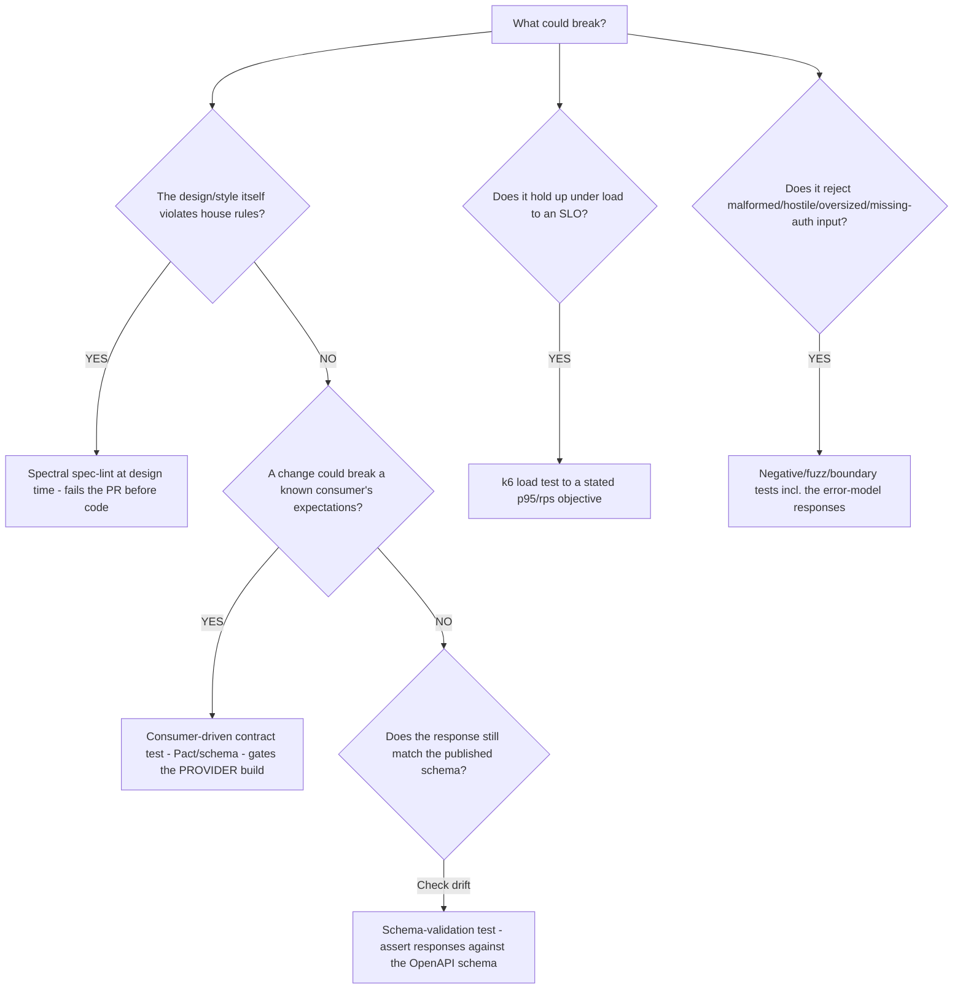
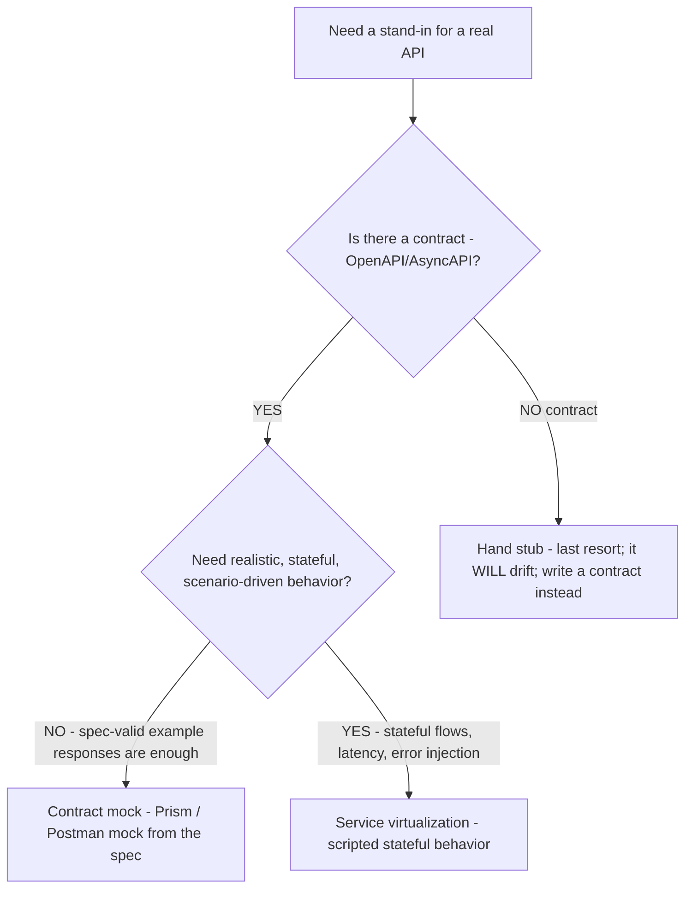
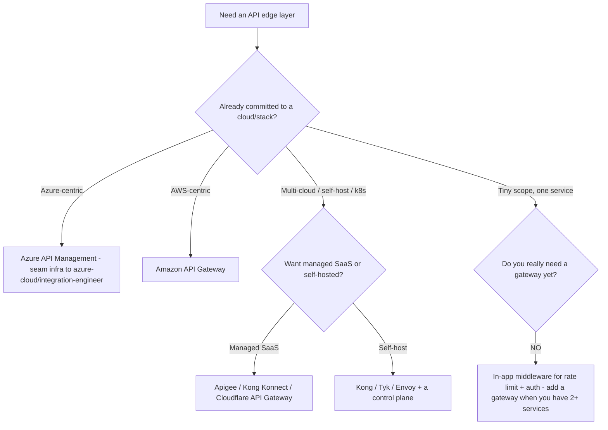

# API Engineering — testing & governance decision trees

**Last reviewed:** 2026-06-04 · **Confidence:** medium-high (tool docs web-verified this date). Tool feature sets are volatile; re-verify before quoting a specific capability. `[verify-at-build]`

> Canonical decision trees for `api-testing-engineer` and `api-platform-engineer`. Traverse the relevant tree top-to-bottom against the observable situation **before** choosing a tool/gate (per [`../CLAUDE.md`](../CLAUDE.md) §5).

---

## Decision Tree: which test type for which risk?

**When this applies:** You're deciding how to test an API change and which gate to put where in CI.

**Last verified:** 2026-06-04.

**Rationale per leaf:**
- _Spectral lint (design-time)_ — cheapest gate; catches style/governance violations before any code exists.
- _Consumer-driven contract test_ — the **consumer's** expectations gate the **provider's** CI; the only gate that proves "we didn't break a known integrator."
- _Schema-validation test_ — asserts live responses still conform to the published schema; catches drift between code and contract.
- _Load test to an SLO_ — pass/fail against a promise (p95/rps), not a vanity number; observe rate-limit and error behavior under stress.
- _Negative/fuzz/boundary_ — the break lives in the 80% that isn't the happy path: malformed bodies, wrong content types, expired/missing auth, oversized payloads, the `application/problem+json` responses.

| Gate | Where | Proves |
|---|---|---|
| Spectral lint | design-time / PR | the spec obeys the style guide |
| Contract test | provider CI | no known consumer is broken |
| Schema validation | CI / runtime | responses still match the contract |
| Load (k6) | pre-release | the SLO holds under load |
| Negative/fuzz | CI | hostile/edge input is rejected safely |

---

## Decision Tree: mock vs stub vs service-virtualization

**When this applies:** A consumer needs to develop/test against an API that isn't ready, is slow, or is costly to call.

**Last verified:** 2026-06-04.

**Rationale:** prefer a **contract-driven mock** (Prism/Postman) — it stays honest as the spec evolves and needs no hand-maintenance. Reach for **service virtualization** only when you need stateful, scenario-driven behavior (latency, error injection, multi-step flows). A **hand stub** drifts from reality immediately and is a smell that the contract is missing — write the contract first.

---

## Decision Tree: API gateway / management — build vs buy, and which?

**When this applies:** You need an edge layer for auth offload, rate limiting, routing, caching, and observability. (Design here; *infrastructure provisioning* seams to `azure-cloud/integration-engineer`.)

**Last verified:** 2026-06-04. Product capabilities are volatile — verify against vendor docs. `[verify-at-build]`

**Rationale:** express the **policy** (rate limits, quotas, auth offload, routing) independently of the product so it's portable; pick the gateway by your existing stack first. Don't stand up a heavyweight gateway for a single service — in-app middleware suffices until you have multiple services or external consumers. **The gateway *resource* (provisioning, networking) is `azure-cloud/integration-engineer`'s when on Azure** — this tree chooses and designs; it doesn't deploy.

---

## See also

- [`api-design-decision-trees.md`](./api-design-decision-trees.md), [`api-security-decision-trees.md`](./api-security-decision-trees.md).
- [`../best-practices/test-consumer-driven-contract-tests.md`](../best-practices/test-consumer-driven-contract-tests.md), [`../best-practices/test-mock-from-the-contract.md`](../best-practices/test-mock-from-the-contract.md), [`../best-practices/operate-deprecate-with-sunset-headers.md`](../best-practices/operate-deprecate-with-sunset-headers.md).

## Provenance

Synthesized 2026-06-04 from the Spectral, Pact, Prism, k6, Postman, and major gateway-vendor docs. Tool/product feature sets are version-sensitive — `[verify-at-build]`.

---

_Last reviewed: 2026-06-04 by `claude`_
