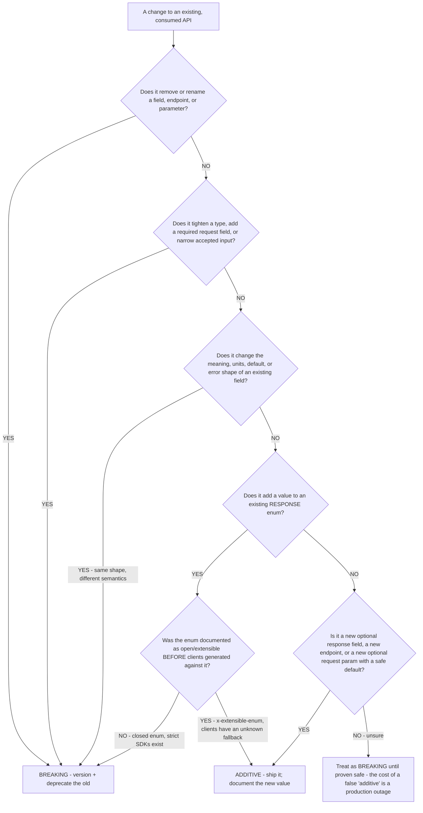
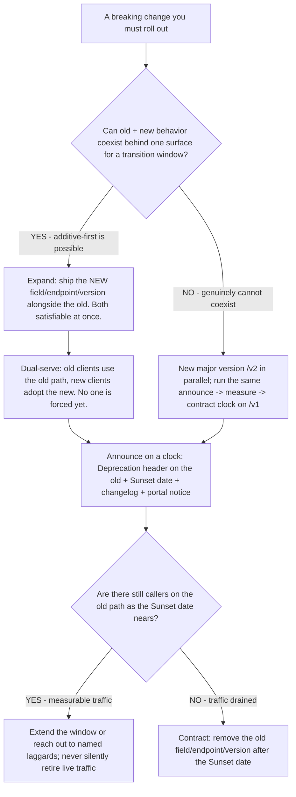

# API Engineering — versioning & evolution decision trees

**Last reviewed:** 2026-06-05 · **Confidence:** medium-high (first-party specs + IETF datatracker, web-verified this date). Volatile facts (IETF draft status of `Deprecation`/`Sunset`/`RateLimit`, OpenAPI extension conventions) carry inline markers + per-tree `Last verified` dates; re-verify on the Researcher sweep before quoting.

> Topic-specific trees that **complement** [`api-design-decision-trees.md`](api-design-decision-trees.md)'s high-level "is it breaking, and where does the version live?" tree. That tree picks the *versioning posture*; these two go a level deeper into the two questions that actually trip teams in production: **(1) is THIS specific change breaking — from the strictest consumer's point of view?** and **(2) once I must break, what's the safe rollout sequence?** Traverse the relevant tree top-to-bottom against the observable change before classifying (per the pre-action-traversal prior in [`../CLAUDE.md`](../CLAUDE.md) §5). Owned by `api-design-architect`; the deprecation-rollout tree is shared with `api-platform-engineer`.

---

## Decision Tree: change classification — is THIS change breaking?

**When this applies:** You are about to ship a change to an existing, consumed API and need to classify it as **additive (no version bump)** vs **breaking (version + deprecate)**. The trap this tree closes: "additive on the wire" ≠ "non-breaking for the consumer" — the test is whether an *existing conforming client* can break, judged from the **strictest plausible consumer** (a strict, code-generated SDK), not from the JSON's shape.

**Last verified:** 2026-06-05. The classification rules are paradigm-independent (REST/GraphQL/gRPC); the "extensible enum" mitigation is convention-level — see notes. `[verify-at-build]`

**Rationale per leaf:**

- **Remove/rename anything → breaking.** A removed or renamed field/endpoint/param breaks every client that referenced the old name. Add the new name *alongside* the old (parallel-change), never rename in place.
- **Tighten type / add required input / narrow input → breaking.** A previously-accepted request now 4xxs. This includes making an optional field required, shrinking a max length, or restricting a previously-open value set on *input*.
- **Change semantics/units/default/error-shape → breaking even when the shape is identical.** A field that changes from cents to dollars, or a 200-wrapped error becoming a real 4xx, breaks consumers silently — the worst kind. Same wire shape, different contract.
- **Add a value to a response enum → it depends on whether the enum was extensible.** This is the single most-misclassified change (see the `breaking-change-shipped-as-additive` scenario). A **closed** enum is a contract that says "these are *all* the values"; a strict generated SDK treats an unknown variant as a deserialization error, and a hand-rolled `switch` with no `default` silently drops the row. → **breaking** unless you marked the enum **extensible** (`x-extensible-enum` convention / an explicit "unknown" fallback) *before* clients generated against it. Mark response enums extensible from day one if you ever intend to grow them.
- **New optional response field / new endpoint / new optional-with-default request param → additive.** The genuinely-safe cases — a tolerant reader ignores unknown response fields, a new endpoint affects no existing client, an optional param with a safe default leaves old callers unchanged.
- **Unsure → treat as breaking.** The asymmetry of cost: a false "breaking" classification costs a version bump (cheap, reversible); a false "additive" classification costs a production outage across every strict consumer (expensive, and a trust hit). Default to safe.

**The producer/consumer asymmetry (the load-bearing idea):** classify from the **strictest plausible consumer's** point of view. The producer doesn't control the consumer's deserializer — a code-generated SDK is strict by construction. "Be more tolerant" is good advice you *give* consumers (the tolerant-reader rule), never a release-safety policy you can *rely* on. If a strict client could break, it's breaking.

| Change | Classification | Safe alternative if breaking |
|---|---|---|
| Add optional response field | Additive | — |
| Add new endpoint | Additive | — |
| Add optional request param (safe default) | Additive | — |
| Add value to **extensible** response enum | Additive | — |
| Add value to **closed** response enum | **Breaking** | Mark enum extensible first, or version |
| Remove / rename field/endpoint/param | **Breaking** | Add new alongside old (parallel-change) |
| Make optional input required | **Breaking** | Keep optional; default server-side |
| Tighten/narrow a type or value set | **Breaking** | New field/version |
| Change units/semantics/default/error shape | **Breaking** | New field with new name |

---

## Decision Tree: deprecation rollout — how do you retire a version or field safely?

**When this applies:** You've classified a change as breaking (tree above) and must retire the old version/field without a flag-day outage. Covers the `Deprecation`/`Sunset` signalling clock and the expand/contract sequence on the producer side.

**Last verified:** 2026-06-05. `Sunset` is **RFC 8594**; `Deprecation` is an **IETF draft (draft-ietf-httpapi-deprecation-header)** — verify RFC-vs-draft status before quoting it as standardized. `[verify-at-build]`

**Rationale per leaf:**

- **Expand → dual-serve → contract (the parallel-change / expand-contract pattern).** Never rename or remove in place. Add the new thing, let old and new coexist, drain the old, then remove it. Each step is independently deployable and reversible, and at no point is there a state only one client version can use. (This is the API-contract mirror of the backend zero-downtime-migration pattern.)
- **Announce on a clock.** A breaking retirement ships with a `Deprecation` header on the deprecated resource (signals "this is going away"), a `Sunset` header (RFC 8594 — the *date* it goes away), a changelog entry, and a developer-portal notice. Silent retirement is the anti-pattern the constitution flags (§4).
- **Measure before you contract.** Instrument old-path traffic. As the `Sunset` date nears with measurable callers still on it, **extend or reach out to named laggards** — don't retire live traffic on schedule just because the calendar says so. The `Sunset` date is a commitment, but a surprise outage for a paying partner is worse than a slipped deprecation.
- **New major in parallel (`/v2`)** — only when old and new genuinely cannot coexist behind one surface. Stand up `/v2` next to `/v1` and run the *same* announce → measure → contract clock on `/v1`.

**Timing rules of thumb `[verify-at-use]` (calibrate to your consumer contract/SLA):**

| Consumer type | Minimum deprecation window | Notes |
|---|---|---|
| Public / unknown consumers | 6–12 months | You can't coordinate a flag day; over-communicate |
| Partner / contracted | Per the contract (often 90 days+) | Reach out to named integrators directly |
| Internal / coordinated | As short as a coordinated migration allows | Still announce; still measure traffic before contracting |

Windows are conventions, not standards — there is no RFC-mandated deprecation period. Set the window in the API's published lifecycle policy and honor it.

---

## See also

- [`api-design-decision-trees.md`](api-design-decision-trees.md) — the high-level versioning posture tree (is-it-breaking + URI-vs-header) and the 2026 spec capability map (OpenAPI 3.1/3.2, the `Deprecation`/`Sunset`/`RateLimit` IETF status rows).
- [`../best-practices/design-version-only-for-breaking-changes.md`](../best-practices/design-version-only-for-breaking-changes.md), [`../best-practices/design-use-tolerant-reader-on-additive-changes.md`](../best-practices/design-use-tolerant-reader-on-additive-changes.md), [`../best-practices/operate-deprecate-with-sunset-headers.md`](../best-practices/operate-deprecate-with-sunset-headers.md).
- [`../scenarios/2026-06-05-breaking-change-shipped-as-additive.md`](../scenarios/2026-06-05-breaking-change-shipped-as-additive.md) — the field note this change-classification tree was hardened against (the closed-response-enum trap).
- [`../templates/deprecation-and-sunset-plan.md`](../templates/deprecation-and-sunset-plan.md) — the rollout-plan template the second tree feeds.

**Sources (retrieved 2026-06-05):**
- OpenAPI Specification (3.1 / 3.2) — https://spec.openapis.org/
- RFC 8594 (`Sunset` header) — https://www.rfc-editor.org/rfc/rfc8594
- `Deprecation` header (IETF draft) — https://datatracker.ietf.org/doc/draft-ietf-httpapi-deprecation-header/
