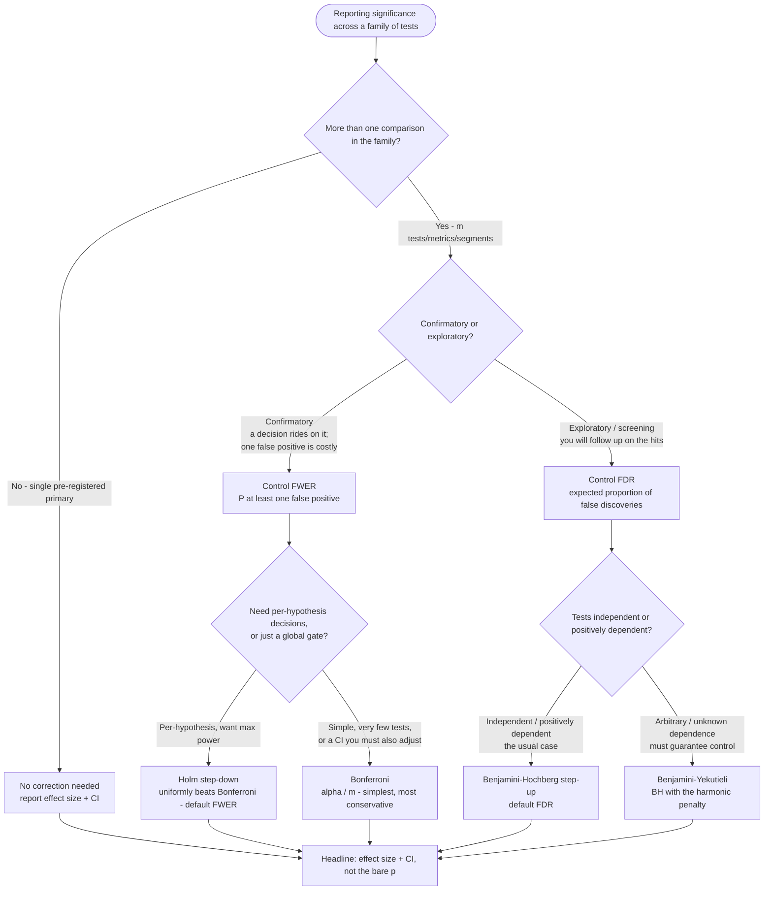

# Knowledge — Multiple-comparison correction: which method?

> **Last reviewed:** 2026-06-05 · **Confidence:** High (canonical multiple-testing consensus; see Provenance).
>
> This file is the **correction-method choice** decision tree. It complements (does not duplicate) the trees in [`stats-test-selection-decision-trees.md`](stats-test-selection-decision-trees.md) — those name *which test* for a comparison; this names *which multiplicity correction* once you're running **more than one** test/metric/segment. It is the decision-tree form of the prose FWER-vs-FDR section in [`statistical-pitfalls.md`](statistical-pitfalls.md) §"Multiple-comparison correction" (pitfall #2) and the rule in [`../best-practices/test-correct-for-multiple-comparisons.md`](../best-practices/test-correct-for-multiple-comparisons.md).
>
> **How the agent uses it:** traverse the Mermaid graph **top-to-bottom before quoting any corrected/uncorrected p-value** across a family of tests (the pre-action decision-tree traversal the Capability Grounding Protocol requires). Resolve each node against *observable* facts — how many tests, confirmatory vs exploratory intent, the cost of a single false positive, dependence between tests — not against the user's phrasing. The runnable companion is `scripts/stat_calc.py correct`.

Format follows the marketplace convention in [`../../../docs/best-practices/decision-trees-in-knowledge-files.md`](../../../docs/best-practices/decision-trees-in-knowledge-files.md): a *When this applies* (observable), a `Last verified:` date, a Mermaid graph, per-leaf rationale, and a tradeoffs table.

---

## Decision Tree: Multiplicity correction — FWER vs FDR, and which method

**When this applies:** you are about to report significance across a **family** of more than one test — multiple metrics, multiple segments/subgroups, multiple treatment arms, multiple endpoints, or a post-hoc set of comparisons. Observable inputs: (a) **how many** comparisons `m`, (b) whether the work is **confirmatory** (a decision rides on it; a single false positive is costly) or **exploratory/screening** (you'll follow up on the hits anyway), (c) the **cost of one false positive** vs the cost of a missed true effect, and (d) whether the tests are roughly **independent / positively dependent** or arbitrarily dependent. Not for a *single* pre-registered primary comparison (no correction needed) — see the false-positive arithmetic note below for when "it's just one test" is actually a family.

**Last verified:** 2026-06-05 against the FWER/FDR canon (Benjamini-Hochberg 1995; Holm 1979) and the prose section in [`statistical-pitfalls.md`](statistical-pitfalls.md) — see Provenance.

**Rationale per leaf:**

- *No correction (single primary)* — one pre-registered comparison has no multiplicity; correcting it would be over-conservative. (But watch the disguised family: 5 "primary" metrics, or one metric peeked at 10 times, *is* a family — see the arithmetic note.)
- *Control FWER (confirmatory)* — when a launch/medical/financial decision rides on the result and a **single** false positive is expensive, control the probability of **any** false positive across the family. This is the strict guarantee.
- *Holm step-down (default FWER)* — Holm controls FWER with **no extra assumptions** and is **uniformly more powerful than Bonferroni** (it rejects everything Bonferroni rejects, sometimes more). Make it the default FWER method; reach for Bonferroni only for its simplicity or when you must adjust a matching CI by the same factor.
- *Bonferroni* — multiply each p by `m` (equivalently test at `α/m`); simplest and most conservative, and it composes cleanly with a Bonferroni-adjusted confidence interval. Fine for very few tests; loses power as `m` grows.
- *Control FDR (exploratory)* — when you're **screening** (which of 200 features / 22 segments look promising) and will follow up on the hits, controlling the **expected proportion** of false discoveries among the rejections is the right, more powerful target. A few false positives among many screened hits is acceptable because the follow-up filters them.
- *Benjamini-Hochberg (default FDR)* — the step-up procedure; controls FDR under independence and positive dependence (PRDS) — the common case for metrics/segments. The default FDR method.
- *Benjamini-Yekutieli* — when tests are arbitrarily/negatively dependent and you must **guarantee** FDR control, BY adds a harmonic penalty `(Σ 1/i)` to BH; more conservative, but valid under any dependence.

**Tradeoffs summary table:**

| Method | Controls | Power | Assumptions | Use when |
|---|---|---|---|---|
| **Bonferroni** | FWER | Lowest | None | Few tests; need a simple, CI-compatible adjustment |
| **Holm (step-down)** | FWER | Higher than Bonferroni | None | **Default confirmatory** — strict control, more power than Bonferroni |
| **Benjamini-Hochberg (step-up)** | FDR | High | Independence / positive dependence | **Default exploratory** — screening many metrics/segments |
| **Benjamini-Yekutieli** | FDR | Moderate | Any dependence | Exploratory under unknown/negative dependence; must guarantee FDR |

> **The false-positive arithmetic (run this first).** Under a true null across `m` independent tests at α, the expected number of false positives is `m·α`, and the chance of **at least one** is `1 − (1−α)^m`. At α = 0.05: `m = 10 → 40%`, `m = 20 → 64%`, `m = 22 → 68%`. So "we sliced it and a few segments came back significant" is the **expected** outcome of slicing, not a discovery. Quote this number before quoting any uncorrected p-value across a family. (Verify with `scripts/stat_calc.py correct --alpha 0.05` on your own p-values, which also prints the per-method adjusted p's and the reject/keep verdict.)

> **Confirmatory-after-exploratory is a two-step, not a contradiction.** A clean pattern: screen with **BH-FDR** to find candidate segments/features (exploratory), then take the most plausible one to a **powered, pre-registered, single confirmatory test** (no correction needed — back to the `No` branch). Don't report a BH-screened hit as a confirmatory win.

---

## Provenance

- **FWER vs FDR framing; Bonferroni/Holm control FWER, BH controls FDR** — Statsig, "Controlling your type I errors: Bonferroni and Benjamini-Hochberg" (retrieved 2026-05-26); MetricGate, "Bonferroni vs. Holm vs. FDR Compared" (retrieved 2026-05-26). Mirrors the prose section in [`statistical-pitfalls.md`](statistical-pitfalls.md).
- **Holm step-down (uniformly more powerful than Bonferroni, no extra assumptions)** — Holm (1979), "A Simple Sequentially Rejective Multiple Test Procedure," *Scandinavian Journal of Statistics* 6(2):65-70.
- **Benjamini-Hochberg step-up (controls FDR under independence/PRDS)** — Benjamini & Hochberg (1995), "Controlling the False Discovery Rate," *J. R. Statist. Soc. B* 57(1):289-300; the step-up adjusted-p formula `min_{j≥i} (m/j)·p_(j)` per r-statistics.co "P-Value Adjustment Calculator" (retrieved 2026-06-05).
- **Benjamini-Yekutieli (FDR under arbitrary dependence)** — Benjamini & Yekutieli (2001), *Annals of Statistics* 29(4):1165-1188.
- **The disguised-family caveat** (multiple "primary" metrics, peeking-as-multiplicity) — consistent with the peeking pitfall in [`stats-test-selection-decision-trees.md`](stats-test-selection-decision-trees.md) and [`experiment-design-and-ab-testing.md`](experiment-design-and-ab-testing.md).
- Refresh trigger: re-verify if a future engagement needs a method this tree doesn't cover (Hochberg/Hommel step-up FWER, knockoffs, hierarchical/gatekeeping testing). The Researcher meta-skill flags any `Last verified:` older than 90 days.
