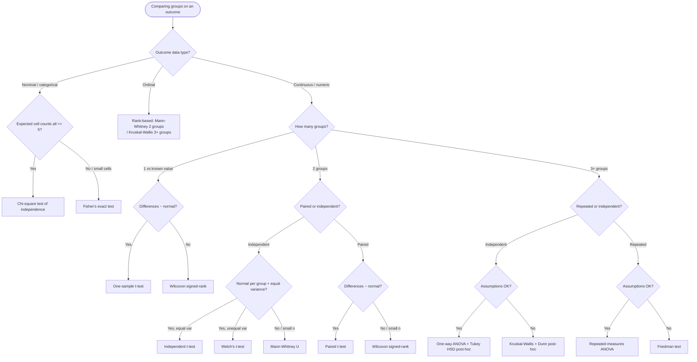
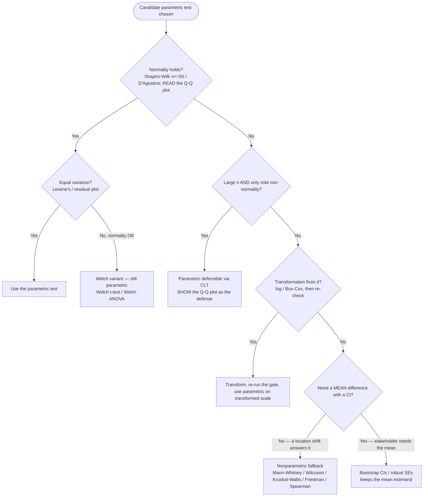
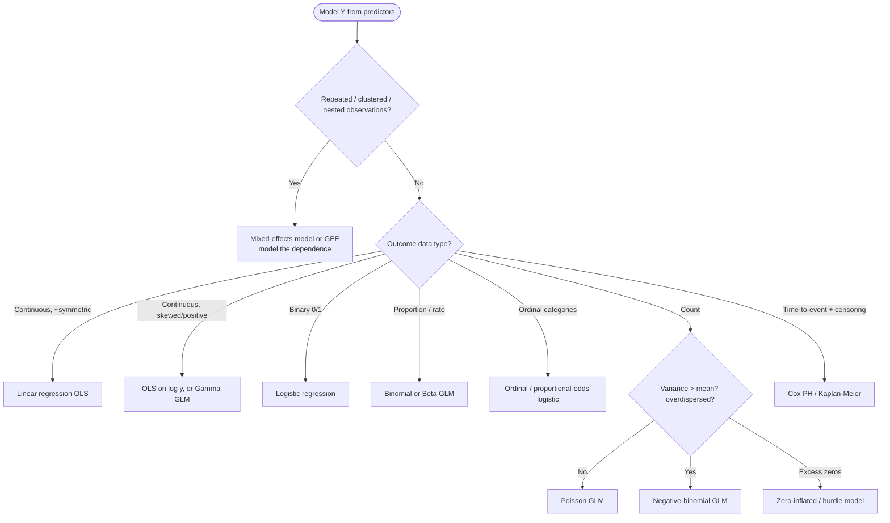
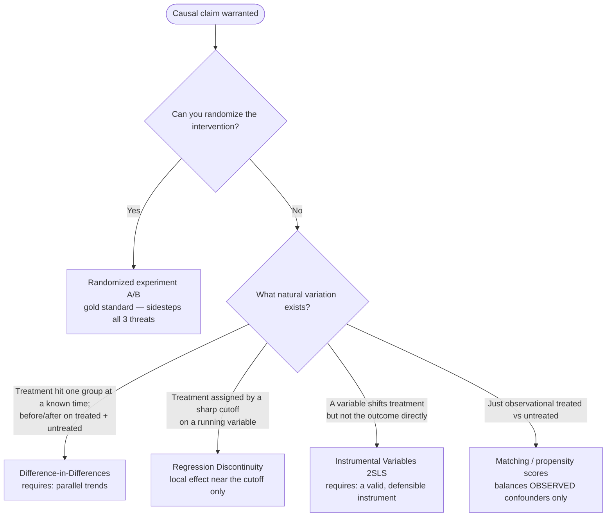
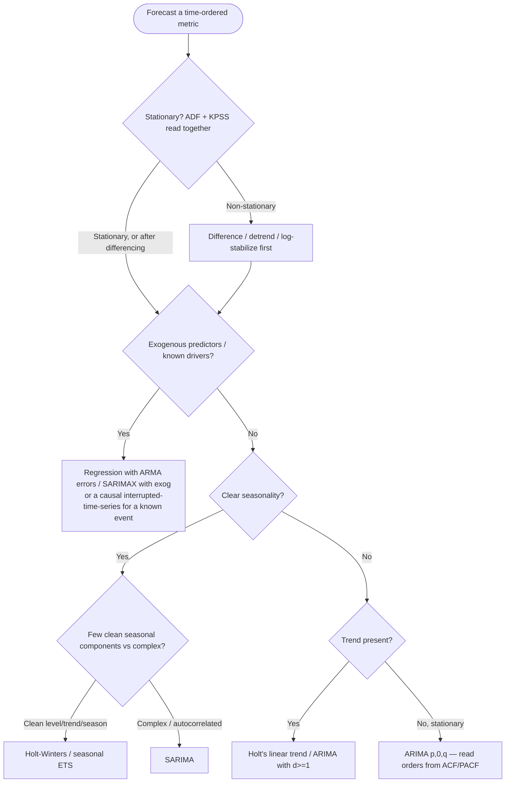

# Knowledge — Statistical method selection: decision trees

> **Last reviewed:** 2026-05-30 · **Confidence:** High (canonical biostatistics / econometrics / time-series consensus; see each tree's Provenance line).
> This file is the **extended decision-tree bank** for method selection across the plugin's whole surface — hypothesis tests, parametric-vs-nonparametric, regression family, causal-inference design, and time-series model. It complements (does not replace) [`test-selection-decision-tree.md`](test-selection-decision-tree.md), which holds the primary hypothesis-test tree plus the assumption gate and the parametric↔nonparametric fallback table.
>
> **How the agent uses it:** traverse the relevant Mermaid graph **top-to-bottom before naming a method** (the pre-action decision-tree traversal the Capability Grounding Protocol requires). Resolve each node against the data in *observable* terms — the outcome's data type, the group structure, the natural variation available — not against keywords in the user's phrasing. The first branch whose condition resolves cleanly is the leaf to apply.

Format follows the marketplace convention in [`../../../docs/best-practices/decision-trees-in-knowledge-files.md`](../../../docs/best-practices/decision-trees-in-knowledge-files.md): each tree carries a *When this applies* (observable), a `Last verified:` date, a Mermaid graph, per-leaf rationale, and a tradeoffs table.

---

## Decision Tree: Hypothesis tests — which test for this data + group structure

**When this applies:** The user asks "which test do I use / is this difference significant?" and you can observe (a) the **outcome variable's data type** (continuous / ordinal / nominal / count), (b) the **number of groups** being compared, and (c) whether observations are **paired/repeated or independent**. Not for "which model predicts Y" (see the regression tree) or "did X cause Y" (see the causal tree).

**Last verified:** 2026-05-30 against canonical biostatistics decision-tree sources (Statology; BioData Mining/Springer 2025) — see Provenance.

**Rationale per leaf:**
- *Chi-square / Fisher's exact* — categorical-vs-categorical association; Fisher's when any expected cell count < 5 (chi-square's approximation breaks).
- *Rank tests on ordinal* — ordinal data has order but not interval spacing, so means are undefined; rank-based tests are the honest choice.
- *One-sample t / Wilcoxon signed-rank* — comparing one sample to a fixed value; Wilcoxon when the differences aren't normal.
- *Independent t / Welch / Mann-Whitney* — two independent groups; Welch when variances differ (the safer default even then), Mann-Whitney when normality fails or n is small.
- *Paired t / Wilcoxon signed-rank* — two paired measurements; the test is on the within-pair differences.
- *ANOVA+Tukey / Kruskal-Wallis+Dunn* — 3+ independent groups via an omnibus test then a multiplicity-correcting post-hoc; **never a stack of pairwise t-tests** (inflates Type I error).
- *Repeated-measures ANOVA / Friedman* — 3+ repeated measurements on the same units; Friedman is the nonparametric fallback.

**Tradeoffs summary table:**

| Test | Outcome type | Groups | Assumption load | Use when |
|---|---|---|---|---|
| Chi-square / Fisher's | Nominal | 2+ | Expected cell counts ≥ 5 (else Fisher) | Association between two categorical variables |
| Mann-Whitney U | Ordinal / non-normal continuous | 2 indep. | Independence; similar shapes for a median-shift read | t-test assumptions fail, or ordinal data |
| Independent / Welch t-test | Continuous | 2 indep. | Normality per group (Welch relaxes equal variance) | Normal-ish continuous, two groups |
| Paired t / Wilcoxon signed-rank | Continuous | 2 paired | Normality of *differences* (Wilcoxon if not) | Before/after or matched pairs |
| ANOVA + Tukey / Kruskal-Wallis + Dunn | Continuous / ordinal | 3+ indep. | Normality + equal variance (KW if not) | 3+ groups — omnibus then corrected post-hoc |

> The full assumption gate (how to *check* normality/variance/independence) and the parametric↔nonparametric fallback table live in [`test-selection-decision-tree.md`](test-selection-decision-tree.md). This tree names the destination; that file gates the parametric leaves.

---

## Decision Tree: Parametric vs nonparametric — should I take the distribution-free route?

**When this applies:** You have *already* identified the candidate parametric test (from the tree above) and are deciding whether its assumptions hold well enough to use it, or whether to drop to the distribution-free counterpart. Observable inputs: the normality check result, the equal-variance check, the sample size, and whether a transformation is available/acceptable.

**Last verified:** 2026-05-30 against the assumption-gate + fallback canon in [`test-selection-decision-tree.md`](test-selection-decision-tree.md) (Sheffield APS 240; Statology) — see Provenance.

**Rationale per leaf:**
- *Use the parametric test* — assumptions met; the parametric test is more powerful and gives the interpretable (mean-difference) estimand.
- *Welch variant* — unequal variance with normality intact does **not** require going nonparametric; Welch handles it and is a safe default even when variances look equal.
- *CLT-defensible* — at large n a t-test/ANOVA is robust to mild non-normality, but "robust" is a *defended* judgment shown with the Q-Q plot, not an excuse to skip the check.
- *Transform then re-check* — a log/Box-Cox transform often restores normality/homoscedasticity; re-run the gate on the transformed scale before trusting it.
- *Nonparametric fallback* — when normality fails, no transform fixes it, and a location-shift answer suffices; note rank tests test stochastic dominance / median shift, not a mean.
- *Bootstrap / robust SEs* — when the stakeholder genuinely needs a **mean** difference with a CI and no clean rank fallback fits (e.g. multi-predictor regression); distribution-free without changing the estimand.

**Tradeoffs summary table:**

| Route | Estimand | Power | Assumption cost | Use when |
|---|---|---|---|---|
| Parametric (t / ANOVA / OLS) | Mean difference + CI | Highest | Normality (+ equal var) | Gate passes, or large-n CLT with Q-Q shown |
| Welch variant | Mean difference + CI | High | Normality only (relaxes equal var) | Variances differ, normality OK |
| Transform → parametric | Mean on transformed scale | High | Transform must restore the gate | Skew/heteroscedasticity a log/Box-Cox fixes |
| Nonparametric (rank) | Median / stochastic dominance | Moderate | Independence; similar shapes | Normality fails, location-shift answer is enough |
| Bootstrap / robust SE | Original-scale mean + CI | Moderate–high | Independence (resampling valid) | Need the mean, no clean rank fallback |

---

## Decision Tree: Regression family — which model for this outcome

**When this applies:** The question is "what predicts / explains / models Y" and you can observe the **outcome's data type** (continuous / binary / proportion / count / time-to-event / ordinal) and its **dependence structure** (independent rows vs repeated/clustered). Choosing the model *family* — the prerequisite to fitting and then diagnosing it.

**Last verified:** 2026-05-30 against the GLM-family canon (McCullagh & Nelder) and the regression leaves of [`test-selection-decision-tree.md`](test-selection-decision-tree.md) — see Provenance.

**Rationale per leaf:**
- *Mixed-effects / GEE* — repeated or nested data violates independence; a random-effects (or GEE) structure models the within-cluster correlation so the SEs are honest.
- *OLS* — continuous, roughly symmetric outcome; the interpretable default *only* here.
- *Log-OLS / Gamma GLM* — positive, right-skewed continuous (spend, time); models multiplicative structure and keeps predictions positive.
- *Logistic* — binary outcome; keeps predicted probabilities in [0,1], which OLS cannot.
- *Binomial / Beta GLM* — proportions/rates bounded in [0,1] with their own variance structure.
- *Ordinal logistic* — ordered categories where you want covariate adjustment beyond a rank test.
- *Poisson → Negative-binomial → zero-inflated* — counts; Poisson assumes variance = mean, so check dispersion and escalate to NegBin when var ≫ mean, or a zero-inflated/hurdle model when zeros are excessive.
- *Cox / Kaplan-Meier* — time-to-event with censoring; standard regression mishandles the censored observations.

**Tradeoffs summary table:**

| Family | Outcome | Link / error | Key check | Use when |
|---|---|---|---|---|
| OLS | Continuous, symmetric | Identity / Normal | Residual diagnostics | Interpretable effect on a symmetric continuous Y |
| Logistic | Binary | Logit / Binomial | Separation, calibration | 0/1 outcome; want odds/probabilities |
| Poisson / Neg-binomial | Count | Log / Poisson(NB) | **Dispersion** (var vs mean) | Event counts; NB when overdispersed |
| Cox PH | Time-to-event | Hazard | Proportional-hazards assumption | Survival/churn timing with censoring |
| Mixed-effects / GEE | Any, repeated/nested | Varies | Variance components / cluster count | Repeated measures, hierarchical data |

> Once the family is chosen, run the diagnostics before trusting coefficients — see [`../best-practices/regression-run-the-diagnostics-before-trusting-coefficients.md`](../best-practices/regression-run-the-diagnostics-before-trusting-coefficients.md).

---

## Decision Tree: Causal inference — which identification strategy

**When this applies:** A **causal** claim is warranted ("does X *cause / drive / impact* Y?", and the causal-verb check in [`../best-practices/causal-correlation-is-not-causation.md`](../best-practices/causal-correlation-is-not-causation.md) passed). You can observe what **natural variation** the situation offers: can you randomize? is there a before/after on treated + untreated groups? a sharp assignment cutoff? a valid instrument? only observational treated/untreated units?

**Last verified:** 2026-05-30 against the causal toolkit in [`causal-inference-primer.md`](causal-inference-primer.md) (textbook consensus; Hernán & Robins) — see Provenance.

**Rationale per leaf:**
- *Randomized experiment* — randomization makes treated and untreated groups exchangeable, so it sidesteps confounding, selection, and reverse causation at once; prefer it whenever feasible.
- *Difference-in-Differences* — uses an untreated group's trajectory as the counterfactual for the treated group; identifies the effect *if* the two would have moved in parallel absent treatment (the load-bearing, partly-checkable assumption).
- *Regression Discontinuity* — units just above vs just below a sharp cutoff are comparable, so the cutoff acts like local randomization; estimates a **local** effect near the threshold only.
- *Instrumental Variables (2SLS)* — an instrument that moves treatment but affects the outcome only *through* treatment isolates exogenous variation; valid instruments are rare and the exclusion restriction is untestable.
- *Matching / propensity scores* — builds comparable treated/untreated groups on observed covariates; **cannot** fix unobserved confounding — always flag that residual risk.

**Tradeoffs summary table:**

| Design | Key assumption | Effect estimated | Defensibility | Use when |
|---|---|---|---|---|
| Randomized experiment | Successful randomization | Average treatment effect | Highest | You can assign the intervention |
| Difference-in-Differences | Parallel trends | ATT (treated group) | High, communicable | Known treatment time + untreated comparison |
| Matching / propensity | No *unobserved* confounding | ATT/ATE on overlap | Medium — unobserved bias bites | Observational, rich observed covariates |
| Instrumental Variables | Valid + exclusion-restricted instrument | LATE (compliers) | Lower — strong, untestable assumptions | A credible natural instrument exists |
| Regression Discontinuity | Continuity at the cutoff | Local effect at cutoff | High *locally* | Sharp assignment rule on a running variable |

> IV / panel estimation uses `linearmodels` (Tier 2). Design selection is the destination; covariate selection *within* the design follows [`../best-practices/causal-watch-confounders-and-colliders.md`](../best-practices/causal-watch-confounders-and-colliders.md).

---

## Decision Tree: Time-series model — which forecasting model

**When this applies:** You are forecasting or modelling a **time-ordered** metric and have run the stationarity + autocorrelation gate ([`../best-practices/timeseries-test-stationarity-and-autocorrelation.md`](../best-practices/timeseries-test-stationarity-and-autocorrelation.md)). Observable inputs: is there a trend? clear seasonality? are there exogenous predictors? is the series stationary after differencing?

**Last verified:** 2026-05-30 against Box-Jenkins / `statsmodels.tsa` canon — see Provenance.

**Rationale per leaf:**
- *Difference / detrend first* — a non-stationary series produces spurious regressions and a model that won't generalize; difference (d) / detrend / log-stabilize until ADF+KPSS agree it's stationary.
- *Regression with ARMA errors / SARIMAX-with-exog* — when known drivers explain the series; model the mean with predictors and the residual autocorrelation with ARMA. A known one-time event → interrupted time series.
- *Holt-Winters / seasonal ETS* — clean, interpretable level/trend/seasonality; fast and a strong baseline.
- *SARIMA* — seasonality plus residual autocorrelation that ETS doesn't capture; orders read from ACF/PACF, residuals confirmed white-noise via Ljung-Box.
- *Holt's linear trend / ARIMA(d≥1)* — trend without strong seasonality.
- *ARIMA(p,0,q)* — already-stationary series; identify AR/MA orders from ACF/PACF.

**Tradeoffs summary table:**

| Model | Captures | Needs | Interpretability | Use when |
|---|---|---|---|---|
| ARIMA(p,d,q) | Autocorrelation + trend (via d) | Stationarity after differencing | Medium | Trended/autocorrelated, no strong seasonality |
| SARIMA | Seasonality + autocorrelation | Stationarity; ACF/PACF orders | Medium | Seasonal + residual autocorrelation |
| Holt-Winters / ETS | Level + trend + seasonality | Clean components | High | Clear seasonal pattern, strong baseline wanted |
| Regression + ARMA errors / SARIMAX | Exogenous drivers + serial dep. | Valid predictors | High (driver coefficients) | Known drivers explain the series |
| Interrupted time series | Effect of a known event | Dated intervention | High | A one-time change at a known date (causal seam) |

> Every forecast ships **with a prediction interval**, never a bare point line, and validation is **temporal** (rolling-origin) — never shuffle (pitfall #9). ETS/ARIMA/SARIMAX live in `statsmodels.tsa` (Tier 1).

---

## Provenance

- **Hypothesis-test tree + parametric/nonparametric tree** — topology and pairings from Statology, "Choosing the Right Statistical Test: A Decision Tree Approach" (retrieved 2026-05-26); BioData Mining/Springer, "A simple guide to ... t-test, Mann-Whitney U, Chi-squared, and Kruskal-Wallis" (2025); assumption gate + fallbacks from Sheffield APS 240 "Non-parametric tests" — consolidated in [`test-selection-decision-tree.md`](test-selection-decision-tree.md) (Tier 1 / consensus).
- **Regression-family tree** — GLM family/link selection by outcome type: McCullagh & Nelder, *Generalized Linear Models*; overdispersion → negative-binomial and zero-inflation are canonical count-model guidance; the OLS/logistic/Poisson/survival leaves mirror [`test-selection-decision-tree.md`](test-selection-decision-tree.md).
- **Causal-inference tree** — RCT > DiD/matching > IV/RDD framing and each design's key assumption from [`causal-inference-primer.md`](causal-inference-primer.md) (textbook consensus; Hernán & Robins, *Causal Inference: What If*) — Tier 2 (strong-but-contextual).
- **Time-series tree** — Box-Jenkins ARIMA/SARIMA identification (ACF/PACF, Ljung-Box residual check) and ETS/Holt-Winters; ADF+KPSS read-together (opposite nulls) is standard practice; Hamilton, *Time Series Analysis*. Implemented in `statsmodels.tsa` per [`statistics-tooling-2026.md`](statistics-tooling-2026.md).
- Refresh trigger: re-verify a tree if a future engagement surfaces a method it doesn't cover (mixed models beyond a primer, staggered-adoption DiD, state-space/Prophet-style forecasting). Per the marketplace staleness convention, the Researcher meta-skill flags any `Last verified:` older than 90 days.
