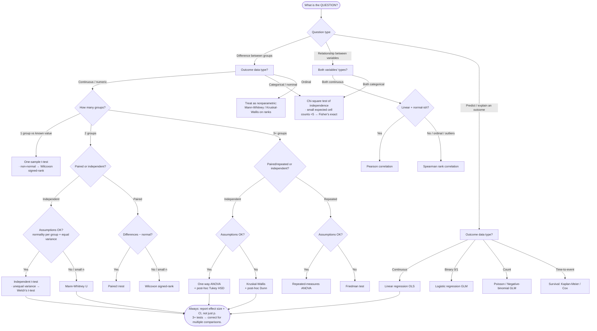

# Knowledge — Statistical test selection

> **Last reviewed:** 2026-05-26 · **Confidence:** High (canonical biostatistics/data-science consensus; see Provenance).
> The single most-asked applied-statistics question is "which test do I use?". This file is the decision tree the `applied-statistician` agent traverses **before** naming a test, plus the parametric ↔ nonparametric fallback table and the assumption checks that gate the choice.

The agent's discipline: **name the method from this tree first, name the library second** (see [`statistics-tooling-2026.md`](statistics-tooling-2026.md)). Never hand over a parametric test without its assumption check and its nonparametric fallback.

---

## Decision Tree: Statistics — choosing a hypothesis test

Traverse top-to-bottom. Resolve each node against the **outcome variable's data type**, then the **number of groups**, then **paired vs independent**, then the **assumption gate**. Default to the nonparametric leaf whenever the assumption check fails or the sample is small.

---

## Parametric ↔ nonparametric fallback table

Every parametric test has a distribution-free fallback. When the assumption gate fails (and you can't fix it by transformation), drop to the fallback rather than reporting a parametric result you can't defend.

| Scenario | Parametric test | Nonparametric fallback |
|---|---|---|
| 1 group vs a known value, continuous | One-sample t-test | Wilcoxon signed-rank |
| 2 groups, independent, continuous | Independent t-test (Welch if variances differ) | **Mann-Whitney U** |
| 2 groups, paired, continuous | Paired t-test | **Wilcoxon signed-rank** |
| 3+ groups, independent, continuous | One-way ANOVA (+ Tukey post-hoc) | **Kruskal-Wallis** (+ Dunn post-hoc) |
| 3+ groups, repeated/paired | Repeated-measures ANOVA | **Friedman test** |
| Association between two categorical | — | **Chi-square** (Fisher's exact for small cells) |
| Relationship between two continuous | Pearson correlation / OLS | **Spearman** rank correlation |
| Continuous outcome ~ several predictors | Multiple linear regression / GLM | robust SE / bootstrap CIs |
| Binary outcome ~ predictors | Logistic regression (GLM) | — |
| Count outcome ~ predictors | Poisson / Negative-binomial GLM | — |

---

## The assumption gate (check before any parametric test)

| Assumption | How to check | If violated |
|---|---|---|
| **Normality** (per group, or of residuals/differences) | Shapiro-Wilk (n ≲ 50) or D'Agostino-Pearson; Q-Q plot. Don't over-trust the test on huge n. | Nonparametric fallback, or transform (log/Box-Cox), or bootstrap |
| **Equal variance** (homoscedasticity) | Levene's test; residual-vs-fitted plot | Welch's t-test / Welch ANOVA; robust standard errors |
| **Independence of observations** | Study design (repeated measures? clustering?) | Paired/repeated-measures test, or a mixed model |
| **Adequate expected cell counts** (chi-square) | All expected counts ≥ 5 | Fisher's exact test |

**3+ groups → use ANOVA/Kruskal-Wallis, never a stack of pairwise t-tests** — repeated pairwise tests inflate the Type I error rate. Run the omnibus test first, then a post-hoc that corrects for multiplicity (Tukey HSD after ANOVA, Dunn after Kruskal-Wallis). See [`statistical-pitfalls.md`](statistical-pitfalls.md) for the multiple-comparisons correction guidance.

---

## Provenance

- Decision-tree topology + parametric/nonparametric pairings: Statology, "Choosing the Right Statistical Test: A Decision Tree Approach" (retrieved 2026-05-26); BioData Mining / Springer, "A simple guide to the use of Student's t-test, Mann-Whitney U, Chi-squared, and Kruskal-Wallis in biostatistics" (2025).
- Assumption checks + nonparametric fallbacks: dzchilds, "Non-parametric tests" (Sheffield APS 240, retrieved 2026-05-26).
- Refresh trigger: re-verify if a future engagement surfaces a method this tree doesn't cover (mixed models, GEE, multivariate). Tier 1 (consensus) — stable; low re-verification urgency.
