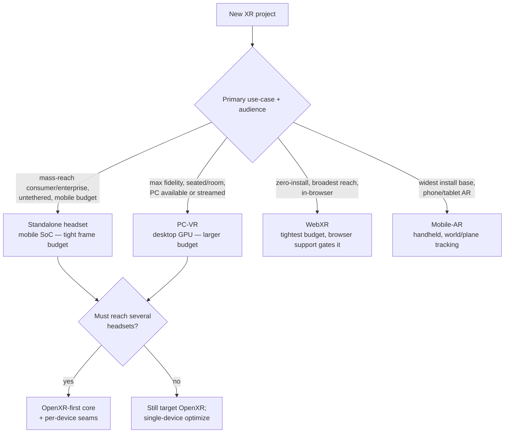
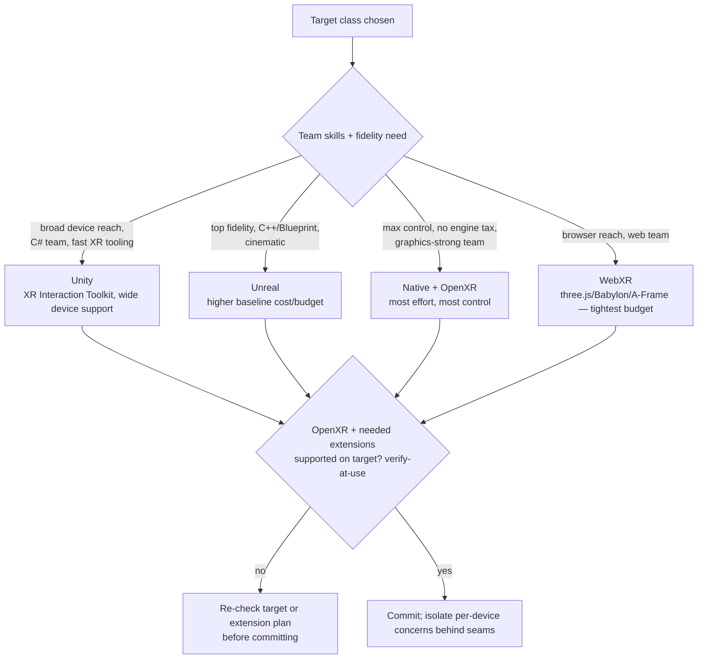
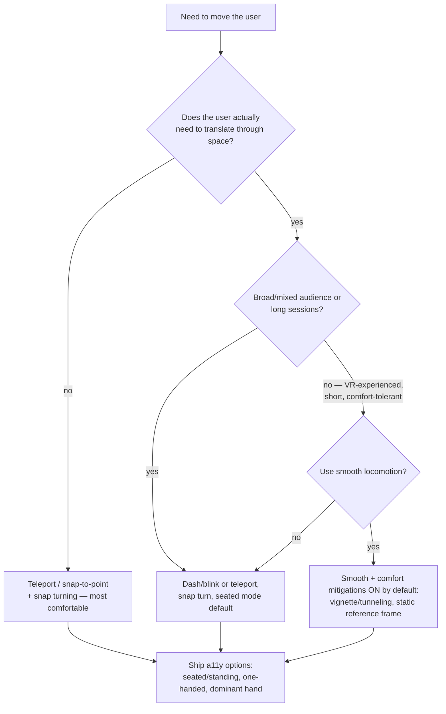
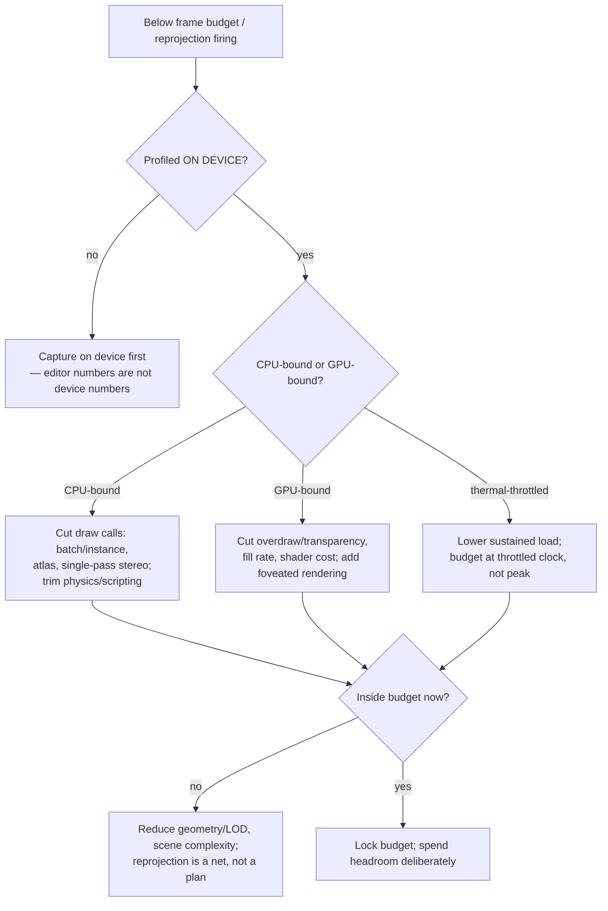

# AR/VR/XR Engineering — Decision Trees

> Reference decision trees for the `ar-vr-xr-engineering` team. Agents **traverse the relevant tree top-to-bottom before deciding** (the proactive complement to the Capability Grounding Protocol). Each `## Decision Tree` section is a Mermaid graph plus the rule it encodes.
>
> **Engineering judgment, not certification advice.** Anything touching a headset spec, runtime/engine version, per-eye perf number, or comfort claim is `[verify-at-use]` — confirm against the vendor/runtime/engine docs before it drives a build commitment. No PII.
>
> _Last reviewed: 2026-07-02 by `claude`. Principles are durable; dated specifics live in [`xr-reference-2026.md`](xr-reference-2026.md)._

---

## Decision Tree: which target platform?

**Rule:** pick the device class on the **use-case and the audience's actual device**, not the newest headset. The class fixes the perf universe. Target OpenXR regardless; add per-device seams when reach spans headsets. All device specs `[verify-at-use]`.

---

## Decision Tree: which engine?

**Rule:** choose the engine on **team skills + the target**, not habit. Confirm OpenXR and the extensions you need (hand-tracking, passthrough, controller profiles) are supported on the target — `[verify-at-use]` — before committing.

---

## Decision Tree: locomotion scheme to reduce sim-sickness

**Rule:** vection drives sim-sickness — default to the **comfortable** scheme (teleport/dash + snap turn) and make comfort mitigations defaults, not buried options. Smooth locomotion is opt-in for comfort-tolerant audiences. Comfort is a requirement; validate on real users. `[verify-at-use]` comfort research.

---

## Decision Tree: rendering perf-budget triage

**Rule:** profile **on device** before optimizing, fix to the **bound** (CPU vs GPU vs thermal), cut draw calls/overdraw first, and hold the budget at the **thermal-sustained** clock. Reprojection is a safety net, not a strategy. Per-eye targets `[verify-at-use]`.

---

## See also

- [`xr-reference-2026.md`](xr-reference-2026.md) — dated headset/runtime landscape + per-eye perf targets (verify-at-use).
- Skills: [`../skills/xr-target-and-engine-selection/SKILL.md`](../skills/xr-target-and-engine-selection/SKILL.md), [`../skills/xr-interaction-and-locomotion/SKILL.md`](../skills/xr-interaction-and-locomotion/SKILL.md), [`../skills/spatial-rendering-and-performance/SKILL.md`](../skills/spatial-rendering-and-performance/SKILL.md), [`../skills/comfort-safety-and-accessibility/SKILL.md`](../skills/comfort-safety-and-accessibility/SKILL.md).
