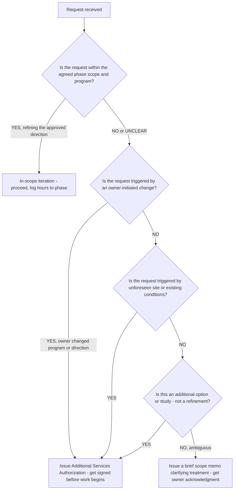
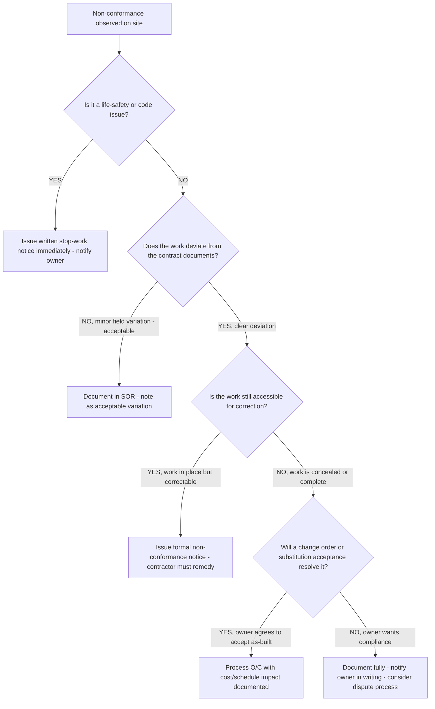
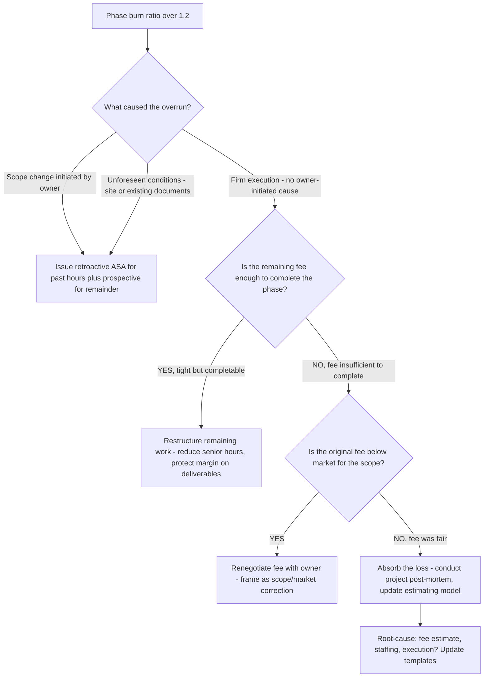

# Architecture/AEC decision trees

Which analysis for which symptom — traverse top-to-bottom before picking a method.

## Decision Tree: Project is over on hours

1) Check phase-fee fit (§3 #1). 2) Check scope creep/additional services (§3 #2). 3) Read the RFI/coordination load (§3 #3). 4) Check the phase gate (§3 #6).

## Decision Tree: Firm is busy but not profitable

1) Compute utilization and net multiplier (§3 #4). 2) Find the gap (capacity vs pricing). 3) Map the fix.

## Decision Tree: A code/life-safety question

Route to the licensed architect/engineer of record (§3 #7) — this plugin supports, it does not certify.

## How to read these trees

Traverse top-to-bottom and stop at the first matching branch — the order encodes the cheap-checks-before-expensive-checks discipline (§3). Each leaf names a skill, a specialist, or a house-opinion to apply. Never skip a higher branch because a lower one looks more interesting; a denominator, seasonal, or definitional artifact masquerades as a finding more often than not.

## Decision Tree: Which skill for which task

- **Phase-load the fee** → use when: Build a fee that matches the effort curve across the design phases, not a flat percentage, so the heavy phases aren't underwater. ([`../skills/phase-load-the-fee/SKILL.md`](../skills/phase-load-the-fee/SKILL.md))
- **Control scope creep** → use when: Distinguish in-scope iteration from additional services and authorize the difference, so unbilled changes don't erode the fee. ([`../skills/control-scope-creep/SKILL.md`](../skills/control-scope-creep/SKILL.md))
- **Coordinate the drawing set** → use when: Read the drawing set for cross-discipline coordination and constructability, since a coordinated set beats a beautiful one. ([`../skills/coordinate-the-set/SKILL.md`](../skills/coordinate-the-set/SKILL.md))
- **Read the RFI/change pattern** → use when: Read the RFI and change-order pattern as a coordination signal to improve the next set, not just process this one. ([`../skills/read-rfi-pattern/SKILL.md`](../skills/read-rfi-pattern/SKILL.md))
- **Read firm economics** → use when: Read utilization and net multiplier to separate a busy firm from a profitable one. ([`../skills/read-firm-economics/SKILL.md`](../skills/read-firm-economics/SKILL.md))

## Decision Tree: Which specialist owns this

- **The engagement** → [`aec-engagement-lead`](../agents/aec-engagement-lead.md)
- **Design phases** → [`design-architect`](../agents/design-architect.md)
- **Documents** → [`construction-documents-specialist`](../agents/construction-documents-specialist.md)
- **The numbers** → [`aec-project-analyst`](../agents/aec-project-analyst.md)

When two leaves apply, route to the **lead** first to scope and sequence — overlapping symptoms usually mean two drivers at once, and the lead keeps the analysis from collapsing into a single-cause story.

## Decision Tree: Which house-opinion gates the call

Before picking any method, check whether one of the standing biases (§3) already decides the framing:

1. Phase-load the fee to the effort, not a flat percentage — if this is in question, apply §3 #1 before any method.
2. Scope creep is the margin killer — control additional services — if this is in question, apply §3 #2 before any method.
3. RFIs and change orders are a coordination signal, not just paperwork — if this is in question, apply §3 #3 before any method.
4. Net multiplier and utilization are the firm's master numbers — if this is in question, apply §3 #4 before any method.
5. Constructability and coordination beat drawing beauty — if this is in question, apply §3 #5 before any method.
6. The phase gate protects the fee — don't draw ahead of approval — if this is in question, apply §3 #6 before any method.
7. Code and life-safety are the licensed professional's call — flag, don't rule — if this is in question, apply §3 #7 before any method.
8. Date and source any rate, fee, or benchmark figure — if this is in question, apply §3 #8 before any method.

## Escalation & guardrails

- Anything touching client PII / regulated records → stop and route to `ravenclaude-core` `security-reviewer`.
- Any external figure entering a deliverable → carry a source URL + retrieval date, or mark it `[unverified — training knowledge]` / `[ESTIMATE]` (§3, final house opinion).
- A recommendation ships only with an owner, a date, and an expected metric movement.
## Sourcing note

Figures in this file are from the author's domain knowledge and are marked `[unverified — training knowledge]` or `[ESTIMATE]` at point of use. Validate against a primary source before putting any figure in a client deliverable (§3 cite-or-mark rule).

---

## Decision Tree: Additional Services — In-Scope Iteration or Billable Additional Service

**When this applies:** the owner or contractor has made a request that may or may not be covered by the basic services fee. The project team is uncertain whether to start work and bill later, ask for authorization first, or treat the request as in-scope. The request has arrived and the clock is running.

**Last verified:** 2026-06-05 against standard AIA B101 additional services framework.

**Rationale per leaf:**
- *In-scope iteration* — refining the selected design direction within the agreed scope is what the basic services fee covers; log and proceed.
- *Issue ASA* — any owner-initiated change, unforeseen condition, or alternative option outside the agreed scope requires authorization before a single hour is logged; the ASA is the contractual protection.
- *Scope memo* — when the boundary is genuinely ambiguous, a brief written memo clarifying the treatment and obtaining acknowledgment is more defensible than either assuming in-scope or generating a surprise invoice later.

**Tradeoffs summary:**

| Method | Speed | Protection | Relationship friction | Use when |
|---|---|---|---|---|
| Proceed in-scope | Fast | None needed | None | Clearly within phase scope |
| Issue ASA | Slight delay | Full contractual | Low if proactive | Any out-of-scope trigger |
| Scope memo | Slight delay | Partial | Very low | Ambiguous boundary only |

---

## Decision Tree: CA Deficiency — Observe, Flag, Stop Work, or Accept

**When this applies:** during a site visit the architect observes work that may not conform to the contract documents. A decision is needed on what response is appropriate before the work progresses further.

**Last verified:** 2026-06-05 against AIA A201 General Conditions and standard CA practice.

**Rationale per leaf:**
- *Stop-work* — life-safety and code issues require immediate cessation; the architect's professional obligation does not wait for the contractor's schedule preference.
- *Document as acceptable variation* — minor field variations within the contractor's means-and-methods latitude and within specification tolerance are documented but not flagged as deficiencies.
- *Non-conformance notice* — a clear deviation from contract documents that is correctable must be formally noticed to the contractor with a remediation deadline.
- *Change order* — if the deviation is discovered after work is concealed or complete and the owner chooses to accept it, a change order memorializes the acceptance and any cost/schedule impact.
- *Legal/dispute* — when the owner wants full compliance on completed/concealed work and the contractor disputes responsibility, the architect documents fully and the parties enter the contract's dispute-resolution process.

**Tradeoffs summary:**

| Method | Immediacy | Cost impact | Use when |
|---|---|---|---|
| Stop-work notice | Immediate | Contractor bears | Life-safety or code violation |
| Document acceptable variation | Same visit | None | Minor, within tolerance |
| Non-conformance notice | 24 hr | Contractor bears (correction) | Clear deviation, correctable |
| Change order - accept | Days | Owner bears (cost delta) | Correctable work owner chooses to accept |
| Document/dispute | Escalated | TBD via process | Owner demands compliance on concealed work |

---

## Decision Tree: Fee Recovery — Project Is Over on Hours

**When this applies:** a phase burn report shows the project has consumed more than 90% of the phase fee at less than 80% phase completion, or the PM reports the team is over on hours mid-phase. A decision is needed: absorb the overrun, restructure the remaining work, pursue an ASA, or renegotiate the fee.

**Last verified:** 2026-06-05 against standard AEC project financial management practice.

**Rationale per leaf:**
- *Retroactive + prospective ASA* — when the overrun is owner-caused, a retroactive ASA for already-burned hours is appropriate and defensible if the change is documented; obtain prospective authorization before continuing.
- *Restructure remaining work* — when the overrun is firm-caused but there is still fee remaining, restructure to reduce senior-hour involvement and focus the remaining budget on deliverables.
- *Renegotiate* — if the original fee was below market for the scope and the project is genuinely underfunded, a transparent renegotiation framed as a scope/market correction is preferable to delivering a compromised product.
- *Absorb and post-mortem* — a firm-caused loss on a fairly-priced project is an estimating or execution failure; absorb it, run the post-mortem, and update the fee model for the next proposal.

**Tradeoffs summary:**

| Method | Fee recovery | Relationship impact | Use when |
|---|---|---|---|
| ASA (owner-caused) | Full | Low if timely | Change or unforeseen conditions documented |
| Restructure remaining work | Partial | None | Firm-caused, fee still present |
| Renegotiate | Partial | Medium | Original fee genuinely below market |
| Absorb and post-mortem | None | None | Firm-caused, fee was fair — recover in estimating |
