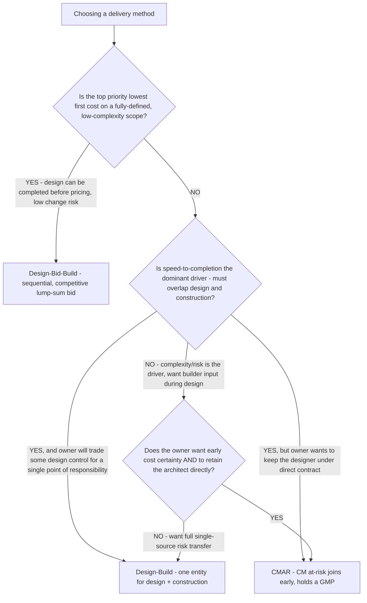
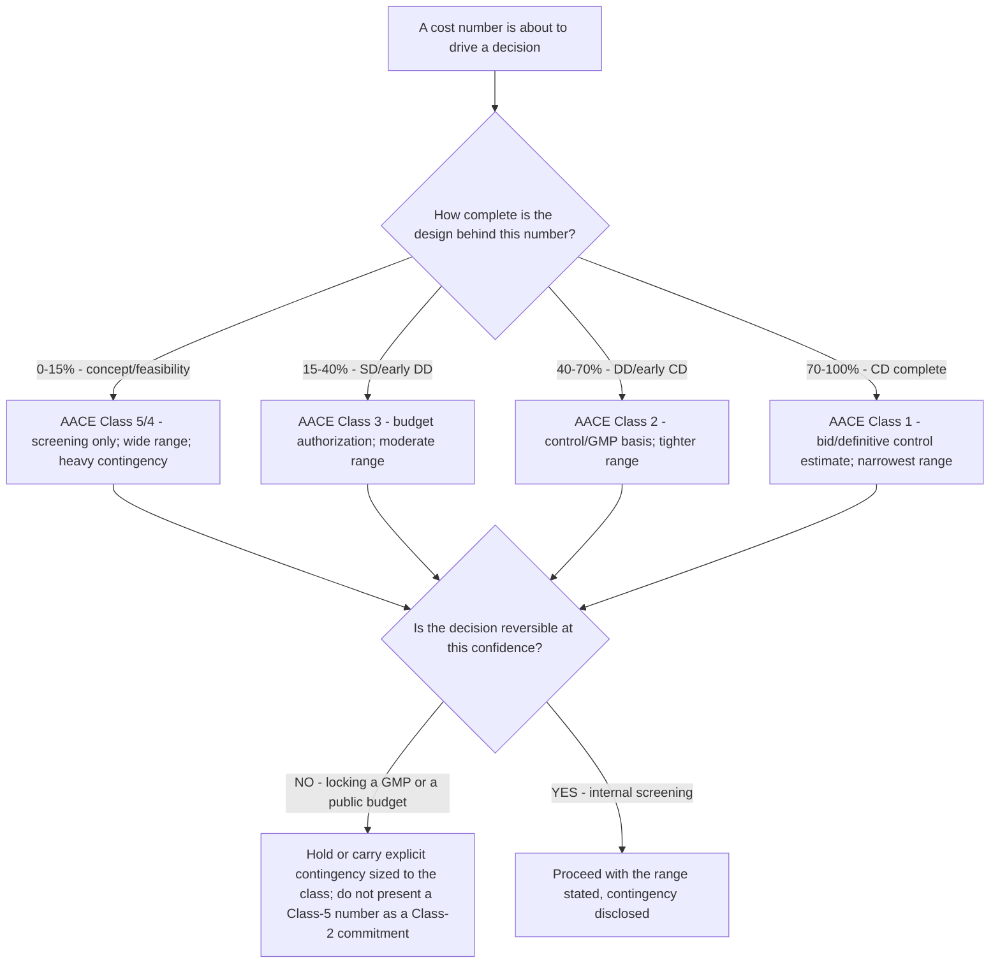

# AEC decision tree — project-delivery method (DBB / DB / CMAR) + estimate-class gate

**Last reviewed:** 2026-06-05 · **Confidence:** medium (industry delivery-method comparisons + AACE estimate-classification standard, web-verified this date). Cost/schedule deltas and AACE accuracy ranges are project- and market-dependent — they carry inline `[verify-at-use]` / `[ESTIMATE]` markers and must be validated against the owner's real risk profile and a project-specific risk analysis before any deliverable (CLAUDE.md §3 #8). Delivery-method selection has legal and procurement dimensions (public-bid statutes, bonding, licensing) that route to counsel and the professional of record (§3 #7).

> Canonical decision tree for the [`aec-engagement-lead`](../agents/aec-engagement-lead.md) (framing the owner's procurement question) and [`aec-project-analyst`](../agents/aec-project-analyst.md) (the cost/contingency arithmetic). Traverse top-to-bottom before recommending a delivery method or committing a number to a budget. The answer is **not** "design-build is faster" or "low bid is cheaper" — it is a risk-allocation + schedule + cost-certainty trade gated by **how complete the design is when the price is set** (the AACE estimate class). This is decision-support for the owner, not a procurement ruling (CLAUDE.md §2).

---

## When this applies

An owner is choosing how to procure a project — or an architect is advising on it — and the question is which delivery method fits the project's priorities (cost certainty vs. speed vs. single-point responsibility vs. design control), and what cost-confidence a budget figure actually carries at the current design maturity.

## Tree A — which delivery method

## Tree B — does the estimate class support the decision

Before a budget number drives a go/no-go or a GMP, gate it on design maturity (the AACE estimate class):

## Rationale per leaf

- **Design-Bid-Build (DBB)** — sequential: design is completed, then competitively bid as a lump sum, then built. Lowest first-cost on a clean, fully-defined scope, and the most transparent procurement — but the **longest schedule** (construction can't start until design is done and a contractor is selected) and the **weakest change resilience** (changes after design-completion are costly). Industry comparisons report DBB schedule **growth ~+4.8%** vs. design-build's **~-4.2% reduction**, while DBB shows **lower cost growth (~3.6%)** than design-build (~7.2%) [verify-at-use]. The historical low-bid premium has compressed to roughly **1-3%** and is often wiped out by DBB's higher change-order and schedule-slip exposure [verify-at-use].
- **Design-Build (DB)** — one entity holds both design and construction, enabling **schedule overlap (fast-track)** and **single-point responsibility**. The owner trades **design control and some price transparency** for speed and one throat to choke; mid-project changes are harder because the same entity owns both sides. Best when speed and risk-transfer dominate.
- **CMAR (Construction Manager at-Risk)** — the CM joins **during design** (preconstruction input, constructability, budgeting) and converts to an at-risk builder holding a **Guaranteed Maximum Price (GMP)**. The owner **keeps the architect under direct contract** (unlike DB) and gets **early cost certainty + collaborative change-handling across both phases**. Best for complex/risky projects where builder input during design and a retained designer both matter.
- **Estimate-class gate (Tree B)** — the AACE classification ties an estimate's accuracy to **how defined the project is (0-100%)**. A concept-stage (Class 5/4) number is a screening range, not a commitment; a GMP or public budget should rest on a Class 2/1 estimate with **contingency sized to the class** (Class 1 contingency is commonly ~**3-7%** of the base; earlier classes carry materially more) [verify-at-use]. The cardinal error is **presenting an early-class number as a late-class commitment**.

## Tradeoffs summary

| Method | Schedule | Cost certainty (early) | Owner design control | Single-point responsibility | Use when |
|---|---|---|---|---|---|
| Design-Bid-Build | Longest (sequential) | Low until bids open | Highest | No (designer + GC separate) | Scope fully definable, low change risk, lowest first cost wins |
| Design-Build | Shortest (overlap) | Moderate (early GMP possible) | Lowest | Yes (one entity) | Speed + risk-transfer dominate; owner trades design control |
| CMAR | Compressed (some overlap) | High (GMP after precon) | High (designer retained) | Split, but CM at-risk on GMP | Complex/risky, want builder input in design + retained architect |

All cost/schedule deltas above are illustrative industry ranges — re-derive on the specific project's risk profile, market, and procurement rules; never present them as project-specific predictions (§3 #8).

## Gotchas

- **"Design-build is faster AND cheaper" is half-true** — DB compresses schedule but the comparisons show it can carry **higher cost growth** than DBB; the win is speed + single-source responsibility, not automatically a lower final cost (`[verify-at-use]`).
- **Public/regulated owners may not have a free choice** — public-bid statutes, bonding, and procurement law constrain delivery-method selection; route the legal dimension to counsel (§3 #7), don't assume the technically-optimal method is procurable.
- **A GMP is only as good as the design behind it** — a GMP set on a Class 4 design is a guess with a number on it; size contingency to the estimate class and disclose it, or the "certainty" is illusory.
- **Don't quote a benchmark delta as a project prediction** — the +4.8% / -4.2% / 1-3% figures are cross-project industry averages, not what *this* project will do; they frame the conversation, they don't size the budget.
- **Change orders are a coordination signal** — a delivery method doesn't fix a poorly-coordinated set; CMAR/DB surface coordination issues earlier, but the document quality is still the architect's responsibility (§3 #3, #5). See [`aec-decision-trees.md`](aec-decision-trees.md) "Additional Services" and "Fee Recovery" trees.

## The arithmetic

- [`../scripts/aec_calc.py`](../scripts/aec_calc.py) `change-order` computes CO as a share of the contract against the ~5-15% bands and the margin erosion from absorbed/unbilled CO work.
- [`../scripts/aec_calc.py`](../scripts/aec_calc.py) `evm` reads CPI/SPI/EAC so a budget overrun is caught early (a cumulative CPI below ~0.90 by the 20% mark rarely recovers [verify-at-use]) — the fee-recovery trigger in [`aec-decision-trees.md`](aec-decision-trees.md).

## Escalation & guardrails

- Procurement-law / public-bid / contract-form questions → counsel + the professional of record (CLAUDE.md §3 #7); this plugin supports the decision, it does not rule on procurability.
- Sizing a GMP or a control budget → [`aec-project-analyst`](../agents/aec-project-analyst.md) with a project-specific risk analysis; AACE ranges are a starting frame, never a substitute for that analysis.
- Every figure entering a deliverable carries a source URL + retrieval date or an `[unverified — training knowledge]` / `[ESTIMATE]` / `[verify-at-use]` mark (CLAUDE.md §3 #8).

## Sources (retrieved 2026-06-05)

- Mastt — *Comparing CMAR vs Design-Build vs Design-Bid-Build*: https://www.mastt.com/blogs/cmar-vs-design-build
- Terrapin Construction Group — *Design-Build vs. CM-at-Risk vs. Design-Bid-Build (2026 Guide)*: https://terrapincg.com/news/design-build-vs-cm-at-risk-vs-design-bid-build-2026
- UNLV thesis — *Performance Comparison of DBB, DB and CMAR* (cost/schedule growth figures): https://oasis.library.unlv.edu/cgi/viewcontent.cgi?article=5920&context=thesesdissertations
- AACE International 56R-08 / 18R-97 — *Cost Estimate Classification System* (class definitions, accuracy ranges): https://web.aacei.org/docs/default-source/toc/toc_18r-97.pdf
- AACE International 119R-21 — *Cost Estimate Accuracy Range and Contingency*: https://web.aacei.org/docs/default-source/toc/toc_119r-21.pdf
