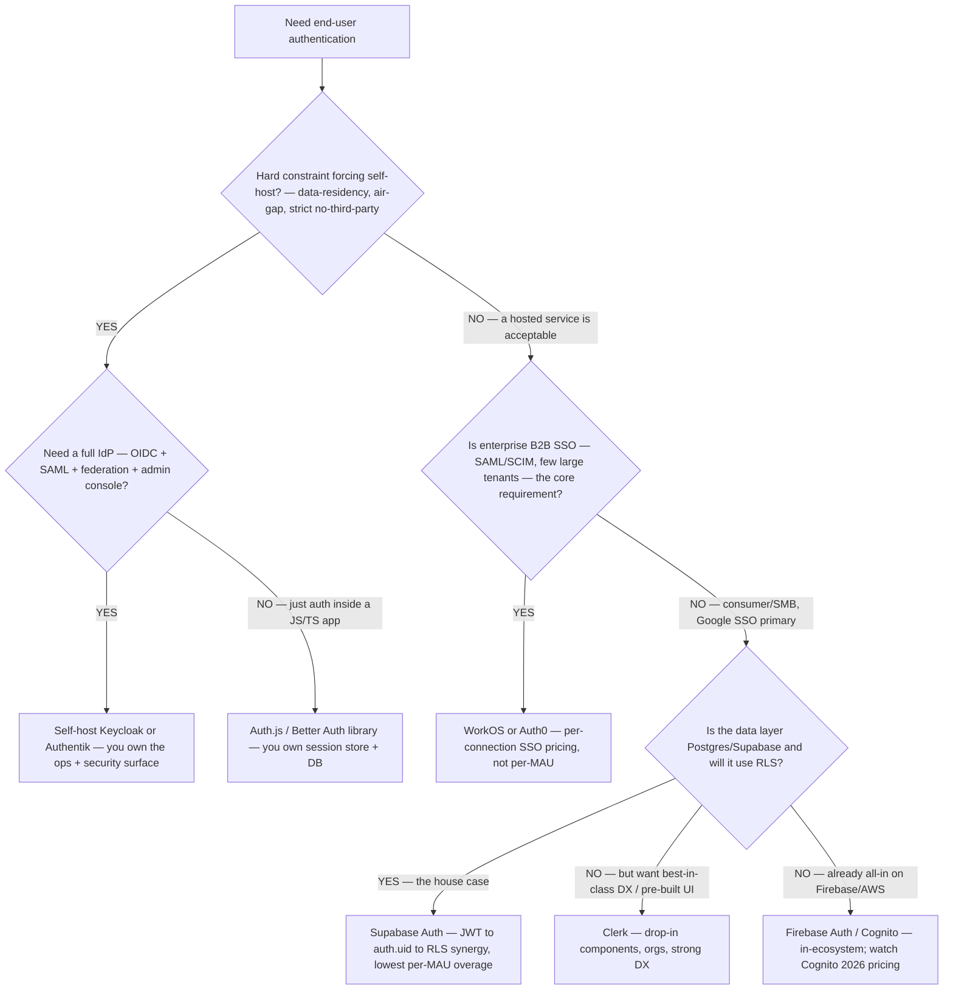
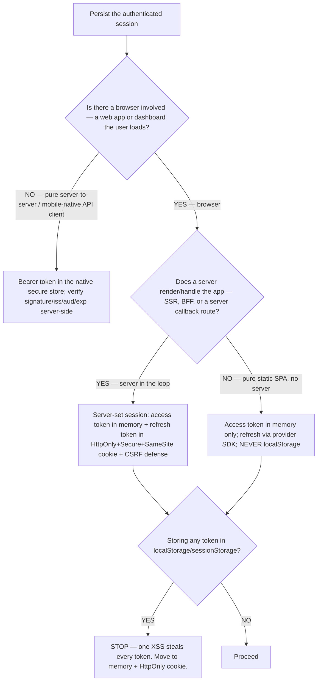

# Auth & identity decision trees

> Canonical `## Decision Tree` sections for the `auth-identity` plugin: the build-vs-buy provider choice, which login methods to offer (Google/Apple/Microsoft/GitHub/magic-link/passkeys), the OAuth-flow choice, the session-vs-JWT + token-storage choice, and the gate-the-dashboard choice. The agents **traverse the relevant tree top-to-bottom before selecting a method** (see `agents/auth-architect.md` → "traverse the decision tree"). Don't keyword-match the user's description; resolve the first clean branch.
>
> **Volatility note.** Provider per-MAU pricing, OAuth 2.1's draft→RFC status, and Google/Supabase mechanics change. Every `Last verified` date below is a re-verification deadline, not a guarantee. Mark any positioning claim `[verify-at-build]` before quoting to a client.
>
> **The boundary every tree respects:** these trees decide how to **authenticate the person**. *What rows/tenant they see after login* is the `data-platform` plugin's Row-Level-Security lane — see [`../CLAUDE.md`](../CLAUDE.md) §0. The gate-the-dashboard tree (d) ends at that seam explicitly.

---

## Decision Tree: Build vs buy — managed provider vs OSS vs roll-your-own

**When this applies:** You're choosing *what* provides authentication for a new app/API/dashboard. Observable trigger: "should I use Supabase Auth, Clerk, Auth0, or roll my own?", "do I need an auth provider at all?", or a greenfield "add login" with no provider chosen yet.

**Last verified:** 2026-06-03 against the managed/OSS landscape in [`auth-provider-landscape-2026.md`](auth-provider-landscape-2026.md) `[verify-at-build — per-MAU pricing volatile]`.



**Rationale per leaf:**
- *Supabase Auth* — **the house default.** Google SSO + sessions built in, and its session JWT maps to Postgres `auth.uid()` — the exact claim `data-platform`'s RLS keys off, so the authn→authz seam is nearly free. Lowest per-MAU overage of the managed set. **requires:** Postgres/Supabase data layer for the synergy to pay off.
- *Clerk* — best DX + pre-built React UI/orgs when the RLS synergy isn't the deciding factor. **requires:** acceptance of ~$0.02/MAU after the free tier.
- *Firebase Auth / Cognito* — in-ecosystem convenience when already on Firebase/AWS. **requires:** awareness that Cognito raised pricing for 60K+ MAU and cut the new-pool free tier to 10K (2026).
- *WorkOS / Auth0* — enterprise B2B SSO (SAML/SCIM); WorkOS prices **per connection**, fitting few-large-tenants. **requires:** the SSO requirement to dominate the cost model.
- *Keycloak / Authentik (self-host)* — a real IdP you operate, for a hard data-residency/air-gap constraint. **requires:** you accept the ops + security-surface burden.
- *Auth.js / Better Auth (library)* — auth *in* a JS/TS app; you own the session store + DB. **requires:** you own (and secure) the storage + posture.

**Tradeoffs summary:**

| Leaf | Control | Security burden you carry | Pricing shape | Requires | Use when |
|---|---|---|---|---|---|
| Supabase Auth | Medium | Low (hosted) | Per-MAU, lowest overage | Postgres/Supabase + RLS | The house case — Google SSO + RLS |
| Clerk | Medium | Low (hosted) | Per-MAU (~$0.02) | DX/UI priority | Fast drop-in, orgs, best DX |
| Firebase / Cognito | Medium | Low (hosted) | Per-MAU | Already on Firebase/AWS | In-ecosystem |
| WorkOS / Auth0 | Medium | Low (hosted) | Per-connection / per-MAU | Enterprise SSO dominant | B2B SAML/SCIM |
| Keycloak / Authentik | High | **High (you run the IdP)** | Infra only | Data-residency/air-gap | Hard self-host constraint |
| Auth.js / Better Auth | High | **High (you own posture)** | Infra only | JS/TS app, own DB | Library-level control |

---

## Decision Tree: Which auth providers should you offer?

**When this applies:** You've chosen the auth product (e.g. Supabase Auth) and now decide *which login methods to surface* — Google, Apple, Microsoft, GitHub, magic link, passkeys, email+password. Observable trigger: "add Apple too", "what login options should I show?", "do I need passwords?".

**Last verified:** 2026-06-03 against [`social-and-passwordless-providers-2026.md`](social-and-passwordless-providers-2026.md). With a managed provider, adding a method is config, not architecture — so bias to **2–4 well-chosen methods**, led by what the audience already has.

```mermaid
flowchart TD
    START[Which login methods to offer?] --> G[Always: Google<br/>broadest reach, lowest friction]
    G --> Q1{Shipping a native iOS app<br/>with third-party login?}
    Q1 -->|YES| APPLE[Add Apple — App Store policy requires it;<br/>budget for its secret-JWT rotation +<br/>first-login name capture]
    Q1 -->|NO| Q1b{Privacy-focused / consumer audience?}
    Q1b -->|YES| APPLE
    Q1b -->|NO| Q2
    APPLE --> Q2{Any users on Microsoft 365 / Entra?<br/>(B2B common)}
    Q2 -->|YES| MS[Add Microsoft — deep Entra →<br/>azure-cloud/entra-identity-engineer]
    Q2 -->|NO| Q3
    MS --> Q3{Developer audience?}
    Q3 -->|YES| GH[Add GitHub — request user:email scope]
    Q3 -->|NO| Q4
    GH --> Q4{Need a no-third-party-account fallback?}
    Q4 -->|YES| PWLESS[Add magic link AND/OR passkeys<br/>— never FORCE a social account]
    Q4 -->|"Passwords explicitly required"| PW[Email+password — provider owns hashing/<br/>breach-check/rate-limit; never hand-roll]
    PWLESS --> STOP[Stop at 2–4 methods.<br/>Every extra button is a 'which did I use?' tax.]
    PW --> STOP
```

**Rationale per leaf:**

- **Google first** — highest account coverage and lowest friction; for a "uses Google for everything" builder it's the primary path.
- **Apple** — mandatory if you ship an iOS app offering other social logins (App Store policy); also a privacy draw. But it carries the most setup cost (ES256 secret-JWT that **expires ≤180 days**, web Services-ID vs native bundle-ID `aud`, name/email **only on first login**) — see the providers doc.
- **Microsoft** — the moment any user base is M365/Entra (most B2B); the generic OAuth button covers consumer/basic-work, full enterprise Entra seams to `azure-cloud/entra-identity-engineer`.
- **GitHub** — developer audiences; request `user:email` since GitHub emails can be private.
- **Passwordless (magic link / passkeys)** — the fallback so you never *force* a third-party account; passkeys are the phishing-resistant modern default (Supabase passkeys is **beta** — gate + keep a fallback).
- **Email+password** — offer only if explicitly needed; the provider must own hashing/breach-check/rate-limiting (house opinion #1).

**Failure modes to avoid:** offering 8 buttons (decision fatigue + maintenance); forcing a social account with no email/passwordless fallback; adding Apple without budgeting for secret rotation + first-login capture; making passkeys the *only* method while adoption is ~15–20%.

> **The method is interchangeable; the seam is not.** However the user authenticates, the same verified `auth.uid()` flows to `data-platform` RLS for row scope (§0).

---

## Decision Tree: Which OAuth flow — by client type

**When this applies:** You've chosen a provider and must pick the OAuth/OIDC flow for a specific client. Observable trigger: "which flow for my SPA / mobile app / backend / CLI?", or a legacy app still on Implicit.

**Last verified:** 2026-06-03 against OAuth 2.1 draft (Implicit removed, PKCE mandatory) + the flows in [`oauth-oidc-and-google-sso.md`](oauth-oidc-and-google-sso.md) `[verify-at-build]`.

```mermaid
flowchart TD
    START[Pick the OAuth/OIDC flow] --> Q1{Is there a human user logging in, or is this machine-to-machine?}
    Q1 -->|Machine-to-machine, no user| LEAF_D[Client Credentials — server holds the secret]
    Q1 -->|Human user| Q2{Can the client keep a secret confidential? — i.e. is it server-side code?}
    Q2 -->|NO — browser SPA or native/mobile (public client)| Q3{Is the device input-constrained? — TV, CLI, no browser/keyboard}
    Q2 -->|YES — server-side web app/backend| LEAF_B[Authorization Code (confidential) + PKCE]
    Q3 -->|YES| LEAF_C[Device Authorization (device code) flow]
    Q3 -->|NO — normal SPA / mobile| LEAF_A[Authorization Code + PKCE]
```

**Rationale per leaf:**
- *Authorization Code + PKCE* — **the default for SPAs and native/mobile (public clients).** PKCE defends the authorization flow against code-injection; no client secret can be safely shipped to a browser/device, so PKCE is the protection. **This is what Supabase's `signInWithOAuth` uses.** `[verified 2026-06-03]`
- *Authorization Code (confidential) + PKCE* — server-side apps that *can* hold a secret. The secret protects the token endpoint; **OAuth 2.1 still mandates PKCE here too** (different attack). **requires:** secret stored server-side, never in source.
- *Device Authorization (device code)* — input-constrained devices show a code the user enters on a second device. **requires:** a device with no usable browser/keyboard.
- *Client Credentials* — machine-to-machine, no user identity. **requires:** a confidential client (server-held secret).

> **Implicit (`response_type=token`) is NOT a leaf** — removed in OAuth 2.1 (token in URL fragment = history/log/`Referer` leak, no PKCE, no sender-constraint). Migrate any Implicit client to Authorization Code + PKCE. ROPC (password grant) is likewise off the tree.

**Tradeoffs summary:**

| Leaf | Client type | Secret? | PKCE | Use when |
|---|---|---|---|---|
| Auth Code + PKCE | SPA / native / mobile | No (public) | **Required** | The default for browser/mobile login |
| Auth Code (confidential) + PKCE | Server-side web app | Yes (server-only) | **Required (2.1)** | Backend that can hold a secret |
| Device code | Input-constrained device | No | n/a | TV / CLI / no-browser |
| Client Credentials | Machine-to-machine | Yes | n/a | No human user |

---

## Decision Tree: Session vs JWT, and where tokens live

**When this applies:** You're deciding how to persist the authenticated session and where each token is stored. Observable trigger: "session cookie or JWT?", "where do I keep the access token?", or a review finding tokens in `localStorage`.

**Last verified:** 2026-06-03 against OWASP Session-Management + CSRF cheat sheets `[verify-at-build]`.



**Rationale per leaf:**
- *Server-set session (HttpOnly cookie)* — **the 2026 default when a server is in the loop** (SSR / BFF / a callback route, e.g. Supabase server-side auth). Short-lived access token in memory, refresh token in an **HttpOnly + Secure + SameSite** cookie the browser sends automatically and JS can't read; add an **anti-CSRF token on writes**. `[OWASP — verified 2026-06-03]`
- *Memory-only SPA* — a pure static SPA keeps the access token **in memory** and refreshes via the provider SDK; never persists to `localStorage`. **requires:** accepting a re-auth on full page reload (or a provider that refreshes silently).
- *STOP — localStorage* — **not a real option.** `localStorage`/`sessionStorage` are readable by any JS in the origin; one XSS discloses every token. Always redirect to the memory + HttpOnly-cookie pattern.
- *Native secure store* — mobile/native clients store the bearer token in the platform secure store (Keychain/Keystore); the **API still verifies signature + `iss`/`aud`/`exp` server-side** on every request.

**Tradeoffs summary:**

| Leaf | XSS exposure | CSRF exposure | Needs a server | Use when |
|---|---|---|---|---|
| Server-set HttpOnly cookie | Low (JS can't read refresh) | **Yes → SameSite + CSRF token** | Yes | SSR/BFF/callback in the loop |
| Memory-only SPA | Access token only, transient | Low (no cookie) | No | Pure static SPA |
| **localStorage** | **Total — every token** | varies | — | **Never** |
| Native secure store | Platform-protected | n/a | API verifies | Mobile/native client |

---

## Decision Tree: Gate the analytics dashboard — and the seam to data-platform

**When this applies:** You're putting the analytics dashboard (the marketplace's generated dashboard HTML + embedded BI views) behind login. Observable trigger: "gate my dashboard behind Google login", "only logged-in users see the dashboard", or "each tenant sees only its rows in the embedded view." This is a **security control**: the chosen leaf escalates to `ravenclaude-core/security-reviewer`.

**Last verified:** 2026-06-03 against the static-host / reverse-proxy / app-shell gate patterns `[verify-at-build]`.

```mermaid
flowchart TD
    START[Put the dashboard behind login] --> Q1{Does the dashboard contain per-viewer/per-tenant DATA, or is it the same view for every authenticated user?}
    Q1 -->|Same view for all authenticated users| Q2{Is the dashboard a static asset on a host that can enforce auth itself? — Vercel/Cloudflare Access, Netlify}
    Q1 -->|Per-tenant rows differ| LEAF_C[App-shell + embed-JWT — auth gate here, ROW SCOPE seams to data-platform RLS/embed-JWT]
    Q2 -->|YES — host can gate| LEAF_A[Static-host access control — platform auth (e.g. Cloudflare/Vercel Access) in front of the static dashboard]
    Q2 -->|NO — self-hosted / needs a uniform gate across apps| LEAF_B[Reverse-proxy gate — oauth2-proxy / Authentik outpost in front]
    LEAF_C --> SEAM[SEAM: identity (auth.uid) handed to data-platform; it issues the short-lived embed-JWT with tenant scope and owns CSP/iframe-sandboxing]
```

**Rationale per leaf:**
- *Static-host access control* — when the dashboard is a **static asset** and shows the **same view to all authenticated users**, let the hosting platform's access layer (Cloudflare Access, Vercel/Netlify auth) enforce login in front of it. Cheapest correct gate. **requires:** a host with a built-in access layer + no per-tenant row differences. **No row scope → no data-platform seam needed.**
- *Reverse-proxy gate* — a self-hosted dashboard, or a uniform gate across several apps, sits behind an **OIDC-aware reverse proxy** (oauth2-proxy, an Authentik proxy outpost) that authenticates before the request reaches the dashboard. **requires:** the proxy wired to your provider (Supabase/Google/IdP).
- *App-shell + embed-JWT* — **the per-tenant case, and the one with the explicit seam.** The dashboard is wrapped in an authenticated app shell; this plugin owns the **login gate** (who's in), and the **row scope** of the embedded BI view is handed to **`data-platform`**: the verified identity (`auth.uid()`) → data-platform issues a **short-lived embed-JWT carrying the tenant claim** → its RLS scopes the rows, and its CSP/iframe-sandboxing skill secures the frame. **A gate that lets the right person in to the wrong tenant's data still leaks** — that's why the row scope is a separate, data-platform-owned control. **requires:** coordination with `data-platform` (`jwt-embed-issuance`, `rls-policy-authoring`, `embed-csp-and-iframe-sandboxing`).

**Tradeoffs summary:**

| Leaf | Per-tenant rows | Who owns row scope | Effort | Requires | Use when |
|---|---|---|---|---|---|
| Static-host access control | No | n/a (same view) | Low | Host with access layer | Static dashboard, one shared view |
| Reverse-proxy gate | No (or coarse) | proxy / app | Medium | OIDC-aware proxy | Self-hosted / uniform multi-app gate |
| App-shell + embed-JWT | **Yes** | **data-platform RLS** | High | data-platform coordination | Per-tenant embedded BI |

**Every leaf escalates the auth verdict to `ravenclaude-core/security-reviewer`** — with where login is enforced, how the session is carried, and (for the app-shell leaf) **where the auth gate ends and the data-platform row-scope seam begins.**

---

## See also

- [`../agents/auth-architect.md`](../agents/auth-architect.md) — the agent that traverses these trees
- [`auth-provider-landscape-2026.md`](auth-provider-landscape-2026.md) — the build-vs-buy landscape behind tree (a)
- [`oauth-oidc-and-google-sso.md`](oauth-oidc-and-google-sso.md) — the flow + Google-SSO detail behind trees (b)/(c)
- [`../CLAUDE.md`](../CLAUDE.md) §0 — the authenticate-the-person vs authorize-the-data boundary the trees respect
- [`../../data-platform/CLAUDE.md`](../../data-platform/CLAUDE.md) §3 — the RLS / embed-JWT lane tree (d) seams to

---

_Last reviewed: 2026-06-03 by `claude`. Provider pricing, OAuth 2.1 status, and Google/Supabase mechanics re-verify before quoting._
