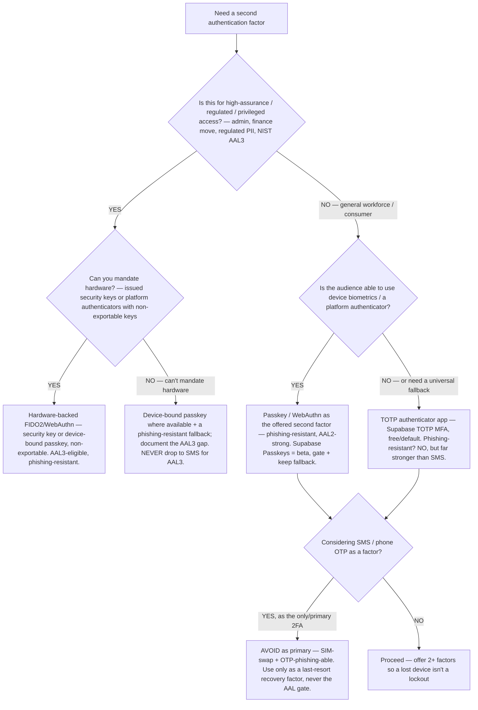
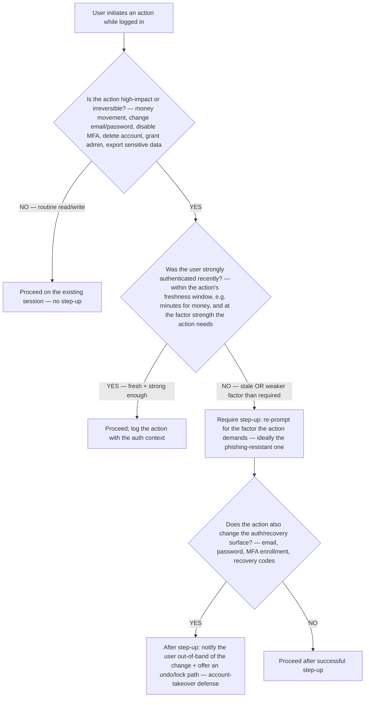

# MFA & step-up authentication decision trees

> Canonical `## Decision Tree` sections complementing [`auth-identity-decision-trees.md`](auth-identity-decision-trees.md). That file decides the **first-factor** story (build-vs-buy, which login methods, OAuth flow, session/token storage, dashboard gate, logout, refresh-reuse). **This file decides the *second-factor and re-authentication* story** — which MFA factor to require, and when to demand step-up auth for a sensitive action. The agents **traverse the relevant tree top-to-bottom before selecting a factor** (don't keyword-match; resolve the first clean branch).
>
> **Volatility note.** NIST SP 800-63B AAL definitions, FIDO/WebAuthn capabilities, and provider MFA support (e.g. Supabase) change. Every `Last verified` date below is a re-verification deadline. Mark any positioning claim `[verify-at-use]` before quoting to a client.
>
> **The boundary every tree respects:** these trees decide how strongly to **authenticate the person** for a given factor or action. *What rows/tenant they see after authentication* is the `data-platform` RLS lane — see [`../CLAUDE.md`](../CLAUDE.md) §0. Every MFA / step-up change is a **security control** → it escalates to `ravenclaude-core/security-reviewer` (CLAUDE.md §8).

---

## Decision Tree: Which MFA factor should you require?

**When this applies:** You've decided the app needs a second factor (or you're choosing what to *offer* as MFA) and must pick the factor type. Observable trigger: "add MFA / 2FA", "is SMS OTP good enough?", "do we need hardware keys?", "what counts as phishing-resistant?".

**Last verified:** 2026-06-05 against NIST SP 800-63B (rev 4, published 2025-07-31) AAL guidance + FIDO2/WebAuthn + Supabase MFA support `[verify-at-use]`.

**Rationale per leaf:**
- *Hardware FIDO2/WebAuthn (LEAF_A)* — the **gold standard**: phishing-resistant (origin-bound cryptography), non-exportable private key, explicit user intent. The only factor class NIST permits at **AAL3**. **requires:** you can issue/mandate hardware keys or non-exportable platform authenticators.
- *Device-bound passkey + fallback (LEAF_B)* — when AAL3-grade assurance is needed but hardware can't be universally mandated; use device-bound (not synced) passkeys where present and **document the residual AAL3 gap** rather than silently dropping to a weaker factor. **requires:** an honest assurance-level record + a phishing-resistant fallback.
- *Passkey / WebAuthn as 2FA (LEAF_C)* — **the modern default for general workforce/consumer MFA**: phishing-resistant, strong at AAL2. Supabase Passkeys is **beta/experimental** (opt-in, API may change) — gate it and keep a fallback (per the passkey-rollout scenario). **requires:** users who can use a platform authenticator + a non-passkey recovery path.
- *TOTP authenticator app (LEAF_D)* — the **universal fallback factor**: works without biometrics/hardware, free and enabled by default on Supabase. **Not phishing-resistant** (a real-time relay can capture the code), but dramatically stronger than SMS. **requires:** the user can run an authenticator app; pair with passkeys where possible.
- *SMS / phone OTP (LEAF_E)* — **avoid as primary 2FA**: vulnerable to SIM-swap and real-time OTP phishing; NIST treats it as "restricted." Acceptable only as a **last-resort recovery factor**, never the factor your AAL claim rests on.

**Tradeoffs summary:**

| Factor | Phishing-resistant | NIST AAL ceiling | Friction | Requires | Use when |
|---|---|---|---|---|---|
| Hardware FIDO2 / WebAuthn | **Yes** | **AAL3** (non-exportable) | Medium (carry a key) | Mandate hardware | Privileged / regulated / AAL3 |
| Device-bound passkey | **Yes** | AAL3 (device-bound only) | Low | Platform authenticator | High-assurance, no key mandate |
| Synced passkey | **Yes** | AAL2 (not AAL3) | Low | Provider ecosystem | General workforce/consumer |
| TOTP app | No | AAL2 | Medium (type a code) | Authenticator app | Universal fallback factor |
| SMS / phone OTP | No (SIM-swap) | Restricted | Low | A phone number | **Recovery only — never primary** |

> **Offer at least two factors.** A single MFA factor with no alternate is a lockout waiting to happen (the passkey-rollout scenario) — pair a phishing-resistant primary (passkey/WebAuthn) with a universal fallback (TOTP), and reserve SMS for last-resort recovery only.

---

## Decision Tree: When to require step-up (re-)authentication for a sensitive action?

**When this applies:** A user is already logged in and is about to do something consequential — and you're deciding whether to demand a fresh, stronger authentication *at that moment*. Observable trigger: "should changing the password / email require re-auth?", "protect the money-movement endpoint", "the user has been logged in for days — is that session strong enough to delete the account?".

**Last verified:** 2026-06-05 against the [`step-up-auth-for-sensitive-actions`](../best-practices/step-up-auth-for-sensitive-actions.md) best-practice + OWASP Authentication / Session Management guidance `[verify-at-use]`.

**Rationale per leaf:**
- *Proceed, no step-up (ALLOW)* — routine actions ride the existing session; demanding re-auth for everything trains users to click through prompts (prompt fatigue) and weakens the signal.
- *Proceed on fresh+strong session (ALLOW2)* — step-up is satisfied if the user *already* authenticated recently at the required strength; don't re-prompt inside the freshness window. Always **log the action with its auth context** so an audit can answer "how strongly was this proven?".
- *Require step-up (STEPUP)* — the session is too old or was established with a weaker factor than this action needs; re-prompt **at the moment of the action**, preferring the phishing-resistant factor. This is the defense against a hijacked-but-idle session and against a low-assurance login reaching a high-impact action.
- *Notify out-of-band (NOTIFY)* — when the action mutates the **auth/recovery surface itself** (email, password, MFA, recovery codes), an attacker who got step-up could lock the real owner out; send an out-of-band notification + an undo/lock path so the legitimate user can react. This is the account-takeover-via-MFA-bypass countermeasure.

**Tradeoffs summary:**

| Action class | Step-up? | Freshness window | Extra control |
|---|---|---|---|
| Routine read/write | No | n/a | Standard session |
| Money movement / data export | Yes if stale | Minutes | Log auth context |
| Change password / email | Yes | Tight | Out-of-band notify + undo |
| Disable MFA / change recovery | Yes (strong factor) | Tight | Out-of-band notify + undo + cool-down |
| Grant admin / delete account | Yes (strong factor) | Tight | Notify + audit log |

> **Step-up authenticates the *action*, not just the *session*.** A long-lived "remember me" session is fine for reading; it is not proof-of-presence for moving money or changing the recovery email. The freshness window + factor strength are the two knobs — set them by the action's blast radius. **Every step-up / MFA-bypass-defense change routes through `ravenclaude-core/security-reviewer`** (CLAUDE.md §8).

---

## See also

- [`auth-identity-decision-trees.md`](auth-identity-decision-trees.md) — the first-factor trees (provider, method, flow, session/token, dashboard gate, logout, refresh-reuse) these two complement
- [`../best-practices/step-up-auth-for-sensitive-actions.md`](../best-practices/step-up-auth-for-sensitive-actions.md) — the rule behind the step-up tree
- [`../best-practices/passkeys-need-a-fallback.md`](../best-practices/passkeys-need-a-fallback.md) — why a single factor with no fallback is a lockout
- [`social-and-passwordless-providers-2026.md`](social-and-passwordless-providers-2026.md) — passkeys/WebAuthn + magic-link provider detail
- [`../CLAUDE.md`](../CLAUDE.md) §0 — the authenticate-the-person vs authorize-the-data boundary

---

_Last reviewed: 2026-06-05 by `claude`. NIST AAL definitions, FIDO/WebAuthn capability, and provider MFA support re-verify before quoting._
