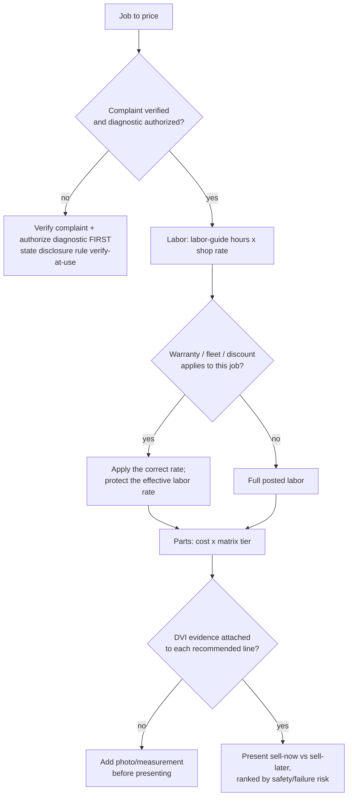
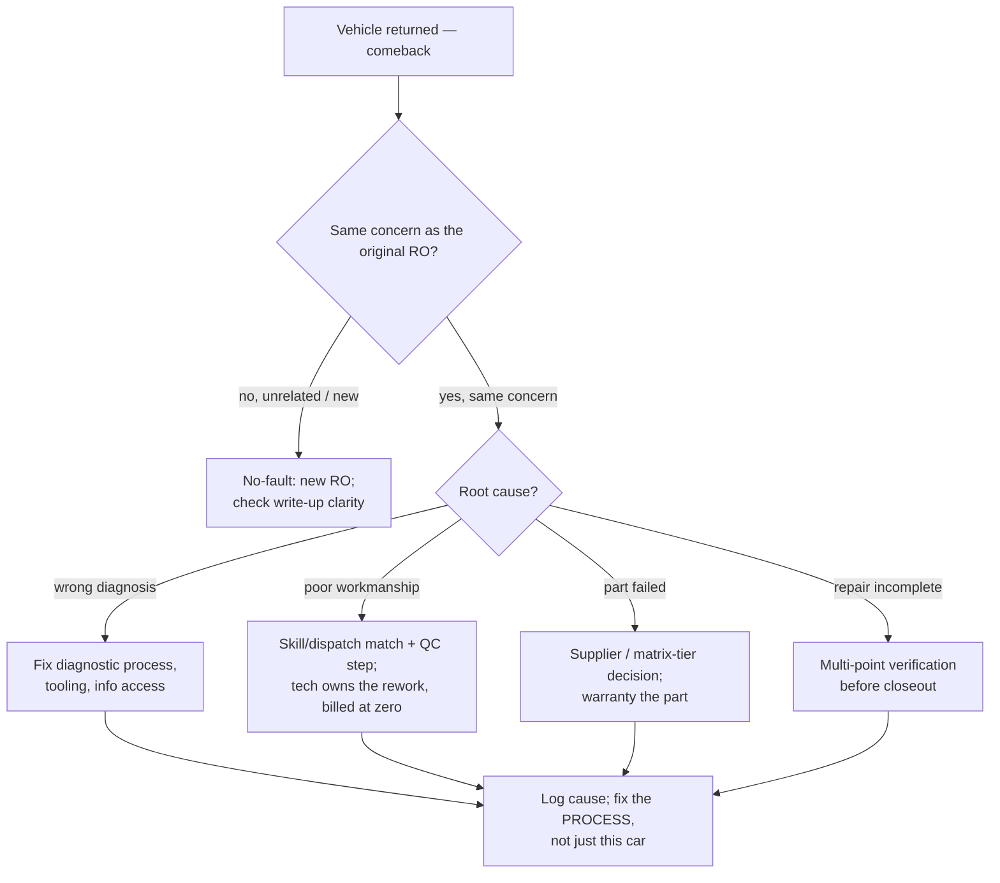
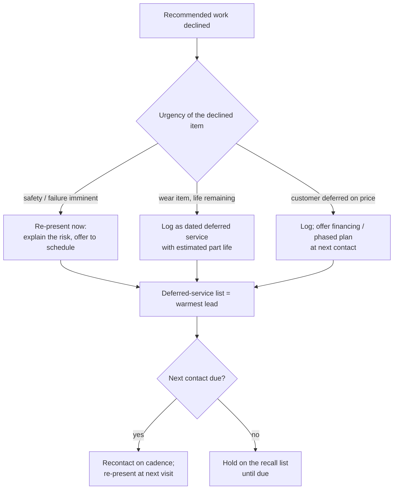
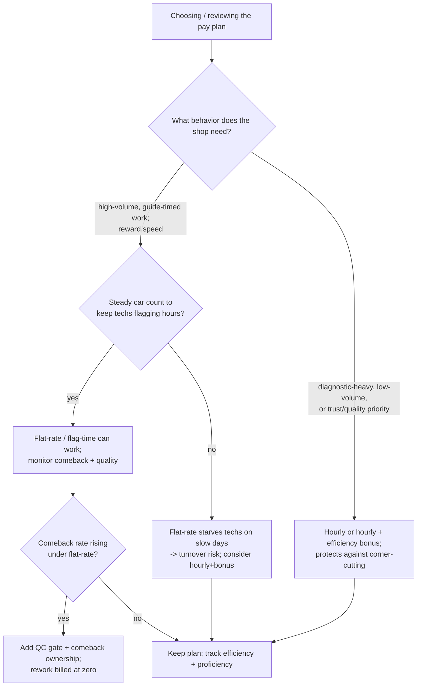

# Auto-Repair Shop — Decision Trees

> Reference decision trees for the `auto-repair-shop-operations` team. Agents **traverse the relevant tree top-to-bottom before deciding** (the proactive complement to the Capability Grounding Protocol). Each `## Decision Tree` section is a Mermaid graph plus the rule it encodes.
>
> **Operations and financial decision-support — not legal, tax, or OEM-warranty advice.** Anything touching a labor rate, a labor-guide time, a parts-margin figure, a productivity benchmark, or a state estimate-authorization rule is `[verify-at-use]` — confirm against the shop's own numbers, the current labor guide, or the local statute before acting. No customer PII.
>
> _Last reviewed: 2026-07-02 by `claude`. Principles are durable; dated benchmarks and figures live in [`auto-repair-shop-reference-2026.md`](auto-repair-shop-reference-2026.md)._

---

## Decision Tree: price a job (labor + parts matrix)

**Rule:** never price before the complaint is verified and the diagnostic authorized. Labor = labor-guide hours x the shop rate (`[verify-at-use]` on both), parts = cost x the matrix tier — not an off-the-cuff markup or discount. Present with DVI evidence, triaged sell-now vs sell-later.

---

## Decision Tree: comeback root-cause triage

**Rule:** a comeback is triaged by **root cause**, and the fix is the process that produced it — not just re-doing the car. Rework is billed at zero and taxes the effective labor rate, so the tech who caused a workmanship comeback owns the rework. Group comebacks by cause; don't chase them one at a time.

---

## Decision Tree: declined-work follow-up

**Rule:** a decline is logged, never forgotten. Rank by urgency and part life, set a recontact cadence, and re-present at the next visit — the deferred-service list is the shop's warmest source of future car count. Honest triage (safety now, wear later) is the ethical form of upsell.

---

## Decision Tree: tech pay — flat-rate vs hourly

**Rule:** the pay plan is chosen for the **behavior the shop needs** and the **car count it can guarantee** — flat-rate rewards speed but needs volume and a quality gate (it can incentivize comebacks); hourly protects quality and diagnostic work but must still be measured on efficiency. Effective-labor-rate and pay-plan strategy are the shop lead's call; benchmarks `[verify-at-use]`.

---

## See also

- [`auto-repair-shop-reference-2026.md`](auto-repair-shop-reference-2026.md) — dated labor-rate norms, productivity benchmarks, and the parts-GP matrix (verify-at-use).
- Skills: [`../skills/effective-labor-rate-and-gross-profit/SKILL.md`](../skills/effective-labor-rate-and-gross-profit/SKILL.md), [`../skills/estimate-and-dvi-workflow/SKILL.md`](../skills/estimate-and-dvi-workflow/SKILL.md), [`../skills/technician-productivity-and-efficiency/SKILL.md`](../skills/technician-productivity-and-efficiency/SKILL.md), [`../skills/ro-lifecycle-and-comeback-control/SKILL.md`](../skills/ro-lifecycle-and-comeback-control/SKILL.md).
