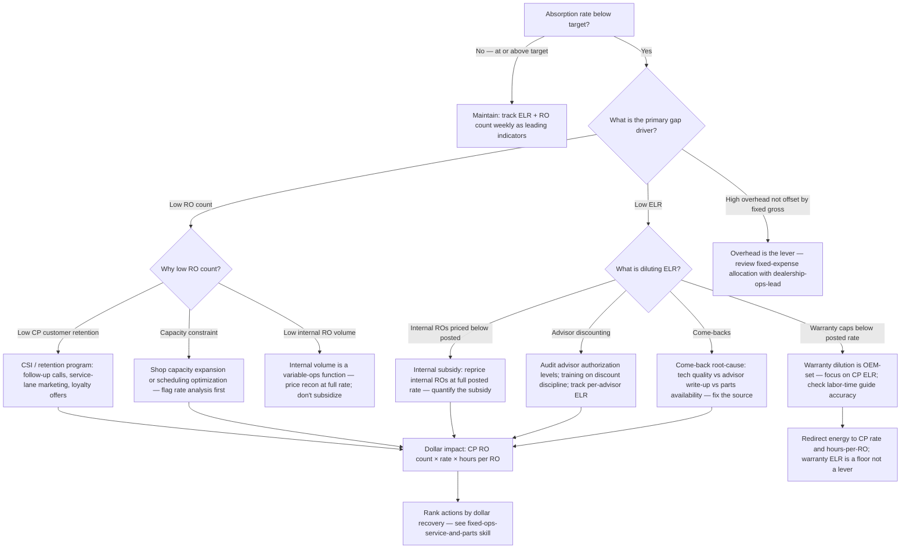
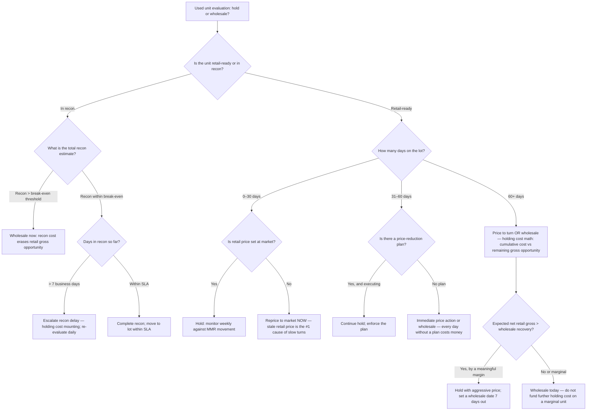
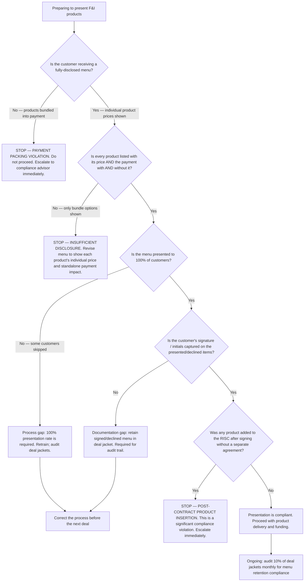

# Automotive Dealership — Decision Trees + 2026 Capability Map

> Canonical knowledge bank for `automotive-dealership`. **Traverse the relevant Mermaid
> tree top-to-bottom before choosing** — the proactive complement to the Capability
> Grounding Protocol. Volatile product/version/benchmark facts carry a retrieval date and
> a `[verify-at-use]` rider.

---

## Decision Tree 1: Absorption Improvement

**Leaf rule:** every absorption diagnosis resolves to one of three levers — RO count (volume),
ELR (rate quality), or overhead (cost base). Start with ELR dilution analysis (fastest dollar
recovery); then RO count growth (takes longer); then overhead review (structural, requires
dealership-ops-lead). Warranty ELR is a floor: improve it only through labor-time guide
accuracy, not by fighting OEM caps.

---

## Decision Tree 2: Hold vs Wholesale — Used Vehicle

**Leaf rule:** the hold-vs-wholesale decision is a break-even calculation, not an opinion.
`Break-even recon threshold = (estimated retail price − ACV) − expected remaining holding cost`.
If the recon quote plus remaining expected holding cost exceeds that threshold, wholesale
today. The most common mistake is holding a unit through three months of floor-plan cost
hoping for a retail price that never comes. Set a wholesale date at day 60 and enforce it.

---

## Decision Tree 3: F&I Product Presentation Compliance

**Leaf rule:** any F&I product presentation that does not show individual product prices
simultaneously, does not document customer acceptance or decline, or bundles a product into
a quoted payment without explicit disclosure is a compliance violation — not a gray area.
Payment packing is an unfair or deceptive act or practice under FTC Act § 5. Stop, correct,
and document. The two goals of high PVR and clean compliance are not in conflict: a
fully-disclosed menu process is the highest-PVR method documented across 20-group studies.

---

## 2026 Capability Map — DMS, Desking, CRM, and Inventory Tools

_Retrieved 2026-06-08. Product features, pricing, and market position are volatile —
re-confirm at use; this is orientation, not a procurement recommendation._

| Category | Options (2026) | Notes |
|---|---|---|
| **DMS (dealer management system)** | **CDK Global** (CDK Drive, Fortellis), **Reynolds & Reynolds** (ERA-IGNITE), **Tekion** (Automotive Retail Cloud — ARC) | CDK and R&R are the two dominant legacy DMS providers (~70%+ combined market share [verify-at-use]). Tekion is the primary cloud-native challenger (circa 2021+), gaining traction with buy-here/pay-here and franchise stores. All three support desking, F&I, service, and parts modules. |
| **Desking software** | **MaximTrak** (integrated F&I platform), **RouteOne** (F&I and lender portal), **Dealertrack** (Cox/CDK ecosystem), **DealerSocket** (Solera) | RouteOne and Dealertrack are the primary lender-portal/contracting platforms. MaximTrak focuses on F&I menu and desking. Most integrate with the primary DMS platforms. |
| **CRM / BDC** | **DealerSocket CRM** (Solera), **VinSolutions** (Cox), **Elead** (CDK), **Activix CRM** | Major DMS players each have a CRM product; many dealers run a best-of-breed CRM separate from the DMS. |
| **Used-vehicle inventory management** | **vAuto** (Cox — Provision, LiveMarket), **DealerSocket Inventory+**, **Lotpop**, **AutoTrader/Cars.com marketplace tools** | vAuto Provision is the dominant market-based pricing and days-supply tool for used-vehicle management. Provides MMR (Manheim Market Report) integration for ACV benchmarking. |
| **Reconditioning / workflow** | **iRecon** (Cox), **AutoVitals**, **Xtime** (Cox — service workflow), **ELEAD1ONE** | Used-vehicle recon management and service workflow tools. Xtime and AutoVitals focus on the service-advisor write-up and tech communication workflow. |
| **Auction / wholesale** | **Manheim** (Cox), **ADESA** (Carvana spin-off), **OVE Marketplace** (Cox digital), **TradeRev** (KAR) | Manheim is the largest physical and digital wholesale auction. OVE is the digital lane. ADESA is the second-largest physical network. TradeRev is mobile/digital. |
| **F&I product providers** | **JM&A Group**, **EFG Companies**, **Safe-Guard Products**, **Zurich**, **First Acceptance** | Major aftermarket F&I product administrators. Product availability, terms, and pricing vary by market. Lender participation and reserve policies are separate from product admin. [verify-at-use] |
| **Compliance tools** | **DealerSocket Compliance**, **Wolters Kluwer compliance suite**, **RouteOne compliance module**, **Reynolds DocuPad** | Compliance module availability varies by DMS and state. OFAC screening is frequently integrated into the F&I/lender portal (RouteOne, Dealertrack). |

> Provenance: NADA, AutoRemarketing, DealerSocket/Cox/CDK published materials, and
> automotive-retail industry coverage, retrieved 2026-06-08. Market shares and product
> capabilities are volatile — verify before procurement decisions. No invented products.

---

## See also

- [`../CLAUDE.md`](../CLAUDE.md) — team constitution and seams.
- [`../best-practices/README.md`](../best-practices/README.md) — the named, citable rules.
- [`../scripts/dealer_calc.py`](../scripts/dealer_calc.py) — absorption, ELR, PVR, days-supply,
  front/back-end gross, and recon holding cost calculator.

_Last reviewed: 2026-06-08 by `claude`._
