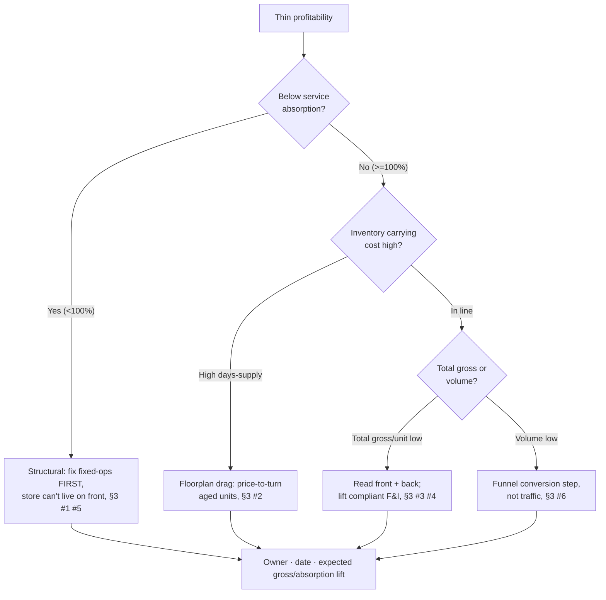
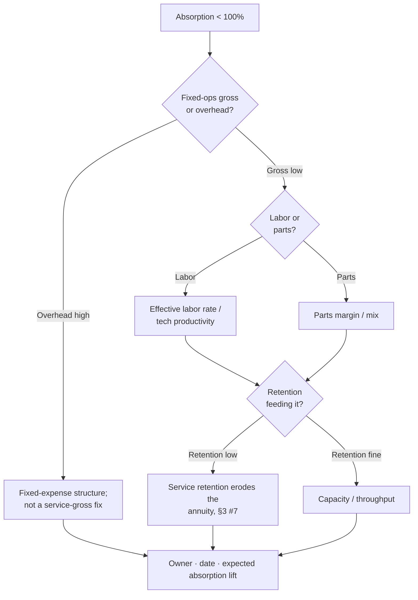

# Automotive Dealership Operations Decision Trees

> Mermaid decision trees for the three most common triage paths. Traverse top-to-bottom and pick the smaller-blast-radius leaf — don't keyword-match the symptom to a method. Each tree encodes the team's house opinions (CLAUDE.md §3).

## Tree 1 — Store profitability is thin



## Tree 2 — Absorption below 100%



## Tree 3 — Sales volume is short

```mermaid
flowchart TD
    A[Volume short] --> B{Traffic (ups)<br/>down?}
    B -- "Ups low" --> B1[Marketing / inventory mix;<br/>then re-check funnel]
    B -- "Ups fine" --> C{Which step<br/>leaks?}
    C -- "Up->write-up" --> C1[Lead handling / response time]
    C -- "Write-up->sold" --> C2{Desk or<br/>F&I/finance?}
    C2 -- "Desk/price" --> C3[Desking / gross discipline, §3 #3]
    C2 -- "Finance" --> C4[Approval / structure; lending<br/>questions to counsel, §2]
    B1 --> D[Owner · date · expected close-rate lift]
    C1 --> D
    C3 --> D
    C4 --> D
```

## How to read these

- **Decompose before you act** — the first node of each tree is usually a STOP that prevents acting on an aggregate you haven't yet split.
- **Fix the constraint before adding volume** — more input into a leaking process wastes resource.
- Every leaf ends in the §6 Output Contract: owner · date · expected metric movement.
