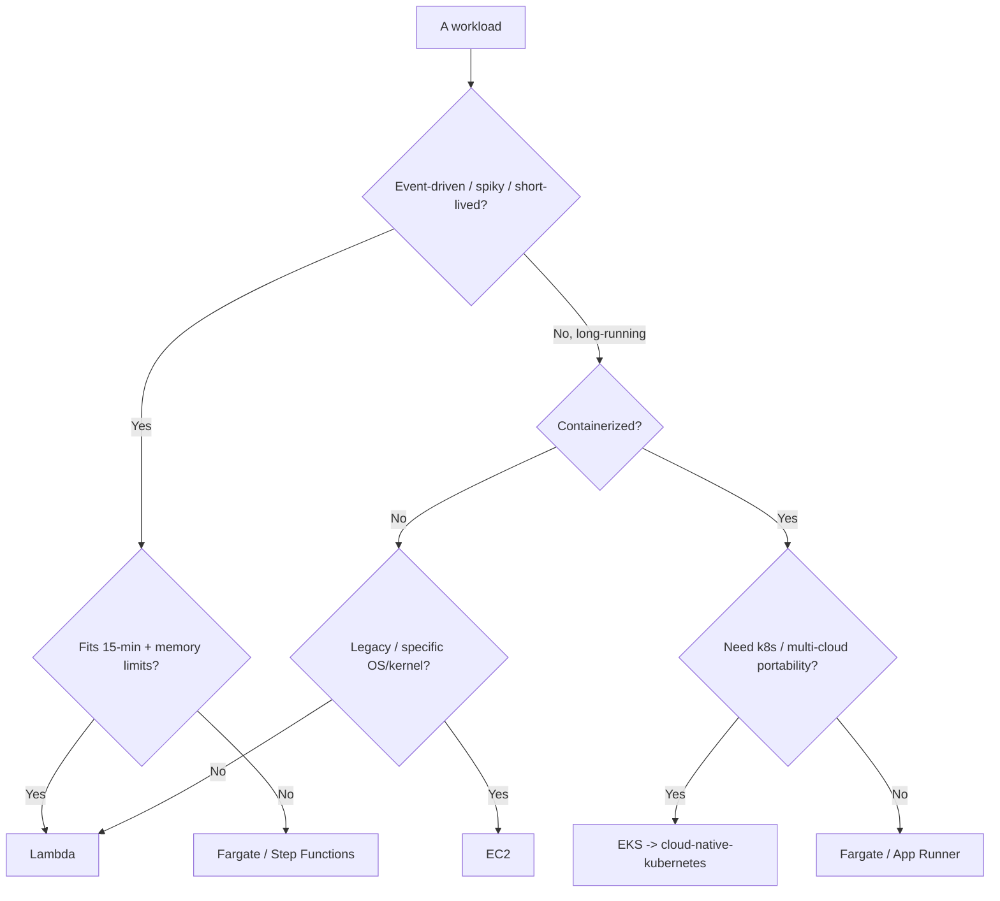
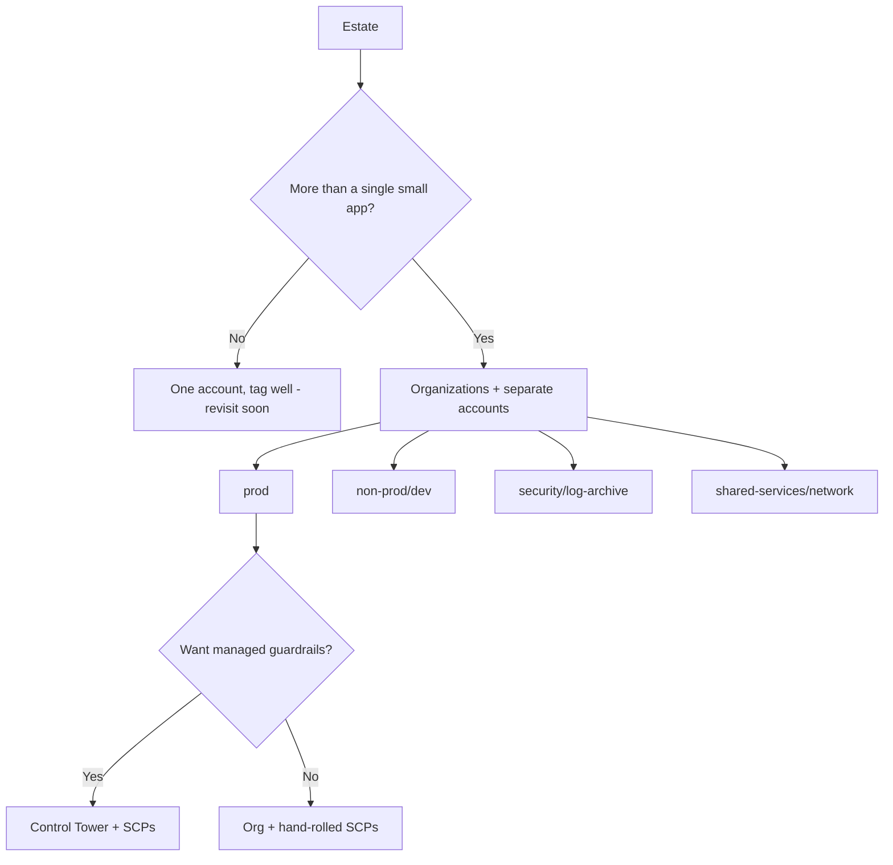
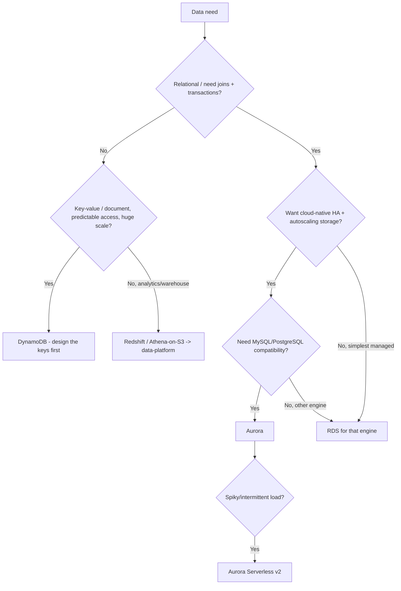
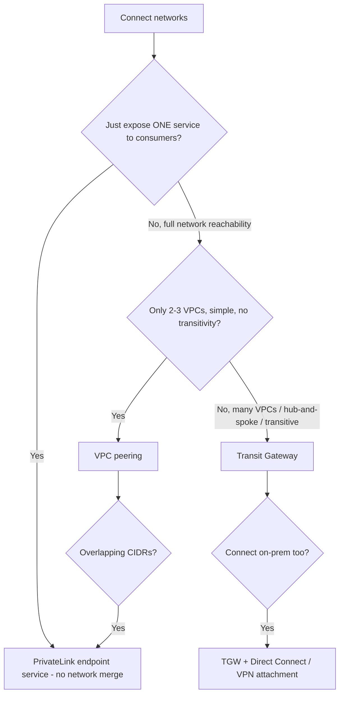
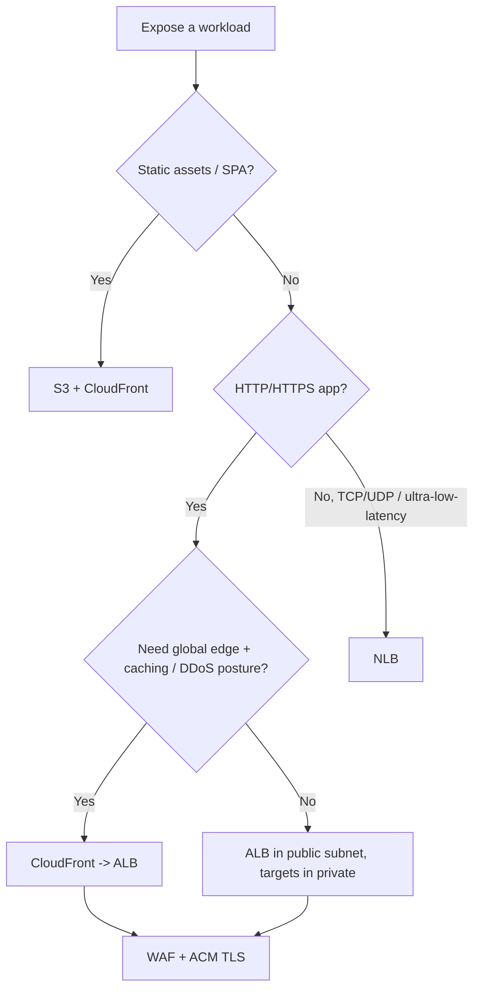

# AWS Cloud — Decision Trees

_Decision trees + a dated capability map. Capability rows are `[verify-at-build]` — re-check against the vendor before quoting. Last reviewed: 2026-06-04._

Traverse before choosing compute or an account layout.

## Decision Tree: AWS compute selection

Pick by workload shape and operational burden, not familiarity.

_Don't run EKS to host one container._

## Decision Tree: How many AWS accounts?

Separate by blast radius and billing, governed by Organizations + SCPs.

## Decision Tree: Which AWS database service?

Pick by data model and access pattern, not by what the team last used.

_DynamoDB rewards key design and punishes relational habits; don't pick it to avoid running a database, pick it for its access pattern._

## Decision Tree: How to connect VPCs/accounts?

Few VPCs peer; many VPCs route through a hub; single-service exposure uses PrivateLink.

_Peering is a full mesh that doesn't scale and isn't transitive; reach for Transit Gateway before the mesh gets ugly, and PrivateLink when you want exposure without merging networks._

## Decision Tree: How to expose a workload to the internet?

Public exposure is an explicit decision; pick the front door by protocol and need.

_The workload stays in a private subnet; only the load balancer (or CloudFront) lives at the edge. Public reachability is reviewed, never a default._

## Capability map (dated — verify at build)

| Capability | 2026 state `[verify-at-build]` | Notes |
|---|---|---|
| Organizations + Control Tower | GA | Landing zone + guardrails |
| IAM Identity Center (SSO) | GA | Federate humans; no IAM users |
| IRSA / EKS Pod Identity | GA | Pod-level IAM without node keys |
| OIDC federation for CI | GA | Replace long-lived keys |
| Lambda (limits) | 15-min max, mem-bound | Verify limits before designing |
| EventBridge / Step Functions | GA | Event routing + orchestration |
| Savings Plans / RIs | GA | Rightsize FIRST |
