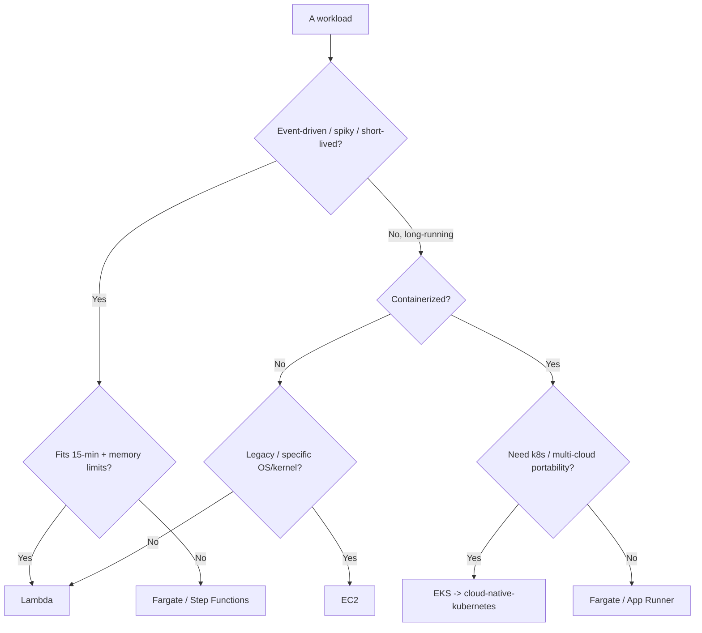
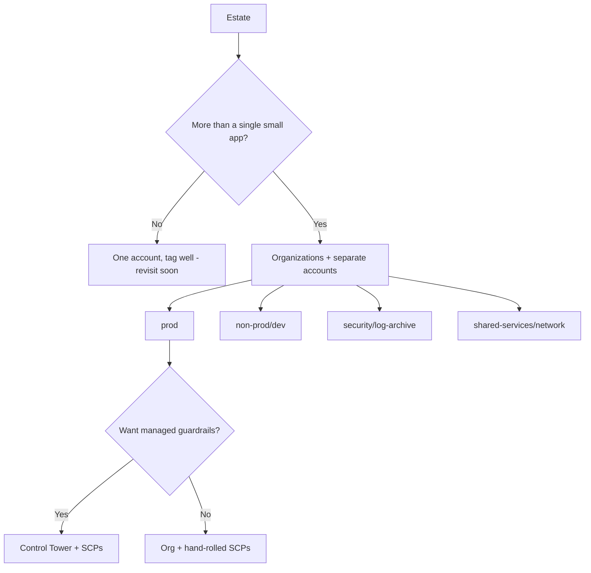
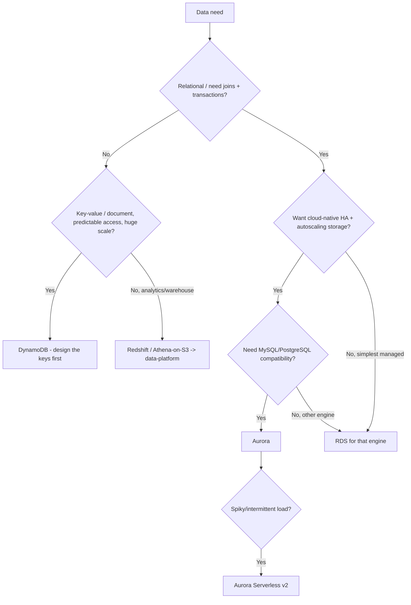
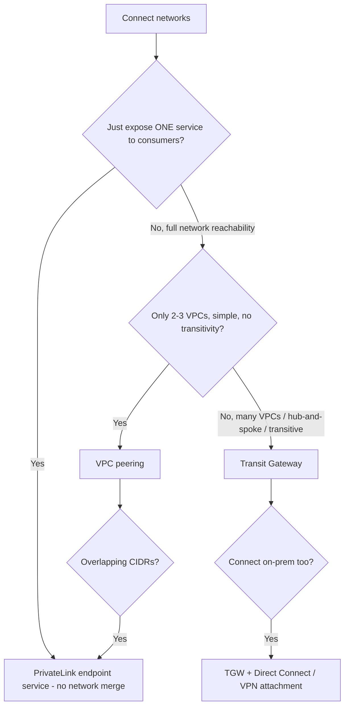
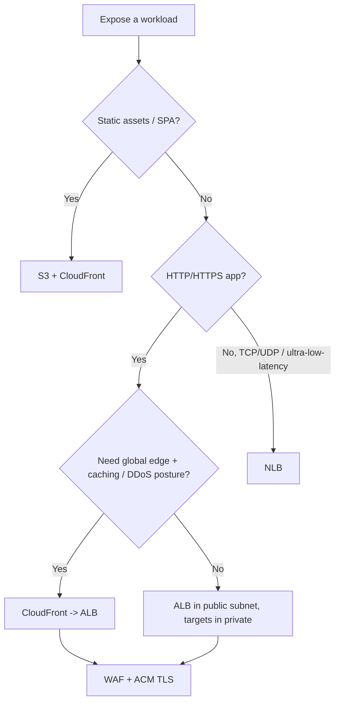
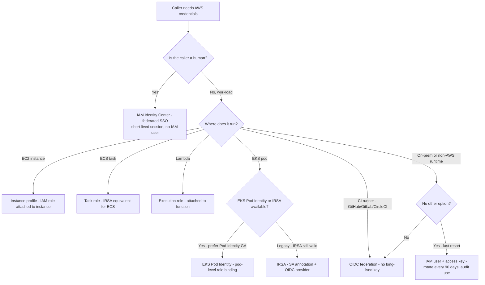
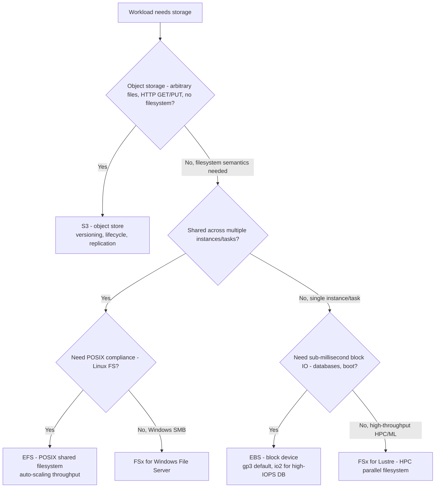
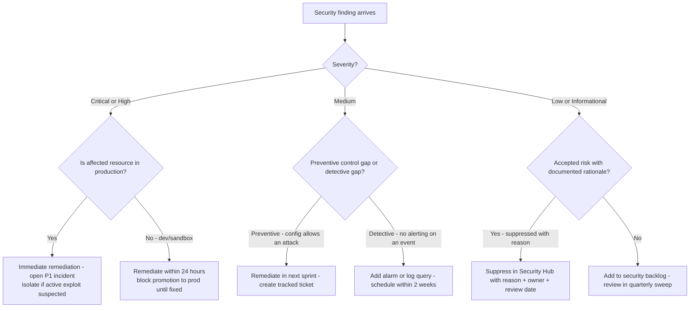

# AWS Cloud — Decision Trees

_Decision trees + a dated capability map. Capability rows are `[verify-at-build]` — re-check against the vendor before quoting. Last reviewed: 2026-06-04._

Traverse before choosing compute or an account layout.

## Decision Tree: AWS compute selection

Pick by workload shape and operational burden, not familiarity.

_Don't run EKS to host one container._

## Decision Tree: How many AWS accounts?

Separate by blast radius and billing, governed by Organizations + SCPs.

## Decision Tree: Which AWS database service?

Pick by data model and access pattern, not by what the team last used.

_DynamoDB rewards key design and punishes relational habits; don't pick it to avoid running a database, pick it for its access pattern._

## Decision Tree: How to connect VPCs/accounts?

Few VPCs peer; many VPCs route through a hub; single-service exposure uses PrivateLink.

_Peering is a full mesh that doesn't scale and isn't transitive; reach for Transit Gateway before the mesh gets ugly, and PrivateLink when you want exposure without merging networks._

## Decision Tree: How to expose a workload to the internet?

Public exposure is an explicit decision; pick the front door by protocol and need.

_The workload stays in a private subnet; only the load balancer (or CloudFront) lives at the edge. Public reachability is reviewed, never a default._

## Capability map (dated — verify at build)

| Capability | 2026 state `[verify-at-build]` | Notes |
|---|---|---|
| Organizations + Control Tower | GA | Landing zone + guardrails |
| IAM Identity Center (SSO) | GA | Federate humans; no IAM users |
| IRSA / EKS Pod Identity | GA | Pod-level IAM without node keys |
| OIDC federation for CI | GA | Replace long-lived keys |
| Lambda (limits) | 15-min max, mem-bound | Verify limits before designing |
| EventBridge / Step Functions | GA | Event routing + orchestration |
| Savings Plans / RIs | GA | Rightsize FIRST |
| Graviton (Arm) instances | GA — Graviton5 / EC2 M9g, M9gd GA 2026-06-10 | Prefer Arm for price-performance where the runtime/deps support Arm64; up to ~25% compute gain vs Graviton4. [AWS what's-new](https://aws.amazon.com/about-aws/whats-new/2026/06/ec2-m9g-m9gd-instances-graviton5-processors-available/) |

---

## Decision Tree: AWS IAM — role, federated identity, or long-lived key?

**When this applies:** A workload, a CI/CD pipeline, or a human needs AWS credentials. The observable inputs are: what is the caller (EC2 instance, ECS task, Lambda, Kubernetes pod, GitHub Actions runner, human developer), and where does it run. The goal is the shortest-lived credential possible for the job.

**Last verified:** 2026-06-05 against AWS IAM documentation and IRSA/Pod Identity GA release notes.

**Rationale per leaf:**
- *IAM Identity Center* — humans must authenticate via SSO so credentials expire with the session and access is centrally revocable.
- *Instance profile* — the EC2 metadata service provides rotating credentials without any key to store.
- *Task role* — ECS tasks inherit a role bound at the task definition level, not the host.
- *Execution role* — Lambda functions get temporary credentials via the execution role without any key.
- *EKS Pod Identity* — the GA successor to IRSA; binds a role to a service account without an OIDC provider per cluster.
- *IRSA* — still valid where Pod Identity is not yet available; the cluster OIDC provider issues pod-scoped credentials.
- *OIDC federation* — CI systems (GitHub Actions, GitLab, CircleCI) can exchange a workflow token for short-lived AWS credentials via AssumeRoleWithWebIdentity.
- *IAM user + access key* — last resort only; a long-lived key is a leak risk and must be rotated and monitored.

**Tradeoffs summary:**

| Method | Credential lifetime | Rotation needed? | Approval gate? | Use when |
|---|---|---|---|---|
| IAM Identity Center | Session-scoped (hours) | No | SSO IdP | Human access |
| Instance / Task / Lambda role | Auto-rotated (minutes) | No | IaC PR review | AWS-native workload |
| EKS Pod Identity | Auto-rotated | No | IaC PR review | EKS pods - GA preferred |
| IRSA | Auto-rotated | No | IaC PR review | EKS pods - OIDC provider |
| OIDC federation | Workflow-scoped | No | Pipeline config | CI/CD runners |
| IAM user + key | Long-lived (permanent until rotated) | Yes - every 90 days | Security review | Last resort only |

---

## Decision Tree: AWS storage — S3, EFS, EBS, or FSx?

**When this applies:** A workload needs persistent storage. The observable inputs are: does data need to be shared across instances/tasks, is it block-level or object-level, is it file-system POSIX semantics, and what are the throughput/latency constraints.

**Last verified:** 2026-06-05 against AWS storage service documentation.

**Rationale per leaf:**
- *S3* — the default for any object or file that does not need a filesystem mount; scales to any size, cheapest per GB, native lifecycle policies.
- *EFS* — POSIX-compliant, multi-AZ, shared filesystem for multi-instance workloads (web farms, CMS media, home directories); throughput scales automatically.
- *FSx for Windows File Server* — Windows SMB shares (Active Directory integrated) for Windows workloads.
- *EBS (gp3)* — the default block device for single-instance workloads; detach/reattach to a new instance; `gp3` gives baseline 3000 IOPS at any size.
- *EBS (io2)* — provisioned IOPS for high-performance databases where IOPS/throughput must be predictable.
- *FSx for Lustre* — HPC and ML training workloads needing parallel high-throughput filesystem at petabyte scale.

**Tradeoffs summary:**

| Method | Access model | Multi-attach | Cost tier | Use when |
|---|---|---|---|---|
| S3 | Object / HTTP | Yes - unlimited | Lowest per GB | Files, backups, static assets, data lake |
| EFS | POSIX / NFS | Yes - multi-AZ | Mid - pay per GB used | Shared Linux filesystem across instances |
| FSx Windows | SMB | Yes - multi-AZ | Higher | Windows SMB shares |
| EBS gp3 | Block | No - single instance | Low | Single-instance OS, data, app storage |
| EBS io2 | Block | Limited multi-attach | Higher | High-IOPS database volumes |
| FSx Lustre | Parallel FS | Yes | High | HPC / ML training workloads |

---

## Decision Tree: AWS security finding — remediate now or accept risk?

**When this applies:** A Security Hub finding, GuardDuty alert, or Trusted Advisor recommendation surfaces a security issue. The observable inputs are: the severity (Critical/High/Medium/Low), whether it is a preventive or detective control gap, and whether the resource is in production.

**Last verified:** 2026-06-05 against AWS Security Hub finding severity definitions.

**Rationale per leaf:**
- *Immediate remediation* — Critical/High on a prod resource means the blast radius is live; treat it as an incident.
- *Remediate within 24 hours* — the same finding in non-prod must be fixed before the next production promotion to prevent the pattern from shipping.
- *Remediate in next sprint* — Medium preventive gaps close an attack surface; they are urgent but not incident-level.
- *Add alarm or log query* — a detective gap means you are blind to a class of events; close within two weeks.
- *Suppress with reason* — some findings are accepted design choices (e.g., public bucket for a static website); document it so future sweeps don't re-open it blindly.
- *Security backlog* — Low findings are real but low-urgency; a quarterly review prevents them from accumulating forever.

**Tradeoffs summary:**

| Method | Response time | Owner | Use when |
|---|---|---|---|
| Immediate P1 remediation | Now | On-call + security team | Critical/High on prod |
| Remediate within 24 hours | 24 hours | Service owner | Critical/High on non-prod |
| Next sprint | 2 weeks | Service owner | Medium preventive gap |
| Add alarm | 2 weeks | Ops/SRE | Medium detective gap |
| Suppress with rationale | Document before suppressing | Security team approval | Accepted by design |
| Security backlog | Quarterly review | Security team | Low or informational |
