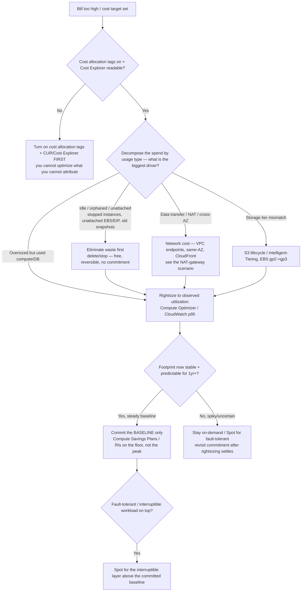
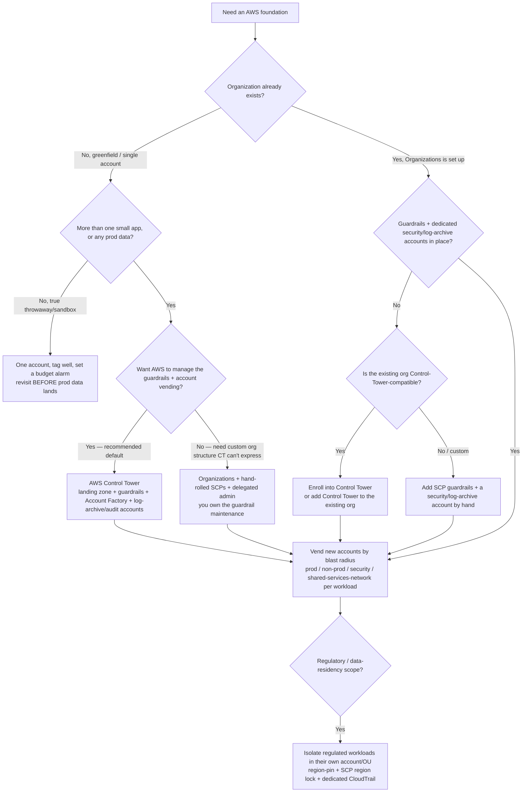

# AWS Cloud — FinOps & Landing-Zone Decision Trees

_Two topic-specific decision trees complementing the compute / storage / database / network / IAM / security-finding trees in [`aws-cloud-decision-trees.md`](aws-cloud-decision-trees.md) (PR #315). Capability/feature rows are `[verify-at-use]` — re-check against the vendor before quoting. Last reviewed: 2026-06-05._

Traverse the relevant tree top-to-bottom before recommending a cost action or a landing-zone bootstrap path. These cover the **sequencing** decisions the #315 trees don't: in what order to pull cost levers, and how to stand up (or extend) the account foundation.

---

## Decision Tree: AWS cost reduction — which lever, in what order?

**When this applies:** the bill is too high, or a cost-reduction target has been set. The observable inputs are: have you *measured* where the money goes (tags + Cost Explorer), is the spend driven by waste (idle/oversized/orphaned) or by genuine steady-state usage, and is the workload's footprint stable enough to commit to.

**The load-bearing rule:** **measure → eliminate waste → rightsize → *then* commit.** Buying a Savings Plan or Reserved Instance before rightsizing locks in the *oversized* footprint for 1–3 years — you commit to paying for the waste. Commitment is the **last** lever, never the first.

**Last verified:** 2026-06-05 against AWS Cost Optimization / Well-Architected Cost Optimization Pillar guidance.

**Rationale per leaf:**
- *Turn on tags + Cost Explorer first* — an un-attributed bill can't be optimized; you'd be guessing which team/service/usage-type drives it. This is the day-one FinOps posture (CLAUDE.md §2).
- *Eliminate waste first* — idle/orphaned resources are free to remove and need no commitment; this is the highest-ROI, lowest-risk lever and it shrinks the footprint you'd otherwise commit to.
- *Network cost* — NAT data processing and cross-AZ/egress transfer are a common hidden driver; VPC endpoints and same-AZ placement cut them (see the `nat-gateway-cost-spike` scenario).
- *Rightsize to observed utilization* — size to measured p95/p99 (Compute Optimizer, CloudWatch), not to the original guess. Do this **before** committing so you commit to the right size.
- *Commit the baseline only* — Savings Plans/RIs are a 1–3yr commitment; apply them to the **stable floor** of usage, never the peak, and only after rightsizing. Commitment is the last lever.
- *Spot* — for interruptible/fault-tolerant work layered above the committed baseline, Spot is the deepest discount; never for stateful single-instance work that can't tolerate reclaim.

**Tradeoffs summary:**

| Lever | Risk | Reversible? | Commitment | Order |
|---|---|---|---|---|
| Tag + measure | None | n/a | None | **First** |
| Eliminate waste (idle/orphaned) | Low | Yes | None | 1 |
| Network (endpoints, same-AZ) | Low | Yes | None | 2 |
| Rightsize | Medium (test under load) | Yes | None | 3 |
| Savings Plans / RIs | Locks in footprint | No (1–3 yr) | High | **Last** |
| Spot | Interruption | Yes | None | On top of baseline |

_Don't buy a Savings Plan to fix a bill you haven't measured — you'll commit to the waste. `[verify-at-use]` current Compute Optimizer coverage, Savings Plan types, and Spot reclaim behavior against AWS docs._

> **AWS FinOps Agent** (public preview, launched **2026-06-09**, no additional charge; US East N. Virginia only during preview; built on Bedrock) can accelerate the *measure*, *rightsize*, and *anomaly-investigation* steps — natural-language cost questions plus rightsizing/Savings Plans recommendations. It is **advisory / recommendations-only — it does not auto-apply infrastructure or commitment changes** — so the **measure → eliminate waste → rightsize → then commit** ordering still governs; treat its Savings Plans suggestions as input to the *last* lever, never a shortcut past rightsizing. Verify GA + region coverage before relying on it. [AWS Weekly Roundup 2026-06-15](https://aws.amazon.com/blogs/aws/aws-weekly-roundup-aws-finops-agent-in-preview-gemma-4-on-bedrock-kiro-pro-max-and-more-june-15-2026/) `[verify-at-use]`

---

## Decision Tree: AWS landing zone — how to bootstrap (or extend) the account foundation?

**When this applies:** you're standing up AWS for the first time, or you're on a single account and need to grow into a governed multi-account estate, or you already have Organizations and need to decide *how* to add guardrails. The observable inputs are: is there already an Organization, do you want AWS to *manage* the guardrails (vs hand-rolling them), and is regulatory/compliance scope driving the design.

**The load-bearing rule:** **separate by blast radius, govern from the top.** One account is one blast radius and one un-attributable bill. But don't hand-roll what Control Tower automates unless you have a specific reason to — and never skip the security/log-archive accounts.

**Last verified:** 2026-06-05 against AWS Organizations / Control Tower / landing-zone guidance.

**Rationale per leaf:**
- *One account (throwaway only)* — acceptable for a true sandbox with no prod data; set a budget alarm and revisit *before* prod data or a second app arrives. A single account is a single blast radius (CLAUDE.md §2).
- *Control Tower (default for greenfield)* — gives a managed landing zone: the OU structure, preventive/detective guardrails, **Account Factory** for vending new accounts, and the mandatory **log-archive + audit** accounts — without hand-rolling and maintaining it. Prefer this unless you have a structure it can't express.
- *Organizations + hand-rolled SCPs* — choose when you need an org layout or guardrail behavior Control Tower can't express; you then own the guardrail maintenance and must still create the security/log-archive accounts yourself.
- *Enroll into Control Tower* — an existing org with no guardrails is the common "we grew organically" state; add/enroll Control Tower rather than hand-building what it automates.
- *Vend by blast radius* — separate accounts for prod / non-prod / security / shared-services(network) so a compromise or a runaway bill is contained and attributable.
- *Isolate regulated workloads* — compliance/data-residency scope earns its own account/OU with region pinning (SCP region lock) and a dedicated audit trail, so the regulated boundary is an account boundary.

**Tradeoffs summary:**

| Path | Guardrail maintenance | Account vending | Use when |
|---|---|---|---|
| One account | You (tags + budget) | n/a | True sandbox, no prod data |
| Control Tower | AWS-managed | Account Factory | Greenfield / most multi-account estates (default) |
| Organizations + hand-rolled SCPs | You | Manual / IaC | Custom org structure CT can't express |
| Enroll existing org into CT | AWS-managed | Account Factory | Grew organically, no guardrails yet |
| Isolated regulated account/OU | You + CT | Account Factory | Regulatory / data-residency scope |

_Never skip the security + log-archive accounts, and never run prod data in the same account as dev. `[verify-at-use]` Control Tower's current managed-guardrail set, region support, and enrollment prerequisites against AWS docs — these are continuously deployed._
