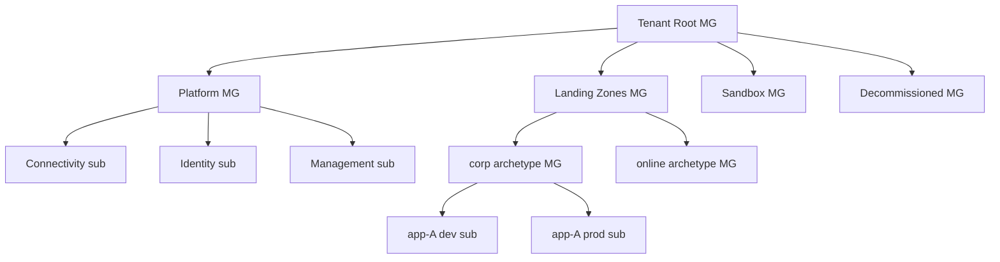

# Keep the management-group hierarchy flat (3–4 levels) — MGs are for policy, not the org chart

**Status:** Pattern — strong default; a deeper or org-shaped hierarchy needs a written reason tied to a real policy/RBAC boundary.

**Domain:** Landing Zones / Governance

**Applies to:** `azure-cloud`

---

## Why this exists

The first structural mistake in a new Azure estate is modeling the **management-group (MG) hierarchy** on the company org chart — a node per business unit, per department, per team — and ending up six or seven levels deep. MGs exist for exactly two things: **inheriting Azure Policy** and **inheriting RBAC** down the tree. They are not a billing boundary (that's subscriptions and tags) and not an org directory. A deep hierarchy makes policy inheritance impossible to reason about ("which of the five ancestor assignments denied this deployment?"), slows the portal, and ossifies a reporting structure that will reorg in eighteen months. CAF's Azure Landing Zone (ALZ) reference is deliberately flat: a `Platform` MG, a `Landing Zones` MG split into a small number of **archetypes** (`corp`, `online`), plus `Sandbox` and `Decommissioned` — three to four levels including the tenant root. Subscription-per-environment goes **under an archetype MG**, never an MG-per-environment.

## How to apply

Stamp the flat ALZ shape; nest workload subscriptions under the archetype that matches their connectivity posture. Use the AVM ALZ-accelerator + subscription-vending modules rather than hand-rolling the tree.



```bicep
// Assign a guardrail Policy at the archetype MG so every nested subscription inherits it.
targetScope = 'managementGroup'
resource denyPublicSql 'Microsoft.Authorization/policyAssignments@2024-04-01' = {
  name: 'deny-public-sql'
  properties: {
    policyDefinitionId: tenantResourceId('Microsoft.Authorization/policyDefinitions', 'deny-public-network-access')
    enforcementMode: 'Default'   // 'DoNotEnforce' first to audit, then flip to Default
  }
}
```

**Do:**
- Keep it to **3–4 levels**: root → Platform / Landing Zones / Sandbox / Decommissioned → archetype → (subscriptions).
- Split Landing Zones by **archetype** (`corp` private-connected, `online` internet-facing) — a policy boundary, not a team boundary.
- Require authorization on the MG hierarchy so users can't spawn rogue MGs; limit root-MG assignments to the few truly universal ones.
- Use **subscription vending** (AVM modules) to stamp each new subscription with policy + RBAC + budgets at creation.

**Don't:**
- Create an MG per business unit / per environment / per team — that's the org-chart anti-pattern (#1).
- Assign app-team RBAC at MG scope (use subscription/RG scope + PIM for platform teams — see [`identity-rbac-least-privilege-and-custom-roles.md`](./identity-rbac-least-privilege-and-custom-roles.md)).
- Pile policy onto the root MG; over-broad root assignments are the hardest to debug.

## Edge cases / when the rule does NOT apply

- **A genuine regulatory boundary** (e.g. a sovereign-cloud or PCI-scoped estate that must never inherit the same policy set) can justify one extra archetype MG — that's a policy boundary, not an org one, so it fits the rule's spirit.
- **Very large enterprises** may add a thin intermediate MG under Landing Zones, but still aim for ≤4 levels; depth past that is almost always the org-chart smell.
- **Sandbox** subscriptions intentionally sit under a loose-policy MG with no prod connectivity — that's the archetype doing its job, not an exception.

## See also

- [`../knowledge/azure-landing-zones-and-governance.md`](../knowledge/azure-landing-zones-and-governance.md) — the full CAF Ready shape + archetypes + subscription vending
- [`./gov-azure-policy-as-guardrails.md`](./gov-azure-policy-as-guardrails.md) — the policy guardrails this hierarchy inherits
- [`./identity-rbac-least-privilege-and-custom-roles.md`](./identity-rbac-least-privilege-and-custom-roles.md) — RBAC scoping that rides the same tree
- [`../agents/azure-architect.md`](../agents/azure-architect.md) — owns the topology · [`../agents/azure-ops-engineer.md`](../agents/azure-ops-engineer.md) — owns the policy/RBAC enforcement

## Provenance

Codifies house opinion #1 (landing-zone-first; flat MG hierarchy) from [`../CLAUDE.md`](../CLAUDE.md) §3 and the §4 anti-pattern ("deep MG hierarchies mirroring the org chart"). Grounded in Microsoft Learn CAF Ready + management-groups + landing-zone-governance guidance (per the landing-zones knowledge file, retrieved 2026-05-28; re-confirmed against the CAF management-groups design area, 2026-05-30).

---

_Last reviewed: 2026-05-30 by `claude`_
