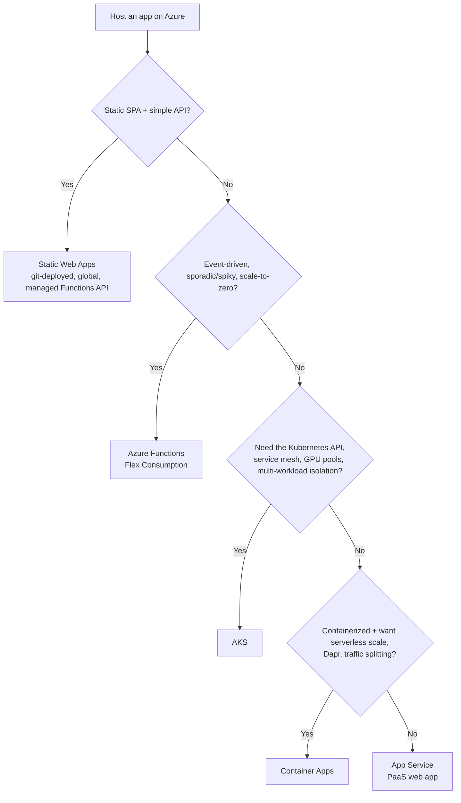

# Decision tree: which Azure compute?

**Last reviewed:** 2026-05-28 · **Confidence:** high ([compute decision](https://learn.microsoft.com/azure/architecture/guide/technology-choices/compute-decision-tree), [container service](https://learn.microsoft.com/azure/architecture/guide/choose-azure-container-service), retrieved 2026-05-28).
**Owner:** `app-platform-engineer` (+ `azure-architect` for the cross-service call).

## The services
| Service | Pick when | Scale-to-zero | Notes |
|---|---|---|---|
| **Static Web Apps** | SPA (React/Angular/Vue/Blazor) + light serverless API, git-deployed | n/a | global CDN; managed Functions or bring-your-own Functions |
| **Azure Functions** | event-driven, sporadic/spiky | **yes** (Consumption / Flex Consumption) | Flex Consumption is the recommended serverless plan — but **no deployment slots, one app per plan, no in-place migration from Consumption, AZ needs ≥2 always-ready instances** |
| **Container Apps** | containers, serverless scale, Dapr, traffic-split/canary | **yes** | RavenClaude's flexible default for containers (Microsoft's guide doesn't crown a default); single environment = one security boundary |
| **App Service** | straightforward HTTP web app/API, deployment slots | no | Web App for Containers is an App Service feature |
| **AKS** | need the Kubernetes API, service mesh, GPU node pools, deny-by-default network policy, multi-workload isolation | partial (user node pools) | most control, most ops; ≥6 nodes for prod |

**Trade-off:** AKS = most control + most ops; Container Apps / App Service = PaaS simplicity. Choose per-service in a composition — Functions for event-driven pieces, Container Apps/AKS for core services. (House opinion #7.)

## Non-Fabric data tier (owned by `azure-architect`)
For an app backend (not Fabric analytics): **Azure SQL** (relational, T-SQL), **Cosmos DB** (NoSQL/global/vector), **PostgreSQL/MySQL Flexible Server** (OSS relational). Wire all data PaaS via **Private Endpoint + Private DNS** with `publicNetworkAccess` Disabled (house opinion #6 — see [`azure-networking-and-connectivity.md`](azure-networking-and-connectivity.md)). Fabric analytics data → `microsoft-fabric` (the seam).

## Reliability
**Zone-redundant by default for prod** where the SKU supports it (house opinion #8).

> The Claude-app Azure host (Container Apps / Functions / Foundry) is provisioned here; the Claude app itself is `claude-app-engineering` (the seam — see [`../CLAUDE.md`](../CLAUDE.md) §10).

---

## Decision Tree: Azure Compute — selecting a host for an app workload

**When this applies:** The user asks "where should this run?" / "which Azure compute for X?" / "should this be on AKS?" — i.e. a workload needs a host and the observable inputs are its shape (static SPA, event-driven/spiky, containerized, plain HTTP web app) and whether it needs the Kubernetes API, a service mesh, GPU node pools, or multi-workload isolation. Not for the data tier (Azure SQL / Cosmos / PostgreSQL — `azure-architect`) and not for the AI hosting layer (Foundry — [`azure-ai-foundry.md`](azure-ai-foundry.md)).

**Last verified:** 2026-05-30 against Microsoft's [compute decision tree](https://learn.microsoft.com/azure/architecture/guide/technology-choices/compute-decision-tree) + [choose an Azure container service](https://learn.microsoft.com/azure/architecture/guide/choose-azure-container-service) (the same sources as the header, re-confirmed).

**Rationale per leaf:**

- _Static Web Apps_ — a SPA (React/Angular/Vue/Blazor) + light serverless API is git-deployed and globally distributed with a managed (or bring-your-own) Functions API; no separate compute to operate.
- _Azure Functions (Flex Consumption)_ — event-driven, sporadic/spiky work wants scale-to-zero so you don't pay for idle; Flex Consumption is the recommended serverless plan. **requires:** AZ resilience needs ≥2 always-ready instances; no deployment slots, one app per plan, no in-place migration from Consumption.
- _AKS_ — terminates here only when a Kubernetes-specific need is present (the Kubernetes API, service mesh, GPU node pools, deny-by-default network policy, multi-workload isolation); it is the most control and the most ops (≥6 nodes for prod).
- _Container Apps_ — containerized work wanting serverless scale, Dapr, or traffic-split/canary without operating Kubernetes; the house default for containers.
- _App Service_ — a straightforward HTTP web app/API with deployment slots and PaaS simplicity (Web App for Containers is an App Service feature).

**Tradeoffs summary table:**

| Method | Scale-to-zero | Ops burden | Prod floor | Use when |
|---|---|---|---|---|
| Static Web Apps | n/a (global CDN) | lowest | — | SPA + light serverless API, git-deployed |
| Azure Functions (Flex Consumption) | yes | low | ≥2 always-ready for AZ | event-driven, sporadic/spiky |
| Container Apps | yes | low-medium | zone-redundant where supported | containers + serverless scale / Dapr / canary (house default) |
| App Service | no | medium | zone-redundant where supported | plain HTTP web app/API, deployment slots |
| AKS | partial (user node pools) | highest | ≥6 nodes | need the Kubernetes API / mesh / GPU pools / isolation |
