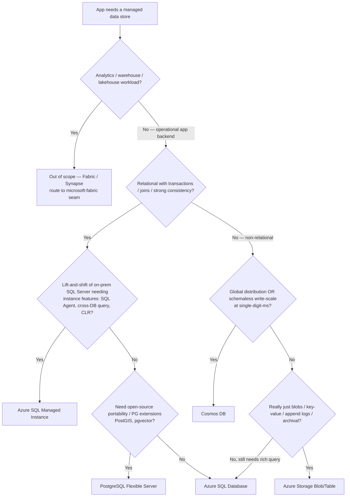

# Azure data-store decision tree — which managed database for an app backend

**Last reviewed:** 2026-06-05 · **Confidence:** high ([Choose a data store](https://learn.microsoft.com/azure/architecture/guide/technology-choices/data-store-decision-tree) + [Azure SQL options](https://learn.microsoft.com/azure/azure-sql/azure-sql-iaas-vs-paas-what-is-overview), retrieved 2026-06-05).
**Owner:** `azure-architect` (owns the non-Fabric application data tier) + `ravenclaude-core/security-reviewer` for the data-plane posture.

This is the sibling of the **compute** tree ([`azure-compute-decision-tree.md`](azure-compute-decision-tree.md)) and complements the cross-domain trees in [`azure-decision-trees.md`](azure-decision-trees.md). It answers "**which Azure managed data store** for this app backend?" — the choice the team is named to own six times across the compute trees but which previously had only a prose best-practice ([`../best-practices/data-tier-pick-the-azure-database.md`](../best-practices/data-tier-pick-the-azure-database.md)), no traversable diagram. **Analytics/warehouse workloads are out of scope** — those are Fabric/Synapse and belong to `microsoft-fabric` (the seam).

## When this applies

An app needs a **managed database on Azure** and someone is about to reach for "the one we always use." The observable inputs are the **dominant access pattern** (relational+transactional vs document/key-value vs global-scale-write vs just-blobs), the **consistency** need, the **scale/distribution** need, and whether it's a **lift-and-shift** of an existing SQL Server instance. The trap is choosing by team habit; the data engine is one of the hardest decisions to reverse (it shapes the data model, query surface, cost curve, and scaling story).

## The tree

## Rationale per leaf

- *Azure SQL Database* — relational, transactional, strong consistency, joins+reporting, or an existing SQL Server app that doesn't need instance-scoped features. The default relational pick. **Sub-choice:** vCore (predictable) vs DTU (simple); serverless for spiky/dev; Hyperscale past ~1–4 TB. `[verify-at-use]` for current tier limits.
- *Azure SQL Managed Instance* — a lift-and-shift of on-prem SQL Server that genuinely needs **instance-scoped** features (SQL Agent, cross-database queries, CLR, Service Broker). Higher floor cost + longer deploy than SQL DB — only when you need the instance surface.
- *PostgreSQL Flexible Server* — open-source relational, OSS portability, or PG extensions (PostGIS, **pgvector** for embeddings). Use **Flexible Server**, not the retiring Single Server; pick zone-redundant HA for prod.
- *Cosmos DB* — global distribution, single-digit-ms reads at scale, schemaless/document or key-value, or massive write throughput (incl. vector search). **The partition key is permanent and load-bearing** — model for the query; provision RU/s deliberately (or autoscale); strong consistency costs RU + latency.
- *Azure Storage (Blob/Table)* — cheap key-value at scale, blobs, append logs, archival. **Not a query engine** — no joins, no rich filtering; pair with a real DB if you need to query. Don't use Storage Tables as a queryable database.

## Tradeoffs summary table

| Engine | Data model | Consistency / scale sweet spot | Key gotcha | Use when |
|---|---|---|---|---|
| **Azure SQL Database** | relational | strong; single-region → Hyperscale | tier choice (vCore/DTU/serverless/Hyperscale) | relational+transactional app, no instance features |
| **SQL Managed Instance** | relational | strong; instance-scoped | higher floor cost + deploy time | lift-and-shift needing SQL Agent / cross-DB / CLR |
| **PostgreSQL Flexible Server** | relational (OSS) | strong; zone-redundant HA | use Flexible (Single Server retiring) | OSS portability / PG extensions (PostGIS, pgvector) |
| **Cosmos DB** | document / key-value / vector | tunable; global, web-scale write | partition key is permanent; RU cost | global distribution or schemaless write-scale |
| **Azure Storage** | blob / key-value | massive, cheap | not queryable — no joins/filter | blobs / archival / append logs only |

**Decision order (cheapest correct fit first):** relational+transactional → **Azure SQL DB** (MI only for instance features; PostgreSQL if OSS/extensions matter) → global/schemaless write-scale → **Cosmos DB** (commit the partition key carefully) → really just blobs/key-value → **Storage**. Don't pay for a database you won't query, and don't default to one engine for every app.

## Cross-cutting (whichever engine wins)

- **Make every data plane private** — Private Endpoint + Private DNS, `publicNetworkAccess` Disabled (house opinion #6; see [`azure-networking-and-connectivity.md`](azure-networking-and-connectivity.md) and the Private-Endpoint scenario in [`../scenarios/2026-06-05-private-endpoint-dns-resolution-failure.md`](../scenarios/2026-06-05-private-endpoint-dns-resolution-failure.md)).
- **Passwordless app→DB auth** — use the workload's managed identity, not a connection-string secret ([`../best-practices/passwordless-by-default.md`](../best-practices/passwordless-by-default.md)).
- **Caching (Azure Cache for Redis) and search (Azure AI Search) are complements, not the system of record.**

## Escalation & guardrails

The data-plane privacy + identity posture routes to `ravenclaude-core/security-reviewer` (mandatory seam). Analytics/warehouse → `microsoft-fabric`. Cross-domain whole-system data architecture → `ravenclaude-core/architect`.

## Sources (retrieved 2026-06-05)

- Choose an Azure data store (CAF/WAF technology-choices) — https://learn.microsoft.com/azure/architecture/guide/technology-choices/data-store-decision-tree
- Azure SQL deployment options (SQL DB vs Managed Instance) — https://learn.microsoft.com/azure/azure-sql/azure-sql-iaas-vs-paas-what-is-overview
- Cosmos DB partitioning + RU model — https://learn.microsoft.com/azure/cosmos-db/partitioning-overview
- PostgreSQL Flexible Server — https://learn.microsoft.com/azure/postgresql/flexible-server/overview

Tier limits, the PostgreSQL Single-Server retirement date, and per-SKU pricing are version-sensitive — `[verify-at-use]` before committing. This file uses the marketplace Mermaid-tree convention ([`../../../docs/best-practices/decision-trees-in-knowledge-files.md`](../../../docs/best-practices/decision-trees-in-knowledge-files.md)) and is authored as a standalone topic file (an H1-titled tree, like the sibling files in other plugins) so it ships its Mermaid diagram without depending on the dashboard's pre-rendered SVG pipeline.
