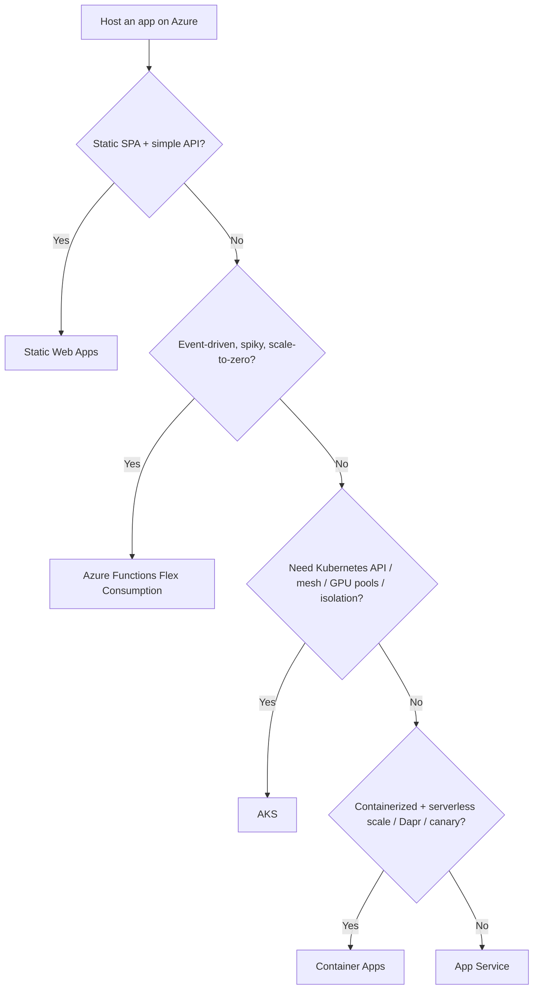
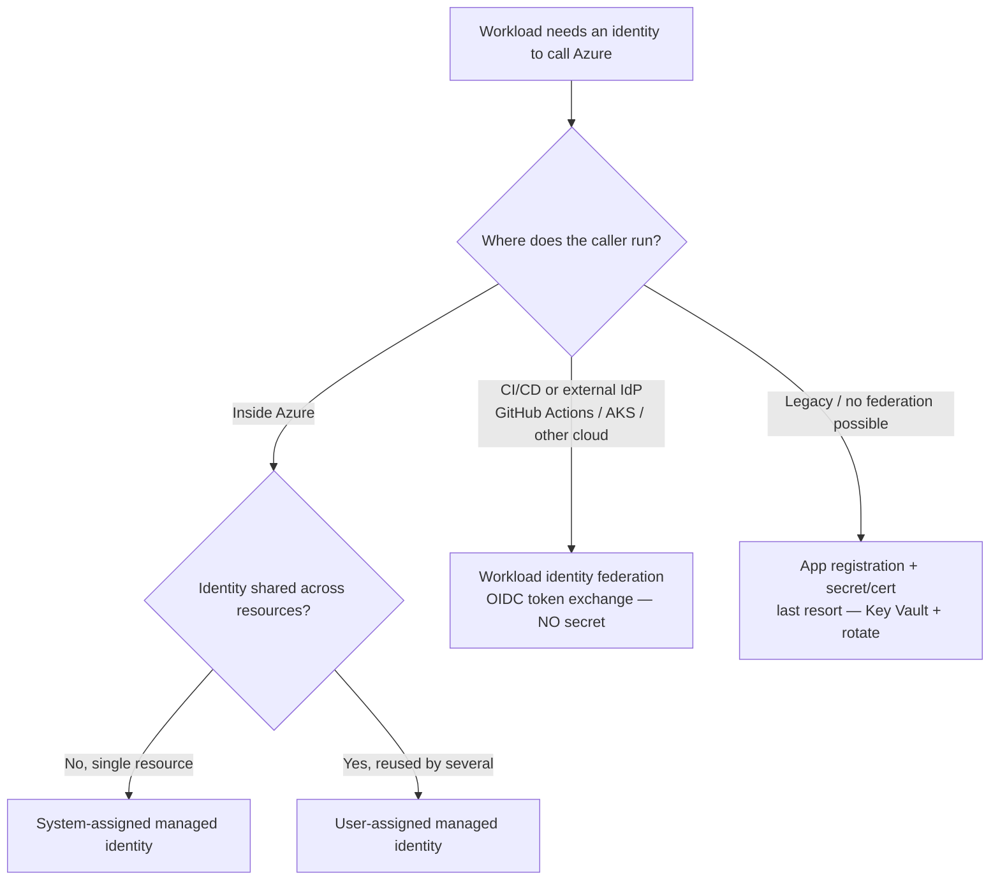
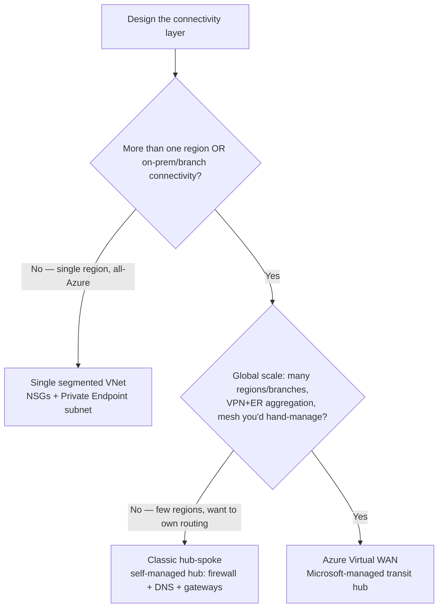
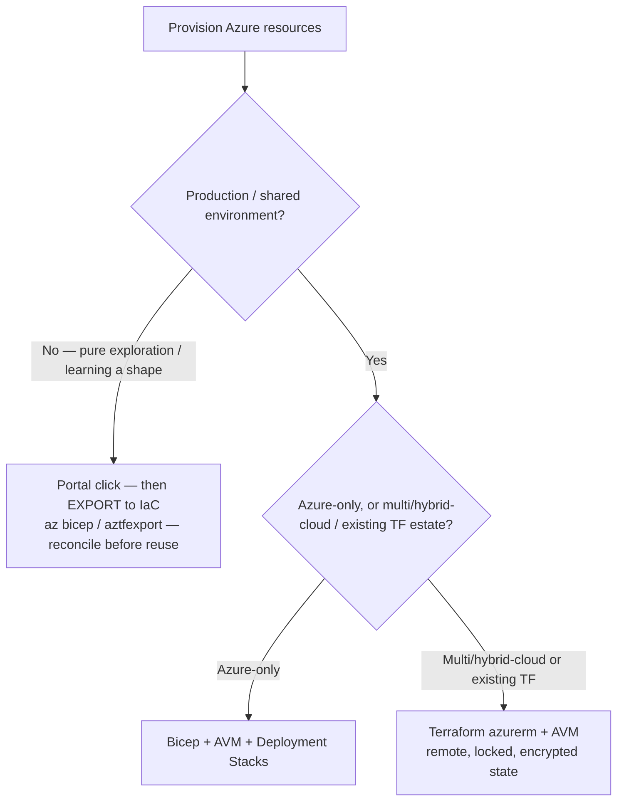
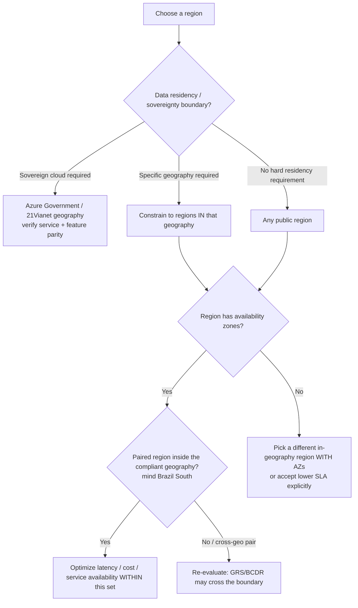
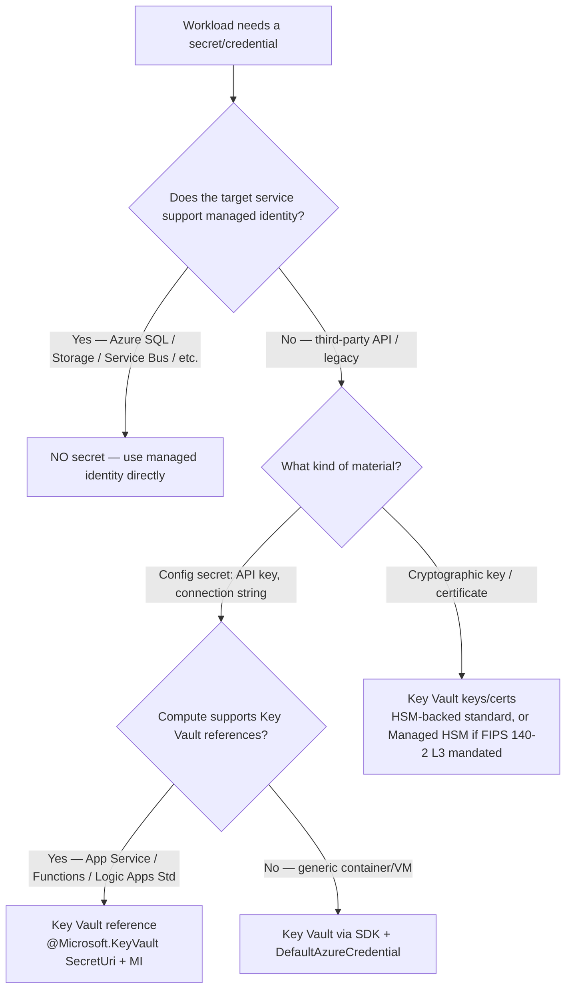

# Azure decision trees (canonical)

**Last reviewed:** 2026-05-30 · **Confidence:** high (Microsoft Learn, retrieved 2026-05-30; per-tree sources cited in each section).
**Owner:** `azure-architect` (cross-service adjudication) + the per-domain specialist named in each tree.
**Source:** per-tree `Last verified` lines below.

This file collects the **canonical `## Decision Tree:` sections** for the cross-cutting Azure choices a consultant makes when standing up an estate. It follows the marketplace decision-tree convention ([`../../../docs/best-practices/decision-trees-in-knowledge-files.md`](../../../docs/best-practices/decision-trees-in-knowledge-files.md)): each tree names an **observable** entry condition, carries a **Last verified** date, a **Mermaid** graph, **per-leaf rationale**, and a **tradeoffs table** for trees with ≥3 leaves.

**Decision-tree traversal (priors).** When the user's situation matches a tree's *When this applies*, traverse the Mermaid graph top-to-bottom **before** naming a service. Do not pattern-match on keywords. The first branch that resolves cleanly is the leaf to apply. If a leaf carries a `requires:` prerequisite, confirm it (auth/permission/region) before committing to that branch — otherwise that's a Capability-Grounding-Protocol "do I have authority?" moment.

**Trees that already live in their domain knowledge file** (don't duplicate them — traverse them there):
- **Compute** — which host for an app workload → [`azure-compute-decision-tree.md`](azure-compute-decision-tree.md) `## Decision Tree`
- **IaC tool** — Bicep vs Terraform for an estate → [`azure-iac-decision-and-bicep.md`](azure-iac-decision-and-bicep.md) `## Decision Tree`
- **Integration** — Logic Apps / Service Bus / Event Grid / Event Hubs / APIM / Functions → [`azure-integration-decision.md`](azure-integration-decision.md) `## Decision Tree`
- **Identity (passwordless)** — managed identity vs WIF vs app-reg → [`entra-identity-and-access.md`](entra-identity-and-access.md) (the H1 mermaid). The canonical version with full tradeoffs is **below**.

The sections below are the canonical trees for choices that span domains (identity, network topology, IaC approach incl. portal, region/residency, secret store) plus a compute cross-reference for one-stop traversal.

---

## Decision Tree: Compute — which Azure host for a workload (cross-reference)

**When this applies:** "Where should this run?" / "which Azure compute for X?" / "should this be AKS?" — a workload needs a host. This is a pointer; the **canonical, fully-elaborated tree** (with per-leaf `requires:` notes and the prod-floor tradeoffs table) is in [`azure-compute-decision-tree.md`](azure-compute-decision-tree.md). Traverse it there.

**Last verified:** 2026-05-30 against Microsoft's [compute decision tree](https://learn.microsoft.com/azure/architecture/guide/technology-choices/compute-decision-tree) + [choose an Azure container service](https://learn.microsoft.com/azure/architecture/guide/choose-azure-container-service).

**Rationale per leaf:** see [`azure-compute-decision-tree.md`](azure-compute-decision-tree.md) — Static Web Apps (no compute to run), Functions (scale-to-zero for spiky; **requires** ≥2 always-ready instances for AZ), AKS (Kubernetes-specific need only; most ops), Container Apps (house default for containers), App Service (plain HTTP web app + slots).

**Tradeoffs summary table:** the full table (scale-to-zero / ops burden / prod floor / use-when) lives in the canonical file. The lever is **scale-to-zero need × ops burden you can absorb**.

---

## Decision Tree: Identity — managed identity vs workload identity federation vs service principal

**When this applies:** A workload, pipeline, or external system **needs an identity to call Azure** and you must pick how it authenticates — the observable inputs are *where the caller runs* (inside Azure / in CI/CD or another cloud / a legacy system with no federation) and whether a federation trust can be established. Not for *what the identity can do* (that's RBAC — see the [`identity-rbac-least-privilege-and-custom-roles.md`](../best-practices/identity-rbac-least-privilege-and-custom-roles.md) rule), and not for human sign-in (Conditional Access).

**Last verified:** 2026-05-30 against Microsoft Learn [workload identity federation](https://learn.microsoft.com/entra/workload-id/workload-identity-federation) + [managed identities overview](https://learn.microsoft.com/entra/identity/managed-identities-azure-resources/overview) (re-confirmed against the identity knowledge file).

**Rationale per leaf:**
- *System-assigned managed identity* — Azure-hosted workload, identity tied 1:1 to one resource's lifecycle; Azure manages the credential, nothing to rotate. The default in-Azure choice.
- *User-assigned managed identity* — Azure-hosted but the identity must be **shared/reused** across resources or exist **before** the resource (e.g. `keyVaultReferenceIdentity` resolving references at create time). **requires:** pre-create the UAMI + grant its RBAC before the consuming resource deploys.
- *Workload identity federation* — caller runs **outside Azure or in CI/CD** (GitHub Actions, AKS, another cloud, Azure DevOps service connection): exchange the external IdP's OIDC token for an Entra token, **no stored secret**. **requires:** the federated credential's `issuer`/`subject`/`audience` must **case-sensitively** match the incoming token (mismatch fails silently); audience typically `api://AzureADTokenExchange`.
- *App registration + secret/certificate* — **last resort** only when no federation path exists (legacy system): store the secret in Key Vault, rotate it, never inline (the hook flags `client_secret`).

**Tradeoffs summary table:**

| Method | Secret to manage? | Where the caller runs | Key gotcha | Use when |
|---|---|---|---|---|
| System-assigned MI | none | inside Azure, 1 resource | dies with the resource | default for a single Azure resource |
| User-assigned MI | none | inside Azure, shared | must pre-exist + pre-grant | shared/reused identity, create-time refs |
| Workload identity federation | none | CI/CD / external IdP | `issuer`/`subject`/`audience` case-match (silent fail) | pipelines, AKS, multi-cloud |
| App reg + secret/cert | **yes** (Key Vault + rotate) | legacy / no federation | rotation + leak surface | nothing else works |

> All identity/secret design routes to `ravenclaude-core/security-reviewer` (mandatory). This tree supplies the Entra craft; core supplies the verdict.

---

## Decision Tree: Network Topology — single VNet vs hub-spoke vs Virtual WAN

**When this applies:** You're designing the **connectivity layer** for an estate and must choose a topology — the observable inputs are *how many regions*, *whether you aggregate branches / VPN / ExpressRoute*, *how many spokes/peerings* you'd hand-manage, and *how much transit plumbing you want Microsoft to own*. Not for spoke-internal segmentation (that's NSGs/subnets — the [`network-segment-subnets-with-nsgs-and-forced-egress.md`](../best-practices/network-segment-subnets-with-nsgs-and-forced-egress.md) rule).

**Last verified:** 2026-05-30 against Microsoft Learn CAF [network topology and connectivity](https://learn.microsoft.com/azure/cloud-adoption-framework/ready/landing-zone/design-area/network-topology-and-connectivity) + [Virtual WAN](https://learn.microsoft.com/azure/virtual-wan/virtual-wan-about) (re-confirmed against the networking knowledge file).

**Rationale per leaf:**
- *Single segmented VNet* — one region, all-Azure, no on-prem mesh: a hub buys nothing; one VNet segmented by tier (NSGs + a Private Endpoint subnet) is enough. Don't stand up a hub for a hub's sake.
- *Classic hub-spoke* — a **few** regions and the team wants to **own** routing + shared services: self-managed hub VNet (Azure Firewall, DNS, gateways), workload spokes peered in. Maximum control. **requires:** you operate the peering mesh + route tables yourself.
- *Azure Virtual WAN* — **global, many-region/many-branch**, VPN+ExpressRoute aggregation, any-to-any at scale: Microsoft-managed hub absorbs the transit routing the hand-managed mesh can't keep up with.

**Tradeoffs summary table:**

| Topology | Who manages transit | Scale sweet spot | Shared services | Use when |
|---|---|---|---|---|
| Single segmented VNet | you (trivial) | 1 region, all-PaaS/IaaS | in the VNet | small, single-region |
| Classic hub-spoke | **you** (peering + UDRs) | few regions | self-managed hub | control + small footprint |
| Virtual WAN | **Microsoft** | global, many branches | managed hub | scale, branch/VPN/ER aggregation |

> The topology + firewall/peering security design routes to `ravenclaude-core/security-reviewer`. Zone-redundant gateways/firewall for prod (house opinion #8).

---

## Decision Tree: IaC approach — Bicep vs Terraform vs portal-then-export

**When this applies:** A new IaC effort is starting (or someone is about to click in the portal) and you must pick the **authoring approach** — the observable inputs are *Azure-only vs multi/hybrid-cloud*, *an existing Terraform estate*, and *whether the change is exploratory or production-bound*. The tool sub-choice (Bicep vs Terraform mechanics) is elaborated in [`azure-iac-decision-and-bicep.md`](azure-iac-decision-and-bicep.md); this tree adds the **portal-then-export** branch and the "never click-ops prod" guardrail.

**Last verified:** 2026-05-30 against Microsoft Learn [comparing Terraform and Bicep](https://learn.microsoft.com/azure/developer/terraform/comparing-terraform-and-bicep), [export templates from the portal](https://learn.microsoft.com/azure/azure-resource-manager/templates/export-template-portal), and [`aztfexport`](https://learn.microsoft.com/azure/developer/terraform/azure-export-for-terraform/export-terraform-overview).

**Rationale per leaf:**
- *Portal-then-export* — **exploration only** (learning a resource shape, a throwaway sandbox): clicking is fine to discover the shape, but you **export it to IaC** (`az bicep decompile` from an exported ARM template, or `aztfexport`) and reconcile **before** it becomes anything shared. Click-ops that *stays* click-ops is the anti-pattern.
- *Bicep* — production, **Azure-only**: no user-managed state, `what-if` preview, **preflight policy validation** (fails before deploy), Deployment Stacks for lifecycle + `denySettings`. The default for Azure-only.
- *Terraform (azurerm)* — production, **multi/hybrid-cloud** or an existing Terraform estate: `terraform plan`, `lifecycle`/`destroy`, portable provider. **requires:** remote, locked, encrypted state (Azure Storage backend) — never `backend "local"` for shared infra (the hook flags it).

**Tradeoffs summary table:**

| Approach | Prod-safe? | State | Preview | Use when |
|---|---|---|---|---|
| Portal → export | **No** (export first) | n/a | n/a | exploration; learning a shape |
| Bicep | yes | none user-managed | `what-if` + preflight policy | Azure-only production |
| Terraform azurerm | yes | `tfstate` (remote, locked) | `terraform plan` | multi-cloud or existing TF estate |

> No prod click-ops (house opinion #2). Whatever you discover in the portal gets exported to IaC and reconciled before reuse.

---

## Decision Tree: Region / Data Residency Selection

**When this applies:** You're choosing **which Azure region** to deploy into — the observable inputs are *a data-residency/sovereignty requirement*, *whether the chosen region has availability zones*, *where its paired region sits*, and *whether the needed service exists in-region*. The trap is picking by latency/cost first; residency must gate the choice because **region is effectively immutable** (resources can't move regions).

**Last verified:** 2026-05-30 against Microsoft Learn [What are Azure regions?](https://learn.microsoft.com/azure/reliability/regions-overview), [paired regions](https://learn.microsoft.com/azure/architecture/aws-professional/regions-zones#paired-regions), and [data residency / WWPS](https://learn.microsoft.com/azure/azure-government/documentation-government-overview-wwps#data-residency).

**Rationale per leaf:**
- *Sovereign cloud* — a sovereignty mandate forces Azure Government / 21Vianet: separate geographies with **reduced service sets** — verify the service AND its features exist there, not just presence.
- *Constrain to geography* — a residency requirement fixes the **geography** (the data-at-rest boundary); pick regions inside it only.
- *Any public region* — no hard residency rule: skip straight to AZ + pairing optimization.
- *Region has AZs?* — prefer an AZ-supporting region (house opinion #8); if none in-geography, choose deliberately and accept the lower SLA.
- *Paired region in geography?* — GRS backups + paired-region BCDR land in the **geo-pair**; confirm it's inside the compliant geography. **Brazil South** is the one pair that crosses a geography boundary — a residency red flag.
- *Optimize within the set* — only **after** residency + AZ + pairing are satisfied do you tune latency/cost and confirm the service is available in-region.

**Tradeoffs summary table:**

| Branch | Drives | Watch out for | Use when |
|---|---|---|---|
| Sovereign cloud | Gov/21Vianet geography | reduced service + feature set | sovereignty mandate |
| Constrain to geography | the residency boundary | non-regional services (Entra ID, CDN) leak out | residency requirement |
| AZ check | reliability floor | not every region has AZs | prod reliability (house #8) |
| Paired-region check | GRS/BCDR destination | **Brazil South** crosses geography | data-at-rest + DR compliance |
| Optimize within set | latency / cost | service not in every region | final tuning |

> Cross-domain residency architecture spanning non-Azure systems → `ravenclaude-core/architect`.

---

## Decision Tree: Secret Store — where does this secret/credential live?

**When this applies:** A workload needs a **secret, key, certificate, or credential** and you must decide where it lives and how it's read — the observable inputs are *whether the target service supports managed identity natively*, *whether the secret is app config vs a cryptographic key/cert*, and *whether the consuming compute supports Key Vault references*. The default answer is increasingly "no secret at all."

**Last verified:** 2026-05-30 against Microsoft Learn [Key Vault references as app settings](https://learn.microsoft.com/azure/app-service/app-service-key-vault-references), [Key Vault overview](https://learn.microsoft.com/azure/key-vault/general/overview), and [Managed HSM overview](https://learn.microsoft.com/azure/key-vault/managed-hsm/overview).

**Rationale per leaf:**
- *No secret (managed identity)* — the target service supports Entra auth (Azure SQL, Storage, Service Bus, Cosmos, …): use the workload's **managed identity** directly, eliminate the secret entirely. Always prefer this.
- *Key Vault reference* — an unavoidable **config secret** (third-party API key, legacy connection string) on App Service / Functions / Logic Apps (Standard): store in Key Vault, set the app setting to `@Microsoft.KeyVault(SecretUri=...)`, resolved at runtime by the app's MI. **requires:** MI granted `Key Vault Secrets User`; VNet egress to a private vault.
- *Key Vault via SDK* — same vault, but the compute (generic container/VM) doesn't support the reference syntax: read with the SDK + `DefaultAzureCredential`.
- *Key Vault keys/certs (HSM-backed / Managed HSM)* — the material is a **cryptographic key or certificate**: Key Vault standard is HSM-backed; choose **Managed HSM** only when a **FIPS 140-2 Level 3** single-tenant boundary is mandated (it's pricier + single-tenant). **requires:** Managed HSM has its own RBAC + activation ceremony.

**Tradeoffs summary table:**

| Leaf | Secret exists? | Mechanism | Use when |
|---|---|---|---|
| Managed identity (no secret) | no | Entra auth, MI | target supports managed identity |
| Key Vault reference | yes (vaulted) | `@Microsoft.KeyVault(...)` + MI | config secret, App Service/Functions/Logic Apps Std |
| Key Vault via SDK | yes (vaulted) | SDK + `DefaultAzureCredential` | compute without reference support |
| Key Vault keys/certs / Managed HSM | yes (key/cert) | HSM-backed vault; Managed HSM for FIPS L3 | cryptographic material; single-tenant HSM mandate |

> Secret/identity design routes to `ravenclaude-core/security-reviewer` (mandatory). See the best-practice [`identity-key-vault-references-not-app-settings-literals.md`](../best-practices/identity-key-vault-references-not-app-settings-literals.md) and [`passwordless-by-default.md`](../best-practices/passwordless-by-default.md).

---

## See also

- [`../best-practices/`](../best-practices/) — the named, citable rules these trees inform
- [`../../../docs/best-practices/decision-trees-in-knowledge-files.md`](../../../docs/best-practices/decision-trees-in-knowledge-files.md) — the decision-tree authoring convention
- [`azure-2026-capability-map.md`](azure-2026-capability-map.md) — the dated freshness anchor for the volatile facts these trees rely on
- [`../CLAUDE.md`](../CLAUDE.md) — the team constitution + house opinions
