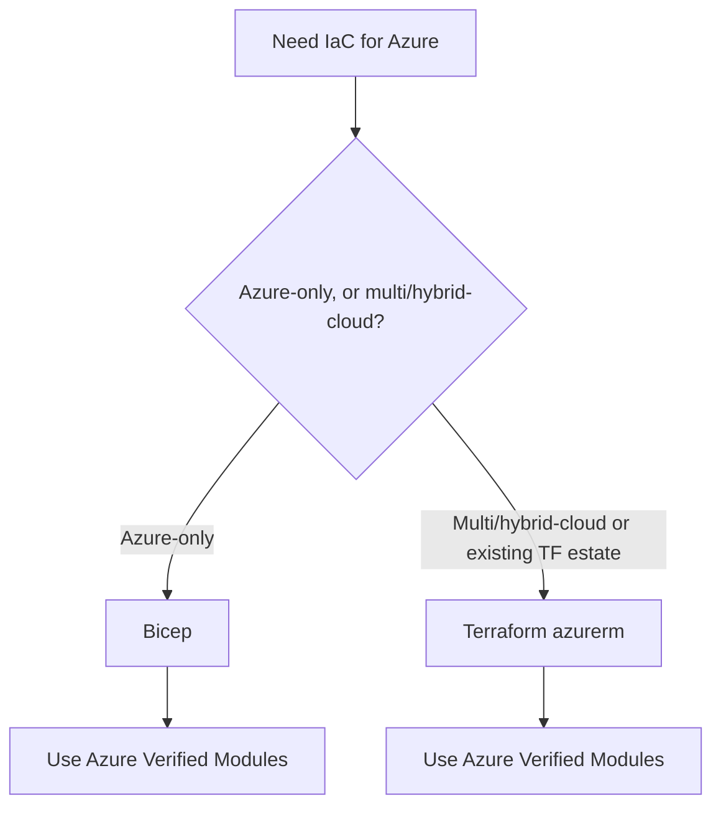

# IaC decision: Bicep vs Terraform (+ AVM, Deployment Stacks)

**Last reviewed:** 2026-05-28 · **Confidence:** high ([Bicep vs Terraform](https://learn.microsoft.com/azure/developer/terraform/comparing-terraform-and-bicep), [AVM](https://learn.microsoft.com/community/content/azure-verified-modules), retrieved 2026-05-28).
**Owner:** `bicep-iac-engineer` (also owns CI/CD — see [`azure-deployment-cicd.md`](azure-deployment-cicd.md)).

## The decision (house opinion #3)

| | Bicep | Terraform |
|---|---|---|
| Scope | **Azure-only** | multi/hybrid-cloud |
| State | **no separate user-managed state file** (keeps deployment history + server-side resource state in Azure) | **`terraform.tfstate`** — back up + secure; use **remote state in Azure Storage** |
| Preview | `what-if` | `terraform plan` |
| Policy | **preflight policy validation** (fails *before* deploy) | fails *during* apply |
| Lifecycle / deletion | **Deployment Stacks** (GA; `denySettings`, managed-resource cleanup) | `lifecycle` meta-argument, `terraform destroy` |
| CLI | `az bicep`, `az deployment` | `terraform` |
| Portal | export ARM/Bicep from portal | `aztfexport` to import existing |

**Default to Bicep for Azure-only work; Terraform when the estate is multi-cloud or already Terraform.** Either way, **use Azure Verified Modules (AVM)** — Microsoft-maintained, WAF-aligned, versioned modules for both languages (including ALZ accelerator + subscription-vending modules).

## Discipline (house opinion #2)
- **IaC or it didn't happen.** Declarative, versioned, pipeline-deployed.
- **`what-if` / `plan` before `apply`** — always preview.
- **No prod click-ops.** If someone changed prod in the portal, export it to IaC and reconcile (drift).
- **Remote, locked, encrypted state** for Terraform (Azure Storage backend; never `backend "local"` for shared infra — the hook flags it).
- **Deployment Stacks** for grouped lifecycle + accidental-deletion protection (the Bicep answer to Terraform lifecycle). Blueprints is deprecated → Stacks + Policy + ALZ.
- **Secrets never in IaC** — Key Vault references / managed identity, never literals (the hook flags `password=`/`accountKey=`/`client_secret`/`connectionString`/`primaryKey`).
- **Parameterize** subscription/tenant IDs (the hook flags hardcoded GUIDs).

## CI/CD
Deploy via GitHub Actions / Azure DevOps with **workload identity federation** (passwordless), `what-if`/`plan` gates, environments + approvals — see [`azure-deployment-cicd.md`](azure-deployment-cicd.md) and [`entra-identity-and-access.md`](entra-identity-and-access.md).

---

## Decision Tree: Azure IaC — Bicep vs Terraform for an estate

**When this applies:** The user asks "Bicep or Terraform?" / "which IaC tool for our Azure work?" — i.e. a new IaC effort is starting and the observable inputs are: is the estate **Azure-only** or **multi/hybrid-cloud**, and is there an **existing Terraform estate** the team already operates. Not for *how* to author a specific resource (that's the AVM/module question, downstream of this call).

**Last verified:** 2026-05-30 against [comparing Terraform and Bicep](https://learn.microsoft.com/azure/developer/terraform/comparing-terraform-and-bicep) + [Azure Verified Modules](https://learn.microsoft.com/community/content/azure-verified-modules) (the same sources as the header, re-confirmed).

**Rationale per leaf:**

- _Bicep_ — Azure-only work: no separate user-managed state file (history + server-side resource state live in Azure), `what-if` preview, **preflight policy validation** that fails *before* deploy, and Deployment Stacks (GA) for grouped lifecycle + `denySettings` accidental-deletion protection. The default for Azure-only.
- _Terraform (azurerm)_ — multi/hybrid-cloud, or an existing Terraform estate the team already operates: `terraform plan` preview, `lifecycle`/`destroy`, and a portable provider model. **requires:** remote, locked, encrypted state (Azure Storage backend) — never `backend "local"` for shared infra (the hook flags it).
- Either leaf → **use Azure Verified Modules** (Microsoft-maintained, WAF-aligned, versioned, for both languages, incl. the ALZ accelerator + subscription-vending modules).

**Tradeoffs summary table:**

| Tool | Scope | State | Policy check | Lifecycle / deletion guard | Use when |
|---|---|---|---|---|---|
| Bicep | Azure-only | none user-managed (in-Azure history) | **preflight** (before deploy) | Deployment Stacks (`denySettings`) | Azure-only estate |
| Terraform azurerm | multi/hybrid-cloud | `terraform.tfstate` (remote, locked, encrypted) | during apply | `lifecycle` meta-arg, `destroy` | multi-cloud or existing TF estate |
