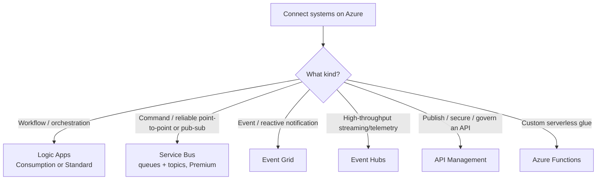

# Decision: Azure integration & messaging

**Last reviewed:** 2026-05-28 · **Confidence:** high ([integration architecture](https://learn.microsoft.com/azure/architecture/integration/integration-start-here), [Logic Apps vs Power Automate](https://learn.microsoft.com/azure/azure-functions/functions-compare-logic-apps-ms-flow-webjobs), retrieved 2026-05-28).
**Owner:** `integration-engineer`.

## The four integration technologies
Orchestration (workflows), **messaging** (commands), **events** (reactions), **APIs** (published interfaces).

| Service | Use for |
|---|---|
| **Logic Apps** | designer-first workflows/orchestration across 300+ connectors; Consumption (multitenant) or Standard (single-tenant) |
| **Service Bus** | reliable **commands** — queues + topics/subscriptions; Premium for Event Grid integration + Peek-Lock semantics |
| **Event Grid** | **events** — reactive pub/sub, cheap, fan-out (drain idle Service Bus queues, react to resource events) |
| **Event Hubs** | high-throughput **streaming** / telemetry ingestion |
| **API Management** | publish/secure/version/throttle **APIs** for internal + external consumers |
| **Functions** | custom serverless glue + triggers between the above |

**Crossover pattern:** Service Bus → Event Grid → Function/Logic App to drain idle queues without a continuous poller.

## The Logic Apps ↔ Power Automate seam (house opinion #10 — the #1 cross-plugin risk)
| | Power Automate (`power-platform/flow-engineer`) | Logic Apps (this agent) |
|---|---|---|
| Audience | O365 makers / citizen devs | IT pros / developers |
| Lives in | Office 365 | an **Azure subscription** |
| Licensing | per-user / per-flow | Consumption / Standard (subscription billing) |
| Connector governance | **DLP** | **Azure Policy** |
| Deploy | web designer | **Bicep / Terraform**, DevOps |

> **Litmus test:** *citizen maker owns it, licensed per-user under O365/DLP → `power-platform/flow-engineer`; lives in an Azure subscription, deploys via Bicep/Terraform, governed by Azure Policy → `integration-engineer` (here).* `flow-engineer` makes the **initial** "Power Automate vs Logic Apps" call and hands off the moment the answer is Logic Apps. (Documented reciprocally in [`../../power-platform/CLAUDE.md`](../../power-platform/CLAUDE.md).)

---

## Decision Tree: Azure Integration — choosing a messaging/integration technology

**When this applies:** The user asks "connect these systems" / "Service Bus or Event Grid?" / "how do we publish this API?" — i.e. two or more systems need to be wired together on Azure and the observable input is the *kind* of integration: a designer-first workflow/orchestration, a reliable command, a reactive event notification, high-throughput streaming/telemetry, a published/governed API, or custom serverless glue. Not for the Power-Automate-vs-Logic-Apps ownership call (that's the seam table above, owned initially by `power-platform/flow-engineer`).

**Last verified:** 2026-05-30 against [integration architecture](https://learn.microsoft.com/azure/architecture/integration/integration-start-here) + [Logic Apps vs Power Automate vs Functions](https://learn.microsoft.com/azure/azure-functions/functions-compare-logic-apps-ms-flow-webjobs) (the same sources as the header, re-confirmed).

**Rationale per leaf:**

- _Logic Apps_ — designer-first workflows/orchestration across 300+ connectors; Consumption (multitenant) or Standard (single-tenant).
- _Service Bus_ — reliable **commands**: queues + topics/subscriptions with Peek-Lock semantics; Premium adds Event Grid integration.
- _Event Grid_ — reactive **events**: cheap pub/sub fan-out, react to resource events, drain idle Service Bus queues.
- _Event Hubs_ — high-throughput **streaming**/telemetry ingestion.
- _API Management_ — publish/secure/version/throttle **APIs** for internal + external consumers.
- _Azure Functions_ — custom serverless glue + triggers between the above. **Crossover pattern:** Service Bus → Event Grid → Function/Logic App drains idle queues without a continuous poller.

**Tradeoffs summary table:**

| Service | Integration kind | Shape | Use when |
|---|---|---|---|
| Logic Apps | orchestration | designer-first workflow, 300+ connectors | multi-step workflows across systems |
| Service Bus | command | queues + topics, Peek-Lock | reliable point-to-point or pub-sub commands |
| Event Grid | event | cheap reactive pub/sub fan-out | resource/notification events, draining idle queues |
| Event Hubs | stream | high-throughput ingestion | telemetry / streaming at scale |
| API Management | API | gateway: secure/version/throttle | publishing an API to consumers |
| Azure Functions | glue | serverless triggers | custom glue between the above |
