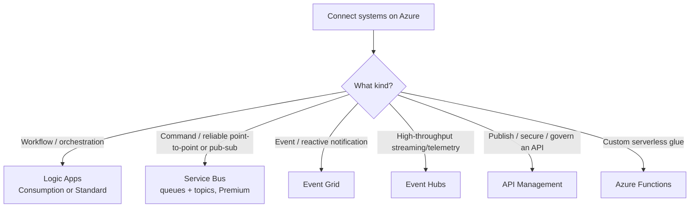

# Decision: Azure integration & messaging

**Last reviewed:** 2026-05-28 · **Confidence:** high ([integration architecture](https://learn.microsoft.com/azure/architecture/integration/integration-start-here), [Logic Apps vs Power Automate](https://learn.microsoft.com/azure/azure-functions/functions-compare-logic-apps-ms-flow-webjobs), retrieved 2026-05-28).
**Owner:** `integration-engineer`.

## The four integration technologies
Orchestration (workflows), **messaging** (commands), **events** (reactions), **APIs** (published interfaces).

| Service | Use for |
|---|---|
| **Logic Apps** | designer-first workflows/orchestration across 300+ connectors; Consumption (multitenant) or Standard (single-tenant) |
| **Service Bus** | reliable **commands** — queues + topics/subscriptions; Premium for Event Grid integration + Peek-Lock semantics |
| **Event Grid** | **events** — reactive pub/sub, cheap, fan-out (drain idle Service Bus queues, react to resource events) |
| **Event Hubs** | high-throughput **streaming** / telemetry ingestion |
| **API Management** | publish/secure/version/throttle **APIs** for internal + external consumers |
| **Functions** | custom serverless glue + triggers between the above |

**Crossover pattern:** Service Bus → Event Grid → Function/Logic App to drain idle queues without a continuous poller.

## The Logic Apps ↔ Power Automate seam (house opinion #10 — the #1 cross-plugin risk)
| | Power Automate (`power-platform/flow-engineer`) | Logic Apps (this agent) |
|---|---|---|
| Audience | O365 makers / citizen devs | IT pros / developers |
| Lives in | Office 365 | an **Azure subscription** |
| Licensing | per-user / per-flow | Consumption / Standard (subscription billing) |
| Connector governance | **DLP** | **Azure Policy** |
| Deploy | web designer | **Bicep / Terraform**, DevOps |

> **Litmus test:** *citizen maker owns it, licensed per-user under O365/DLP → `power-platform/flow-engineer`; lives in an Azure subscription, deploys via Bicep/Terraform, governed by Azure Policy → `integration-engineer` (here).* `flow-engineer` makes the **initial** "Power Automate vs Logic Apps" call and hands off the moment the answer is Logic Apps. (Documented reciprocally in [`../../power-platform/CLAUDE.md`](../../power-platform/CLAUDE.md).)
