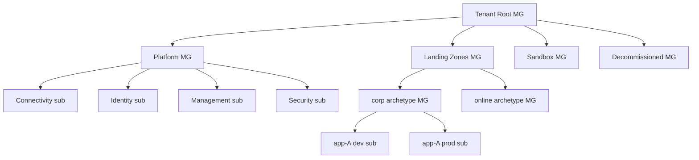

# Azure landing zones & governance (CAF Ready)

**Last reviewed:** 2026-05-28 · **Confidence:** high (Microsoft Learn CAF, retrieved 2026-05-28).
**Owner:** `azure-architect` (+ `azure-ops-engineer` for the Policy/cost/Defender enforcement).
**Source:** [CAF Ready](https://learn.microsoft.com/azure/cloud-adoption-framework/ready/), [management groups](https://learn.microsoft.com/azure/cloud-adoption-framework/ready/landing-zone/design-area/resource-org-management-groups), [landing-zone governance](https://learn.microsoft.com/azure/cloud-adoption-framework/ready/considerations/landing-zone-governance).

## The shape
A **platform landing zone** is the foundation: a **management-group (MG) hierarchy** with **Azure Policy** enforced down the tree, plus platform subscriptions (connectivity, identity, management, security). **Application landing zones** are workload subscriptions (one per environment) nested under archetype MGs to inherit policy.

## The rules (house opinions #1, #5, #9, #13)
- **Flat MG hierarchy, 3-4 levels max.** MGs are for **policy + RBAC**, not for mirroring org structure or billing.
- **Subscription per environment**, nested under an **archetype MG** (`corp` / `online`), **not** an MG-per-environment. Use **subscription vending** (AVM ships vending modules for Bicep + Terraform) to stamp them with policy + RBAC + budgets at creation.
- **Archetypes**: `corp` (private-connected), `online` (internet-facing); plus `sandbox` (loose policy, no prod connectivity) and `decommissioned`.
- **RBAC at subscription/resource-group scope**, not MG (except platform teams via **PIM** — never standing access). Don't assign app teams MG-scope RBAC.
- **Policy-driven governance**: assign Azure Policy at the MG level; limit root-MG assignments; require authorization on the MG hierarchy so users can't create rogue MGs.
- **Tag + name to the CAF standard**: tags `owner` / `cost-center` / `environment` / `application`; naming `abbreviation-workload-env-region-instance` (e.g. `rg-payments-prod-eastus-001`). Don't put tags in security-policy definitions (subscription-scope tags are mutable by elevated users).
- **Universal across every subscription**: RBAC, Cost Management (budgets + alerts), **Defender for Cloud**, Network Watcher.

## Reliability / BCDR (house opinion #8)
**Zone-redundant by default for prod** (AZ-enabled SKUs); choose paired-region or zone-redundant per RTO/RPO; back up + ASR for stateful workloads.

## Migration note
**Azure Blueprints is deprecated** → use **Deployment Stacks + Azure Policy + the ALZ accelerator** (AVM ships ALZ accelerator modules for Bicep + Terraform). See [`azure-iac-decision-and-bicep.md`](azure-iac-decision-and-bicep.md).

> Governance enforcement (Policy authoring, Defender, cost) is `azure-ops-engineer`; the topology design is `azure-architect`. The WAF is the spine — see the dated map [`azure-2026-capability-map.md`](azure-2026-capability-map.md).
