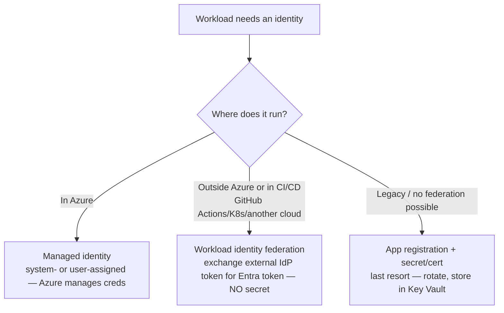

# Entra identity & access

**Last reviewed:** 2026-05-28 · **Confidence:** high ([workload identity federation](https://learn.microsoft.com/entra/workload-id/workload-identity-federation), [what is Entra](https://learn.microsoft.com/entra/fundamentals/what-is-entra), retrieved 2026-05-28). Identity/security **design escalates to `ravenclaude-core/security-reviewer`** (mandatory).
**Owner:** `entra-identity-engineer`.

## The identity decision (house opinion #4 — passwordless by default)

- **Managed identity** for Azure-hosted workloads — no secrets to manage. Prefer **user-assigned** for shared/reused identity.
- **Workload identity federation** for external workloads + CI/CD (GitHub Actions, AKS, other clouds, Azure Pipelines service connections): the external IdP's OIDC token is exchanged for an Entra token — **no secret to rotate/leak**. The federated credential's `issuer`/`subject`/`audience` must **case-sensitively match** the incoming token (a mismatch fails the exchange **silently** — common gotcha). Audience is typically `api://AzureADTokenExchange`.
- **App registration + secret/certificate** is the **last resort** (legacy, no federation path); store the secret in **Key Vault**, rotate it, never in code/IaC (the hook flags `client_secret`).

## Authorization
- **RBAC least-privilege** scoped to the **resource group / resource**, not the subscription/MG (house opinion #5). Standing **Owner** is an anti-pattern.
- **PIM** (Privileged Identity Management) for just-in-time, approval-based, time-bound elevation — platform teams get MG-scope access only through PIM.
- **Conditional Access** for sign-in risk / MFA / device posture (design with security-reviewer).

## CIAM — Entra External ID (house opinion: cite the date)
**Microsoft Entra External ID** is the current customer identity (CIAM) product — self-service sign-up, social IdPs, custom domains. **Azure AD B2C is end-of-sale (May 1 2025)** for new customers; **existing B2C tenants are supported ~to 2030**, **B2C P2 / ID Protection retired ~March 2026** (auto-downgrade to P1), and Microsoft ships **HSC coexistence** for B2C→External ID migration. New CIAM work → **External ID**, not B2C.

## Entra Agent ID
**Entra Agent ID** provides first-class identities for **AI agents** (new) — relevant when a Claude/agent workload needs a governed identity to call Microsoft-protected resources. Verify current capabilities against the dated map.

> Any auth / secret / identity / Conditional-Access design routes through `ravenclaude-core/security-reviewer`. This agent supplies the Entra craft; core supplies the security verdict.
