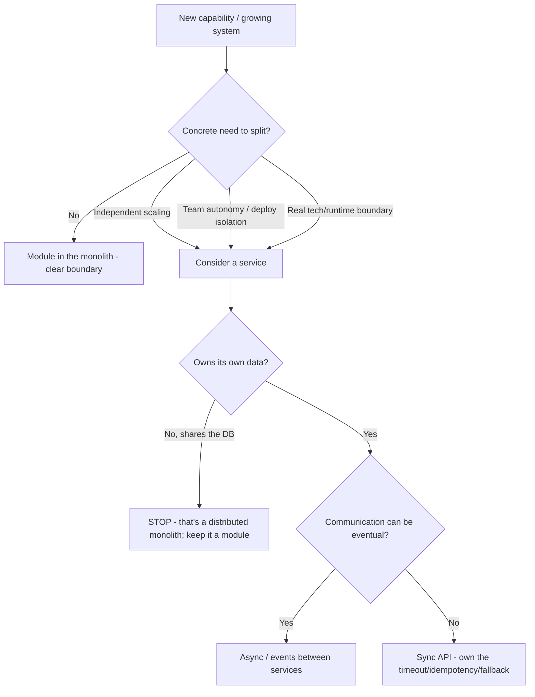
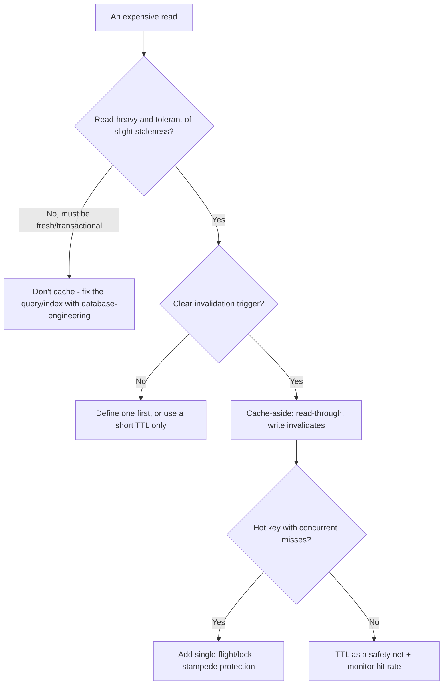

# Backend Engineering — Decision Trees

_Decision trees + a dated capability map. Capability rows are `[verify-at-build]` — re-check against the vendor before quoting. Last reviewed: 2026-06-04._

Traverse before splitting a service or adding a cache.

## Decision Tree: Monolith or a separate service?

Default to a modular monolith; a split must buy something concrete.

_Name the trade: a split buys autonomy/scale and pays in operational + consistency complexity._

## Decision Tree: Should this be cached, and how?

Cache deliberately; the invalidation story is the design.

## Capability map (dated — verify at build)

| Capability | 2026 state `[verify-at-build]` | Notes |
|---|---|---|
| Modular-monolith-first | mainstream guidance | Split on real need, not by default |
| Transactional outbox | established pattern | Avoids dual-write loss/phantom |
| Idempotency keys | standard for webhooks/payments | Dedup store required |
| Circuit breakers / bulkheads | mature (libs per language) | Fail fast, isolate |
| Backoff + jitter | standard | Avoid synchronized retry storms |
| Redis / cache-aside | mature | Invalidation is the hard part |
