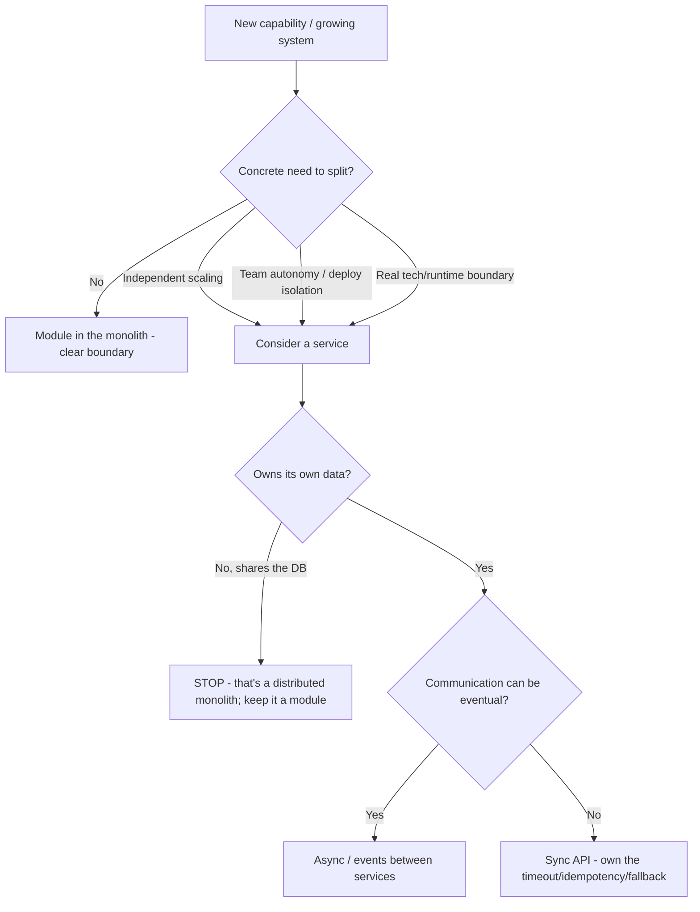
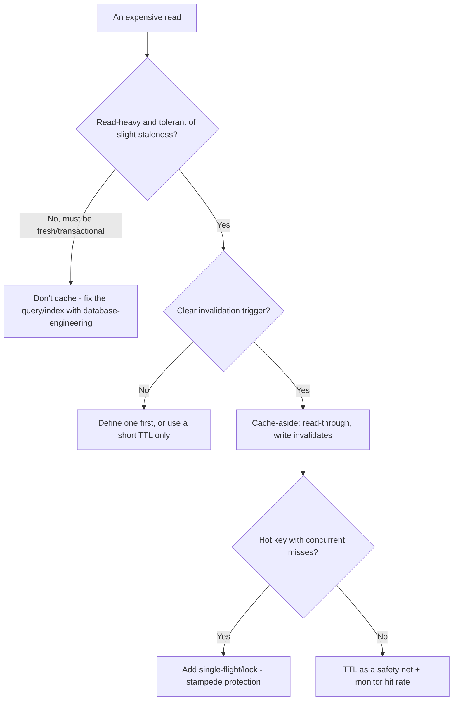
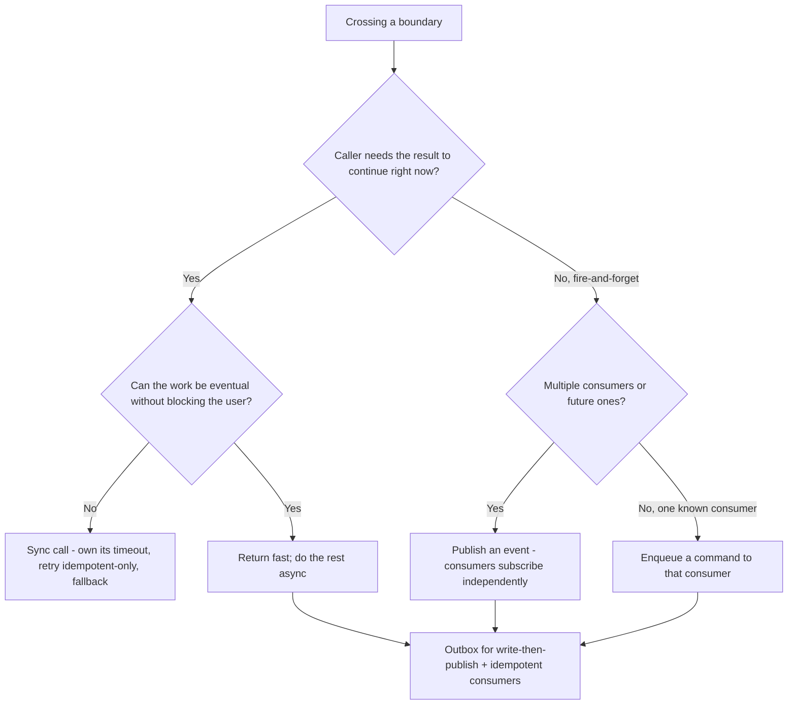
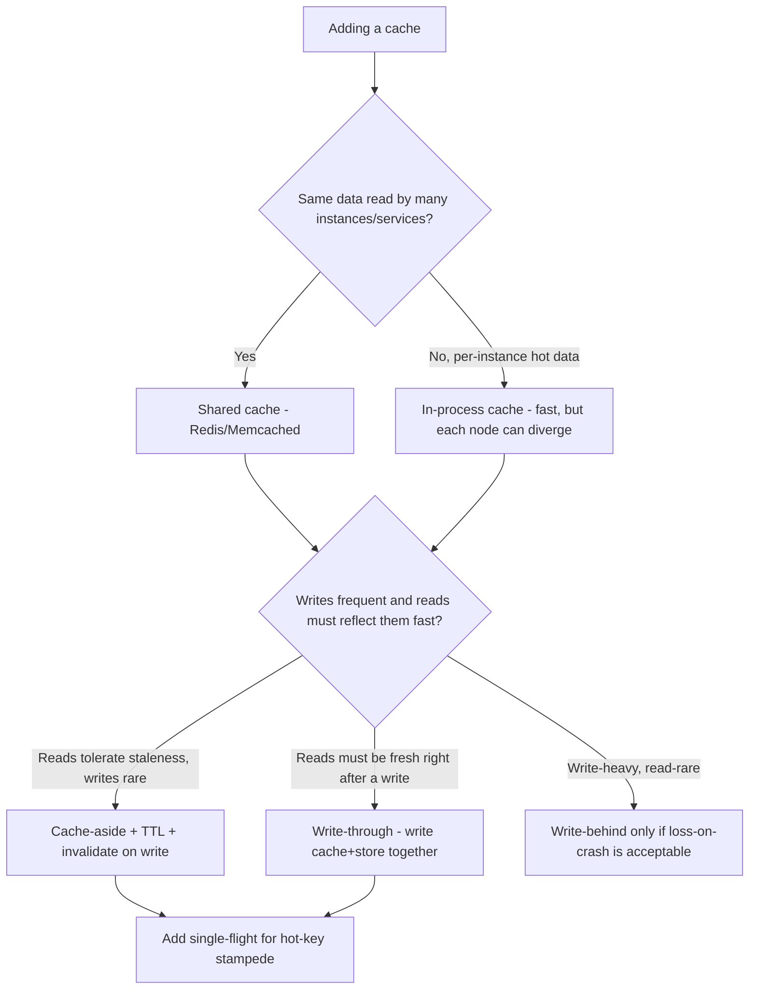
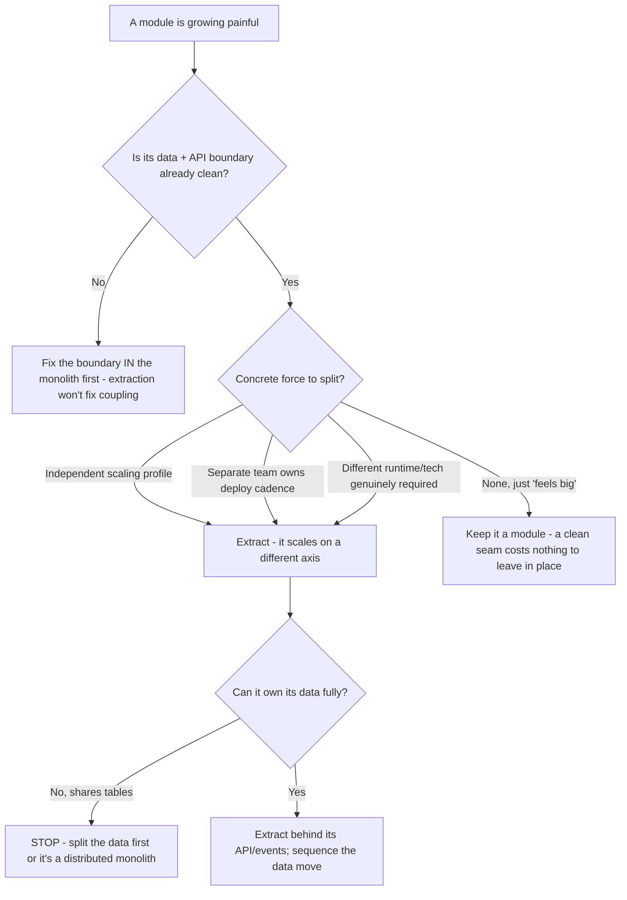
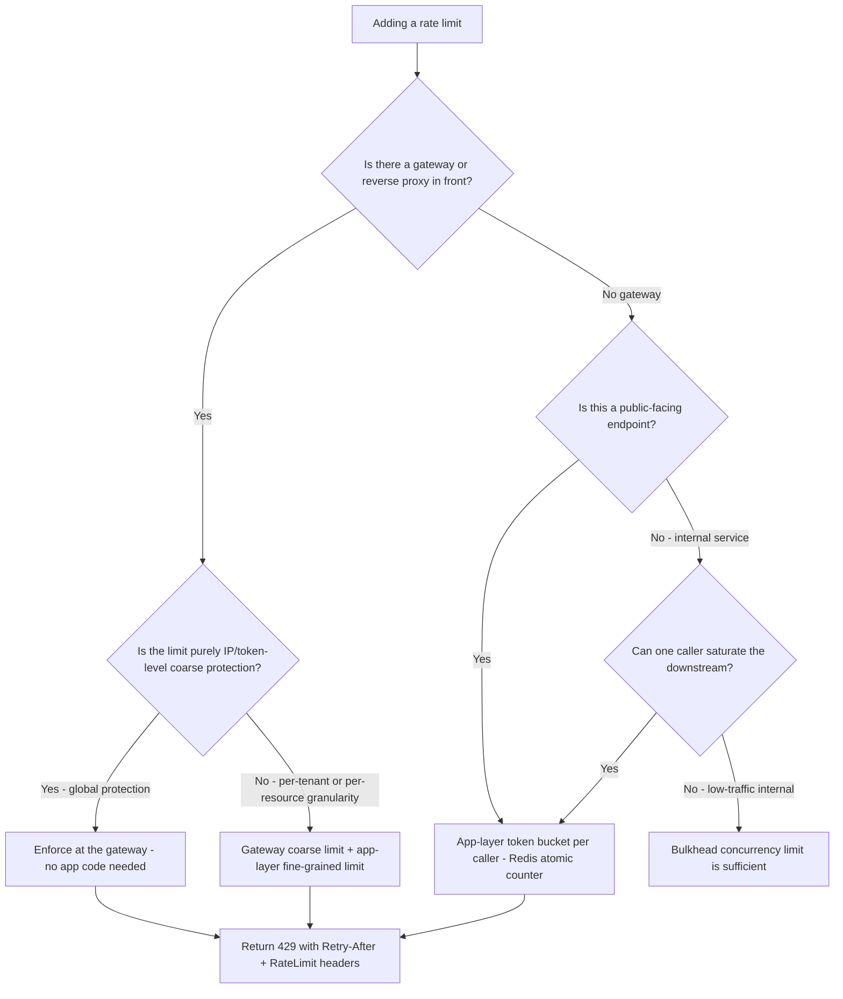
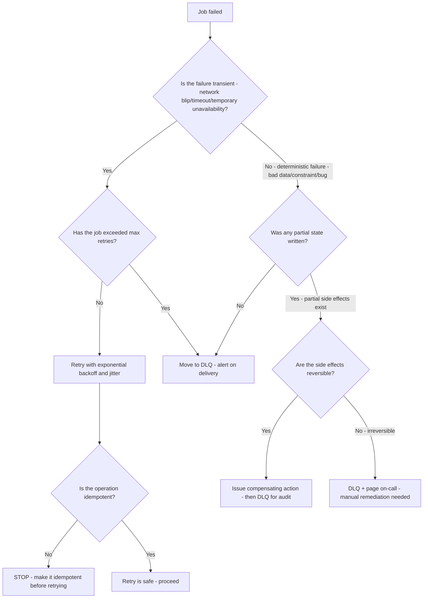
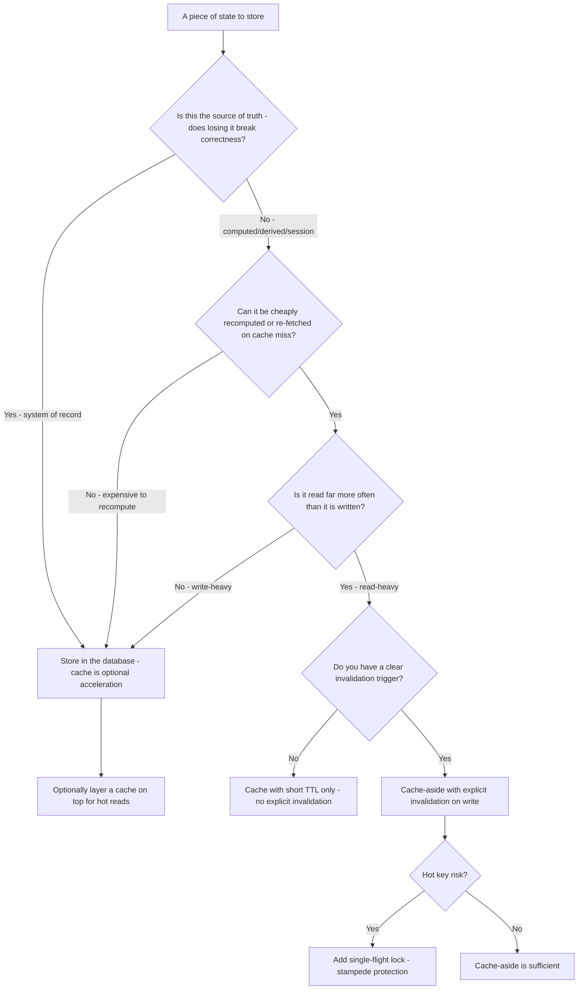

# Backend Engineering — Decision Trees

_Decision trees + a dated capability map. Capability rows are `[verify-at-build]` — re-check against the vendor before quoting. Last reviewed: 2026-06-04._

Traverse before splitting a service or adding a cache.

## Decision Tree: Monolith or a separate service?

Default to a modular monolith; a split must buy something concrete.

_Name the trade: a split buys autonomy/scale and pays in operational + consistency complexity._

## Decision Tree: Should this be cached, and how?

Cache deliberately; the invalidation story is the design.

## Decision Tree: Sync call or async event?

Sync couples availability and latency; async decouples but pays in eventual consistency.

_A sync call makes the callee's downtime your downtime; if you don't need the answer now, an event removes that coupling at the cost of eventual consistency._

## Decision Tree: Where should this cache live, and write-through or cache-aside?

Place the cache by who must see fresh data, and pick the write policy by consistency need.

_In-process caching is fastest but every node holds its own copy — without an invalidation broadcast they drift; a shared cache trades a network hop for one coherent view._

## Decision Tree: Extract this module into a service now, or later?

Get the module boundary right inside the monolith first; extract only when a concrete force demands it.

_A clean module boundary is reversible and free to leave in place; a premature extraction is a network hop and a distributed transaction you can't easily take back._

## Capability map (dated — verify at build)

| Capability | 2026 state `[verify-at-build]` | Notes |
|---|---|---|
| Modular-monolith-first | mainstream guidance | Split on real need, not by default |
| Transactional outbox | established pattern | Avoids dual-write loss/phantom |
| Idempotency keys | standard for webhooks/payments | Dedup store required |
| Circuit breakers / bulkheads | mature (libs per language) | Fail fast, isolate |
| Backoff + jitter | standard | Avoid synchronized retry storms |
| Redis / cache-aside | mature | Invalidation is the hard part |

## Decision Tree: Rate limiting — where and at what granularity?

**When this applies:** You are adding rate limiting to a backend service or endpoint and need to decide where the limit lives and how fine-grained it should be. Typically triggered when traffic spikes cause cascading failures, costs spike, or an abuse vector is identified.

**Last verified:** 2026-06-05 against standard backend resilience patterns and OWASP API4.

**Rationale per leaf:**
- *Gateway only* — coarse IP/token rate limiting at the reverse proxy keeps attack traffic out before it hits the app; zero app-code cost.
- *Gateway + app layer* — the gateway absorbs burst; the app layer enforces per-tenant/resource fairness the gateway can't reason about.
- *App-layer token bucket* — Redis `INCR` + `EXPIRE` gives atomic per-caller counts; use when no gateway exists or when the limit requires business context.
- *Bulkhead only* — low-traffic internal services do not need a per-request counter; a concurrency bulkhead prevents pool saturation.

**Tradeoffs summary:**

| Method | Cost / time | Blast radius | Approval gate? | Use when |
|---|---|---|---|---|
| Gateway only | Low | Coarse - all callers share | Gateway team approval | Coarse abuse protection, no per-tenant need |
| App-layer bucket | Medium | Per caller | None | Per-tenant fairness, no gateway |
| Gateway + app layer | High | Fine-grained | Gateway team approval | Public API with per-tenant SLAs |
| Bulkhead only | Low | Per dependency | None | Internal service, low traffic |

## Decision Tree: Background job failure — retry, DLQ, or compensate?

**When this applies:** A background job or async worker has failed after processing a message. You need to decide whether to retry the message, move it to a dead-letter queue, or issue a compensating action. Triggered by an exception, a downstream timeout, or a constraint violation in the worker.

**Last verified:** 2026-06-05 against standard queue-reliability patterns (SQS, RabbitMQ, Kafka).

**Rationale per leaf:**
- *Retry with backoff* — transient failures are expected; backoff + jitter avoids synchronized retry storms.
- *DLQ* — after max retries or a deterministic failure, the message needs human inspection; a DLQ preserves it.
- *Compensating action* — if partial state was written, issue a semantic undo before parking the message.
- *Alert + manual* — irreversible partial side effects cannot be auto-compensated; escalate immediately.

**Tradeoffs summary:**

| Method | Cost / time | Blast radius | Approval gate? | Use when |
|---|---|---|---|---|
| Retry | Low | None if idempotent | None | Transient failure, idempotent job |
| DLQ | Low | Deferred - human reviews | None | Max retries exceeded or bad data |
| Compensate + DLQ | Medium | Undo the partial write | None | Partial side effects, reversible |
| Alert + manual | High | Immediate escalation | On-call | Irreversible partial side effects |

## Decision Tree: Should this state be stored in a cache or in the database?

**When this applies:** You have a piece of application state and must decide whether it belongs in a cache (Redis/in-process) or in the primary database. Triggered when adding a new data concept or when performance profiling shows repeated expensive reads.

**Last verified:** 2026-06-05 against cache-aside and data-access best practices.

**Rationale per leaf:**
- *Database (source of truth)* — correctness and durability requirements always win; the database is the last line of defense.
- *Short-TTL-only cache* — without a clear invalidation trigger, a TTL is the safety net; accept bounded staleness.
- *Cache-aside with invalidation* — the standard pattern: write invalidates the cache; reads populate it on miss.
- *Single-flight lock* — a hot key with many concurrent misses needs stampede protection to avoid a thundering-herd DB hit.

**Tradeoffs summary:**

| Method | Cost / time | Blast radius | Approval gate? | Use when |
|---|---|---|---|---|
| Database only | Low | None | None | Source of truth, write-heavy |
| TTL-only cache | Low | Bounded staleness | None | No clear invalidation trigger |
| Cache-aside + invalidation | Medium | Stale on miss | None | Read-heavy, clear write trigger |
| Single-flight + cache-aside | Medium-high | None | None | Hot key, concurrent misses |
