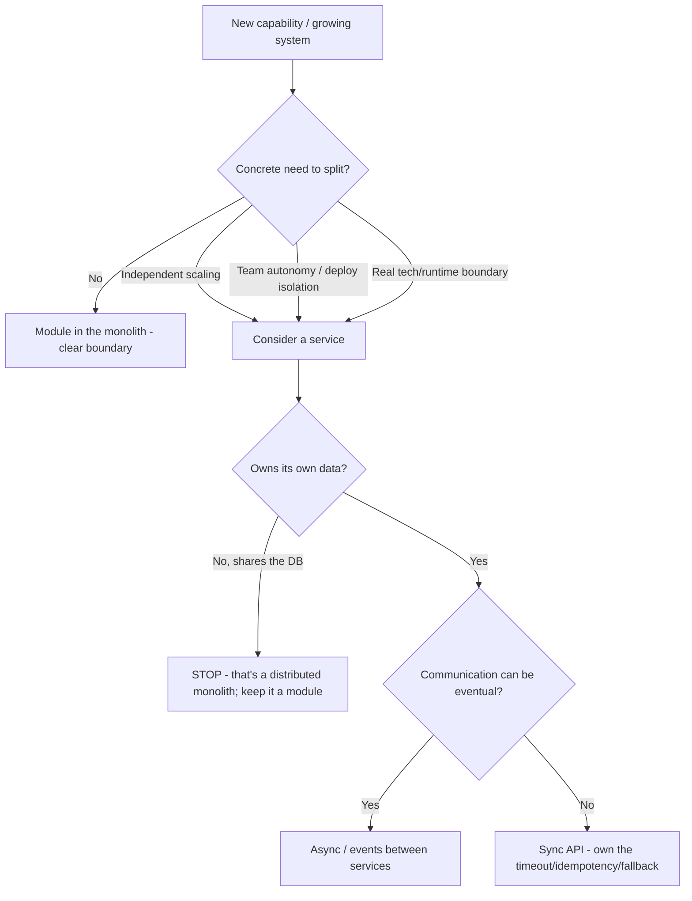
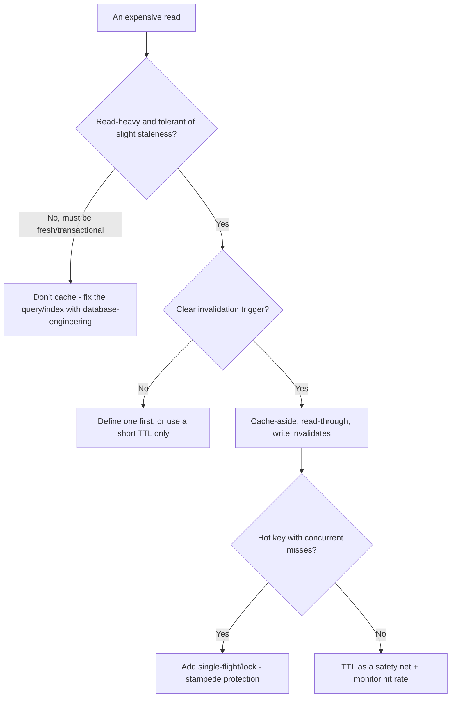
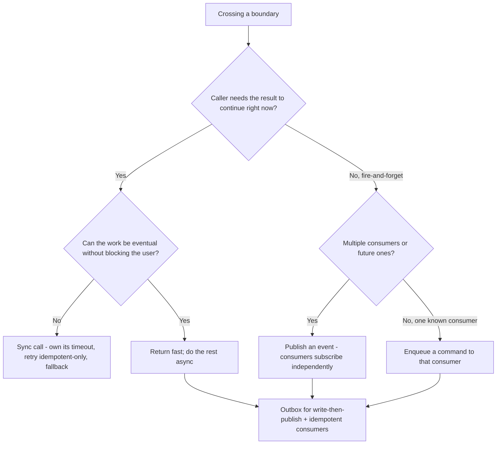
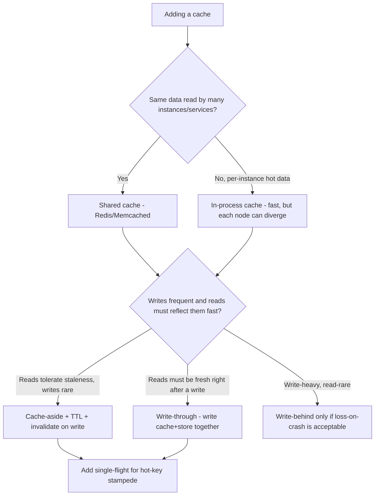
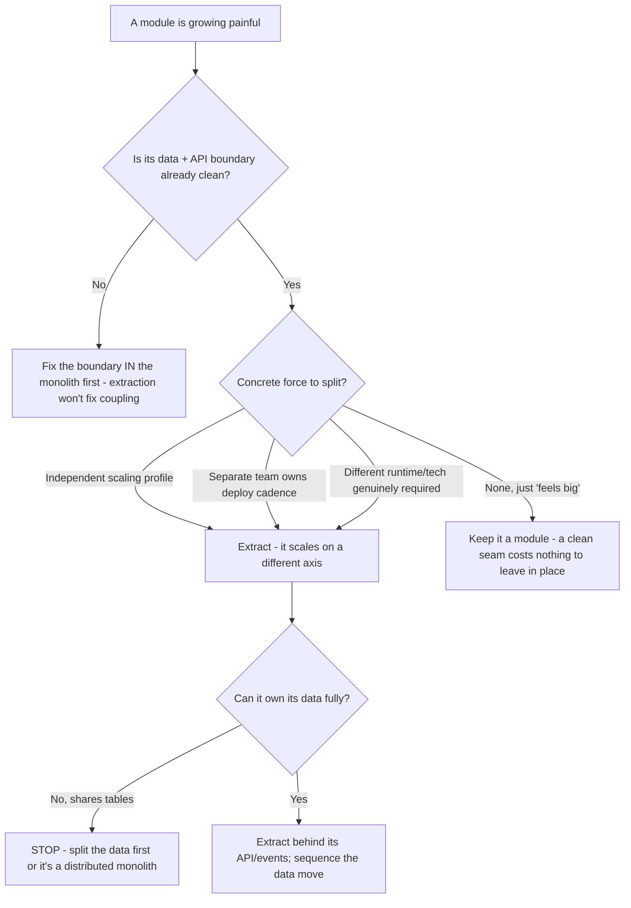

# Backend Engineering — Decision Trees

_Decision trees + a dated capability map. Capability rows are `[verify-at-build]` — re-check against the vendor before quoting. Last reviewed: 2026-06-04._

Traverse before splitting a service or adding a cache.

## Decision Tree: Monolith or a separate service?

Default to a modular monolith; a split must buy something concrete.

_Name the trade: a split buys autonomy/scale and pays in operational + consistency complexity._

## Decision Tree: Should this be cached, and how?

Cache deliberately; the invalidation story is the design.

## Decision Tree: Sync call or async event?

Sync couples availability and latency; async decouples but pays in eventual consistency.

_A sync call makes the callee's downtime your downtime; if you don't need the answer now, an event removes that coupling at the cost of eventual consistency._

## Decision Tree: Where should this cache live, and write-through or cache-aside?

Place the cache by who must see fresh data, and pick the write policy by consistency need.

_In-process caching is fastest but every node holds its own copy — without an invalidation broadcast they drift; a shared cache trades a network hop for one coherent view._

## Decision Tree: Extract this module into a service now, or later?

Get the module boundary right inside the monolith first; extract only when a concrete force demands it.

_A clean module boundary is reversible and free to leave in place; a premature extraction is a network hop and a distributed transaction you can't easily take back._

## Capability map (dated — verify at build)

| Capability | 2026 state `[verify-at-build]` | Notes |
|---|---|---|
| Modular-monolith-first | mainstream guidance | Split on real need, not by default |
| Transactional outbox | established pattern | Avoids dual-write loss/phantom |
| Idempotency keys | standard for webhooks/payments | Dedup store required |
| Circuit breakers / bulkheads | mature (libs per language) | Fail fast, isolate |
| Backoff + jitter | standard | Avoid synchronized retry storms |
| Redis / cache-aside | mature | Invalidation is the hard part |
