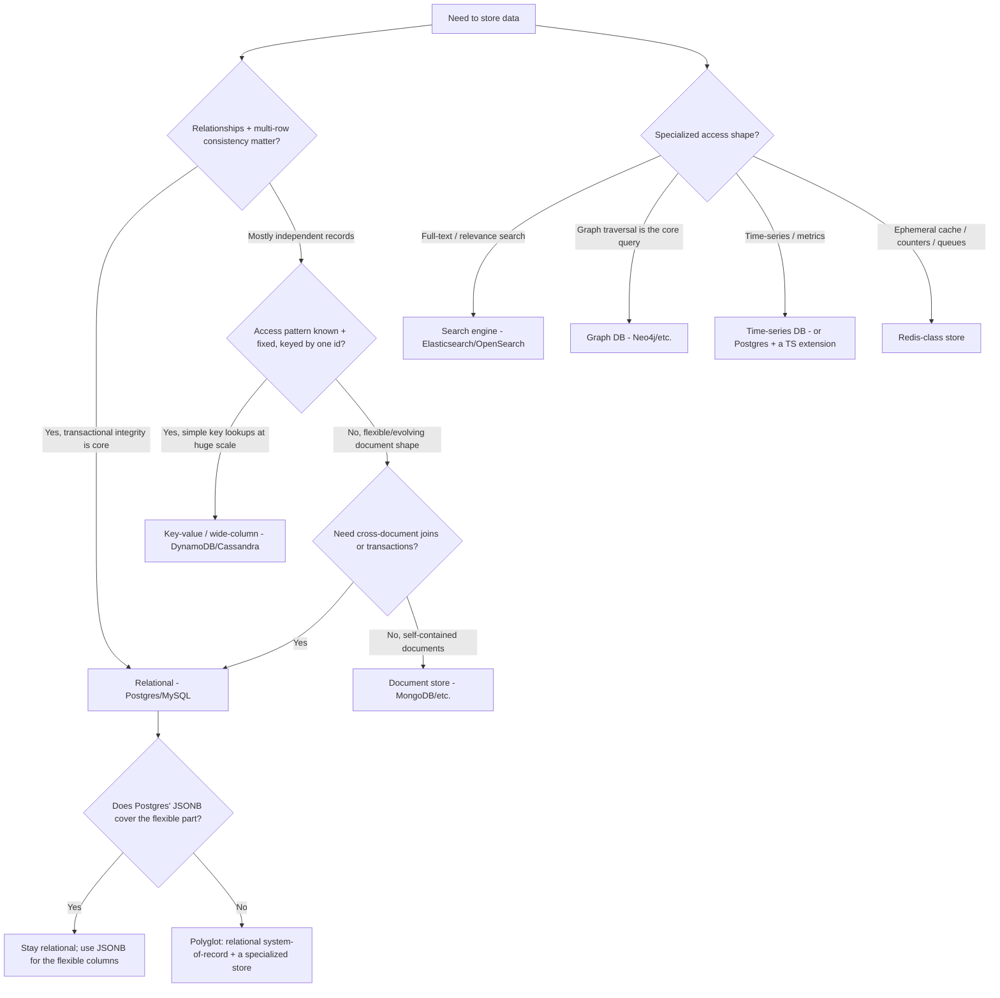
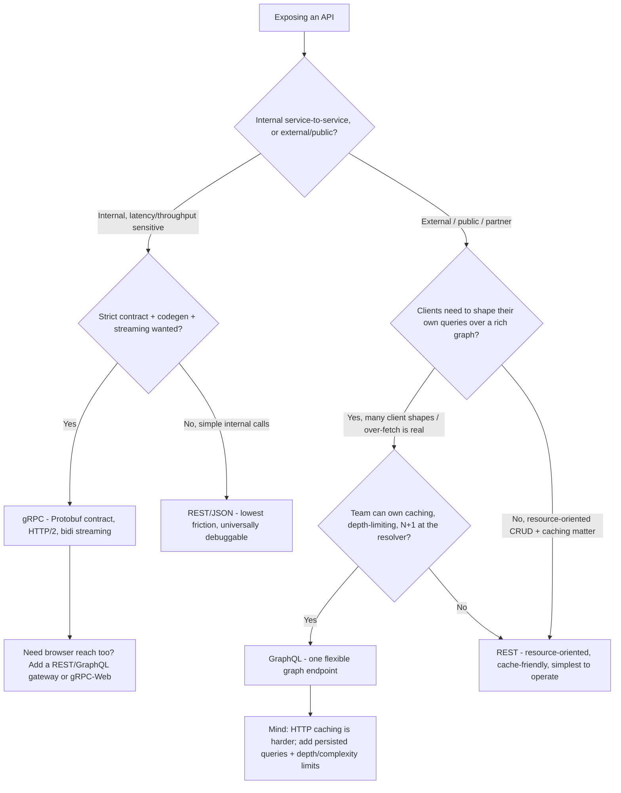

# Data-Store & API-Paradigm Decision Trees

_Two decision trees for choices the existing [`backend-engineering-decision-trees.md`](backend-engineering-decision-trees.md) does not cover: **which data store** to reach for, and **which API paradigm** to expose. Architectural priors, not version-volatile facts — but specific engine/protocol capabilities marked `[verify-at-use]` move; re-check against the vendor before quoting. Last reviewed: 2026-06-05._

Traverse the relevant graph top-to-bottom **before** picking a store or a protocol — do not pattern-match on the loudest recent blog post.

## Decision Tree: Relational (SQL) or non-relational (NoSQL)?

**Default to a relational database.** It is the lower-regret choice for most backends: ACID transactions, joins, a mature ecosystem, and a schema that catches mistakes early. Reach past it only when a concrete data-shape or scale force the relational model doesn't serve.

**How to read it:**

- **The relational default is not nostalgia — it's lower regret.** A relational store with `JSONB`/`json` columns absorbs most "we need flexible fields" cases without giving up transactions and joins. Reach for a document store when the *primary* access pattern is self-contained documents with no cross-document consistency need, not because "schemas feel heavy." `[verify-at-use]`: Postgres `JSONB` indexing/operator capability has expanded steadily — confirm the current operator/index set before deciding it can't cover your flexible part.
- **Key-value / wide-column wins on one axis: predictable single-key access at a scale that strains a single relational primary.** Its cost is that you must know the access pattern up front (you model the table around the query), joins and ad-hoc queries are weak, and consistency is often eventual/tunable. A wrong access-pattern guess is expensive to undo. Don't pick it to "scale later" — pick it when the scale + access shape are real now.
- **Eventual consistency is a feature you pay for, not a free upgrade.** Many NoSQL stores trade strong consistency for availability/partition tolerance (the CAP trade). If your domain needs read-your-writes or multi-row invariants, that trade is a liability, not a perk.
- **Polyglot persistence is legitimate but has a tax.** A relational system-of-record plus a specialized store (search, graph, cache) is a normal mature pattern — but each extra store is another thing to keep consistent (usually via this team's outbox/CDC patterns), back up, and operate. Add one when a query shape genuinely doesn't fit the primary, not to collect databases.
- **Specialized shapes have specialized homes.** Full-text relevance search → a search engine (or Postgres FTS for modest needs); graph traversal as the core query → a graph DB; time-series/metrics → a TS store or a Postgres time-series extension; ephemeral counters/locks/cache → Redis-class. Forcing any of these into a generic store usually works until the scale or query shape makes it not.

> **Seam:** the **schema, indexes, query plans, and the engine's tuning** are `database-engineering`'s lane. This tree is about the **store-selection decision** the backend makes and the **data-access code** that follows from it — the two teams hand off here.

_Name the trade: relational buys integrity + flexibility of query and pays a (usually overstated) scaling-ceiling cost; a NoSQL store buys a specific scale/shape and pays in consistency, query flexibility, and up-front access-pattern commitment._

## Decision Tree: REST, GraphQL, or gRPC?

Pick the API paradigm by **who calls it and how**, not by fashion. The same service can expose more than one (e.g. gRPC internally, REST at the edge).

**How to read it:**

- **REST is the lower-regret default for public and resource-oriented APIs.** It is cache-friendly (HTTP caching, CDNs, conditional requests work out of the box), universally debuggable (curl, browser, any HTTP tool), and the simplest to operate and document (OpenAPI). Most external APIs should start here.
- **gRPC's home is internal, latency-/throughput-sensitive service-to-service traffic.** Protobuf gives you a strict, versioned, code-generated contract across languages; HTTP/2 gives you multiplexing and first-class streaming (incl. bidirectional). Its costs: not natively browser-callable (you need gRPC-Web or a gateway), binary payloads are harder to eyeball, and you take on the Protobuf toolchain. Don't expose raw gRPC as your public browser API.
- **GraphQL earns its keep when many different clients need to shape their own queries over a rich, interconnected graph and over-/under-fetching with REST is a *measured* problem** (classic: a mobile app and a web app wanting different field sets from the same resources). It is **not** free: you take on resolver-level N+1 (the dataloader/batching problem this team knows well), depth/complexity limiting to stop abusive queries, and HTTP caching becomes harder (everything POSTs to one endpoint — mitigate with persisted queries + CDN). Adopt it for the over-fetch problem, not because it's modern.
- **The contract still belongs to `api-engineering`.** Whichever paradigm you pick, the *contract* (OpenAPI / Protobuf / GraphQL SDL, versioning, pagination semantics, error model) is `api-engineering`'s lane. This tree is the backend's **paradigm-selection** input to that contract; the service *behind* it — the resolvers, the handlers, the idempotency and resilience — is this team's.
- **It's not exclusive.** A common mature shape is gRPC between internal services and a REST or GraphQL gateway at the public edge. Pick per-boundary, not per-company.

_Name the trade: REST buys ubiquity + caching + operational simplicity and pays in over-/under-fetch and weaker contracts; gRPC buys a strict typed contract + streaming + throughput and pays in browser reach + debuggability; GraphQL buys client-shaped queries over one graph and pays in resolver N+1, query-abuse limiting, and caching complexity._

## Capability map (dated — verify at use)

| Capability | 2026 state `[verify-at-use]` | Notes |
|---|---|---|
| Relational-default + `JSONB` for flexible fields | mainstream | Absorbs most "we need flexible fields" cases without leaving SQL |
| DynamoDB/Cassandra single-key scale | mature | Model the table around the access pattern; weak on ad-hoc joins |
| Document store (MongoDB) multi-doc transactions | available, with caveats | Confirm the consistency/transaction scope you actually get before relying on it |
| Postgres full-text search | mature for modest needs | Dedicated search engine still wins at relevance-tuning scale |
| gRPC in the browser | needs gRPC-Web or a gateway | Not natively browser-callable |
| GraphQL HTTP caching | hard by default | Persisted queries + CDN + depth/complexity limits are the standard mitigations |
| REST + OpenAPI tooling | mature | The lowest-friction, most-debuggable public default |

> Sources for the architectural priors above: the MDN / IETF HTTP-caching model and OpenAPI ecosystem (REST), the [gRPC project docs](https://grpc.io/docs/) (Protobuf/HTTP-2/streaming, gRPC-Web), the [GraphQL spec + best-practices](https://graphql.org/learn/best-practices/) (single-endpoint, N+1/dataloader, persisted queries), and the [PostgreSQL docs](https://www.postgresql.org/docs/) for `JSONB`/FTS. These are stable design properties of the protocols/engines, not release-pinned facts; the version-specific rows are marked `[verify-at-use]`.
