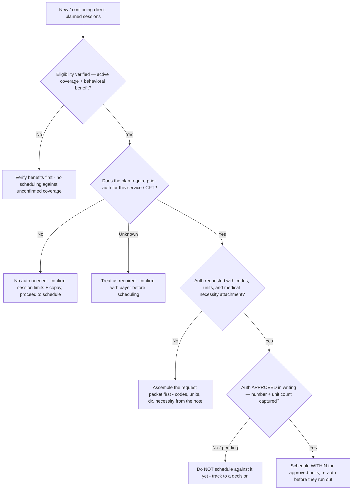
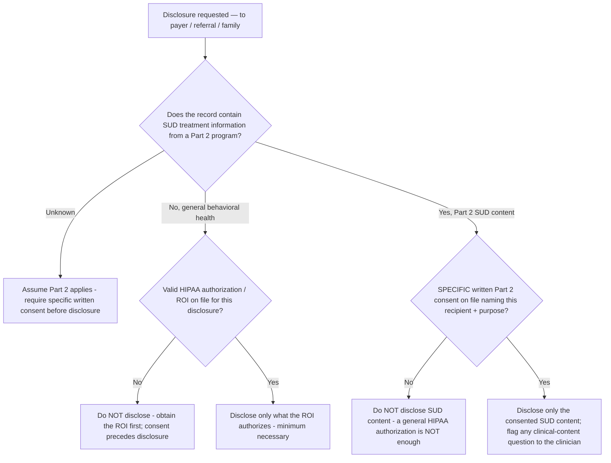

# Behavioral-Health Practice — Decision Trees

_Decision trees + a dated reference map. Rows marked `[verify-at-build]` are time-sensitive (CPT codes, payer policy, regulatory specifics) — re-check against the current code set / payer policy / regulation before quoting to a client. **Operational and documentation support only — not clinical, medical, or legal advice.** Last reviewed: 2026-06-08._

Traverse before scheduling against an authorization, disclosing a record, or wiring the intake→claim flow. PHI stays in the EHR — these trees use placeholders only.

## Decision Tree: Is a prior authorization required (and confirmed)?

An authorization is confirmed in writing or it does not exist. Booking against an assumed auth is a denial waiting to happen.

_The code reflects the service rendered, never the reimbursement wanted. If the documentation doesn't support the time/modality, the code drops — route the gap to documentation, don't stretch the code._

## Decision Tree: Is this record 42 CFR Part 2-covered, and can we disclose it?

Part 2 (substance-use-disorder) records carry consent requirements HIPAA does not. When unsure whether a record is Part 2-covered, assume it is.

_Consent precedes disclosure, every time. A general HIPAA authorization does not cover Part 2 SUD content — that needs its own specific consent. Route any question about what the clinical content *means* to a licensed clinician; this is a consent/operations call, not a clinical one._

---

## Reference map (2026, `[verify-at-build]`)

> **Not clinical, billing-final, or legal advice.** Every code, format, and rule below is a starting reference to confirm against the current CPT code set, the specific payer's policy, and current regulation before use.

### The intake → treatment-plan → note → claim flow (medical-necessity thread)

| Stage | Owner here | Carries forward |
|---|---|---|
| Intake + screening | `practice-operations-lead` (clinical screen → clinician) | Presenting problem, coverage, consent on file `[verify-at-build]` |
| Treatment plan | `clinical-documentation-specialist` (structure; clinician authors) | Diagnosis, functional impairment, goals, interventions `[verify-at-build]` |
| Progress note | `clinical-documentation-specialist` (structure; clinician authors) | Same dx + impairment, intervention delivered, client response `[verify-at-build]` |
| Claim | `billing-and-authorization-lead` | Same dx, CPT reflecting the service, auth units, medical necessity `[verify-at-build]` |

_The same diagnosis, the same functional impairment, and a consistent plan must thread all four stages. A claim whose necessity story diverges from the note is a denial and an audit risk._

### Progress-note formats (structure only)

| Format | Sections | Notes |
|---|---|---|
| DAP | Data, Assessment, Plan | Common in behavioral health; concise `[verify-at-build]` |
| SOAP | Subjective, Objective, Assessment, Plan | Widely used across medical + behavioral `[verify-at-build]` |
| BIRP | Behavior, Intervention, Response, Plan | Intervention/response-focused; strong for medical necessity `[verify-at-build]` |

_Pick one standard and apply it consistently; contemporaneous, behavioral, factual. The clinician authors the content — the standard governs the structure._

### Behavioral CPT codes (confirm against current code set + payer policy)

| Code (reference) | Service (reference) | Selection driver |
|---|---|---|
| 90791 | Psychiatric diagnostic evaluation (no medical services) | Intake/eval `[verify-at-build]` |
| 90832 / 90834 / 90837 | Individual psychotherapy — 30 / 45 / 60 min (time-based) | Documented face-to-face time `[verify-at-build]` |
| 90846 / 90847 | Family psychotherapy — without / with client present | Who is present `[verify-at-build]` |
| 90853 | Group psychotherapy | Group modality `[verify-at-build]` |
| Telehealth modifiers / POS | Service-delivery modifier + place of service | Payer + current telehealth policy `[verify-at-build]` |

_Time and modality determine the code; the documentation must support the time. Never upcode — the code reflects the service rendered. Confirm every code and modifier against the current CPT set and the specific payer's policy before quoting._

### 42 CFR Part 2 vs HIPAA (basics)

| Dimension | HIPAA | 42 CFR Part 2 |
|---|---|---|
| Covers | PHI generally | SUD records from a Part 2 program `[verify-at-build]` |
| Disclosure to payer | Permitted for treatment/payment/operations (within minimum necessary) | Generally needs specific written consent `[verify-at-build]` |
| Consent specificity | Authorization may be broader | Specific recipient + purpose; redisclosure prohibition `[verify-at-build]` |
| Default when unsure | — | Assume Part 2 applies; require specific consent `[verify-at-build]` |

_When in doubt whether a record is Part 2-covered, treat it as covered. This map is a basics reference — confirm against current regulation and route any legal question to counsel and any clinical-content question to a licensed clinician._
