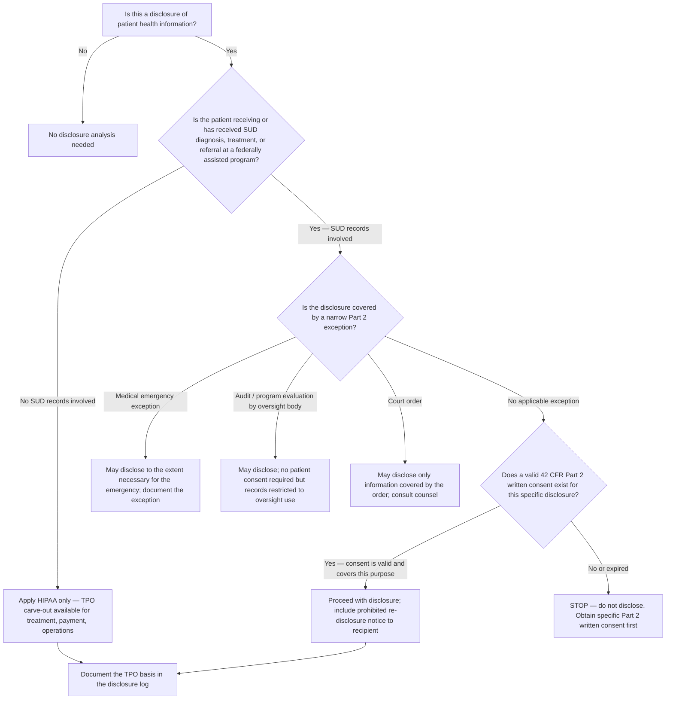
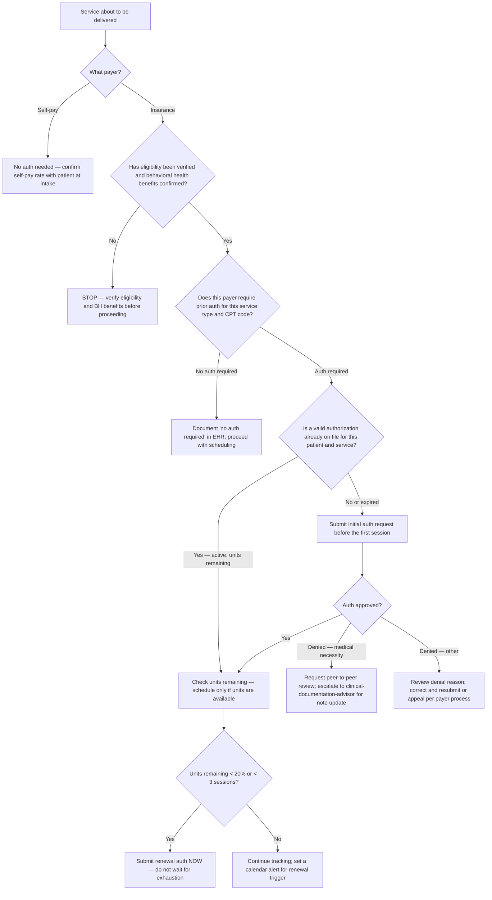
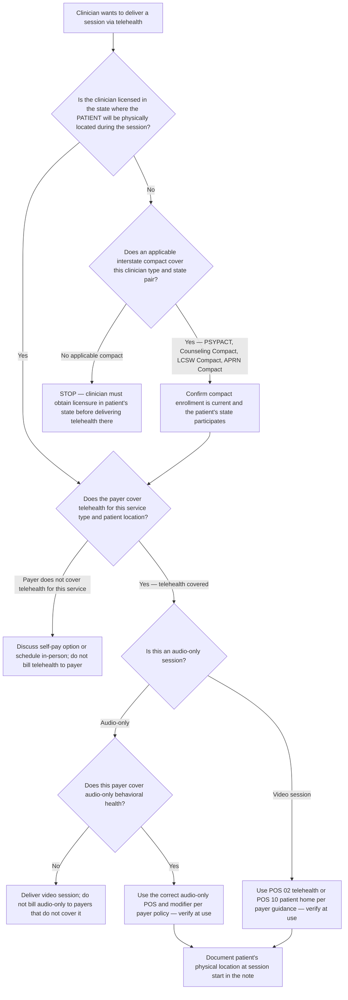

# Behavioral & Mental Health Practice — Decision Trees + 2026 Capability Map

> Canonical knowledge bank for `behavioral-mental-health-practice`. **Traverse the relevant Mermaid
> tree top-to-bottom before choosing** — the proactive complement to the Capability Grounding Protocol.
> Volatile product/version facts in the capability map carry a retrieval date and a [verify-at-use]
> rider. This file is operational/regulatory guidance only — not clinical advice.

---

## Decision Tree: 42 CFR Part 2 vs HIPAA — Disclosure Routing

**Leaf rule:** for any SUD record from a federally assisted program, the default is **do not
disclose** until a valid 42 CFR Part 2 specific written consent exists. HIPAA's TPO carve-out does
NOT apply. The exceptions (emergency, audit, court order) are narrow and must be documented. When
in doubt, withhold and consult counsel.

---

## Decision Tree: Prior Authorization — Is One Needed?

**Leaf rule:** verify authorization requirements before the first session, not after. Track units
actively and submit renewals when 20% or 3 sessions remain — whichever comes first. A session
delivered without a valid authorization is a billing compliance risk regardless of whether the service
was clinically appropriate. Use `scripts/bh_calc.py auth-burn` to calculate units remaining and
weeks of coverage.

---

## Decision Tree: Telehealth Eligibility Check

**Leaf rule:** the clinician must be licensed in the state where the **patient is physically located
at the time of the session** — this is the most common telehealth compliance failure. Interstate
compacts help but are license-type and state-specific; verify enrollment and participation status
before relying on them [verify-at-use]. Document patient location at every telehealth session start.
Payer telehealth coverage and audio-only rules are volatile — verify with the current payer policy
before each new patient type [verify-at-use].

---

## 2026 Capability Map — BH Practice Technology Landscape

_Retrieved 2026-06-08. Product positioning, pricing, and feature sets are volatile — re-confirm at
use; this is orientation, not a procurement recommendation. No invented products._

### EHR / Practice Management (Behavioral Health Focus)

| Platform | Notes [verify-at-use] |
| --- | --- |
| **SimplePractice** | Widely used solo/small-group outpatient BH; telehealth built in; client portal; insurance billing; payer integrations vary. Strong for therapy practices. |
| **TheraNest** | Multi-provider outpatient BH and social work practices; note templates, billing, telehealth, client portal. Acquired by Therapy Brands. |
| **Valant** | Designed specifically for behavioral health practices; MBC instruments built-in (PHQ-9, GAD-7, others); psychiatry and therapy workflows; e-prescribing option. |
| **TherapyNotes** | Therapy-focused; strong documentation and scheduling; telehealth add-on; popular among solo and small-group practices. |
| **Qualifacts CareLogic / Credible** | Enterprise-tier community mental health centers (CMHCs) and larger agencies; more complex workflow support. |
| **Kipu / Procentive** | SUD/addiction specialty EHRs with 42 CFR Part 2 compliance features built in. |
| **EHR integrations note** | Most BH EHRs offer some level of ERA/EOB integration; depth of payer integration varies widely — verify with each platform's current payer list. |

### Telehealth Platforms (BH-Relevant)

| Platform | Notes [verify-at-use] |
| --- | --- |
| **Doxy.me** | HIPAA BAA available; free tier widely used in solo BH practices; browser-based no-download. |
| **Zoom for Healthcare** | HIPAA BAA available; widely recognized; group session capability; requires BAA be in place. |
| **Telehealth by SimplePractice** | Embedded in SimplePractice EHR; simplest workflow for SimplePractice users. |
| **Thera-Link** | BH-specific telehealth; HIPAA-compliant; group session capability. |
| **Selection criteria (platform-agnostic)** | HIPAA BAA, audio-only capability, group session support, EHR integration, waiting room, emergency contact capture, cost structure. Never use a consumer video platform (Zoom personal, FaceTime) without a BAA. |

### Measurement-Based Care (MBC) Tools

| Instrument / Tool | Notes [verify-at-use] |
| --- | --- |
| **PHQ-9 (Patient Health Questionnaire)** | Public domain; adult depression; 9 items; validated for scoring and severity thresholds; widely accepted by payers. |
| **GAD-7 (Generalized Anxiety Disorder)** | Public domain; adult anxiety; 7 items; validated. |
| **PCL-5 (PTSD Checklist)** | Public domain (National Center for PTSD); 20-item; PTSD/trauma. |
| **BASIS-24** | McLean Hospital; licensed; 24-item general BH severity; widely used in CMHCs. |
| **CAMS (Collaborative Assessment and Management of Suicidality)** | Jobes Associates; requires training; suicide risk assessment and management. |
| **Greenspace, Blueprint (formerly Therapy Brands MBC)** | Commercial MBC platforms that integrate with EHRs; automate instrument delivery and scoring. [verify-at-use] |
| **EHR-embedded MBC** | Valant, TheraNest, and others have varying levels of built-in MBC instrument support — confirm with current vendor documentation. |

### Interstate Compact Status (as of 2026-06-08 — highly volatile [verify-at-use])

| Compact | License types | Notes |
| --- | --- | --- |
| **PSYPACT** | Psychologists | Active in 40+ states; check psypact.org for current participating states |
| **Counseling Compact** | LPCs, LADCs (varies by state) | Growing; check counselingcompact.com for current status |
| **LCSW Compact** | Licensed Clinical Social Workers | Newer; check lcswcompact.org |
| **APRN Compact** | APRNs including psychiatric NPs | State-by-state participation varies; check ncsbn.org |
| **Critical note** | All types | Compact enrollment and state participation change; always verify current status directly with the compact authority before relying on compact authority. |

> Provenance: platform descriptions from vendor public documentation and BH industry sources, retrieved
> 2026-06-08. Product features, pricing, and payer integrations are volatile — re-verify at use.
> Instrument descriptions from public-domain instrument documentation and SAMHSA/NIMH sources.
> Interstate compact status from each compact's public website as of 2026-06-08 — verify current state
> participation directly with the compact authority.

---

## See also

- [`../CLAUDE.md`](../CLAUDE.md) — team constitution and seams.
- [`../best-practices/README.md`](../best-practices/README.md) — the named, citable rules.
- Neighbour decision trees: `medical-revenue-cycle`, `regulatory-compliance`.

_Last reviewed: 2026-06-08 by `claude`._
