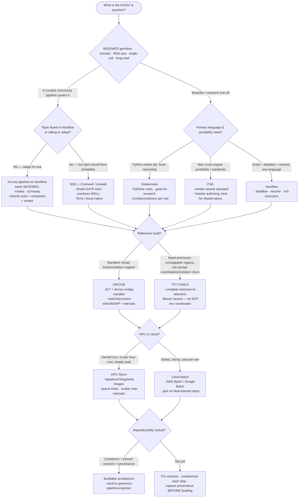

# Knowledge — Bioinformatics pipeline decision tree

> **Last reviewed:** 2026-07-09 · **Confidence:** Medium-High (consensus on the engine-selection framing — nf-core-first, Snakemake for Python-native research, WDL for cloud/Terra, CWL for portability — and on where GATK/DeepVariant, BWA-MEM2/minimap2/STAR/Salmon each fit; **specific tool versions, reference-build accessory files, and cloud pricing are volatile — re-verify before a commitment**).
> The most-asked bioinformatics question is "what should we build this on — Nextflow/nf-core, Snakemake, WDL+Cromwell, or CWL, on GRCh38 or T2T-CHM13, on HPC or cloud?". This is the decision tree the `bioinformatics-workflow-architect` traverses **before** naming an engine, plus the trade-off tables, the reference-build sub-choice, the compute sub-choice, and the seams to adjacent plugins.

The agent's discipline: **name the scientific question and assay first, adopt a curated community pipeline before hand-rolling, name the engine second.** Clinical-trial operations and regulatory submission are **not** pipeline engineering; they leave this layer for `clinical-trials`. Generic model training leaves it for `ml-engineering`.

---

## Decision Tree: choosing a workflow engine + reference + compute

Traverse top-to-bottom. Gate on **assay/question** first, then **is there a curated community pipeline**, then **portability/team fluency**, then **HPC vs cloud**, then the **reference build**.

---

## Trade-off table: workflow engines

| Engine | Sweet spot | Watch out for |
|---|---|---|
| **Nextflow + nf-core** | Production genomics; a curated pipeline (sarek, rnaseq, scrnaseq) already covers the assay; dataflow + `-resume`; runs on HPC and every major cloud | Groovy DSL2 learning curve; the abstraction can hide what a step actually runs — read the module |
| **Snakemake** | Python-native research labs; local reasoning about a rule graph; per-rule Conda/containers | Scaling to huge fan-out and multi-cloud is more DIY than Nextflow; scheduler is Python-side |
| **WDL + Cromwell / miniwdl** | Cloud/Terra-centric shops; Broad's GATK best-practices WDLs; readable, declarative | Cromwell is heavy to operate; miniwdl is lighter but a smaller ecosystem; less nimble for rapid research iteration |
| **CWL** | Vendor-neutral, standards-first portability; a spec shared across institutions/tools | Verbose to author; smaller day-to-day community momentum than Nextflow/Snakemake in 2026 |

> **Volatile:** engine versions, nf-core pipeline coverage, and executor/plugin support change frequently. Treat the rows as a 2026-07 snapshot and re-verify with `ravenclaude-core/deep-researcher` before a commitment.

---

## Reference-build sub-choice (GRCh38 vs T2T-CHM13)

- **GRCh38** — the 2026 workhorse. Broadest tool + annotation + known-sites support. Use the **analysis set** with ALT/decoy handling, and pull the **matching** accessory files (dbSNP/known-sites for BQSR, interval lists) for the *same* build.
- **T2T-CHM13** — complete telomere-to-telomere assembly; recovers previously unmappable regions (centromeres, segmental duplications, some medically relevant genes). The cost: **different coordinates** and still-maturing annotation/known-sites compatibility. Choose it when those regions matter and the downstream tools support it.
- **The build hazard (non-negotiable):** a reference build is a **coordinate contract**. Never mix coordinates across builds; a BAM aligned to GRCh38 with a T2T VCF, or a GRCh37 dbSNP against a GRCh38 alignment, silently corrupts BQSR and every annotation. Liftover is a lossy, hazard-laden bridge, not a free conversion — validate any lifted-over set.

---

## Compute sub-choice (HPC Slurm vs cloud Batch)

| | HPC Slurm | Cloud (AWS Batch / Google Batch) |
|---|---|---|
| **Cost model** | Owned iron; no per-hour cost but real queue/contention limits | Pay-per-use; elastic; **spot** cuts cost 60–90% on interruptible steps |
| **Containers** | **Apptainer/Singularity** (rootless, HPC-friendly) — convert from Docker | Docker-native |
| **Best for** | Steady, predictable load; data already on-cluster | Bursty/large campaigns; data already in object storage |
| **Spot/interruption** | N/A (fixed nodes) | Safe on **short, fault-tolerant, checkpointed** steps with retries; risky on **long single-shot** steps |
| **Watch out** | Queue waits, module hell, no elastic burst | Egress + storage cost, spot reclaim, per-service quotas |

Cross-cut both with **right-sizing from real profiling** and **scatter/gather** (scatter over genomic intervals for calling, gather at joint-genotyping) — the single biggest lever on both runtime and cost.

---

## Seams (pipeline engineering is a layer, not the whole science)

- **Model training / generic MLOps on the outputs** → `ml-engineering` (training a classifier on variant/expression features is not pipeline engineering).
- **Clinical-trial operations, regulatory submission, protocol/CRF, GxP** → `clinical-trials` (the "are we allowed to, and under what protocol" question — distinct from "does the pipeline compute the right calls").
- **The warehouse / BI the results land in** → `data-platform`.
- **Scheduling the runs, the orchestrator DAG, backfill execution** → `data-orchestration`.
- **Kubernetes execution / cloud account provisioning** → `cloud-native-kubernetes` / `aws-cloud`.

---

## Provenance

- Engine positioning (Nextflow/nf-core dataflow + resume + curated pipelines, Snakemake Pythonic rules, WDL+Cromwell/miniwdl for Terra/cloud, CWL for vendor-neutral portability) reflects community consensus reviewed 2026-07-09.
- Reference-build guidance (GRCh38 analysis set with ALT/decoy; T2T-CHM13 completeness vs coordinate/annotation churn; coordinate-contract hazard) and tool positioning (BWA-MEM2, minimap2, STAR, Salmon, GATK best practices, DeepVariant) are consensus practice as of 2026-07; **tool versions, accessory files, and cloud pricing are volatile — re-verify before quoting.**
