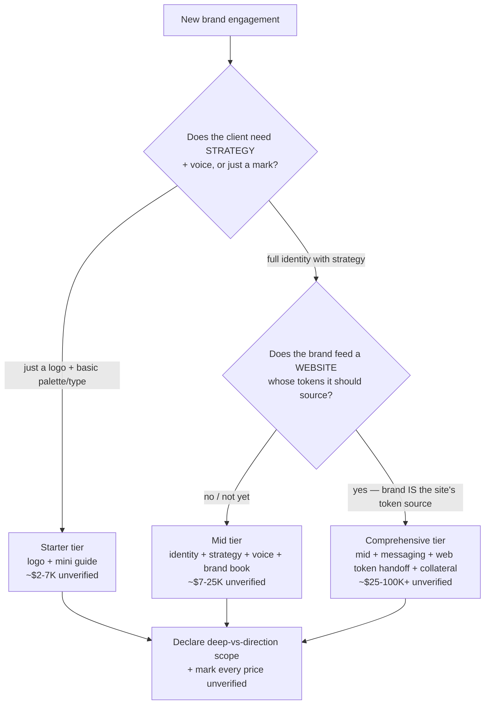
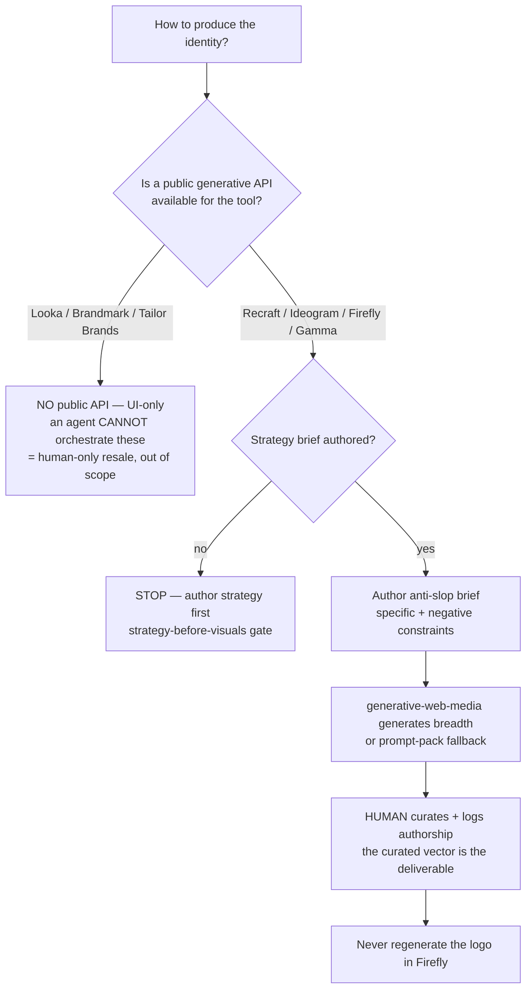
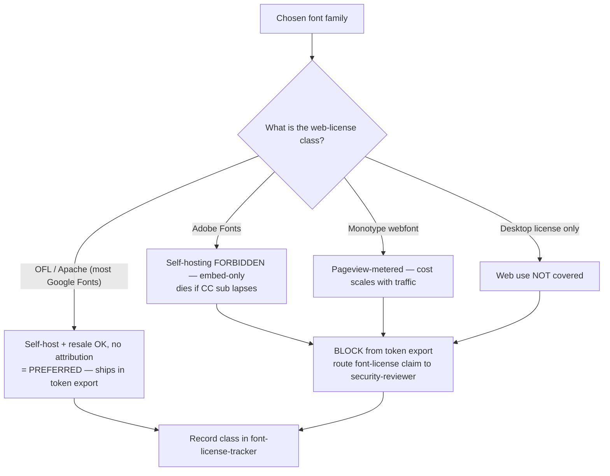
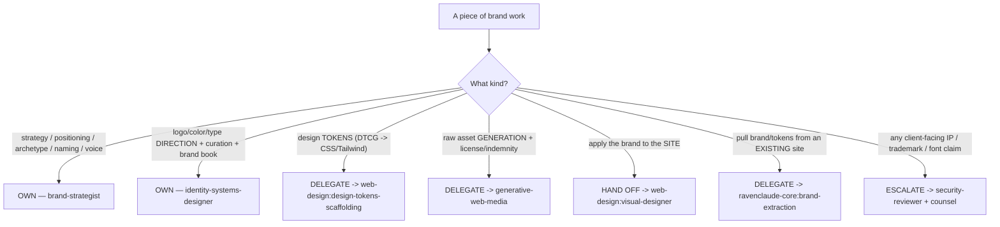

# Brand Identity Studio — Decision Trees

> Reference decision trees for the `brand-identity-studio` team. Agents **traverse the relevant tree
> top-to-bottom before deciding**. Each `## Decision Tree` section is a Mermaid graph plus the rule it encodes.
>
> **Not legal advice; prices `[unverified]`.** Anything touching an IP/registrability/font-license claim routes
> to `ravenclaude-core:security-reviewer`; anything touching a price is `[unverified]`; provider/API facts are
> `[verify-at-use]`.
>
> _Last reviewed: 2026-07-13 by `claude`. Principles are durable; dated specifics live in
> [`brand-identity-anatomy-2026.md`](brand-identity-anatomy-2026.md) and
> [`legal-and-licensing-2026.md`](legal-and-licensing-2026.md)._

---

## Decision Tree: which engagement tier?

**Rule:** the tier is set by whether the client needs the **strategy substrate** and whether the brand **feeds
a site's tokens**. The natural studio bundle is mid/comprehensive, where the brand system IS the source of the
site's design tokens (delegated to `web-design:design-tokens-scaffolding`). All prices `[unverified]` — confirm
on the market pricing page; declare what's deep (logo/color/type/tokens/brand-book/voice) vs direction
(icon/imagery) vs out-of-v1 (motion, extensive stationery).

---

## Decision Tree: agentic pipeline vs human-only toolkit?

**Rule:** the agentic path is Claude-orchestrator-over-Recraft/Ideogram/Firefly/Gamma (all API-callable), NOT a
Looka/Brandmark resale (no public API — UI-only). Strategy gates generation; a human curates; the curated
vector is the deliverable and is never regenerated in Firefly (regen voids the curation). Provider selection +
per-asset indemnity is `generative-web-media`'s call, not this plugin's.

---

## Decision Tree: font web-license class (can it ship self-hosted?)

**Rule:** OFL/Apache self-host is preferred and ships in the token export. A **non-self-hostable** font (Adobe
embed-only, Monotype metered, desktop-only) is **blocked from the export** and its license claim routes to
`security-reviewer`. Every family's class is recorded in the font-license-tracker. Desktop license ≠ web
license.

---

## Decision Tree: where does this work belong (delegate or own)?

**Rule:** this plugin is **thin**. It OWNS strategy + identity-direction + brand book; it DELEGATES tokens
(web-design), generation + indemnity (generative-web-media), and site application (web-design:visual-designer);
it ESCALATES every client-facing IP claim to `security-reviewer`. Owning zero token code kills the
triplicated-token-contract failure mode (RT1). If a piece of work isn't in the OWN branches, delegate or
escalate it — don't re-implement it.
