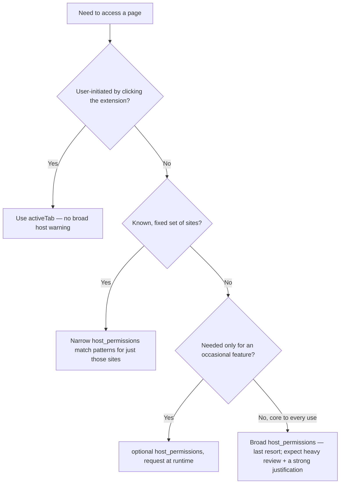

# Manifest V3 architecture (durable reference)

> The MV3 component model and its mechanics. These facts are **durable** (MV3 is a
> published, stable spec); store-policy and per-browser API availability specifics
> are volatile and live in the companion `cross-browser-and-stores.md` with dates.

## The components

| Component | What it is | Lifetime |
|---|---|---|
| **Background service worker** | Event-driven script (`background.service_worker`) — the extension's brain | **Ephemeral** — started on an event, killed when idle |
| **Content scripts** | JS injected into web pages, in an **isolated world** | Per matching page/frame |
| **Popup (`action`)** | The toolbar-button UI | Open only while shown |
| **Options page** | Settings UI | Per visit |
| **`web_accessible_resources`** | Extension files reachable by web pages | Static |

## The service-worker lifecycle trap (the #1 MV3 bug)

MV2 had a **persistent background page**; MV3 replaced it with an **ephemeral
service worker** that can be terminated whenever it's idle and restarted on the
next event. Consequences:

- **No load-bearing global state.** Variables in the SW are lost when it's killed.
  Persist state to `chrome.storage` and rehydrate on each event.
- **Register listeners at the top level.** Listeners added inside an async
  callback won't exist after a restart, so the SW misses the event that would wake
  it. All `chrome.*.addListener(...)` calls go at module top level, synchronously.
- **No long `setTimeout`/`setInterval`.** They don't survive termination. Use
  `chrome.alarms` for anything beyond a few seconds.

```js
// CORRECT — top-level listener; state from storage
chrome.runtime.onMessage.addListener((msg, sender, sendResponse) => {
  chrome.storage.local.get("settings").then(({ settings }) => {
    sendResponse({ ok: true, settings });
  });
  return true; // keep the channel open for the async response
});
```

## Content-script isolation + messaging

Content scripts run in an **isolated world**: they share the page's DOM but **not**
its JS objects, and they can't share JS objects with the background either.
Communicate via message passing:

- **One-shot:** `chrome.runtime.sendMessage` / `chrome.tabs.sendMessage` (+ the
  `return true` rule for async responses).
- **Long-lived / streaming:** `chrome.runtime.connect` ports.
- **To reach the page's own JS:** inject into the page's main world deliberately
  (`scripting.executeScript` with `world: "MAIN"`), aware of the security cost.

## Permissions model

- **`permissions`** — API permissions (`storage`, `scripting`, `alarms`,
  `tabs`, …).
- **`host_permissions`** — which origins the extension can access.
- **`activeTab`** — grants access to the *current* tab on user action, with **no**
  broad-host warning. The best choice for user-initiated extensions.
- **`optional_permissions` / optional `host_permissions`** — requested at runtime
  via `permissions.request()`, so the install-time ask stays minimal.

### Permissions-minimization decision tree



## Storage

- `chrome.storage.local` — larger, device-local.
- `chrome.storage.sync` — synced across the user's signed-in browsers, small quota.
- `chrome.storage.session` — in-memory, cleared on browser close (good for
  secrets you don't want persisted).
- All are async; the SW reads from storage on each event (since it has no
  persistent memory).

## No remotely-hosted code

MV3 **forbids executing remotely-hosted code**. All executable JS ships in the
package. You may *fetch data/config*; you may **not** fetch and run code (`eval`
of a remote payload, injecting a remote `<script>`, importing a remote module).
This is both a platform rule and a common store-rejection cause.

## `web_accessible_resources` as an attack surface

Anything listed is reachable by web pages, so:

- Expose only the specific files needed.
- Scope `matches` to the origins that actually need them — never `<all_urls>`/`*`.

## How it composes

```
manifest.json
  ├── action → popup (UI)
  ├── options_page (settings)
  ├── background.service_worker (event-driven brain; state in chrome.storage)
  ├── content_scripts[] (isolated world; message-pass to background)
  ├── permissions / host_permissions / optional_permissions (least privilege)
  └── web_accessible_resources (scoped, minimal)
```
