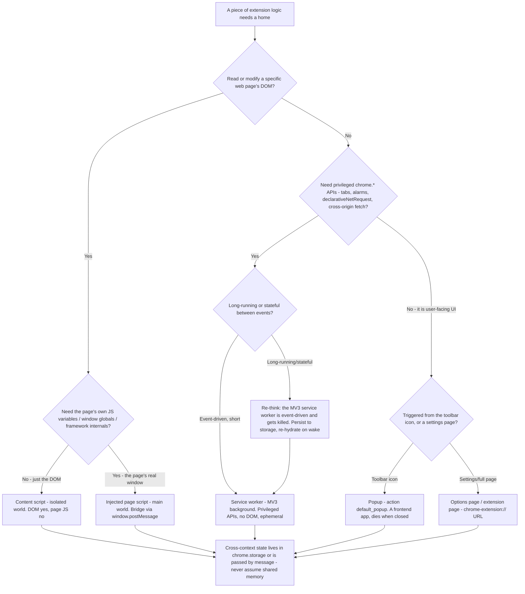

# Where should this logic live? (durable reference)

> The MV3 context-placement decision. An extension is a multi-context distributed
> system: each piece of logic has up to **four** distinct execution contexts to
> live in, each with different DOM access, lifetime, and privilege. Putting code
> in the wrong context is the most common MV3 design mistake — paid in
> store-review rejections and security surface, not just refactors. These
> mechanics are **durable**; the companion
> [`manifest-v3-architecture.md`](manifest-v3-architecture.md) carries the
> component/lifecycle/permissions detail and
> [`cross-browser-and-stores.md`](cross-browser-and-stores.md) the volatile
> store/API specifics.

The durable rule: **the least-privileged context that can do the job — and keep
the privileged background ephemeral.** Traverse the tree top-to-bottom *before*
placing logic; this is the proactive complement to the Capability Grounding
Protocol.

## Decision tree

## The four contexts

- **Content script (isolated world)** runs in the page but in an **isolated
  JavaScript world** — it sees and mutates the page's **DOM**, but **not** the
  page's own JS variables, functions, or framework internals (and the page can't
  see the content script's). That isolation is a feature: it keeps your script
  from colliding with the page's globals and limits the blast radius if the page
  is hostile. Declare via `content_scripts` in the manifest, or inject on demand
  with `chrome.scripting.executeScript` (preferred for least-privilege — see the
  permissions tree in [`manifest-v3-architecture.md`](manifest-v3-architecture.md)).
  It has no access to most privileged `chrome.*` APIs beyond messaging and a small
  allow-listed subset `[verify-at-use]`.
- **Injected page script (main world)** is the escape hatch for when you
  genuinely need the page's *real* `window` — its variables, a framework's
  internals, a global the page set. You inject into the page's **main world** (via
  `chrome.scripting.executeScript` with `world: "MAIN"` `[verify-at-use]`, or by
  appending a script element from the content script). It has **no** extension
  privileges and **no** isolation — treat it as untrusted, and bridge it to your
  content script via `window.postMessage` with strict `origin` / `source` / shape
  checks. Use it only when the isolated content script cannot do the job; it is
  the highest-collision, lowest-trust context. (See
  [`message-pass-across-the-isolation-boundary.md`](../best-practices/message-pass-across-the-isolation-boundary.md).)
- **Service worker (MV3 background)** holds the privileged logic (`tabs`,
  `alarms`, `declarativeNetRequest`, cross-origin `fetch`), has **no DOM**, and is
  **event-driven and ephemeral** — the browser terminates it when idle and
  restarts it on the next event. So: no in-memory state you can't lose, register
  all event listeners at the **top level** (synchronously, on every load — not
  inside an async callback, or the wake-up event is missed), and persist anything
  durable to `chrome.storage`. (See the service-worker lifecycle trap in
  [`manifest-v3-architecture.md`](manifest-v3-architecture.md) and
  [`treat-the-background-as-ephemeral.md`](../best-practices/treat-the-background-as-ephemeral.md).)
- **Popup** (the toolbar `action` `default_popup`) and **options / extension
  pages** are ordinary web pages served from `chrome-extension://` — this is where
  a **React/Svelte/Vue UI lives, and `frontend-engineering` owns it** (component
  craft, state, bundle, a11y). The popup's document is **destroyed every time it
  closes**, so it holds no durable state either — read from storage on open, write
  on change.

> **Seam:** the popup/options **UI** is a frontend app → `frontend-engineering`
> (see [`../CLAUDE.md`](../CLAUDE.md) §1 and the routing rules in §3). This plugin
> owns only the MV3-distinctive layer — context placement, service-worker
> lifetime, messaging, permissions, store review — not the in-popup component/
> state/perf work.

_Name the trade: the isolated content script is collision-safe but can't touch
page JS; the main-world injected script can touch everything and is
collision-prone and untrusted; the service worker is privileged but ephemeral;
the popup is a real UI but transient. Pick the **least-privileged context that
works**, and never assume two contexts share memory._
