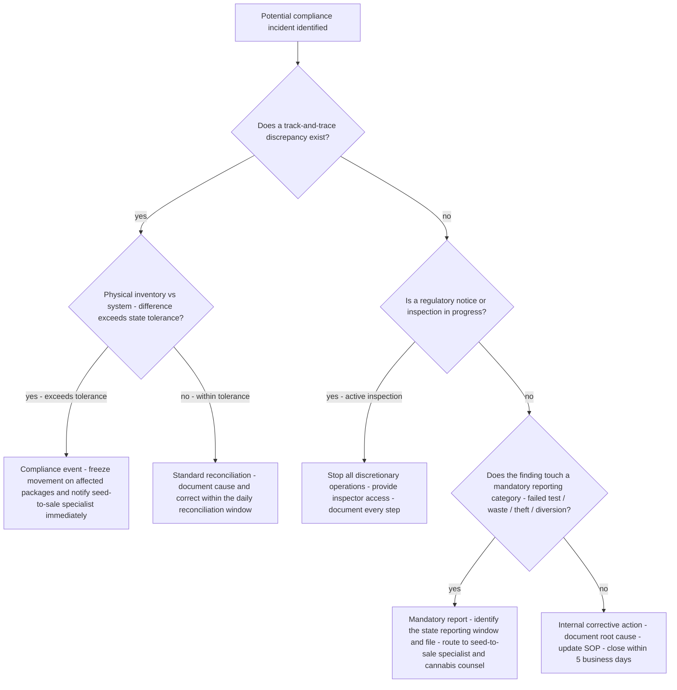
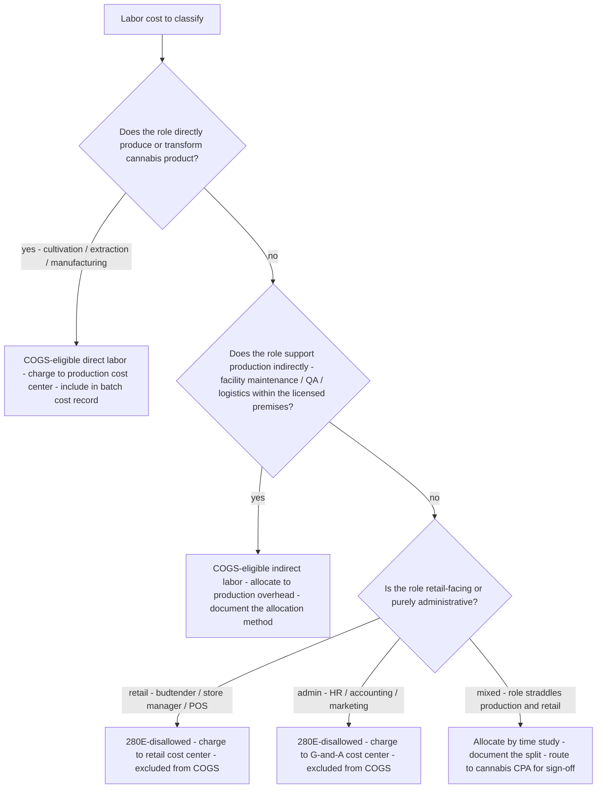
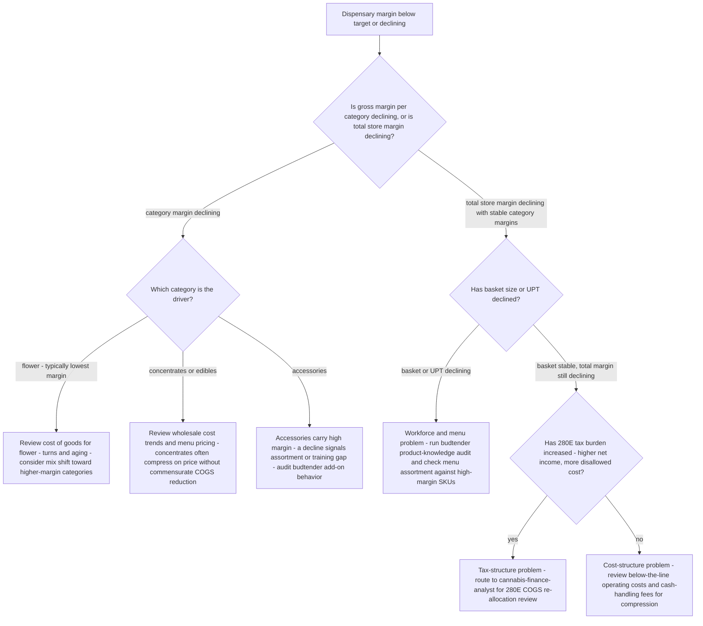

# Cannabis operations decision trees

Which analysis for which symptom — traverse top-to-bottom before picking a method.

## Decision Tree: Licensed but losing money

1) Frame 280E COGS allocation (§3 #2). 2) Read category margin/basket (§3 #4). 3) Read inventory turns (§3 #5). 4) Check traceability cost/risk (§3 #1).

## Decision Tree: Track-and-trace doesn't reconcile

1) Pull physical vs system (§3 #1). 2) Locate the discrepancy. 3) Apply the state's corrective steps (§3 #3).

## Decision Tree: Is a rule X true here?

1) Pin the state and date (§3 #3). 2) Map the requirement. 3) Cite the regulator source (§3 #8).

## How to read these trees

Traverse top-to-bottom and stop at the first matching branch — the order encodes the cheap-checks-before-expensive-checks discipline (§3). Each leaf names a skill, a specialist, or a house-opinion to apply. Never skip a higher branch because a lower one looks more interesting; a denominator, seasonal, or definitional artifact masquerades as a finding more often than not.

## Decision Tree: Which skill for which task

- **Reconcile seed-to-sale** → use when: Reconcile physical inventory to the state track-and-trace system and resolve discrepancies as compliance events, not bookkeeping. ([`../skills/reconcile-seed-to-sale/SKILL.md`](../skills/reconcile-seed-to-sale/SKILL.md))
- **Frame 280E COGS allocation** → use when: Build a defensible COGS-allocation framework under 280E, as decision-support for the CPA, so only properly-capitalized cost reduces taxable income. ([`../skills/frame-280e-cogs/SKILL.md`](../skills/frame-280e-cogs/SKILL.md))
- **Run dispensary retail on margin** → use when: Read category margin, basket, and turns and lift store profit without discount-driven traffic. ([`../skills/run-dispensary-retail/SKILL.md`](../skills/run-dispensary-retail/SKILL.md))
- **Manage the state patchwork** → use when: Anchor every compliance answer to the specific state and date, since track-and-trace, testing, potency, and tax all vary. ([`../skills/manage-the-state-patchwork/SKILL.md`](../skills/manage-the-state-patchwork/SKILL.md))
- **Read inventory turns** → use when: Read inventory turns as both a cash and a compliance metric, flagging aged and perishable product. ([`../skills/read-inventory-turns/SKILL.md`](../skills/read-inventory-turns/SKILL.md))

## Decision Tree: Which specialist owns this

- **The engagement** → [`cannabis-engagement-lead`](../agents/cannabis-engagement-lead.md)
- **Traceability** → [`seed-to-sale-compliance-specialist`](../agents/seed-to-sale-compliance-specialist.md)
- **The store** → [`dispensary-retail-operations-specialist`](../agents/dispensary-retail-operations-specialist.md)
- **The numbers** → [`cannabis-finance-analyst`](../agents/cannabis-finance-analyst.md)

When two leaves apply, route to the **lead** first to scope and sequence — overlapping symptoms usually mean two drivers at once, and the lead keeps the analysis from collapsing into a single-cause story.

## Decision Tree: Which house-opinion gates the call

Before picking any method, check whether one of the standing biases (§3) already decides the framing:

1. Seed-to-sale traceability is the license — reconcile it daily — if this is in question, apply §3 #1 before any method.
2. 280E makes COGS allocation existential, not academic — if this is in question, apply §3 #2 before any method.
3. The rules change at the state line — never generalize a state — if this is in question, apply §3 #3 before any method.
4. Dispensary retail runs on margin and basket, not just traffic — if this is in question, apply §3 #4 before any method.
5. Inventory turns are a compliance AND a cash metric — if this is in question, apply §3 #5 before any method.
6. Testing and remediation are a yield-and-cost reality — if this is in question, apply §3 #6 before any method.
7. Cash and banking constraints shape operations — if this is in question, apply §3 #7 before any method.
8. Cite the source and date for every market and rule — if this is in question, apply §3 #8 before any method.

## Escalation & guardrails

- Anything touching client PII / regulated records → stop and route to `ravenclaude-core` `security-reviewer`.
- Any external figure entering a deliverable → carry a source URL + retrieval date, or mark it `[unverified — training knowledge]` / `[ESTIMATE]` (§3, final house opinion).
- A recommendation ships only with an owner, a date, and an expected metric movement.
## Sourcing note

Figures in this file are from the author's domain knowledge and are marked `[unverified — training knowledge]` or `[ESTIMATE]` at point of use. Validate against a primary source before putting any figure in a client deliverable (§3 cite-or-mark rule).

## Decision Tree: Compliance Incident — How to Classify and Respond

**When this applies:** A reported discrepancy, regulatory notice, failed audit, or internal finding surfaces that may be a compliance incident. The operator needs to decide how urgent the response is, who owns it, and whether self-reporting is required — before taking any corrective action.

**Last verified:** 2026-06-05 against state cannabis enforcement frameworks and standard compliance incident response practice.

**Rationale per leaf:**
- *Compliance event - freeze* — a discrepancy exceeding state tolerance is a license risk; freezing movement prevents compounding the gap before it is investigated.
- *Standard reconciliation* — minor daily variances are expected; document and correct without escalating unless the cause is unexplained.
- *Active inspection* — once a regulator is on premises, operational continuity is secondary to cooperation; every undocumented step becomes a separate finding.
- *Mandatory report* — most states require reporting within a narrow window (24-72 hours); missing it converts a correctable event into an additional violation.
- *Internal corrective action* — findings that do not meet mandatory-reporting criteria still require documented root cause and SOP update to prevent recurrence.

**Tradeoffs summary:**

| Method | Cost / time | Blast radius | Approval gate? | Use when |
|---|---|---|---|---|
| Freeze + specialist | Hours of disruption | Batch or package level | Compliance officer | Discrepancy exceeds state tolerance |
| Standard reconciliation | Minutes - daily | Single package entry | Supervisor | Within-tolerance daily variance |
| Inspector cooperation | Full stop while inspector present | Entire facility | Legal counsel ASAP | Active inspection in progress |
| Mandatory report | Same-day action | Disclosed to regulator | Cannabis counsel | Failed test / theft / diversion / over-tolerance |
| Internal corrective action | 1-5 days | Internal record | Manager sign-off | No mandatory-reporting trigger |

## Decision Tree: Labor Cost — COGS-Eligible vs 280E-Disallowed

**When this applies:** The finance analyst or engagement lead is building or reviewing the COGS allocation and needs to classify a specific role or labor cost as COGS-eligible (production, §471) or disallowed (retail/admin, §280E). The request may be triggered by a tax filing, an audit, or a new hire classification question.

**Last verified:** 2026-06-05 against 280E COGS allocation practice and IRS §471 inventory capitalization standards.

**Rationale per leaf:**
- *COGS-eligible direct labor* — direct production labor is the clearest §471 inclusion and the most defensible COGS bucket under audit.
- *COGS-eligible indirect labor* — production-support roles qualify under §471 overhead capitalization but require a documented allocation method to survive scrutiny.
- *280E-disallowed retail* — retail labor is the paradigm case of §280E disallowance; any ambiguity here triggers audit risk.
- *280E-disallowed admin* — G&A is fully disallowed; attempting to push it into production overhead is the most common aggressive-allocation mistake.
- *Mixed - time study* — dual-role employees require a contemporaneous time study; estimates made at year-end are not defensible.

**Tradeoffs summary:**

| Method | Cost / time | Blast radius | Approval gate? | Use when |
|---|---|---|---|---|
| Direct labor to production | Minimal - role is clear | Single cost center | Finance sign-off | Cultivation / extraction / manufacturing roles |
| Indirect overhead allocation | Moderate - requires allocation method | All production batches in the period | Finance + CPA review | Support roles within licensed production facility |
| Retail / admin disallowance | Minimal - role is clear | Single cost center | Finance sign-off | Budtenders, store staff, marketing, HR |
| Time-study split | Significant - requires tracking | Individual employee record | Cannabis CPA sign-off | Genuinely dual-role employees |

## Decision Tree: Dispensary Margin Problem — Diagnose Before Discounting

**When this applies:** A dispensary operator reports that store margins are declining, below target, or below a competitor benchmark. The engagement lead needs to identify the driver before recommending action, because the symptom of "low margin" has five distinct causes requiring different responses.

**Last verified:** 2026-06-05 against dispensary retail operations practice and cannabis unit-economics frameworks.

**Rationale per leaf:**
- *Flower COGS and turns* — flower is the volume driver but lowest-margin category; aging inventory erodes both margin and compliance posture.
- *Concentrates/edibles pricing* — these categories absorb wholesale price compression poorly; regular pricing reviews prevent margin drift.
- *Accessories assortment gap* — accessories are the highest-UPT add-on; a decline is almost always a training or assortment problem, not a demand problem.
- *Workforce and menu* — basket decline is a human and menu problem, not a pricing problem; discounting will not fix it.
- *280E re-allocation* — an increased 280E burden on a growing operation is addressable only through better COGS allocation, not through operational changes.
- *Operating cost review* — cash-handling fees, armored-transport costs, and payment-processing fees compress margin in ways that are invisible above the EBITDA line.

**Tradeoffs summary:**

| Method | Cost / time | Blast radius | Approval gate? | Use when |
|---|---|---|---|---|
| Category-level COGS review | Hours - financial analysis | Single category | Finance review | Category gross margin declining |
| Budtender training audit | Days - floor observation | Store floor team | Operations manager | Basket or UPT declining |
| 280E COGS re-allocation | Weeks - CPA-assisted | Tax filing and all periods open to audit | Cannabis CPA sign-off | Total margin declining with stable category margins and rising net income |
| Operating cost review | Hours - financial analysis | P-and-L below gross margin | Finance review | Total margin declining with stable category margins and flat/declining net income |
