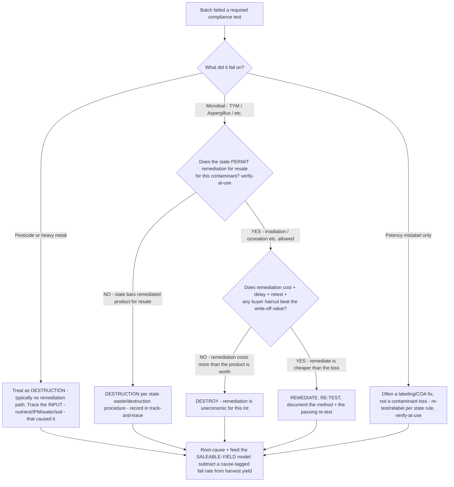

# Cannabis cultivation/manufacturing decision tree — failed compliance test: remediate vs. destroy (and saleable-yield economics)

**Last reviewed:** 2026-06-05 · **Confidence:** medium (state-regulator + peer-reviewed contamination literature + industry cost-framing, web-verified this date). Required panels, **action levels**, and whether remediation is *permitted for resale* are **state-specific and volatile**; specific fail-rate percentages are operator-dependent and not reliably published. All carry inline `[verify-at-use]` / `[ESTIMATE]` markers and must be validated against the operator's own lab data and specific state regulator before any deliverable (CLAUDE.md §3 #3, #6, #8).

> Canonical decision tree for the [`seed-to-sale-compliance-specialist`](../agents/seed-to-sale-compliance-specialist.md) (the test, the remediation rules) with a finance assist from [`cannabis-finance-analyst`](../agents/cannabis-finance-analyst.md) (the yield/COGS hit). Traverse top-to-bottom when a batch fails — or **before** harvest, to put a realistic fail rate into the economics. The load-bearing fact: **harvest yield is not saleable yield**, and the **remediation path depends on the failure cause** — many microbial failures are remediable, most pesticide/heavy-metal failures are not. This is decision-support, not a lab/agronomy/legal opinion (CLAUDE.md §2).

---

## When this applies

A batch fails (or you are modeling the chance it will fail) the state's required pre-sale contaminant panel — microbials (total yeast & mold, Aspergillus species, Salmonella, STEC), pesticides, heavy metals, residual solvents, or mycotoxins. Common triggers: a failed Certificate of Analysis, a wholesale-order shortfall, or a cultivation-economics review.

## The tree



## Rationale per leaf

- **Microbial fail (often the recoverable one)** — total yeast & mold / Aspergillus failures are frequently **remediable** (irradiation, ozonation, or other state-permitted methods) *where the state allows remediated product to be sold*. Predominant contaminants (Penicillium, Aspergillus, Cladosporium) are **environment- and post-harvest-handling driven** — so the durable fix is contamination control at the source (drying/curing humidity, airflow, sanitation), not relying on remediation as a routine backstop.
- **Pesticide / heavy-metal fail (usually the total loss)** — typically **no remediation path**; treat as **destruction** and trace the **input** that caused it (nutrient line, IPM product, water, soil/medium). A pesticide fail is an input-control problem, not a handling problem.
- **Potency mislabel only** — frequently a **labeling/COA** correction (re-test and relabel per state rule), not a contamination write-off — don't model it as a yield loss.
- **Remediation economic test** — even when remediation is *permitted*, it's only worth it when **remediation cost + delay + re-test + any buyer price haircut < write-off value**. A low-value lot can be cheaper to destroy than to remediate.
- **Every path → saleable-yield model** — the point of the tree is upstream too: a cause-tagged fail rate must be **subtracted from harvest yield** so projections use *saleable* yield, not gross.

## The load-bearing arithmetic

```
saleable yield   = harvest yield x (1 - cause-tagged fail rate)            [ESTIMATE the rate from YOUR batches]
remediate when   = remediation cost + delay + retest + buyer haircut  <  write-off (lost saleable value)
remediation is   = a microbial option only WHERE the state permits resale of remediated product  [verify-at-use]
pesticide/metal  = destruction default (no remediation); fix the INPUT, not the handling
```

## Gotchas

- **Action levels and required panels are state-specific** — e.g. California fails on **any detection** of the named Aspergillus species, Salmonella, or STEC [verify-at-use]; another state may use a quantitative TYM threshold. Never carry one state's thresholds to another (CLAUDE.md §3 #3).
- **"Remediable" ≠ "saleable in your state"** — some states **bar** remediated product from resale even when the technique works. Confirm *permissibility for resale*, not just technical feasibility. `[verify-at-use]`.
- **Use the operator's OWN fail rate** — industry-wide fail-rate percentages are not reliably published and vary by genetics, environment, and state; an assumed number is an `[ESTIMATE]` until enough of the operator's batches accrue.
- **Destruction is a track-and-trace event** — destroyed/remediated product must be recorded per the state's waste/destruction procedure and reconciled in the system (cross-links the [`cannabis-track-and-trace-discrepancy-decision-tree.md`](cannabis-track-and-trace-discrepancy-decision-tree.md)). `[verify-at-use]`.
- **The COGS treatment of a write-off** is a finance question under 280E/471 — route to [`cannabis-finance-analyst`](../agents/cannabis-finance-analyst.md) / [`frame-280e-cogs`](../skills/frame-280e-cogs/SKILL.md).

## Escalation & guardrails

- Clinical/agronomic appropriateness of a remediation method, or a contamination-source investigation → [`seed-to-sale-compliance-specialist`](../agents/seed-to-sale-compliance-specialist.md) (decision-support, not a lab/agronomy order — CLAUDE.md §2).
- Yield economics, write-off COGS, and the saleable-yield model → [`cannabis-finance-analyst`](../agents/cannabis-finance-analyst.md).
- Regulated-record, destruction-reporting, or diversion questions → `ravenclaude-core` `security-reviewer`.
- Every figure entering a deliverable carries a source URL + retrieval date or an `[unverified — training knowledge]` / `[ESTIMATE]` / `[verify-at-use]` mark (CLAUDE.md §3 #8).

## Sources (retrieved 2026-06-05)

- Colorado Dept. of Public Health & Environment — marijuana microbial pathogen & TYM reference: https://cdphe.colorado.gov/laboratory-home/certification-of-cannabis-testing-facilities/cannabis-reference-library/marijuana
- Medicinal Genomics — Cannabis Microbial Testing Regulations by State (panels, action levels, CA any-detection rule): https://medicinalgenomics.com/resource/cannabis-microbial-testing-regulations-by-state/
- Frontiers in Microbiology — Total yeast & mold in high-THC cannabis: genotype, environment, and pre/post-harvest handling drivers: https://www.frontiersin.org/journals/microbiology/articles/10.3389/fmicb.2023.1192035/full
- Cannabis Workforce Initiative — Total Yeast and Mold Count (TYMC) primer: https://cannabisworkforce.org/total-yeast-and-mold-count-tymc/
