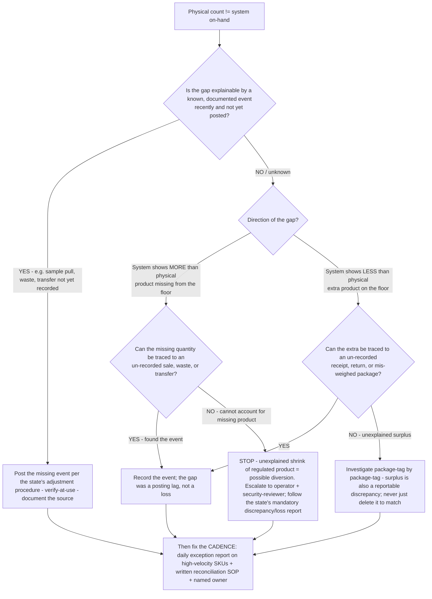

# Cannabis compliance decision tree — track-and-trace (Metrc/BioTrack) physical-vs-system discrepancy

**Last reviewed:** 2026-06-05 · **Confidence:** medium (state-regulator + track-and-trace-vendor framing, web-verified this date). Discrepancy-reporting windows, adjustment procedures, and the system-of-record itself are **state-specific and volatile** — they carry inline `[verify-at-use]` markers and must be validated against the operator's specific state regulator and track-and-trace system before any deliverable (CLAUDE.md §3 #3, #8).

> Canonical decision tree for the [`seed-to-sale-compliance-specialist`](../agents/seed-to-sale-compliance-specialist.md), with a finance assist from [`cannabis-finance-analyst`](../agents/cannabis-finance-analyst.md) on the cash/COGS side of a write-off. Traverse top-to-bottom the moment a physical count disagrees with the state system. The discipline is **a discrepancy is a compliance event until proven a recording error** — not the reverse (CLAUDE.md §3 #1). This is decision-support for the licensed operator; it is **not** legal advice and the plugin is not a track-and-trace platform (CLAUDE.md §2). Anything that looks like actual **diversion** stops here and routes to `ravenclaude-core` `security-reviewer`.

---

## When this applies

A physical inventory (vault count, cycle count, or spot check) does not match the on-hand quantity in the state track-and-trace system (Metrc, BioTrack, LeafData, or a state-built system — `[verify-at-use]` which one governs this license). Common triggers: monthly/daily reconciliation, a pre-audit prep, an M&A diligence count, or an integration that silently stopped syncing.

## The tree



## Rationale per leaf

- **Explainable-and-unposted (the common, benign case)** — most "discrepancies" are a **posting lag**: a sample pull, waste destruction, or transfer that physically happened but wasn't yet entered. Post it via the **state's adjustment procedure** with the source documented. This is a recording fix, not a loss — but it only stays benign if it's caught fast (hence the cadence leaf).
- **System > physical, traceable** — found the un-recorded sale/waste/transfer: record it; it was a lag. **System > physical, untraceable** — unexplained shrink of regulated product is the diversion-shaped case. **Stop, escalate to the operator and `ravenclaude-core` `security-reviewer`, and follow the state's mandatory discrepancy/loss report** — do not quietly adjust the system to match (CLAUDE.md §2).
- **Physical > system** — a *surplus* is **also** a reportable discrepancy, not a freebie. Never delete inventory in-system to force a match; trace the un-recorded receipt/return/mis-weigh and correct per procedure.
- **Cadence (every path ends here)** — the root cause of a *compounded* break is almost always **monthly reconciliation + blind trust in the POS↔track-and-trace integration**. Daily exception reporting on high-velocity SKUs, a written SOP, and a named owner keep the next drift small enough to explain.

## The load-bearing discipline

```
A discrepancy is a COMPLIANCE EVENT until proven a recording error — never the reverse.
Direction matters: shortage  -> possible diversion (escalate, report)
                  surplus   -> still reportable (trace, don't delete)
Cadence is the fix: reconcile DAILY on high-velocity SKUs; the integration is NOT self-verifying.
```

## Gotchas

- **The system of record is state-specific.** Metrc operates in ~30 regulated markets [verify-at-use]; some states run BioTrack, a state-built system (e.g. Washington), or require track-and-trace without a single named vendor (e.g. Arizona, Vermont) [verify-at-use]. New York and Illinois both moved toward Metrc in 2025 — confirm which system governs *this* license before quoting any procedure.
- **The discrepancy-reporting window and adjustment procedure vary by state** — never apply one state's window or steps to another (CLAUDE.md §3 #3). `[verify-at-use]`.
- **Don't "fix" a surplus by deleting inventory** — that converts a recordkeeping discrepancy into a falsification problem.
- **The POS↔track-and-trace integration is not self-verifying** — a silent integration failure looks exactly like slow drift. Run an exception report, don't assume the sync.

## Escalation & guardrails

- Unexplained shrink / suspected diversion / PII / regulated records → **stop and route to `ravenclaude-core` `security-reviewer`** (CLAUDE.md §2).
- The cash / COGS / write-off consequence of a confirmed loss → [`cannabis-finance-analyst`](../agents/cannabis-finance-analyst.md) (and the 280E COGS treatment, [`frame-280e-cogs`](../skills/frame-280e-cogs/SKILL.md)).
- The reconciliation SOP and cadence → [`reconcile-seed-to-sale`](../skills/reconcile-seed-to-sale/SKILL.md).
- Every figure or procedural claim entering a deliverable carries a source URL + retrieval date or an `[unverified — training knowledge]` / `[verify-at-use]` mark (CLAUDE.md §3 #8).

## Sources (retrieved 2026-06-05)

- Metrc — Metrc/BioTrack strategic partnership (footprint, ~30 regulated markets): https://www.metrc.com/news/metrc-and-biotrack-announce-strategic-partnership/
- CRB Monitor — Metrc and BioTrack Form Partnership (state coverage, BT Government structure): https://news.crbmonitor.com/2025/09/metrc-and-biotrack-form-partnership/
- Flowhub — Metrc vs. BioTrack (which states use which system): https://www.flowhub.com/learn/metrc-vs-biotrack
- Distru — New York's cannabis compliance framework / Metrc integration: https://www.distru.com/cannabis-blog/new-yorks-cannabis-compliance-framework-guide-to-metrc-integration
