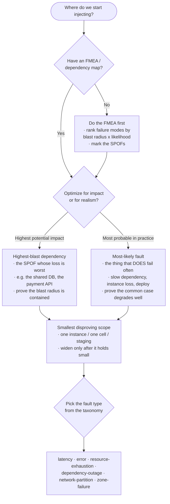
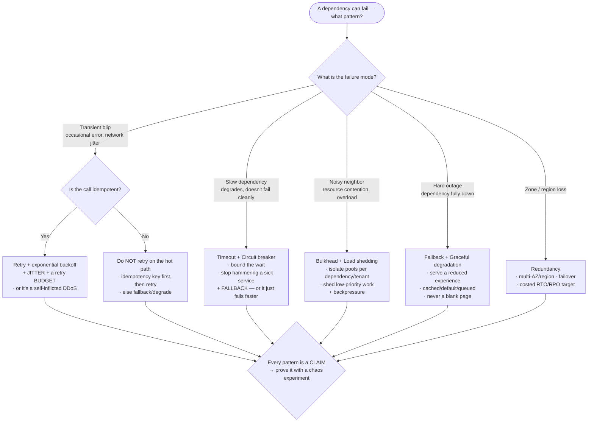

# Knowledge — Chaos-engineering & resilience decision tree

> **Last reviewed:** 2026-07-13 · **Confidence:** High on the durable framing (the maturity gate, hypothesis-driven experiments, the smallest blast radius, the pattern-for-a-failure-mode mapping, and the principles of chaos); **Medium on the dated tooling snapshot — fault-injection product names, features, and managed-chaos-service capabilities are volatile and carry retrieval dates in the patterns doc — re-verify before a production commitment.**
> The recurring questions this team answers are "are we even ready to run chaos?", "which failure do we inject first?", "which resilience pattern for this failure mode?", and "did the pattern actually hold?". These are the decision trees the two agents traverse **before** answering, plus the trade-off tables and the seams to adjacent plugins.

The team's discipline: **the maturity gate runs first** — no fault injection until steady-state observability exists, SLOs are defined, and on-call is ready. Then design the pattern from the failure mode, prove it with the smallest disproving experiment, and never inject without an abort condition. The metrics/SLO/on-call platform, the deploy pipeline, load generation, and real incidents **leave this layer** for `observability-sre`, `devops-cicd`, `performance-engineering`, and `incident-response-dfir`.

---

## Decision Tree A: the maturity gate — should you run chaos AT ALL?

Traverse top-to-bottom. **Nothing gets injected until the gate clears.**

```mermaid
graph TD
  Start([Someone wants to run chaos]) --> OBS{Steady-state observability?<br/>Can you measure "healthy"<br/>in real time?}

  OBS -->|No| NOTREADY1[NOT YET — build observability first<br/>· metrics/traces/dashboards<br/>· without it, chaos = breaking prod blind<br/>· route to observability-sre]
  OBS -->|Yes| SLO{Steady-state metrics / SLOs<br/>defined and agreed?}

  SLO -->|No| NOTREADY2[NOT YET — define steady state + SLOs<br/>· what number says "the system is healthy"?<br/>· route to observability-sre]
  SLO -->|Yes| ONCALL{On-call ready?<br/>Can someone respond +<br/>can you auto-abort?}

  ONCALL -->|No| NOTREADY3[NOT YET — stand up on-call<br/>+ automatic abort/rollback first]
  ONCALL -->|Yes| RESIL{Resilience patterns<br/>actually designed in?}

  RESIL -->|No| DESIGN[Design FIRST, then prove<br/>· resilience is designed in, not tested in<br/>· route to resilience-architect<br/>· chaos now would just find a known outage]
  RESIL -->|Yes| GO[GO — run the smallest<br/>hypothesis-driven experiment<br/>staging → cell → region]
```

**The rule that catches most mistakes:** immature observability = you are just breaking prod. If you cannot define and watch steady state, a chaos experiment is indistinguishable from an outage.

---

## Decision Tree B: which failure do you inject FIRST?



> Start where the FMEA points — the intersection of **high blast radius** and **high likelihood** is the first experiment. Then always the **smallest scope that can still disprove the hypothesis**.

---

## Decision Tree C: which resilience pattern for this failure mode?



> Layer the patterns — a slow dependency usually needs **timeout + circuit breaker + fallback + bulkhead** together. And defend each pattern's **own** failure mode: retry→backoff+jitter+budget; breaker→fallback; timeout→a real value; bulkhead→sized pools.

---

## Trade-off table — resilience patterns

| Pattern | Defends against | Its OWN failure mode (must defend) |
|---|---|---|
| **Timeout** | A slow/hung dependency holding a thread forever | An unset timeout is infinite; too-tight kills healthy slow calls — tune it |
| **Retry + backoff + jitter + budget** | A transient, idempotent blip | Naked/unbounded retry = a self-inflicted DDoS; never retry non-idempotent or slow deps |
| **Circuit breaker** | Hammering a sick dependency, cascading failure | No fallback = it just fails faster; bad thresholds flap open/closed |
| **Bulkhead** | One dependency's resource exhaustion starving everything | Under-sized pools throttle healthy traffic; over-sized defeats isolation |
| **Load shedding / rate limiting** | Overload collapse; noisy neighbors | Shedding the wrong (high-value) work; no prioritization |
| **Graceful degradation / fallback** | A hard dependency outage | A stale/wrong fallback that misleads; fallback path itself untested |
| **Idempotency** | Duplicate effects from retries/redelivery | Weak keys; non-idempotent side effects slipping through |
| **Backpressure** | Unbounded queues, memory blowout under load | No shed path when the buffer fills; silently dropping work |
| **Redundancy (multi-AZ/region, failover)** | Zone/region loss | "HA" with no tested RTO/RPO; failover never rehearsed (→ game day) |

## Trade-off table — where to inject first

| Optimize for | Pick | Watch out for |
|---|---|---|
| **Worst-case impact** | Highest-blast SPOF (shared DB, payment API, auth) | Bigger blast radius if it goes wrong — start in staging, tiny scope |
| **Realism / frequency** | The most-likely fault (slow dep, instance loss, bad deploy) | Feels mundane, but it's what actually pages you — high ROI |
| **Confidence to widen** | Whatever just held small | Don't region-first; earn scope with each held round |

---

## The principles of chaos (the guardrails behind every experiment)

1. **Build a hypothesis around steady-state behavior** — define the measurable "healthy," then hypothesize it survives the fault.
2. **Vary real-world events** — inject faults that actually happen (dependency slowness, instance loss, network partition), not contrived ones.
3. **Run experiments in production — carefully** — prod is where the real behavior lives, but only after it holds in staging, with the smallest scope and an abort button.
4. **Minimize the blast radius** — the smallest experiment that can disprove the hypothesis; contain it, widen only when it holds.
5. **Automate experiments to run continuously** — a one-time experiment proves a point-in-time; automation catches regressions as the system evolves. (Automate only after manual runs are safe.)

---

## Seams (this team designs + proves resilience; it does not own the platform)

- **The metrics / tracing / SLO / alerting / on-call platform** (the steady-state signals every experiment reads — a **hard prerequisite**) → `observability-sre`. This team consumes those signals; it does not build them.
- **The deploy / release pipeline, progressive delivery (canary/blue-green), automated-rollback wiring** → `devops-cicd`. This team's abort relies on rollback; that machinery is theirs.
- **Load generation, throughput/capacity modeling, performance profiling** → `performance-engineering`. Chaos runs *under* their load.
- **A real, customer-impacting incident an experiment surfaces or triggers** → `incident-response-dfir`. Stop the experiment; run the incident.
- **Verifying volatile tooling facts** (fault-injection product features, managed chaos-service capabilities) → `ravenclaude-core/deep-researcher`.

---

## Provenance

- The maturity gate, hypothesis-driven experiment loop, the smallest-blast-radius principle, and the principles of chaos are consensus practice in the chaos-engineering literature (Principles of Chaos Engineering; the Netflix/Basiri et al. framing; the resilience-pattern canon from Nygard's *Release It!* and the Hystrix/resilience4j lineage), reviewed 2026-07-13 — **High confidence** on the durable framing.
- The pattern-for-a-failure-mode mapping (timeout/retry/breaker/bulkhead/fallback) is durable engineering consensus; specific library defaults and semantics vary — re-verify against the current library docs before committing.
- Fault-injection tooling and managed-chaos-service specifics are a 2026-07 snapshot in the patterns doc; **features and availability change — re-verify with `ravenclaude-core/deep-researcher` before a production commitment.**
