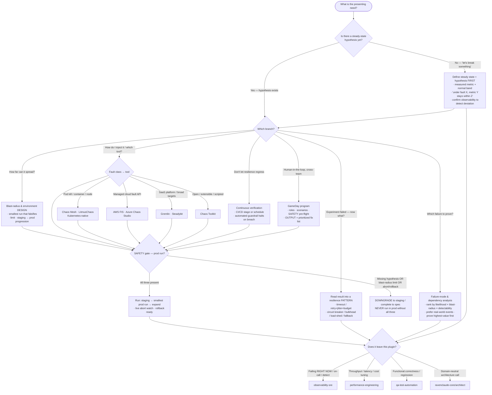

# Knowledge — Chaos-resilience decision tree

> **Last reviewed:** 2026-07-13 · **Confidence:** Medium-High (consensus on the Principles of Chaos Engineering, the hypothesis-first framing, the blast-radius-minimization and staging→prod progression, the SAFETY spine, and the resilience-pattern taxonomy; **specific fault-injection tool features, cloud fault-API capabilities, and managed-chaos-service offerings are volatile — re-verify with a retrieval date before a client commitment**).
> The first question in any chaos/resilience engagement is "do we have a steady-state hypothesis yet, or are we about to break something blind?" This is the decision tree the `resilience-architect` traverses to scope and route, and the `chaos-experiment-engineer` traverses to reach its tooling/execution branch — **before** injecting a fault or picking a tool.

The team's discipline: **name the branch before the fault; define the steady state and a falsifiable hypothesis before any experiment; enforce the SAFETY spine (hypothesis + blast-radius limit + abort/rollback) on any production run.** A live incident leaves this plugin for `observability-sre`; throughput/latency tuning is `performance-engineering`; functional correctness is `qa-test-automation`.

---

## Decision Tree: scope & route a chaos/resilience engagement

Traverse top-to-bottom. Gate on **do we have a hypothesis?** first, then the sub-branch. The **SAFETY gate** sits in front of every production run.

---

## The SAFETY spine (the hard gate — this team's non-negotiable rule)

> **No experiment is ever proposed to run against production without ALL THREE:**

| Control | What it is | Why it's mandatory |
|---|---|---|
| **(a) Steady-state hypothesis** | "Under fault X, metric Y stays within band Z" — falsifiable, tied to a measured metric | Without it, you can't tell "survived" from "broke"; the run is an intentional outage, not an experiment |
| **(b) Blast-radius limit** | A hard cap on scope — one pod, one AZ, N% of traffic | Bounds the worst case; the first run is the smallest that can still falsify the hypothesis |
| **(c) Abort / rollback condition** | An automated "halt if steady state breaches by > X" trigger + a tested way to stop the fault and restore state | An experiment you can't stop instantly *is* an incident |

An experiment missing any of the three is **downgraded to staging or completed to spec first** — the engineer refuses to run it in prod or wire it into CI/CD, and the architect refuses to sign off the GameDay scenario. This is the engineering analogue of a hard safety caveat: chaos engineering's entire legitimacy rests on the experiment being *controlled*.

---

## The failure taxonomy (pick real-world faults from here)

| Class | Real-world faults | Typical resilience pattern it tests |
|---|---|---|
| **Resource** | CPU/memory pressure, disk full, file-descriptor/thread exhaustion | Load shedding, bulkheads, autoscaling, graceful degradation |
| **Network** | Latency injection, packet loss, DNS failure, partition/split-brain | Timeouts, retries+jitter, circuit breakers |
| **State** | Clock skew, corrupted/stale cache, data inconsistency | Idempotency, reconciliation, cache fallback |
| **Dependency** | A downstream service timing out, erroring, or returning slow | Timeouts, circuit breakers, fallbacks, bulkheads |
| **Region / zone** | AZ loss, full region failure, control-plane outage | Multi-AZ/region failover, replication, degraded-mode |

Rank candidates by **likelihood × blast radius × detectability** and prove the highest-value ones first — a contrived fault nobody experiences is wasted risk.

---

## The tooling sub-choice (after "how do I inject it?")

| Tool | Fits when | Watch out for |
|---|---|---|
| **Chaos Mesh / LitmusChaos** | Kubernetes-native — pod/container/node kill, network, stress, IO faults as CRDs | K8s-scoped; feature parity between the two shifts — verify current capabilities |
| **AWS FIS / Azure Chaos Studio** | Managed cloud fault APIs — inject at the cloud-resource level with the provider's guardrails | Cloud-specific; capability coverage changes — retrieval-date any specific action |
| **Gremlin / Steadybit** | SaaS chaos platforms — broad target support, built-in safety/blast-radius controls, a catalog | Commercial; terms & feature sets volatile — verify before quoting |
| **Chaos Toolkit** | Open, extensible, declarative experiments (JSON/YAML) driving many providers via plugins | You assemble the safety controls; more DIY, less turnkey |

_(Retrieved 2026-07-13; tool features, cloud fault-API coverage, and managed-service offerings are volatile — treat any specific claim as a snapshot and re-verify before a client commitment.)_

---

## Seams (this team proves resilience to FAILURE — not detection, not speed, not correctness)

- **A system failing *right now* / on-call / paging / the telemetry that *detects* failure** → `observability-sre` (also the observability *precondition* — you can't run an experiment without the metric to detect the deviation).
- **Throughput / latency / cost tuning under normal load** → `performance-engineering` (this team injects *failure*, not load-for-speed).
- **Functional correctness / does the feature work / regression suites** → `qa-test-automation`.
- **A domain-neutral software-architecture decision** not specifically about failure-mode resilience → `ravenclaude-core/architect`.
- **Verifying a volatile tool/API claim** → `ravenclaude-core/deep-researcher`.

---

## Provenance

- Durable framing (the Principles of Chaos Engineering — steady-state hypothesis, real-world events, run-in-production-with-guardrails, minimize blast radius, automate; the failure taxonomy; the staging→prod progression; the resilience-pattern set; the SAFETY spine) is consensus chaos/resilience engineering practice, reviewed 2026-07-13 — **Medium-High confidence**.
- **Fault-injection tool feature sets (Chaos Mesh, LitmusChaos, Chaos Toolkit), cloud fault-API capabilities (AWS FIS, Azure Chaos Studio), and managed/SaaS chaos platforms (Gremlin, Steadybit) are volatile** — treat any specific claim as a 2026-07 snapshot, attach a retrieval date, and re-verify with `ravenclaude-core/deep-researcher` before a client commitment.
