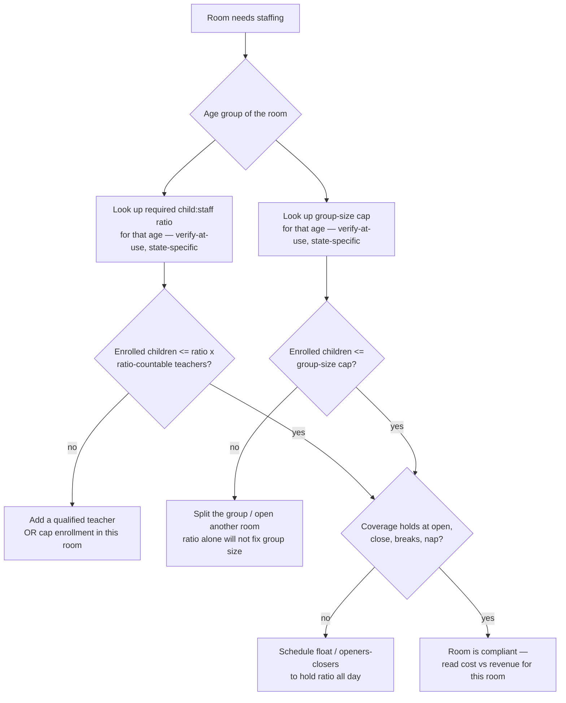
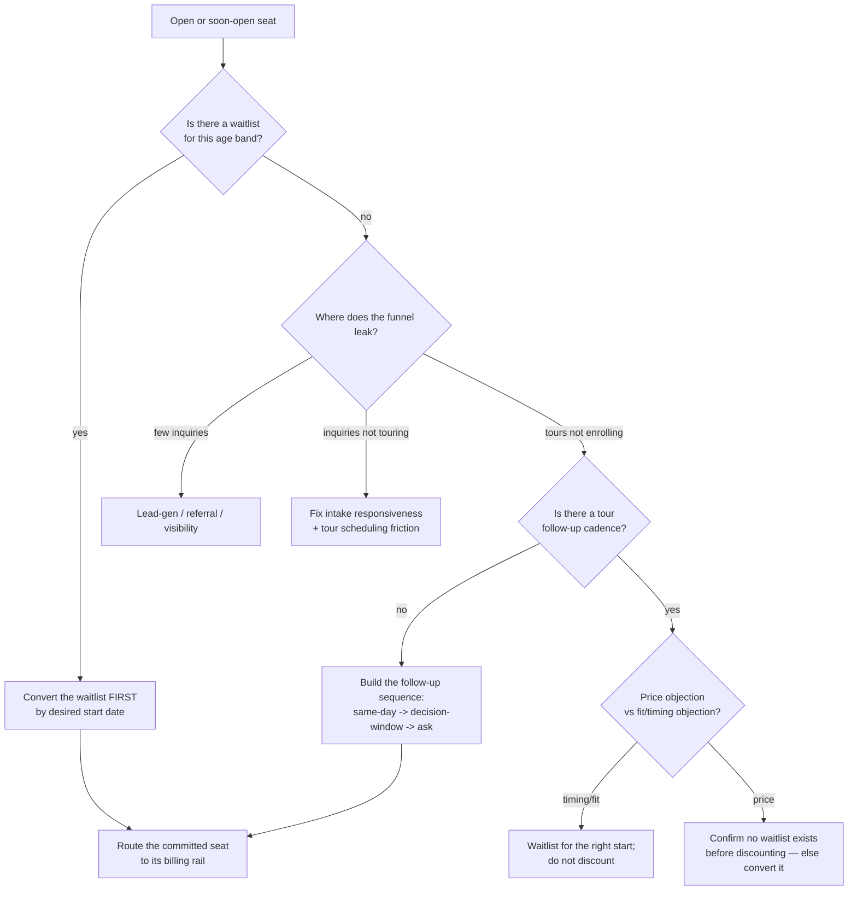
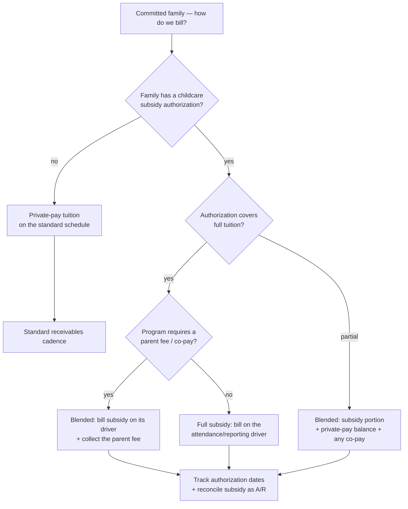
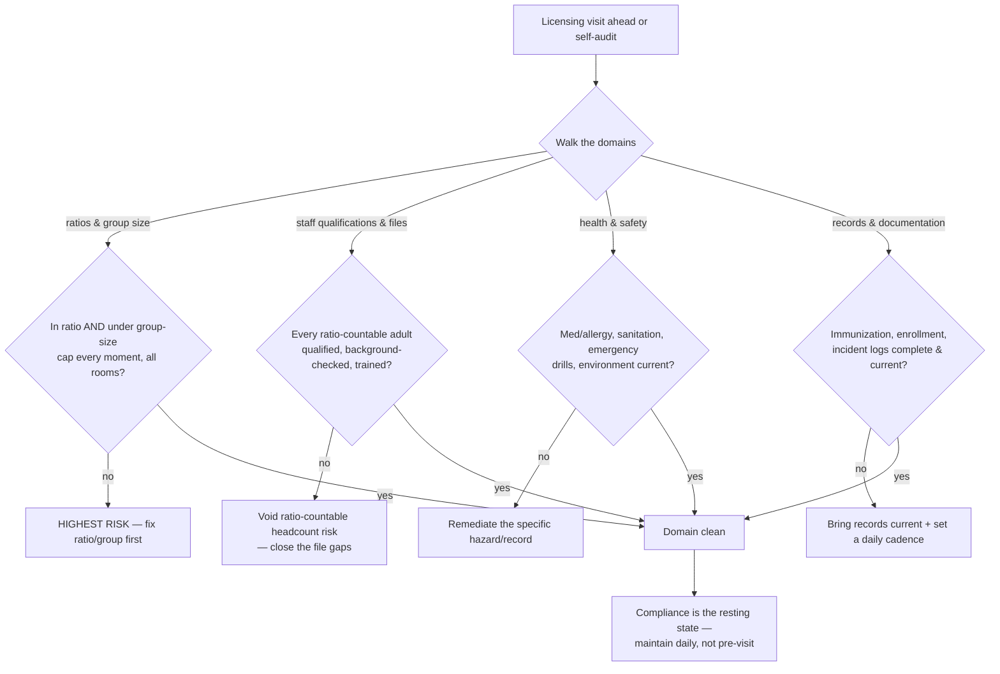

# Childcare / Early-Education — Decision Trees

> Reference decision trees for the `childcare-early-education` team. Agents **traverse the relevant tree top-to-bottom before deciding** (the proactive complement to the Capability Grounding Protocol). Each `## Decision Tree` section is a Mermaid graph plus the rule it encodes.
>
> **Advisory operations knowledge, not legal, licensing, or financial advice.** Anything touching a ratio, group-size cap, staff qualification, subsidy rule, or licensing requirement is **state-specific and `[verify-at-use]`** — confirm against your current state licensing regulation and the funding agency before acting. No child or family PII.
>
> _Last reviewed: 2026-07-02 by `claude`. Principles are durable; dated norms and program concepts live in [`childcare-reference-2026.md`](childcare-reference-2026.md)._

---

## Decision Tree: staff a room to ratio

**Rule:** ratio and group size are **two separate limits** — a room must satisfy both, by age, every moment of the day. Only **ratio-countable** (qualified, verified) staff count. Adding the child that crosses a ratio boundary adds a **whole teacher** — model the step, don't average it. All specific numbers are `[verify-at-use, state-specific]`.

---

## Decision Tree: enrollment / waitlist decision

**Rule:** **work the waitlist and diagnose the funnel leak by stage before you discount tuition.** A discount on a seat someone was waiting for is margin given away. The tour leaks most often at **follow-up**, not at the tour itself.

---

## Decision Tree: tuition vs subsidy billing route

**Rule:** decide the rail — **private / subsidy / blended** — deliberately, then **collect the parent fee/co-pay as seriously as private tuition**, **track the authorization** (it expires), and **bill on the program's payment driver** (often attendance). Subsidy is **accounts-receivable to reconcile**, not money that arrives. Every subsidy rule `[verify-at-use, state-specific]`.

---

## Decision Tree: licensing-readiness triage

**Rule:** triage the **licensing domains** by risk — **ratio/group-size gaps first** (they are the fastest citations and can be immediate), then staff-file gaps (which can void ratio-countable headcount), then health-safety and records. Compliance is **continuous**, not an inspection-day project. Every requirement `[verify-at-use, state-specific]`.

---

## See also

- [`childcare-reference-2026.md`](childcare-reference-2026.md) — dated ratio/group-size norms by age, CCDF/subsidy basics, licensing domains (verify-at-use, state-specific).
- Skills: [`../skills/staffing-to-ratio-scheduling/SKILL.md`](../skills/staffing-to-ratio-scheduling/SKILL.md), [`../skills/enrollment-and-waitlist-management/SKILL.md`](../skills/enrollment-and-waitlist-management/SKILL.md), [`../skills/tuition-and-subsidy-billing/SKILL.md`](../skills/tuition-and-subsidy-billing/SKILL.md), [`../skills/ratios-and-licensing-compliance/SKILL.md`](../skills/ratios-and-licensing-compliance/SKILL.md).
