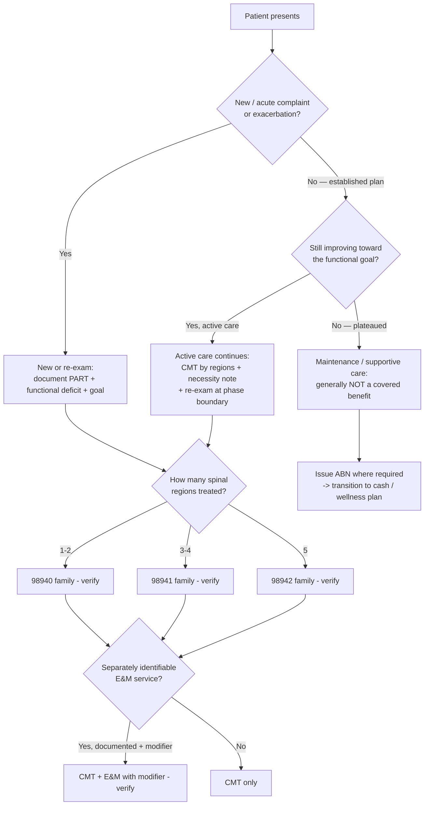

# Chiropractic billing & medical-necessity decision tree

> **Last reviewed:** 2026-07-07. Confidence: **medium** — the *framework* (active vs maintenance, PART,
> region-based CMT) is stable; the *specifics* (which payer requires what, region definitions, modifier
> rules) are payer- and state-specific and change. Every code and rule below is **[verify-at-use]** and,
> where it's a coverage/coding determination, flagged for a certified coder or the payer's own policy.
> This is decision-support, **not** medical, legal, or billing advice.

## Reading the tree

- **Active vs maintenance is the pivot.** Improving toward a functional goal = active (potentially covered); plateaued = maintenance (cash). The re-exam is what proves you're still on the active side.
- **CMT is coded by regions treated**, and the note must name them. Code to documentation, never up.
- **E&M is the exception, not the default** — only a separately identifiable service, with the modifier and the documentation to back it.
- **The ABN is the clean handoff** from covered active care to cash maintenance care.

## The PART necessity backbone (document for the region coded)

| Letter | Finding |
|---|---|
| **P** | Pain / tenderness (provoked, characterized) |
| **A** | Asymmetry / misalignment (posture, static/motion palpation) |
| **R** | Range-of-motion abnormality |
| **T** | Tissue / tone / temperature changes |

Commonly ≥2 documented, tied to the region, plus a functional goal and progress since last visit `[verify-at-use]`.

## Re-verify each time you use this file

- The CMT region-count code family and any updates.
- E&M modifier rules for same-day chiropractic services.
- The specific payer's documentation frequency, region definitions, and covered-service definitions.
- State scope-of-practice and cash-discount/inducement rules (route to counsel).
