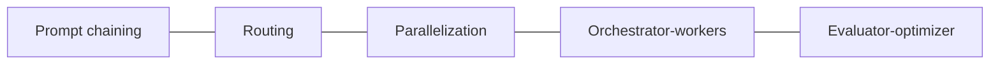
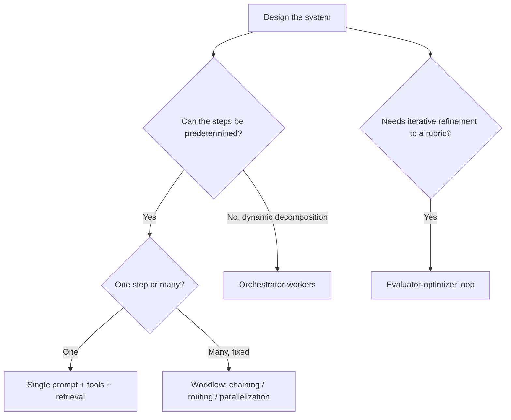

# Agent orchestration patterns (2026)

**Last reviewed:** 2026-05-28 · **Confidence:** high (Anthropic "Building effective agents"; durable). 
**Owner:** `agent-sdk-engineer` + `claude-solution-architect`. Pairs with [`agent-sdk-and-managed-agents.md`](agent-sdk-and-managed-agents.md) (the runtime) and [`evals-and-quality.md`](evals-and-quality.md) (proving a pattern earns its complexity).

## The core principle
**Start with the simplest thing that works; add agentic complexity only when it measurably improves outcomes.** A single well-prompted LLM call with retrieval + good examples beats a multi-agent system for most tasks. "Agent" complexity buys autonomy at the cost of latency, tokens, and unpredictability — spend it deliberately.

## Workflows (orchestration you define) vs Agents (the model decides)
- **Workflows** — LLM calls + tools wired through **predefined code paths**. Predictable, debuggable, cheaper. Most production "agentic" systems are workflows.
- **Agents** — the model **dynamically directs its own process + tool use** (the Agent SDK loop / Managed Agents). Use when the steps can't be predetermined and the task genuinely needs open-ended autonomy.

## The five composable patterns (Anthropic)

1. **Prompt chaining** — decompose into sequential steps, each call consuming the prior output (with optional gates between). For tasks cleanly splittable into fixed subtasks; trades latency for accuracy.
2. **Routing** — classify the input, then send it to a specialized prompt/model/tool. Lets you use cheap models for easy cases, strong models for hard ones (the cost ladder — [`claude-app-finops-reliability-and-security.md`](claude-app-finops-reliability-and-security.md)).
3. **Parallelization** — *sectioning* (split a task into independent subtasks run concurrently) or *voting* (run the same task N times for confidence/diversity). Faster + can raise quality.
4. **Orchestrator-workers** — an orchestrator LLM dynamically decomposes a task and delegates to worker LLMs, then synthesizes. For tasks with **unpredictable** subtask shape (e.g. multi-file code changes). **RavenClaude itself is this pattern** — a Team Lead dispatching specialist sub-agents.
5. **Evaluator-optimizer** — one model generates, another evaluates against criteria, loop until it passes. For tasks with clear iterative quality gains and a checkable rubric.

## Building agents (when you do go autonomous)
- Give the agent a **clear tool set with excellent descriptions** (the tool description is the contract — [`tool-use-and-structured-output.md`](tool-use-and-structured-output.md)), **stopping conditions**, and a **budget** (max turns/tokens) so it can't loop forever.
- **Sub-agents only via the orchestrator** (RavenClaude's rule): workers report back; the orchestrator decides next steps. Don't let workers spawn workers.
- **Agent Skills** (Anthropic, late 2025; opened as a **shared standard** March 2026) — package a capability (`SKILL.md` + resources) the agent loads on demand. The Agent SDK + Claude Code + this marketplace all consume them. Prefer a skill over stuffing everything in the system prompt.
- **Keep a human in the loop** for high-blast-radius actions; gate them (this marketplace's comfort-posture / tribunal is a worked example).

## Decision

Prove the added complexity with an eval delta before shipping it (house opinion #4).

## Sources (retrieved 2026-05-28)
[Anthropic — Building effective agents](https://www.anthropic.com/engineering/building-effective-agents), [Agent Skills](https://platform.claude.com/docs/agents-and-tools/agent-skills), the multi-agent research-system writeup. RavenClaude `ravenclaude-core/CLAUDE.md` (orchestrator-worker) is the in-repo worked example.
