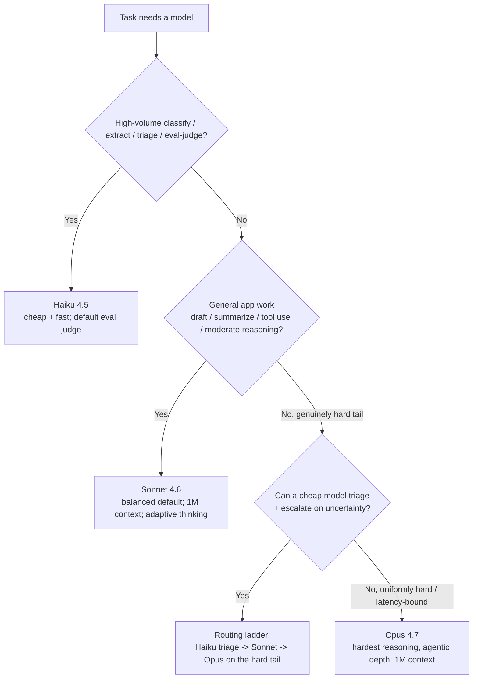
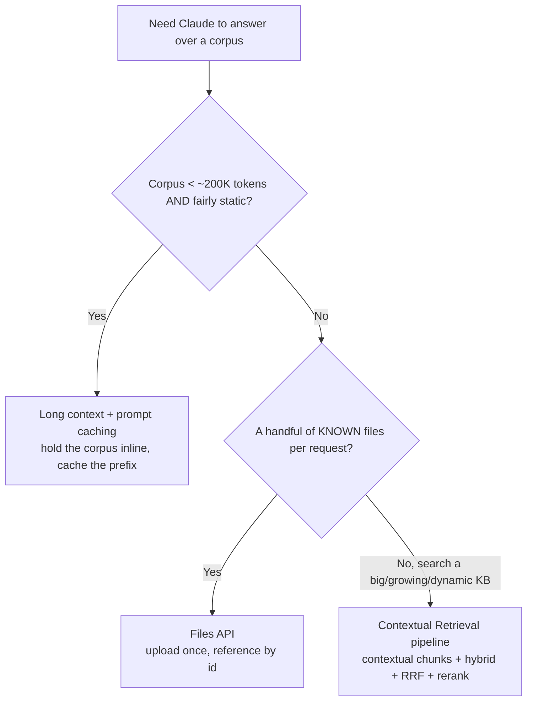
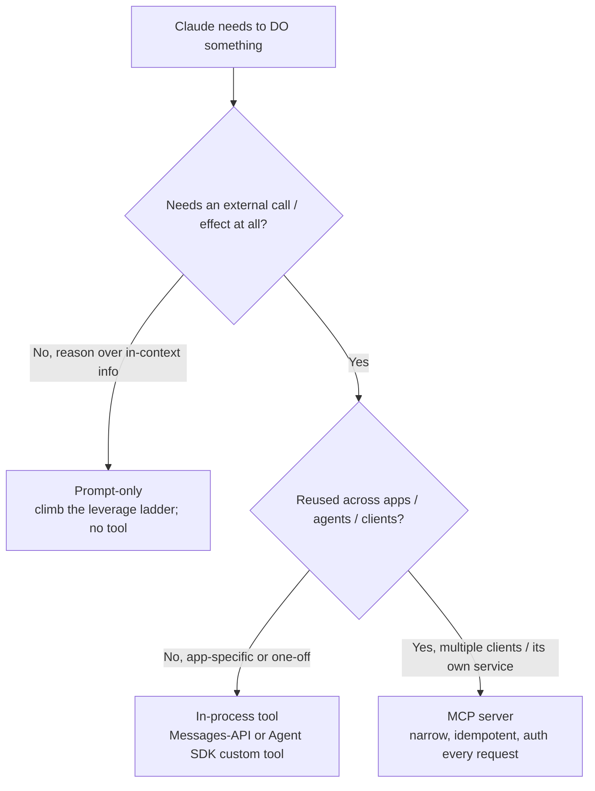
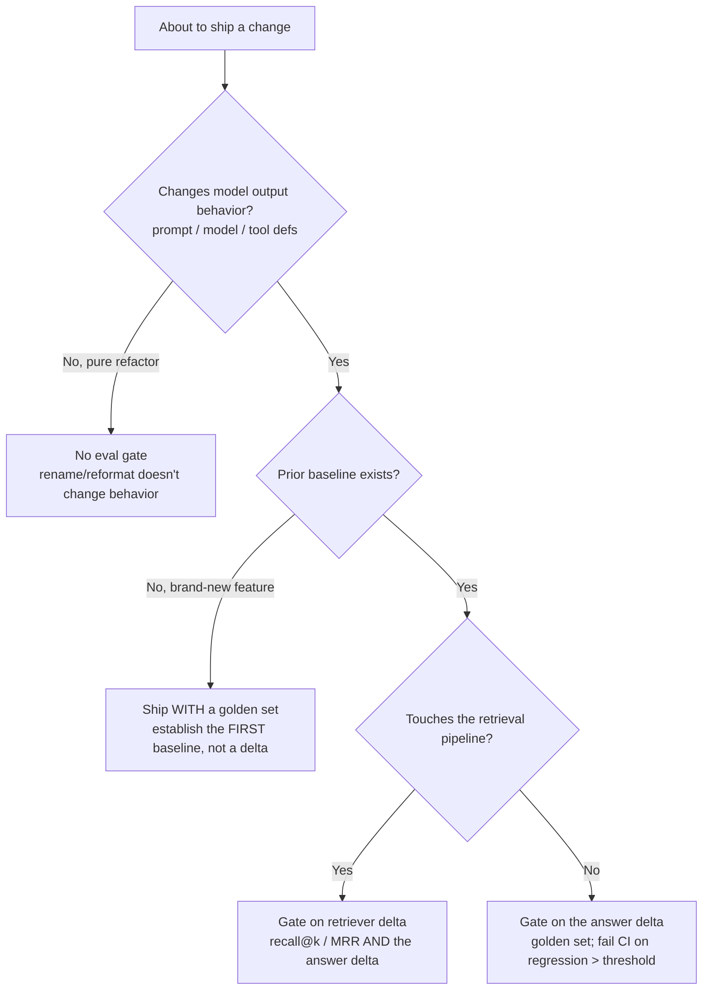

# Claude app decision trees (canonical)

**Last reviewed:** 2026-05-30 · **Confidence:** high (grounded in this plugin's own knowledge bank — caching, model-selection, RAG, tool-use, MCP, evals, orchestration — all retrieved 2026-05-28; statuses dated).
**Owner:** all six agents (traverse the relevant tree **before** recommending — don't keyword-match on the user's situation).

This file collects the plugin's canonical `## Decision Tree:` sections in the marketplace's standard shape ([`../../../docs/best-practices/decision-trees-in-knowledge-files.md`](../../../docs/best-practices/decision-trees-in-knowledge-files.md)). The **build-surface** tree (Messages API / Agent SDK / Managed Agents / Workbench) already lives canonically in [`claude-build-surface-decision-tree.md`](claude-build-surface-decision-tree.md) `## Decision Tree: Claude Build Surface` — traverse it there; this file does **not** duplicate it. The sections below cover the model, retrieval strategy, capability home (tool / MCP / prompt-only), and the eval-gate decisions.

> **Decision-tree traversal (priors).** When the user's situation matches a tree's entry condition, traverse the Mermaid graph top-to-bottom before selecting an approach. Do NOT pattern-match on keywords in the situation description. The first branch where the condition resolves cleanly is the leaf to apply. Every numeric/GA fact below is dated — confirm against [`model-selection-and-2026-capability-map.md`](model-selection-and-2026-capability-map.md) before quoting a client.

---

## Decision Tree: Model selection — which Claude model for this task?

**When this applies:** A request needs a model assigned and the observable inputs are the task *shape* — is it high-volume classification/extraction/triage; is it general app work (drafting, summarizing, moderate reasoning, tool use); or is it the genuinely hard reasoning tail (deep agentic work, multi-file refactors, hard analysis). Use this **after** the build surface is chosen ([`claude-build-surface-decision-tree.md`](claude-build-surface-decision-tree.md)) — surface and model are orthogonal. Not for the deployment-target call (Claude API vs Bedrock/Vertex/Foundry).

**Last verified:** 2026-05-30 against [`model-selection-and-2026-capability-map.md`](model-selection-and-2026-capability-map.md) (lineup dated 2026-05-28; the platform ships monthly — re-confirm the model ids).

**Rationale per leaf:**

- _Haiku 4.5_ — high-volume, latency-sensitive, or schema-constrained extraction; also the **default eval judge**. Cheapest per token; right-size here before reaching up.
- _Sonnet 4.6_ — the **balanced default** for most app work (1M context, adaptive thinking). Start here unless an observable says otherwise.
- _Routing ladder_ — when uncertainty is measurable (schema-invalid output, low self-reported confidence, a judge flag), triage cheap and escalate; the metric is **cost-per-resolved-task**, not raw tokens — a Haiku call that fails and re-routes to Opus is *more* expensive than starting on Sonnet.
- _Opus 4.7_ — reserve for the genuinely hard tail (deep agentic reasoning, large-repo refactors) or when a multi-hop ladder's re-route cost / latency outweighs its savings. Don't *default* here unmeasured (anti-pattern #3).

**Tradeoffs summary table:**

| Model | Relative cost | Speed | Best for | Avoid when |
|---|---|---|---|---|
| Haiku 4.5 | lowest | fastest | volume classify/extract/triage; eval judge | the task needs deep reasoning the model can't reach |
| Sonnet 4.6 | mid | fast | general app work; balanced default; 1M context | proven-trivial work Haiku resolves (overspend) |
| Opus 4.7 | highest | slower | hardest reasoning / agentic depth; 1M context | as a blanket default "to be safe" (the #3 anti-pattern) |
| Routing ladder | mid (amortized) | varies | mixed difficulty where uncertainty is measurable | strict latency budgets (the extra hop adds round-trips) |

Re-baseline **deliberately** when the platform ships a new model — a default shift is an eval event ([`evals-and-quality.md`](evals-and-quality.md)), not a silent swap.

---

## Decision Tree: Retrieval strategy — long context vs Files API vs RAG

**When this applies:** Claude must answer over a corpus and the observable inputs are corpus **size** (does it fit under ~200K tokens [verify]), **volatility** (static vs dynamic/per-tenant/frequently-updated), the **shape per request** (a handful of known files vs search over a big/growing KB), and whether you **must surface citations**. Not the chunking/rerank *internals* (that's [`retrieval-and-rag-2026.md`](retrieval-and-rag-2026.md) once you're on the RAG branch).

**Last verified:** 2026-05-30 against [`retrieval-and-rag-2026.md`](retrieval-and-rag-2026.md) (Anthropic Contextual Retrieval + cookbook, 2026-05-28). The ~200K threshold and 1M window are dated — verify.

**Rationale per leaf:**

- _Long context + caching_ — under the threshold + static, the whole corpus sits above a cache breakpoint and reads at 0.1× input; simpler, faster, often cheaper than any pipeline. Skip RAG ([`../best-practices/rag-skip-it-under-200k.md`](../best-practices/rag-skip-it-under-200k.md)).
- _Files API_ — a known small set of documents per request: upload once, reference by id, avoid re-sending bytes every call. The middle ground between "hold inline" and "full RAG."
- _Contextual Retrieval pipeline_ — large, dynamic, per-tenant, or citation-required corpora: retrieve a tight, high-precision slice (quality over quantity — [`../best-practices/rag-retrieve-quality-over-quantity.md`](../best-practices/rag-retrieve-quality-over-quantity.md)).

**Tradeoffs summary table:**

| Strategy | Setup cost | Per-request cost | Freshness | Citations | Use when |
|---|---|---|---|---|---|
| Long context + caching | none | low (cached 0.1×) | static only | weak (whole corpus in window) | small + static corpus |
| Files API | low (upload once) | low (by-id reference) | per-upload | per-file | a handful of known files per request |
| Contextual Retrieval (RAG) | high (pipeline + eval) | mid (retrieve + generate) | dynamic / per-tenant | strong (chunk→source) | large/dynamic KB; must cite sources |

A "fine-tune-equivalent" outcome (domain adaptation) is reached on Claude via **better context** — retrieval + examples + a strong system prompt — not a weight update; this tree is that adaptation lever. Eval the retriever **separately** from the generator on the RAG branch ([`../best-practices/eval-the-retriever-separately.md`](../best-practices/eval-the-retriever-separately.md)).

---

## Decision Tree: Capability home — prompt-only vs in-process tool vs MCP server

**When this applies:** Claude needs to *do* something and the observable inputs are: does the task need an **external call/effect at all** (vs reasoning over what's already in context); is the capability **reused across apps/agents/clients** or app-specific; and is it **coupled to one app's state** or independently runnable. Not for Anthropic-hosted server tools (computer use / code execution / web / Files / memory — a separate category, [`server-side-tools-and-files.md`](server-side-tools-and-files.md)).

**Last verified:** 2026-05-30 against [`mcp-server-authoring.md`](mcp-server-authoring.md) + [`tool-use-and-structured-output.md`](tool-use-and-structured-output.md) (modelcontextprotocol.io + Anthropic tool-use docs, 2026-05-28).

**Rationale per leaf:**

- _Prompt-only_ — if the answer is derivable from what's already in context, a tool is needless machinery; climb the prompt ladder instead ([`../best-practices/prompt-climb-the-leverage-ladder.md`](../best-practices/prompt-climb-the-leverage-ladder.md)).
- _In-process tool_ — app-specific, coupled to your app's state, or a one-off: ship the function (a Messages-API tool or an Agent SDK custom tool), skip the service overhead.
- _MCP server_ — reused across apps/agents/clients or wanted from Claude Desktop / Claude Code / your app interchangeably: author it **narrow, idempotent, authenticated** ([`../best-practices/mcp-author-the-narrow-server.md`](../best-practices/mcp-author-the-narrow-server.md)). Don't stand one up for a single app's single function (anti-pattern #12).

**Tradeoffs summary table:**

| Home | Build cost | Reuse | Coupling | Ops surface | Use when |
|---|---|---|---|---|---|
| Prompt-only | lowest | n/a | none | none | answer derivable from in-context info |
| In-process tool | low | none (one app) | tight to app state | none extra | app-specific / one-off capability |
| MCP server | high (service + auth + versioning) | across clients | independent process | a deployed, secured service | capability reused across apps/agents/clients |

All three apply the same contract discipline where a schema exists — name + description-as-prompt + typed schema ([`../best-practices/tools-design-as-a-contract.md`](../best-practices/tools-design-as-a-contract.md)). Auth/sandboxing of an MCP server escalates to `ravenclaude-core/security-reviewer`.

---

## Decision Tree: When to add an eval gate

**When this applies:** A change is about to ship and the observable input is **what kind of change** it is — a behavioral change to the prompt / model / tool definitions; a retrieval-pipeline change; a pure refactor with no behavior change; or a brand-new feature with no prior baseline. The question is whether CI needs an eval delta to gate it.

**Last verified:** 2026-05-30 against [`evals-and-quality.md`](evals-and-quality.md) + [`retrieval-and-rag-2026.md`](retrieval-and-rag-2026.md) (established LLM-eval practice + Anthropic guidance, 2026-05-28).

**Rationale per leaf:**

- _No eval gate (refactor)_ — renaming a variable or reformatting code that doesn't touch the prompt/model/tools changes no behavior; the gate is for *behavioral* change.
- _Ship with a golden set (first baseline)_ — a brand-new feature has nothing to delta against, but still ships on a golden set, not vibes — it *establishes* the first baseline ([`../best-practices/evals-before-vibes.md`](../best-practices/evals-before-vibes.md)).
- _Gate on the answer delta_ — any prompt/model/tool-def change runs the golden set in CI and fails on a regression beyond threshold, failing cases enumerated; pin model + judge model + judge prompt so a baseline shift is intentional.
- _Gate on retriever delta too_ — a retrieval-pipeline change can drop recall@k while answers still "look fine" on the happy path; gate the retriever separately (recall@k / MRR) to localize the failure ([`../best-practices/eval-the-retriever-separately.md`](../best-practices/eval-the-retriever-separately.md)).

**Tradeoffs summary table:**

| Change kind | Eval gate? | What you measure | Why |
|---|---|---|---|
| Pure refactor (no behavior change) | none | — | no behavioral surface to regress |
| New feature (no baseline) | golden set, first run | absolute pass-rate | establishes the baseline; not vibes |
| Prompt / model / tool-def change | answer delta, CI | pass-rate delta vs pinned baseline | catches silent regressions before users do |
| Retrieval-pipeline change | retriever **+** answer delta | recall@k / MRR + answer delta | localizes retrieval vs generation failure |

A re-baseline on a new platform model is a **deliberate** eval event, not an automatic swap — the platform ships monthly and defaults change ([`model-selection-and-2026-capability-map.md`](model-selection-and-2026-capability-map.md)).

---

## Sources

Every leaf above is grounded in this plugin's own knowledge bank (all retrieved 2026-05-28, re-confirmed for these trees 2026-05-30): [`model-selection-and-2026-capability-map.md`](model-selection-and-2026-capability-map.md), [`retrieval-and-rag-2026.md`](retrieval-and-rag-2026.md), [`mcp-server-authoring.md`](mcp-server-authoring.md), [`tool-use-and-structured-output.md`](tool-use-and-structured-output.md), [`evals-and-quality.md`](evals-and-quality.md), [`agent-orchestration-patterns.md`](agent-orchestration-patterns.md), and the canonical build-surface tree in [`claude-build-surface-decision-tree.md`](claude-build-surface-decision-tree.md). The platform ships monthly — re-verify every dated model id / GA status / threshold on the Researcher sweep and re-date the `Last verified:` lines.
