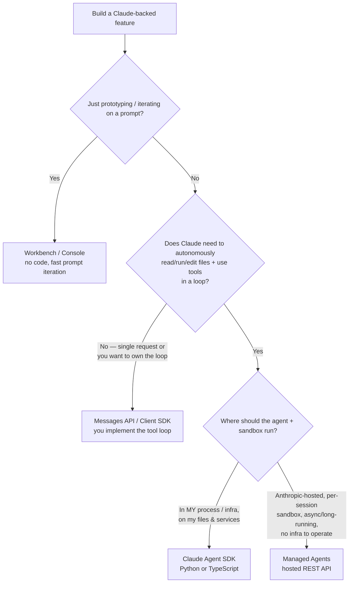

# Decision tree: which Claude build surface?

**Last reviewed:** 2026-05-28 · **Confidence:** high (platform.claude.com + code.claude.com/agent-sdk, retrieved 2026-05-28).
**Owner:** `claude-solution-architect` (traverse before recommending a surface).

## The four surfaces

| Surface | You own | Claude owns | Best for |
|---|---|---|---|
| **Workbench / Console** | nothing (UI) | — | prototyping, prompt iteration |
| **Messages API** (Client SDK) | the whole tool loop, orchestration | model inference | single requests, custom orchestration, full control |
| **Claude Agent SDK** (Python/TS) | config, custom tools, infra | the agent loop + built-in tools + context mgmt | agents on *your* infra/files; CI/CD; custom apps |
| **Managed Agents** (hosted REST) | events in / results out | the loop **and** the sandbox + session log | production agents w/o operating sandbox/session infra; long-running/async |

Source: [Agent SDK overview](https://code.claude.com/docs/en/agent-sdk/overview), [Managed Agents](https://platform.claude.com/docs/en/managed-agents/overview).

## The migration path (the recurring real decision)
**Prototype in Workbench → build in the Agent SDK locally → move to Managed Agents for production** when you don't want to operate the sandbox/session infrastructure. This is the canonical path; design so the move doesn't require a rewrite (keep tool logic portable, keep prompts/skills in files).

## Client SDK vs Agent SDK in one line
- **Client SDK:** `response = client.messages.create(...)`; **you** loop on `stop_reason == "tool_use"`, execute the tool, send `tool_result`, repeat.
- **Agent SDK:** `async for message in query(prompt=..., options=...)`; Claude runs the loop, executes built-in tools, manages context.

## Deployment target also shapes the architecture
The same surfaces run against the Claude API directly **or** via **Amazon Bedrock** (`CLAUDE_CODE_USE_BEDROCK=1`), **Claude Platform on AWS**, **Google Vertex AI** (`CLAUDE_CODE_USE_VERTEX=1`), or **Microsoft Foundry** (`CLAUDE_CODE_USE_FOUNDRY=1`). Each has distinct model-ID schemes, region/quota constraints, and prompt-caching support — pick the target with the data-residency + procurement + caching story the engagement needs (see [`claude-app-finops-reliability-and-security.md`](claude-app-finops-reliability-and-security.md)).

> **Billing note (dated):** from **2026-06-15**, Agent SDK + `claude -p` usage on subscription plans draws from a separate Agent SDK credit. Verify before quoting an engagement. ([source](https://code.claude.com/docs/en/agent-sdk/overview))

> House-opinion link: **#2 pick the build surface from the tree** (don't default to the Agent SDK for a single-shot classification, or to Managed Agents when you already operate infra).

---

## Decision Tree: Claude Build Surface — choosing how to build a Claude-backed feature

**When this applies:** The user asks "how should I build this Claude app?" / "Agent SDK or Managed Agents?" / "do I need an agent loop or just a Messages call?" — i.e. a Claude-backed feature needs a build surface and the observable inputs are: are you still prototyping a prompt; does Claude need to autonomously read/run/edit files + use tools in a loop; and if so, should the agent + sandbox run in *your* process/infra or be Anthropic-hosted (async/long-running, no infra to operate). Not for the deployment-target call (Claude API vs Bedrock/Vertex/Foundry — that's a downstream residency/quota/caching decision) and not for the model right-sizing call (see [`model-selection-and-2026-capability-map.md`](model-selection-and-2026-capability-map.md)).

**Last verified:** 2026-05-30 against [Agent SDK overview](https://code.claude.com/docs/en/agent-sdk/overview) + [Managed Agents](https://platform.claude.com/docs/en/managed-agents/overview) (the same sources as the header, re-confirmed).

**Rationale per leaf:**

- _Workbench / Console_ — no code; the fastest loop for iterating on a prompt before any build decision is made.
- _Messages API / Client SDK_ — a single request, or a case where you want to own the tool loop and orchestration; you loop on `stop_reason == "tool_use"` yourself. A classification call isn't an agent — don't reach for the Agent SDK here.
- _Claude Agent SDK_ — Claude runs the agent loop, built-in tools, and context management **in your process / on your infra, files, and services** (CI/CD, custom apps). **requires:** from 2026-06-15, Agent SDK + `claude -p` usage on subscription plans draws from a separate Agent SDK credit — verify before quoting an engagement.
- _Managed Agents_ — Claude owns the loop **and** the Anthropic-hosted sandbox + session log; pick it for production agents you don't want to operate sandbox/session infra for, and for long-running/async work.

**Tradeoffs summary table:**

| Surface | You own | Claude owns | Infra to operate | Use when |
|---|---|---|---|---|
| Workbench / Console | nothing (UI) | — | none | prototyping, prompt iteration |
| Messages API (Client SDK) | the whole tool loop + orchestration | model inference | your app only | single requests, custom orchestration, full control |
| Claude Agent SDK | config, custom tools, infra | agent loop + built-in tools + context mgmt | your process/infra | agents on *your* infra/files; CI/CD; custom apps |
| Managed Agents | events in / results out | the loop **and** sandbox + session log | none (Anthropic-hosted) | production agents w/o operating sandbox/session infra; long-running/async |

**Migration path:** prototype in Workbench → build in the Agent SDK locally → move to Managed Agents for production. Design so the move isn't a rewrite (keep tool logic portable, prompts/skills in files).
