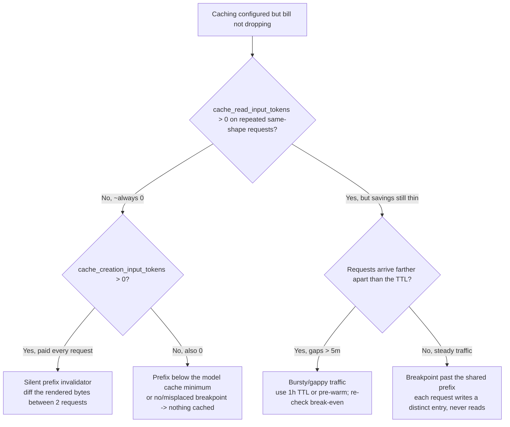
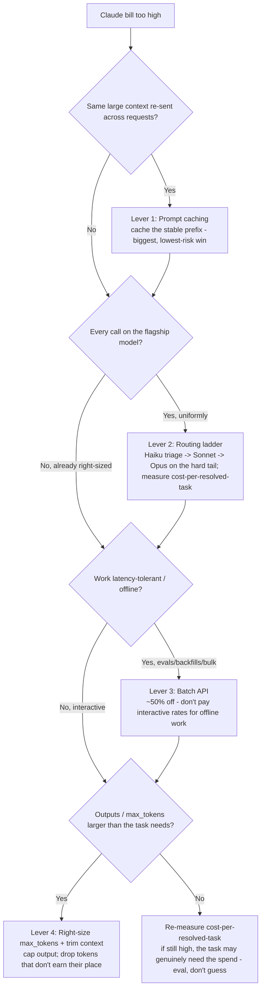

# Claude app cost & caching decision trees (canonical)

**Last reviewed:** 2026-06-05 · **Confidence:** high for the *decision logic* (grounded in this plugin's caching + FinOps knowledge bank); **dated** for every numeric/GA fact (model lineup, prices, cache minimums/premiums, the ~200K threshold) — all `[verify-at-use]` against [`model-selection-and-2026-capability-map.md`](model-selection-and-2026-capability-map.md), which is the freshness anchor.
**Owner:** `prompt-and-context-engineer` + `claude-app-ops-engineer` (traverse the relevant tree **before** recommending — don't keyword-match the symptom).

This file adds **two** canonical decision trees that the existing [`claude-app-decision-trees.md`](claude-app-decision-trees.md) did not cover (it has model-selection, retrieval-strategy, capability-home, eval-gate, orchestration-shape, async-delivery, injection, and document-format). These two are the **cost/caching diagnostic** seams:

1. **Cache-hit-rate collapse** — the debug tree for "caching is configured but the bill isn't dropping / `cache_read_input_tokens` is zero."
2. **The cost-lever ladder** — "the Claude bill is too high; which lever do I pull, in what order?"

Both follow the marketplace's standard decision-tree shape ([`../../../docs/best-practices/decision-trees-in-knowledge-files.md`](../../../docs/best-practices/decision-trees-in-knowledge-files.md)).

> **Decision-tree traversal (priors).** When the user's situation matches a tree's entry condition, traverse the Mermaid graph top-to-bottom before selecting an approach. Do NOT pattern-match on keywords in the situation description. The first branch where the condition resolves cleanly is the leaf to apply. Every numeric/GA fact below is dated — confirm against the capability map before quoting a client.

---

## Decision Tree: Cache-hit-rate collapse — why isn't prompt caching saving money?

**When this applies:** Prompt caching is configured (there's a `cache_control` breakpoint) but the bill isn't dropping as expected, or someone says "caching isn't working." The single observable that drives the whole tree is the response `usage` block — specifically `cache_read_input_tokens` (served-from-cache, ~0.1×) vs `cache_creation_input_tokens` (written-to-cache, the ~1.25× / 2×-for-1h premium) across **repeated, same-shape** requests. Not for deciding *whether* to cache at all (that's a "is the prefix large + reused?" question) — this is for diagnosing a cache that's *configured but not paying off*.

**Last verified:** 2026-06-05 against [`prompt-caching-playbook.md`](prompt-caching-playbook.md) (Anthropic prompt-caching docs, retrieved 2026-05-28). Cache minimums (model-specific), the 5m/1h write premiums, and the prefix-match render order are dated — `[verify-at-use]`.

**Rationale per leaf:**

- _INVALIDATE (read=0, create>0 — the most common case)_ — you're paying the write premium every request and reading nothing, which is **strictly worse than not caching**. A byte changes in the prefix every request. Diff the rendered `tools`→`system`→`messages` bytes between two requests; the culprit is almost always `datetime.now()`/`uuid4()` in the system prompt, unsorted `json.dumps()` of tool schemas, a per-user tool set, or a conditional system section. Fix the prefix to be byte-stable; do **not** add breakpoints or raise TTL (neither addresses a non-stable prefix). Field note: [`../scenarios/2026-06-05-prompt-cache-hit-rate-collapse.md`](../scenarios/2026-06-05-prompt-cache-hit-rate-collapse.md).
- _MIN (read=0, create=0 — nothing is being cached at all)_ — the prefix is below the model's cacheable minimum (shorter prefixes silently won't cache — no error), or there's no breakpoint / it's misplaced. Confirm the prefix clears the model minimum `[verify-at-use]`; place the breakpoint on the last block of the stable prefix.
- _LONGTTL (read>0 but gaps exceed the TTL)_ — bursty/gappy traffic lets the 5m entry expire between requests, so each burst re-writes. Switch to the 1h TTL (re-check break-even — the 1h write premium is higher) or pre-warm on a schedule just under the TTL. Don't pre-warm steady traffic that already keeps the cache hot.
- _PLACE (read>0 but savings thin, steady traffic)_ — the breakpoint sits *past* the shared prefix (e.g. after the per-request question), so every request writes a distinct entry and never reads a prior one. Move the breakpoint to the end of the **shared** portion, before the varying suffix.

**Tradeoffs / what each leaf costs:**

| Leaf | The fix | Cost of the fix | Don't instead |
|---|---|---|---|
| INVALIDATE | Freeze the prefix; deterministic tool serialization; volatile content after the breakpoint | Refactor prompt assembly | Add breakpoints / raise TTL (won't help a churning prefix) |
| MIN | Meet the model cache minimum; place a real breakpoint | May need a larger stable prefix to be worth it | Assume caching is "broken" and remove it |
| LONGTTL | 1h TTL or scheduled pre-warm | Higher write premium / a warm-up call | Pre-warm steady traffic (pure extra writes) |
| PLACE | Move breakpoint to end of shared prefix | One-line placement change | Cache the whole prompt incl. the varying suffix |

The diagnostic is always the `usage` fields first — they point straight at which leaf you're on before you change any code.

---

## Decision Tree: The cost-lever ladder — the Claude bill is too high; which lever first?

**When this applies:** Spend on Claude is higher than wanted and you need to know which lever moves the most money for the least risk, **in order** — not to pull all of them at once. Observable inputs: is the same large context re-sent across requests; is every call on the flagship model; is the work latency-tolerant/offline; are outputs/`max_tokens` larger than needed. The metric throughout is **cost-per-resolved-task** (and the cache hit rate that multiplies it), **not** raw token count — a cheap call that fails and re-routes costs more than starting one rung up.

**Last verified:** 2026-06-05 against [`claude-app-finops-reliability-and-security.md`](claude-app-finops-reliability-and-security.md) + [`prompt-caching-playbook.md`](prompt-caching-playbook.md) (retrieved 2026-05-28). The Batch discount, model prices/lineup, and cache economics are dated — `[verify-at-use]`.

**Rationale per leaf (the order is the point — pull them top-down, biggest-and-safest first):**

- _Lever 1 — Prompt caching (first)._ If a large context (system prompt, docs, tool defs) repeats across requests, caching the stable prefix is the **biggest, lowest-risk** win — cached reads are ~0.1× input. It's first because it doesn't change *which* model or *what* output you get, only the price of the repeated prefix. (If it's configured but not paying off, you're in the cache-hit-rate-collapse tree above before anything else.)
- _Lever 2 — Routing ladder (second)._ If every call is on the flagship "to be safe," right-size: cheap model triages/classifies, escalate-on-uncertainty to a stronger model, reserve the flagship for the hard tail. Gate on **cost-per-resolved-task** — a Haiku call that fails and re-routes to Opus is *more* expensive than starting on Sonnet, so the ladder is only a win measured end-to-end. (Uniformly-hard or strict-latency workloads may legitimately *land* on the flagship — see the model-selection tree in [`claude-app-decision-trees.md`](claude-app-decision-trees.md).)
- _Lever 3 — Batch API (third)._ Latency-tolerant work — evals, backfills, bulk classification, the eval judge — runs through the Batch API at ~50% off `[verify-at-use]`. It's third because it only applies to *offline* work; you can't batch an interactive request.
- _Lever 4 — Right-size `max_tokens` + trim context (fourth)._ Cap output to what the task needs (a too-high `max_tokens` doesn't cost output you don't generate, but an over-verbose prompt design does), and drop context tokens that don't earn their place. Smallest lever, most fiddly — last.
- _MEASURE (the honest floor)._ If the bill is still high after the four levers, the task may genuinely need the spend. Confirm with an eval (quality-at-cost), don't keep cutting blind — under-spending that regresses quality is a worse outcome than the bill.

**Tradeoffs summary table:**

| Lever | Typical leverage | Risk to quality | Applies when |
|---|---|---|---|
| 1 — Prompt caching | Highest (repeated prefix → ~0.1×) | None (same model, same output) | Large context re-sent across requests |
| 2 — Routing ladder | High | Some (a too-cheap rung can mis-resolve) — gate on cost-per-resolved-task | Everything's on the flagship by default |
| 3 — Batch API | ~50% on offline work | None (same model, just async) | Work is latency-tolerant / offline |
| 4 — Right-size `max_tokens` / trim | Lowest, fiddliest | Low if measured | Outputs/context larger than the task needs |

Pull them **in order** and re-measure after each — the order maximizes saving-per-risk, and stacking them (cache × ladder × batch) compounds. Re-baselining on a new platform model is a deliberate eval event, not a silent swap (the platform ships monthly).

---

## Sources

Both trees are grounded in this plugin's own knowledge bank (retrieved 2026-05-28, re-confirmed for these trees 2026-06-05): [`prompt-caching-playbook.md`](prompt-caching-playbook.md), [`claude-app-finops-reliability-and-security.md`](claude-app-finops-reliability-and-security.md), [`model-selection-and-2026-capability-map.md`](model-selection-and-2026-capability-map.md), and the scenario [`../scenarios/2026-06-05-prompt-cache-hit-rate-collapse.md`](../scenarios/2026-06-05-prompt-cache-hit-rate-collapse.md). The Anthropic prompt-caching + pricing facts (cache minimums, 5m/1h write premiums, the Batch discount, the model lineup) are **dated and volatile** — re-verify on the Researcher sweep and re-date the `Last verified:` lines before quoting a client.
