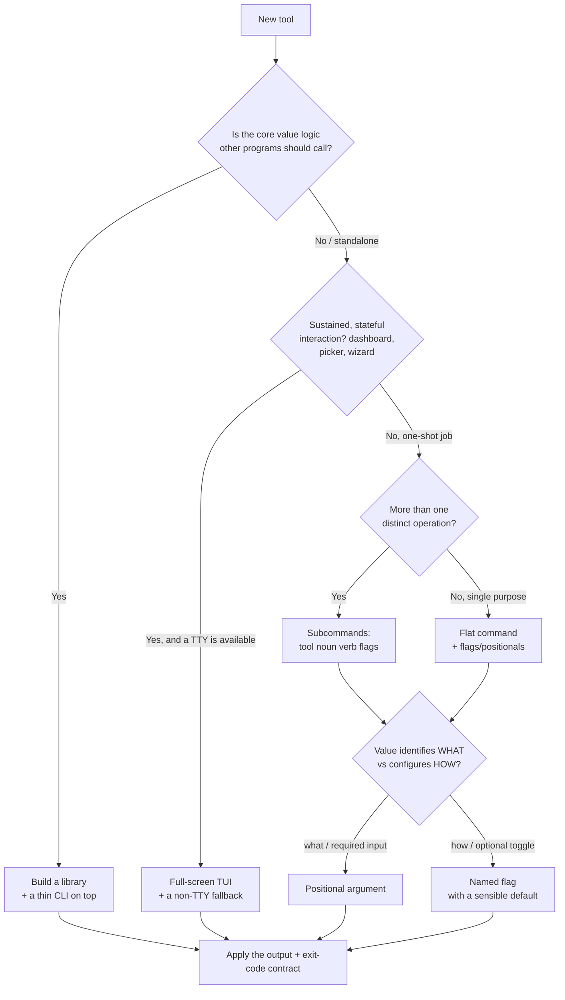
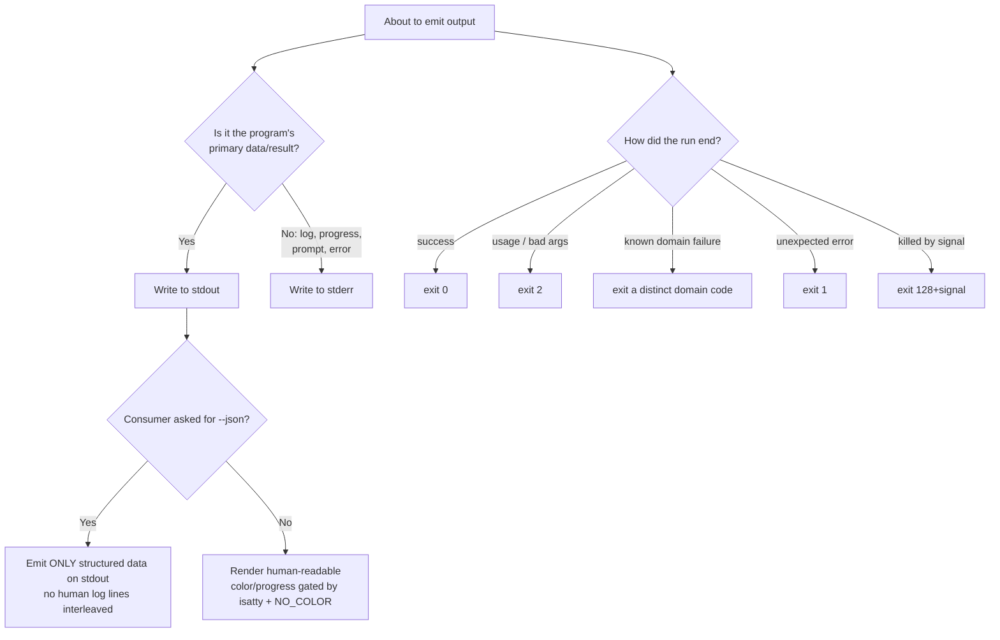
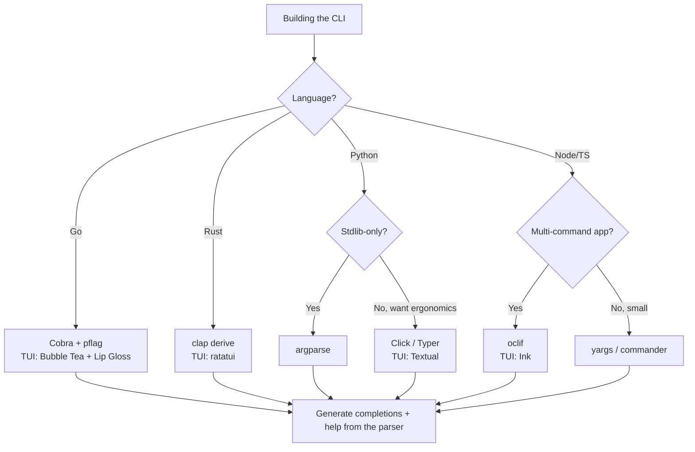

# CLI Tooling — decision trees & capability map

> Canonical knowledge bank for `cli-tooling-engineering`. **Traverse the relevant `## Decision Tree` top-to-bottom before choosing an approach** — the proactive complement to the Capability Grounding Protocol. Capability rows are dated and `[verify-at-use]`; re-confirm against the vendor before quoting a version-specific fact.
>
> _Last reviewed: 2026-06-22._

---

## Decision Tree — the command surface (CLI vs TUI vs library; flag vs arg vs subcommand)



**Read:** default to a **scriptable CLI** — it pipes, automates, and composes. Take a **full-screen TUI** only when interaction is sustained and stateful, and only with a non-TTY fallback. Use **subcommands** once a tool does more than one thing. Make required inputs **positional** and optional toggles **flags with good defaults** so the common case needs no flags. If the logic is reusable, ship a **library** with a thin CLI wrapper.

---

## Decision Tree — the output + exit-code contract



**Read:** **data → stdout, everything else → stderr.** Human output by default, **`--json`** emits only data on stdout (never interleave logs). **Exit codes are an API:** `0` success, `2` usage, `1` general error, distinct codes per known failure class, `128+signal` when killed. Never exit `0` on a real failure — downstream CI trusts it.

---

## Decision Tree — parser/framework choice by language



**Read:** use the language's idiomatic parser so you get help generation, validation, and shell completions for free — never hand-roll `argv`. For a full-screen TUI, pair the parser with the language's mainstream TUI library (Bubble Tea / ratatui / Textual / Ink).

---

## Decision Tree — distribution form

```mermaid
flowchart TD
    A[Shipping the tool] --> B{Compiled language?<br/>Go / Rust}
    B -- Yes --> SB[Single static binary<br/>cross-compiled per OS/arch]
    B -- No, interpreted --> C{Node or Python?}
    C -- Node --> NPM[npm package<br/>bin entry]
    C -- Python --> PIPX[pipx<br/>isolated app install]
    SB --> D[Publish channels]
    NPM --> D
    PIPX --> D
    D --> E[Homebrew tap/formula · Scoop/winget · checksums]
    E --> F[Stamp --version semver+commit · plan updates]
    F --> G{Offer curl | sh?}
    G -- Yes --> H[Verify checksum/signature,<br/>pick OS/arch, sane path, auditable]
    G -- No --> Z[Done — CI release + signing -> devops-cicd]
    H --> Z
```

**Read:** prefer a **single static binary** when the language allows (lowest install friction). Otherwise ship a **runtime package** (npm/pipx). Publish to where users look (Homebrew/Scoop/winget), keep versions+checksums in sync, stamp `--version` at build time, and only ship a `curl | sh` installer if it verifies a checksum/signature. CI wiring + signing route to `devops-cicd`.

---

## Config-precedence prior

The single correct order, highest wins:

| Rank | Source | Example |
|---|---|---|
| 1 (wins) | Command-line **flag** | `--timeout 30` |
| 2 | **Environment variable** | `TOOL_TIMEOUT=30` |
| 3 | **Project config file** | `./.toolrc`, `./tool.toml` |
| 4 | **User config file** | `$XDG_CONFIG_HOME/tool/config.toml` |
| 5 (fallback) | **Built-in default** | `timeout = 10` |

Resolve all five into **one config object** early and pass it down. Never let a file silently override an explicit flag. Discover user config via **XDG Base Directory** (`$XDG_CONFIG_HOME`, falling back to `~/.config`) on Linux/macOS and the platform equivalent on Windows.

---

## 2026 capability map `[verify-at-use]`

| Area | Current shape (dated 2026-06-22) | Note |
|---|---|---|
| Color suppression | `NO_COLOR` (any non-empty value disables color) is the cross-tool convention; `FORCE_COLOR` overrides a non-TTY | Always combine with an `isatty` check |
| Go CLI | Cobra + pflag dominant; `cobra-cli` scaffolds; completions generated per shell | Re-confirm Cobra major + completion API |
| Rust CLI | `clap` v4 (derive) standard; `clap_complete` for completions; `ratatui` (the maintained `tui-rs` successor) for TUIs | Quote clap v4; tui-rs is unmaintained |
| Python CLI | argparse (stdlib), Click/Typer (ergonomic), Textual (TUI); ship apps via **pipx** | Re-confirm Typer/Textual majors |
| Node/TS CLI | oclif (multi-command), yargs/commander (small), Ink (TUI) | Verify oclif major + ESM support |
| Exit-code conventions | `0` ok, `2` usage (argparse/getopt), `1` general, `128+N` signals; `126/127` shell "not executable/not found" | `126/127` are shell-owned — don't reuse |

> Every row is version-volatile. These are priors to *route* the decision, not specs to quote verbatim — re-confirm against the vendor docs at use.
