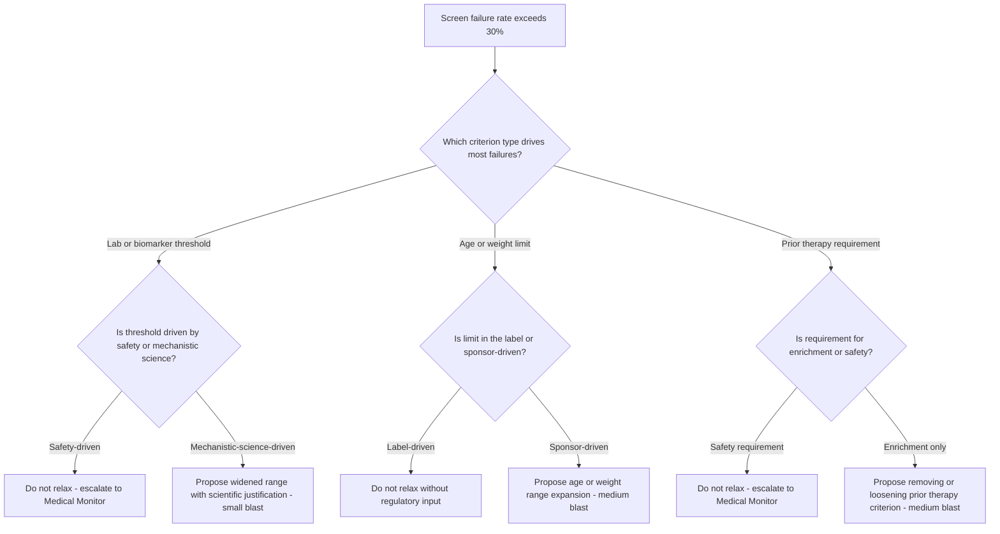
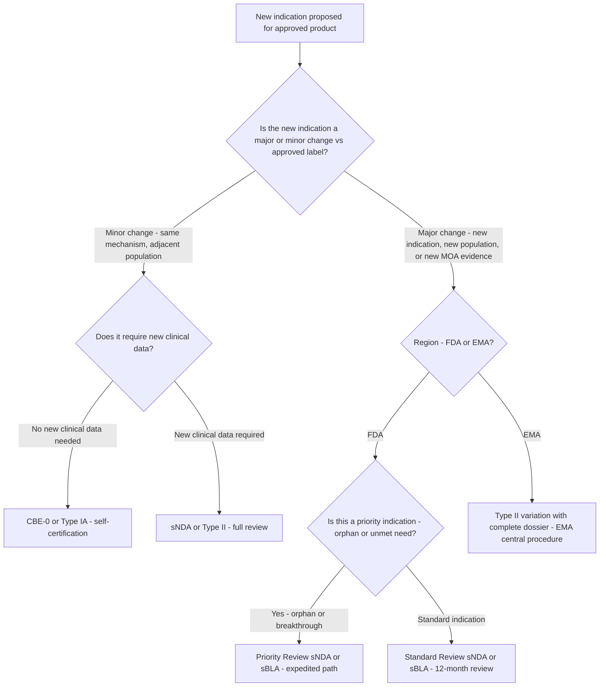
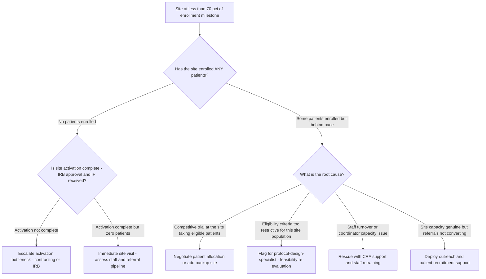

# Clinical trial decision trees

Which analysis for which symptom — traverse top-to-bottom before picking a method.

## Decision Tree: Enrollment is behind

1) Read the funnel — referral/eligibility/consent (§3 #5). 2) Stress-test feasibility (§3 #1). 3) Check site activation (§3 #4). 4) Check dropout (§3 #3).

## Decision Tree: Is this protocol enrollable?

1) Map eligibility to population (§3 #1). 2) Check site capacity. 3) Recommend criteria adjustments as decision-support.

## Decision Tree: Are we submission-ready?

1) Inventory documentation (§3 #7). 2) Check data quality. 3) Structure the eCTD and flag gaps.

## How to read these trees

Traverse top-to-bottom and stop at the first matching branch — the order encodes the cheap-checks-before-expensive-checks discipline (§3). Each leaf names a skill, a specialist, or a house-opinion to apply. Never skip a higher branch because a lower one looks more interesting; a denominator, seasonal, or definitional artifact masquerades as a finding more often than not.

## Decision Tree: Which skill for which task

- **Stress-test protocol feasibility** → use when: Stress-test eligibility criteria against the addressable population and site capacity before the protocol locks, since restrictive criteria are the biggest enrollment killer. ([`../skills/stress-test-feasibility/SKILL.md`](../skills/stress-test-feasibility/SKILL.md))
- **Plan the recruitment funnel** → use when: Plan recruitment as a costed funnel with a cost per stage, against the per-patient economics, instead of a hope. ([`../skills/plan-recruitment-funnel/SKILL.md`](../skills/plan-recruitment-funnel/SKILL.md))
- **Accelerate site activation** → use when: Sequence site selection, contracting, and start-up as the schedule's critical path to cut the activation delay. ([`../skills/accelerate-site-activation/SKILL.md`](../skills/accelerate-site-activation/SKILL.md))
- **Design for retention** → use when: Build retention into visit burden, schedule, and engagement to lower the ~30% dropout, instead of re-recruiting. ([`../skills/design-for-retention/SKILL.md`](../skills/design-for-retention/SKILL.md))
- **Read submission readiness** → use when: Read documentation completeness, data quality, and eCTD structure throughout the trial so the filing isn't a final-month scramble. ([`../skills/read-submission-readiness/SKILL.md`](../skills/read-submission-readiness/SKILL.md))

## Decision Tree: Which specialist owns this

- **The engagement** → [`trials-engagement-lead`](../agents/trials-engagement-lead.md)
- **Feasibility** → [`protocol-design-specialist`](../agents/protocol-design-specialist.md)
- **Execution** → [`clinical-operations-manager`](../agents/clinical-operations-manager.md)
- **Submissions** → [`regulatory-submissions-specialist`](../agents/regulatory-submissions-specialist.md)

When two leaves apply, route to the **lead** first to scope and sequence — overlapping symptoms usually mean two drivers at once, and the lead keeps the analysis from collapsing into a single-cause story.

## Decision Tree: Which house-opinion gates the call

Before picking any method, check whether one of the standing biases (§3) already decides the framing:

1. Protocol feasibility is set before the first patient — design for enrollment — if this is in question, apply §3 #1 before any method.
2. Recruitment is a costed pipeline, not a hope — if this is in question, apply §3 #2 before any method.
3. Retention is cheaper than re-recruitment — design for it — if this is in question, apply §3 #3 before any method.
4. Site activation is the schedule's long pole — if this is in question, apply §3 #4 before any method.
5. Enrollment is a rate, not a count — track the funnel — if this is in question, apply §3 #5 before any method.
6. Budget by phase and category — the shape differs — if this is in question, apply §3 #6 before any method.
7. The submission is built throughout, not at the end — if this is in question, apply §3 #7 before any method.
8. Cite the source and date for every benchmark — if this is in question, apply §3 #8 before any method.

## Escalation & guardrails

- Anything touching client PII / regulated records → stop and route to `ravenclaude-core` `security-reviewer`.
- Any external figure entering a deliverable → carry a source URL + retrieval date, or mark it `[unverified — training knowledge]` / `[ESTIMATE]` (§3, final house opinion).
- A recommendation ships only with an owner, a date, and an expected metric movement.
## Sourcing note

Figures in this file are from the author's domain knowledge and are marked `[unverified — training knowledge]` or `[ESTIMATE]` at point of use. Validate against a primary source before putting any figure in a client deliverable (§3 cite-or-mark rule).

---

## Decision Tree: Protocol Design — Which Eligibility Criterion to Relax First

**When this applies:** Enrollment is below plan and the screen-failure rate exceeds 30%. The protocol-design-specialist or trials-engagement-lead needs to triage which eligibility criterion to relax in order to maximize enrolled-patient gain with minimal protocol amendment blast radius.

**Last verified:** 2026-06-05 against standard sponsor/CRO protocol amendment practice and ICH E6(R3).

**Rationale per leaf:**
- *Do not relax - escalate to Medical Monitor* — safety-based criteria protect participants; relaxation requires medical and regulatory sign-off, not an operational decision.
- *Propose widened range with scientific justification - small blast* — biomarker thresholds driven by mechanistic enrichment are amendable with a scientific rationale memo; typically the smallest blast radius path.
- *Do not relax without regulatory input* — label-driven age/weight limits signal a regulatory constraint; relaxing without agency consultation may invalidate the primary endpoint population.
- *Propose age or weight range expansion - medium blast* — sponsor-imposed demographic limits are the most operationally flexible; expansion requires an amendment and updated consent but not typically regulatory dialogue.
- *Do not relax - escalate to Medical Monitor* — prior-therapy safety requirements (e.g., wash-out periods) protect from drug-drug interactions and must not be relaxed without medical oversight.
- *Propose removing or loosening prior therapy criterion - medium blast* — enrichment-only prior-therapy requirements (e.g., "must have failed first-line" when no safety reason exists) are amendable with a benefit-risk framing.

**Tradeoffs summary:**

| Method | Cost / time | Blast radius | Approval gate? | Use when |
|---|---|---|---|---|
| Widen biomarker threshold | Low - scientific memo | Small - SAP/consent update | Medical + Regulatory review | Mechanistic enrichment criterion only |
| Expand age or weight range | Medium - full amendment | Medium - consent, PK substudy possible | Protocol amendment + IRB | Sponsor-imposed demographic limit |
| Remove prior therapy requirement | Medium - full amendment | Medium - potential population shift | Protocol amendment + IRB | Enrichment-only requirement confirmed |
| Safety criterion relaxation | High - major amendment | Large - potential safety consequence | Medical Monitor + Regulatory + IRB | Only when safety profile data supports it |

---

## Decision Tree: Regulatory Submissions — Which Submission Path to Use for a New Indication

**When this applies:** A sponsor has an approved NDA/BLA/MAA and wants to add a new indication. The regulatory-submissions-specialist needs to determine the correct supplemental submission pathway before structuring the dossier.

**Last verified:** 2026-06-05 against FDA 21 CFR 314/601 supplemental NDA/BLA regulations and EMA post-authorization variation guidelines.

**Rationale per leaf:**
- *CBE-0 or Type IA - self-certification* — minor labeling updates with no new clinical data can be self-certified without prior approval; lowest resource and time cost.
- *sNDA or Type II - full review* — new clinical data requires full regulatory review regardless of whether the change is minor in clinical scope.
- *Type II variation with complete dossier - EMA central procedure* — EMA categorizes major indication additions as Type II variations requiring a complete dossier through the centralized procedure.
- *Priority Review sNDA or sBLA - expedited path* — FDA priority review designation (serious condition with unmet need) halves the standard review clock; apply early if criteria are met.
- *Standard Review sNDA or sBLA - 12-month review* — standard new indication submissions; structure the eCTD supplement with Module 5 study reports for the new indication and updated Modules 2.5 and 2.7.

**Tradeoffs summary:**

| Method | Cost / time | Blast radius | Approval gate? | Use when |
|---|---|---|---|---|
| CBE-0 or Type IA | Minimal - weeks | Minimal | Self-certification | No new clinical data, minor label update |
| Type II EMA variation | High - 12-18 months | Large - full committee review | EMA CHMP | Major indication, EMA-approved product |
| Priority Review sNDA | High - 6 months | Large | FDA priority designation required | Serious unmet need with clinical data |
| Standard Review sNDA | High - 12 months | Large | FDA standard review | New indication with clinical data, no priority criteria |

---

## Decision Tree: Site Operations — What to Do When a Site Misses an Enrollment Milestone

**When this applies:** A site was projected to enroll N patients by a milestone date and has enrolled fewer than 70% of target. The clinical-operations-manager must decide whether to rescue, defer, or replace the site before the next enrollment review.

**Last verified:** 2026-06-05 against standard CRO site management practice.

**Rationale per leaf:**
- *Escalate activation bottleneck - contracting or IRB* — a site that has not completed activation has a structural block, not a performance problem; the fix is in the activation workflow, not enrollment support.
- *Immediate site visit - assess staff and referral pipeline* — an activated site with zero enrollments after the ramp-up window is a red flag requiring in-person assessment before any recovery investment.
- *Negotiate patient allocation or add backup site* — competitive dilution is a market problem; the site may not be underperforming, the capacity assumption was just wrong — add capacity rather than solely supporting this site.
- *Flag for protocol-design-specialist - feasibility re-evaluation* — eligibility root cause requires a protocol-level decision, not a site-level fix; escalate before investing more in this site.
- *Rescue with CRA support and staff retraining* — staff issues are recoverable with targeted support; the site's patient access may be intact if capacity is restored.
- *Deploy outreach and patient recruitment support* — referral conversion problems respond to active recruitment tactics; engage the recruitment vendor or site liaison.

**Tradeoffs summary:**

| Method | Cost / time | Blast radius | Approval gate? | Use when |
|---|---|---|---|---|
| Activation escalation | Low - 1-2 weeks | Small | Sponsor project team | Site never activated |
| Site rescue - staff support | Medium - 4-8 weeks | Medium - delays enrollment timeline | Sponsor ops team | Staff/coordinator capacity root cause |
| Competitive negotiation or backup site | High - 8-16 weeks for new site | Large - budget and timeline impact | Sponsor medical + ops | Competitive dilution confirmed |
| Protocol feasibility re-evaluation | High - amendment cycle | Large - all sites affected | Protocol amendment + IRB | Eligibility criteria confirmed as root cause |
