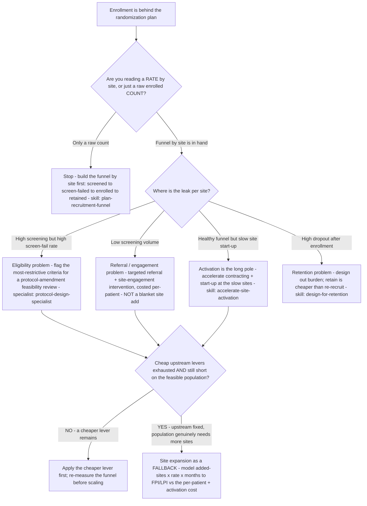

# Enrollment decision tree — recovering an enrollment shortfall (fix the funnel before you scale it)

**Last reviewed:** 2026-06-05 · **Confidence:** medium (industry enrollment-failure benchmarks + per-patient cost framing, web-verified this date). Site-performance percentages and per-patient costs are industry aggregates that vary widely by phase and therapeutic area — they carry inline `[verify-at-use]` / `[ESTIMATE]` markers and must be validated against the trial's actual EDC/CTMS funnel data before any deliverable (CLAUDE.md §3 #8).

> Canonical decision tree for the `clinical-operations-manager` (execution) with a feasibility assist from `protocol-design-specialist` (eligibility). Traverse top-to-bottom against the observed funnel **before** recommending a recovery move. The order encodes the house discipline: **diagnose the funnel leak and exhaust the cheap upstream levers before the expensive, slow one** (CLAUDE.md §3 #5 — enrollment is a rate, not a count; §3 #4 — site activation is the schedule's long pole). The single most expensive, slowest-to-realize move (a site expansion) sits at the bottom on purpose. This is decision-support for the sponsor's clinical-ops lead, not a regulatory or eligibility determination (CLAUDE.md §2).

---

## When this applies

A trial is **behind its randomization plan** and someone has proposed an enrollment-rescue move — usually "add more sites." Use this before committing, because adding sites to a trial whose real constraint is upstream just buys a second set of under-enrolling sites at full activation cost.

## The tree



## Rationale per leaf (cheap → expensive)

- **Build the funnel first** — a raw enrolled count hides whether the leak is referral, eligibility, or consent. Enrollment is a rate, not a count (CLAUDE.md §3 #5). Run [`../skills/plan-recruitment-funnel/SKILL.md`](../skills/plan-recruitment-funnel/SKILL.md) before any recovery move.
- **Eligibility problem (high screen-fail)** — restrictive eligibility criteria are the single biggest enrollment killer (CLAUDE.md §3 #1). The cheapest *durable* fix is often loosening the two or three criteria doing the most screen-failing, via a feasibility-reviewed protocol amendment — owned by [`protocol-design-specialist`](../agents/protocol-design-specialist.md). It is a medical/regulatory change, so it is decision-support, never a unilateral edit (CLAUDE.md §2).
- **Referral problem (low screening)** — a targeted referral / site-engagement intervention, **costed against the per-patient economics** (~$6,533 to recruit a patient [verify-at-use]), beats a blanket site add: you're spending on the leak, not on more leaky sites.
- **Activation is the long pole** — if the funnel is healthy where sites are *active* but sites are slow to start, the constraint is activation, not recruitment — accelerate contracting/start-up at the slow sites (CLAUDE.md §3 #4; [`../skills/accelerate-site-activation/SKILL.md`](../skills/accelerate-site-activation/SKILL.md)).
- **Retention problem (high dropout)** — if patients enroll then drop, you're refilling a leaking bucket; retention is cheaper than re-recruitment (CLAUDE.md §3 #3; [`../skills/design-for-retention/SKILL.md`](../skills/design-for-retention/SKILL.md)).
- **Site expansion (the fallback)** — the most expensive, slowest-to-realize move (every added site carries activation cost + its own start-up long pole). Only after the upstream leak is fixed and the feasible population genuinely needs more reach. Model it before committing — see the arithmetic below.

## Why "add more sites" is the wrong first reflex (the benchmarks)

The under-enrollment pattern is **industry-endemic, not a one-trial anomaly** — so a shortfall is rarely evidence your site count is uniquely too low:

| Signal | Industry figure (`[verify-at-use]`) | Read |
|---|---|---|
| Sites missing their projected enrollment target | ~68% | Under-enrollment is the norm; adding sites replicates the norm |
| Sites enrolling zero or one patient | ~one-third | A new site has a real chance of being another zero |
| Trials missing their initial enrollment target | ~80–85% | The shortfall is a funnel/feasibility problem far more often than a count problem |

Source: WCG, *Avoid Enrollment Pitfalls* and Applied Clinical Trials, *The Enrollment Rescue Dilemma* (retrieved 2026-06-05). These are aggregates across phases/indications — calibrate to the trial's segment.

## The feasibility arithmetic (the load-bearing math)

Whether the current (or expanded) site footprint can hit the target on time:

```
projected enrollment = active sites × enrollment rate per site per month × months remaining
```

If `projected enrollment < target`, you are short — and the lever to pull is set by *which input is wrong*: a low **rate per site** is a funnel/eligibility problem (fix upstream); too few **active sites** with a healthy rate is the case where expansion is warranted. [`../scripts/trials_calc.py`](../scripts/trials_calc.py) `enrollment-feasibility` computes projected enrollment, the gap, and the breakeven rate or site count needed to close it.

## Gotchas

- **Adding sites has its own long pole.** A new site doesn't enroll on day one — it carries the full activation/start-up timeline (CLAUDE.md §3 #4), so expansion buys enrollment *months from now*, not now.
- **Don't average away a bifurcated leak.** Two sites with opposite problems (one high-screen-fail, one low-screening) average to a "moderately behind" aggregate that points at neither real cause. Read per site.
- **A criteria change is a medical/regulatory decision.** Loosening eligibility is decision-support to the sponsor and goes through amendment + IRB, never a unilateral move (CLAUDE.md §2).

## Escalation & guardrails

- A protocol-amendment / eligibility-criteria change → [`protocol-design-specialist`](../agents/protocol-design-specialist.md) (decision-support for the sponsor's medical lead; amendment + IRB process applies — CLAUDE.md §2).
- Anything touching patient PHI or a reportable safety signal → stop and route to the sponsor's medical monitor and `ravenclaude-core` `security-reviewer`.
- Every figure entering a deliverable carries a source URL + retrieval date or an `[unverified — training knowledge]` / `[ESTIMATE]` mark (CLAUDE.md §3 #8).

## Sources (retrieved 2026-06-05)

- WCG — *Avoid Enrollment Pitfalls: Find Your Best-fit Clinical Trial Sites* (site-level under-enrollment): https://www.wcgclinical.com/wp-content/uploads/2022/03/avoid-enrollment-pitfalls-best-clinical-trial-sites.pdf
- Applied Clinical Trials — *The Enrollment Rescue Dilemma*: https://www.appliedclinicaltrialsonline.com/view/enrollment-rescue-dilemma-how-sponsors-and-sites-can-make-most-tough-situation
- Sofpromed — *The Ultimate Guide to Clinical Trial Costs* (per-patient recruitment cost): https://www.sofpromed.com/ultimate-guide-clinical-trial-costs
