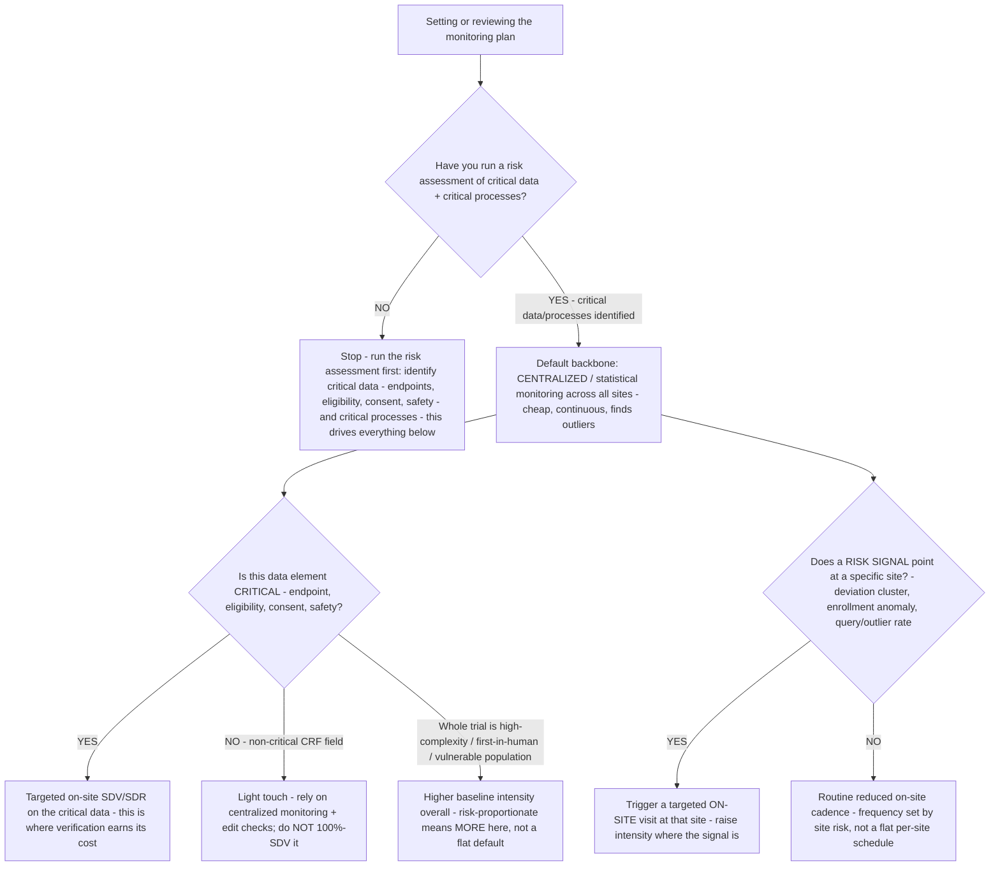

# Monitoring decision tree — risk-based monitoring intensity (where on-site SDV earns its cost under ICH E6(R3))

**Last reviewed:** 2026-06-05 · **Confidence:** medium (ICH E6(R3) + FDA guidance + TransCelerate SDV-effectiveness literature, web-verified this date). Regulatory dates and SDV statistics are volatile / source-dependent — they carry inline `[verify-at-use]` markers and must be confirmed against the current ICH/FDA text and the sponsor's SOPs before any deliverable (CLAUDE.md §3 #8). This is decision-support for the sponsor's clinical-ops lead, not a monitoring or regulatory determination (CLAUDE.md §2).

> Canonical decision tree for the `clinical-operations-manager` (execution) with a regulatory assist from `regulatory-submissions-specialist` (GCP framework). Traverse top-to-bottom **before** setting a monitoring plan or accepting a CRO monitoring bid. The order encodes the post-E6(R3) discipline: **risk-assessment first, centralized monitoring as the default backbone, on-site SDV concentrated where data criticality and risk signals justify it** — not a flat 100%-SDV reflex (CLAUDE.md §3 #7 — the submission is built throughout; quality is designed in, not verified in at the end).

---

## When this applies

A sponsor is scoping (or re-scoping) a trial's monitoring plan / budget, or weighing a CRO's monitoring bid. Common triggers: a new trial start-up, a monitoring-budget review, a CRO contract renewal, or a deviation cluster that should *raise* intensity at specific sites.

## The framework moved (date the facts)

- **ICH E6(R3)** was adopted **6 January 2025** and entered into force **23 July 2025**; the **FDA issued its final E6(R3) guidance in September 2025** [verify-at-use]. R3 formalizes **risk-proportionate, quality-by-design** monitoring and a shift toward **centralized + targeted** oversight, explicitly away from one-size-fits-all 100% SDV.
- The evidence behind the shift: a TransCelerate analysis found **SDV impacts on average only ~1% of site-entered CRF data**, and only **~2.4% of critical-data queries** were SDV-driven, while **100% SDV is estimated to consume ~25–40% of trial cost** [verify-at-use]. 100% SDV is the most expensive control for the least marginal quality.

## The tree

## Rationale per leaf

- **Risk assessment first** — R3's core move. You cannot size monitoring without knowing which data and processes are *critical* (the endpoints, eligibility, consent, safety reporting). Everything below is proportioning effort to that map.
- **Centralized monitoring as the backbone** — cheap, continuous, and able to flag outlier sites and anomalous patterns across the whole trial. FDA has encouraged centralized monitoring for data quality/integrity; it is the default layer, with on-site as the *targeted* complement.
- **Targeted SDV on critical data** — on-site source-data verification concentrated on the elements that actually matter (endpoints, eligibility, consent, safety) is where verification earns its cost. Non-critical CRF fields get edit checks + centralized monitoring, **not** 100% SDV.
- **Risk-triggered on-site visits** — a deviation cluster, an enrollment anomaly, or an outlier query rate at a specific site *raises* on-site intensity there. (This is the bridge from the [`trials-monitoring`-adjacent CAPA scenario](../scenarios/2026-06-05-protocol-deviation-capa.md): a deviation cluster is exactly the signal that should pull a targeted visit.)
- **Higher baseline for high-risk trials** — risk-proportionate cuts both ways: a first-in-human, high-complexity, or vulnerable-population trial warrants *more* intensity, not the flat default. Proportionate ≠ minimal.

## The cost read (why 100% SDV is the wrong default)

| Lever | Marginal quality | Cost share | Right use |
|---|---|---|---|
| 100% on-site SDV (flat) | Low — SDV touches ~1% of CRF data, ~2.4% of critical-data queries [verify-at-use] | High — ~25–40% of trial cost [verify-at-use] | Almost never as a flat default |
| Centralized / statistical monitoring | High — finds outlier sites + systematic issues across all data | Low | The default backbone |
| Targeted on-site SDV/SDR on critical data | High where it's applied | Medium | The complement, concentrated on critical data |
| Risk-triggered on-site visits | High — intensity follows the signal | Medium | When a site risk signal fires |

Source: Applied Clinical Trials, *Risk-Based Monitoring Versus Source Data Verification* and the TransCelerate RBM literature (retrieved 2026-06-05). Figures are industry aggregates — `[verify-at-use]`.

## Gotchas

- **"Risk-based" is not "less monitoring."** It's *proportionate* monitoring — high-risk trials get more, low-risk data gets less. A plan that just cuts SDV everywhere has missed the point.
- **Date the regulatory facts.** R3's in-force date and the FDA guidance date are volatile — confirm at use and against the sponsor's SOPs; a monitoring plan citing a stale framework is a finding waiting to happen (CLAUDE.md §3 #8).
- **Centralized monitoring needs the data to flow.** It assumes timely EDC entry — if sites enter data late, the centralized layer is blind and you fall back to on-site by default. Check data-entry latency before relying on centralized signals.
- **A CRO's flat-SDV bid is a budgeting reflex, not a requirement.** Re-scope it from the risk assessment.

## Escalation & guardrails

- The GCP-framework interpretation / submission implications → [`regulatory-submissions-specialist`](../agents/regulatory-submissions-specialist.md) (decision-support; confirm against current ICH/FDA text — CLAUDE.md §2).
- Anything touching patient PHI or a reportable safety signal → stop and route to the sponsor's medical monitor and `ravenclaude-core` `security-reviewer`.
- Every figure entering a deliverable carries a source URL + retrieval date or an `[unverified — training knowledge]` / `[ESTIMATE]` mark (CLAUDE.md §3 #8).

## Sources (retrieved 2026-06-05)

- ICH — *Guideline for Good Clinical Practice E6(R3), Step 4 Final* (adoption 2025-01-06): https://database.ich.org/sites/default/files/ICH_E6%28R3%29_Step4_FinalGuideline_2025_0106.pdf
- FDA — *E6(R3) Good Clinical Practice (GCP)* guidance (Sept 2025): https://www.fda.gov/regulatory-information/search-fda-guidance-documents/e6r3-good-clinical-practice-gcp
- ACRP — *FDA Publishes ICH E6(R3): What it Means for U.S. Clinical Trials* (in-force date 2025-07-23; RBM emphasis): https://acrpnet.org/2025/09/16/fda-publishes-ich-e6r3-what-it-means-for-u-s-clinical-trials
- Applied Clinical Trials — *Risk-Based Monitoring Versus Source Data Verification* (SDV ~1% of data; cost share): https://www.appliedclinicaltrialsonline.com/view/risk-based-monitoring-versus-source-data-verification
- Precision for Medicine — *Why 100% SDV Is No Longer Feasible* (RBM cost/time framing): https://www.precisionformedicine.com/blog/why-100-sdv-is-no-longer-feasible-and-how-risk-based-monitoring-saves-time-money-and-your-trial
